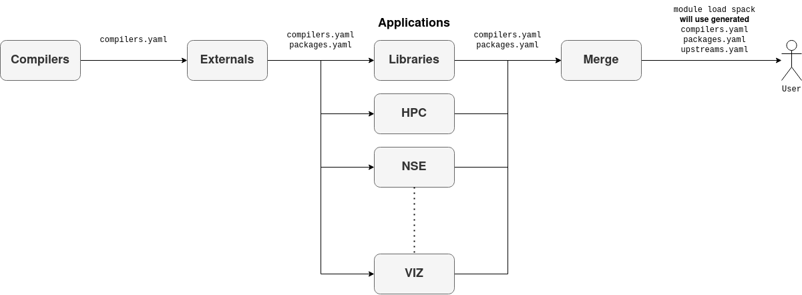

# Conceptual Deployment of Software Stacks with Spack

These instructions were compiled in preparation for our continuous
deployment with Jenkins.
While the concepts presented here still hold true, the details of the
implementation may have evolved over time.

## Contents

* [Spec Generation](#spec-generation)
* [Deployment Description](#deployment-workflow)
* [Pull Request Building Description](#pull-request-workflow)

**Credit:** Based on [spack-packagelist](https://github.com/epfl-scitas/spack-packagelist)

## Spec Generation

### Setup Environment for Experimentation

Clone repository:

```
git clone https://github.com/BlueBrain/spack.git
cd spack/deploy
```

Setup virtual environment:

```
DEPLOYMENT_VIRTUALENV="${PWD}/venv"
virtualenv -p "$(which python)" "${DEPLOYMENT_VIRTUALENV}" --clear
. "${DEPLOYMENT_VIRTUALENV}/bin/activate"
pip install --force-reinstall -U .
```

And you should have `spackd` available:

```
→ spackd --help

Usage: spackd [OPTIONS] COMMAND [ARGS]...

  This command helps with common tasks needed to deploy software stack with
  Spack in continuous integration pipeline

Options:
  --input FILENAME  YAML file containing the specification for a production
                    environment
  --help            Show this message and exit.

Commands:
  compilers  Dumps the list of compilers needed by a...
  packages   List all the packages that are part of an...
  stack      List all the providers for a given target.
  targets    Dumps the list of targets that are available
```


> On OSX I saw :
>
> ```
>   Could not fetch URL https://pypi.python.org/simple/click/: There was a problem confirming the ssl certificate: [SSL: TLSV1_ALERT_PROTOCOL_VERSION] tlsv1 alert protocol version (_ssl.c:590) - skipping
> ```
> See [this](https://stackoverflow.com/questions/49743961/cannot-upgrade-pip-9-0-1-to-9-0-3-requirement-already-satisfied/49758204#49758204) : from virtual env do:
>
> ```
> curl https://bootstrap.pypa.io/get-pip.py | python
> ```

### Toolchain Specifications

The compiler toolchain specification is based on multiple axis:

```
axis:
  - architecture
  - compiler
  - mpi
  - lapack
  - python
```

These axis represent how the hierarchical modules (e.g. with LMOD) are exposed to end users. For example :

* two compute architectures are available : linux-rhel7-x86\_64 and darwin-sierra-x86\_64
* multiple compilers are available for each architecture : gnu, intel, llvm
* each compiler has multiple mpi libraries : hpe-mpi, mvapich2
* each mpi could provide multiple lapack libraries : intel-mkl, netlib-lapack
* different python versions could be used for compiling package : python@2.7.16, python@3.6.5


We define compiler toolchains in [packages/toolchains.yaml](packages/toolchains.yaml) as:


```yaml
# core toolchain typically represent system compilers
core:
  architecture:
  - x86_64
  compiler:
  - gcc@4.8.5
  mpi: None
  lapack: None
  python: None

# stable gnu toolchain
gnu-stable:
  architecture:
  - x86_64
  compiler:
  - gcc@6.4.0
  mpi:
  - hpe-mpi@2.16
  lapack:
  - openblas@0.2.20
  python:
  - python@3.6.5
```

The `core` toolchain typically represent system compiler. This compiler is used only to bootstrap/install other compilers and some basic utility packages. And hence it doesn't provide any mpi, lapack or python packages.

The next toolchain `gnu-stable` represent default GNU compiler. We are going to provide single version of HPE mpi library and python version.


### Packages Specifications

Once compiler toolchains are defined, we can define packages to build for each toolchain. For example, we define compiler packages as:


```
# list of packages to build
packages:
  compilers:
    target_matrix:
      - core
    requires:
      - architecture
      - compiler
    specs:
      - gcc@8.2.0
      - gcc@6.4.0
      - intel-parallel-studio+advisor+clck+daal+gdb+inspector+ipp+itac+mkl+mpi+rpath+shared+tbb+vtune@cluster.2018.3
      - intel@18.0.3
      - llvm@7.0.0
      - pgi+network+nvidia+mpi@18.4
```

Here is brief summary of what's going on:

* `compilers` under packages is just a tag
* `target_matrix` indicates which compiler toolchain we are going to use (see Toolchain Specifications)
* `requires` indicates which axis will be used while building the packages
* `specs` indicates which packages we are going to build

It would be more clear if we look at the package specs generated with `spackd` command.

To see which packages will be installed, for example, to install all compilers on the system:

```
→ spackd --input packages/compilers.yaml packages x86_64
gcc@8.2.0 %gcc@4.8.5 target=x86_64
gcc@6.4.0 %gcc@4.8.5 target=x86_64
intel-parallel-studio+advisor+clck+daal+gdb+inspector+ipp+itac+mkl+mpi+rpath+shared+tbb+vtune@cluster.2018.3 %gcc@4.8.5 target=x86_64
intel@18.0.3 %gcc@4.8.5 target=x86_64
llvm@7.0.0 %gcc@4.8.5 target=x86_64
pgi+network+nvidia+mpi@18.4 %gcc@4.8.5 target=x86_64
```

These specs can be the used to install packages using `spack install` command. This become more useful when multiple compilers and mpi libraries come into picture, for example, to install all parallel libraries on the system :

```
→ spackd --input packages/parallel-libraries.yaml packages x86_64
hdf5+mpi@1.10.2 ^hpe-mpi@2.16 %intel@18.0.3 target=x86_64
hdf5+mpi@1.10.2 ^hpe-mpi@2.16 %gcc@6.4.0 target=x86_64
omega-h@9.17.2 ^openblas@0.2.20 %gcc@6.4.0 target=x86_64
petsc+int64+mpi@3.9.3 ^openblas@0.2.20 %gcc@6.4.0 target=x86_64
trilinos@12.12.1 ^openblas@0.2.20 %gcc@6.4.0 target=x86_64
omega-h@9.17.2 ^intel-mkl@2018.1.163 %intel@18.0.3 target=x86_64
petsc+int64+mpi@3.9.3 ^intel-mkl@2018.1.163 %intel@18.0.3 target=x86_64
trilinos@12.12.1 ^intel-mkl@2018.1.163 %intel@18.0.3 target=x86_64
```

### Whole Software Stack

Here is list of all packages (in order) that we will be installing :

```
spackd --input packages/compilers.yaml packages x86_64 --output compilers.txt
spackd --input packages/tools.yaml packages x86_64 --output tools.txt
spackd --input packages/serial-libraries.yaml packages x86_64 --output serial-libraries.txt
spackd --input packages/python-packages.yaml packages x86_64 --output python-packages.txt
spackd --input packages/parallel-libraries.yaml packages x86_64 --output parallel-libraries.txt
spackd --input packages/bbp-packages.yaml packages x86_64 --output bbp-packages.txt
```

## Deployment Workflow

Here is how deployment workflow should look like :



There are five stages:

1. compilers: all necessary compilers
2. tools: software involved in the building process
3. external-libraries: software dependencies of our stack that should only
   be compiled once and can have their dependency tree truncated within
   Spack
4. libraries: software dependencies of our stack that are
   compiler-dependent
5. applications: packages maintained by Blue Brain

During deployment, package specs required by Spack are generated with the
Python package of this repository and subsequently build by Spack.

### Configuration Layout

#### Deployment configuration

The definitions of software can be found in the `packages` directory:

    packages
    ├── bbp-packages.yaml
    ├── compilers.yaml
    ├── external-libraries.yaml
    ├── parallel-libraries.yaml
    ├── python-packages.yaml
    ├── serial-libraries.yaml
    ├── toolchains.yaml
    └── tools.yaml

Files used for the stages:

1. compilers: `compilers.yaml`
2. tools: `tools.yaml`
3. external-libraries: `external-libraries.yaml`
4. libraries: `parallel-libraries.yaml`,
              `python-packages.yaml`,
              `serial-libraries.yaml`
4. applications: `bbp-packages.yaml`

#### Spack configuration

The basic Spack configuration should be in the folder `configs`:

    configs
    ├── compilers
    │   └── modules.yaml
    ├── config.yaml
    ├── modules.yaml
    └── packages.yaml

If a folder named after a deployment stage is present, the configuration
files in said folder override the more generic ones within `configs`:

* first the configurations present in `configs` are copied
* if the previous stage produced `packages.yaml` or `compilers.yaml`, those
  files are copied over
* if there is a folder `configs/stage`, then these configurations overwrite
  all previous ones

See the `copy_configuration` function in [`deploy.lib`](deploy.lib) for
details.

The generation/population of `packages.yaml` and chaining of Spack
instances are defined at the top of [`deploy.lib`](deploy.lib) in the
variable `export_packages`.

Similarly, the variable `include_in_chain` determines which stages will be
configured as upstream installations in `.spack/upstreams.yaml` by the
function `update_chain_config`, which runs after the configurations are
copied.
This allows the later stages of the deployment to reuse the database and
full dependency graphs of previous stages as described in the
[upstream documentation](https://spack.readthedocs.io/en/latest/chain.html).
Please note that stages should only be set to `yes` in *at most one* of
`export_packages` and `include_in_chain` to avoid conflicts.

Within our workflow, we want to see the modules from previous
stages, and thus set the `MODULEPATH` to all but the current stage.
Compilers are only visible through `compilers.yaml`, and tools and
serial libraries should be at least in part found in `packages.yaml` to
truncate the dependency DAG and remove duplication with different
compilers.

### Preparing the deployment

The deployment will need a checkout of Spack and licenses for proprietary
software already present in the directory structure.

    $ export DEPLOYMENT_ROOT="${PWD}/test"
    $ git clone git@github.com:BlueBrain/spack.git "${DEPLOYMENT_ROOT}/deploy/spack"
    $ git clone ssh://bbpcode.epfl.ch/user/kumbhar/spack-licenses "${DEPLOYMENT_ROOT}/deploy/spack/etc/spack/licenses"

### Generating all specs

The deployment script can be found in the root of this repository as
`deploy.sh`.
To generate and install the specs to be installed for all stages, use:

    $ export DEPLOYMENT_ROOT="${PWD}/test"
    $ ./deploy.sh -g all
    ### updating the deployment virtualenv
    ### generating specs for compilers
    ### ...using compilers.yaml
    ### generating specs for tools
    ### ...using tools.yaml
    ### generating specs for external-libraries
    ### ...using external-libraries.yaml
    ### generating specs for libraries
    ### ...using parallel-libraries.yaml
    ### ...using serial-libraries.yaml
    ### ...using python-packages.yaml
    ### generating specs for applications
    ### ...using bbp-packages.yaml

This results in the following directory structure:

    ${DEPLOYMENT_ROOT}
    ├── spack
    │   └── venv
    └── deploy
        ├── applications
        │   └── 2018-11-13
        │       └── data
        │           ├── spack_deploy.env
        │           ├── spack_deploy.version
        │           └── specs.txt
        ├── compilers
        │   └── 2018-11-13
        │       └── data
        │           ├── spack_deploy.env
        │           ├── spack_deploy.version
        │           └── specs.txt
        ├── *-libraries
        │   └── 2018-11-13
        │       └── data
        │           ├── spack_deploy.env
        │           ├── spack_deploy.version
        │           └── specs.txt
        └── tools
            └── 2018-11-13
                └── data
                    ├── spack_deploy.env
                    ├── spack_deploy.version
                    └── specs.txt

To install the system tools:

    $ ./deploy.sh -i tools

To link a successful deployment to `latest`:

    $ ./deploy.sh -l all

After a successful deployment, all user facing configuration is copied into
a separate directory with:

    $ ./deploy.sh -c applications

Resulting in additional files:

    ${DEPLOYMENT_ROOT}
    └── config
        ├── compilers.yaml
        ├── config.yaml
        ├── packages.yaml
        └── modules.sh

And modules can be copied into archival directories with:

    $ ./deploy.sh -m all

Resulting in:

    ${DEPLOYMENT_ROOT}
    └── modules
        ├── applications
        │   ├── 2018-10
        │   └── 2018-11
        │       └── data
        ├── compilers
        │   ├── 2018-10
        │   └── 2018-11
        │       └── data
        ├── *-libraries
        │   ├── 2018-10
        │   └── 2018-11
        │       └── data
        └── tools
            ├── 2018-10
            └── 2018-11
                └── data

### Jenkins Pipeline Workflow

See `Jenkinsfile`.
All package collections referenced above are triggered as separate stages,
calling `deploy.sh` with appropriate arguments.

## Pull Request Workflow

To build pull requests, each one will be stored in a separate
`${DEPLOYMENT_ROOT}`:

    ${DEPLOYMENT_ROOT}
    └── pulls
        └── XXXX
            ├── deploy
            │   ├── spack
            │   └── venv
            └── install

Every stage within the pull request will chain to its original upstream and
all dependencies.

#### Open Items

* [ ] Archival of older deployments
* [ ] Avoid conflicts during module generation
* [ ] Avoid conflicts during Python package activation

#### Other Commands

```
→ spackd --input packages/parallel-libraries.yaml targets
x86_64

→ spackd --input packages/parallel-libraries.yaml compilers x86_64
clang@6.0.1%gcc@4.8.5 target=x86_64
gcc@6.4.0%gcc@4.8.5 target=x86_64
intel@18.0.3%gcc@4.8.5 target=x86_64
pgi@18.4%gcc@4.8.5 target=x86_64
```
