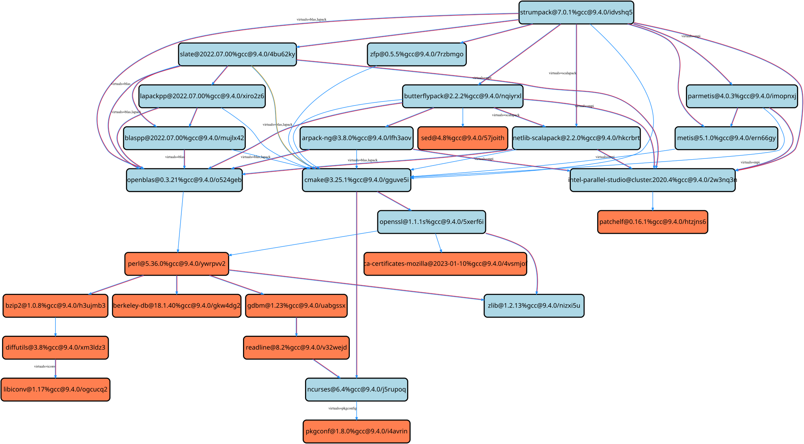

.. Copyright Spack Project Developers. See COPYRIGHT file for details.

   SPDX-License-Identifier: (Apache-2.0 OR MIT)

.. _basic-usage:

===========
Basic Usage
===========

The ``spack`` command has many *subcommands*, but you'll only need a small subset of them for typical usage.

.. _basic-list-and-info-packages:

--------------------------
Listing Available Packages
--------------------------

To install software with Spack, you need to know what software is available.
You can search the available packages at the `packages.spack.io <https://packages.spack.io>`_ website, or using the ``spack list`` command.

.. _cmd-spack-list:

^^^^^^^^^^^^^^
``spack list``
^^^^^^^^^^^^^^

The ``spack list`` command prints out a list of all of the packages Spack
can install:

.. code-block:: console

   $ spack list

Packages are listed by name in alphabetical order.
A pattern can be used to narrow the list, and the following rules apply:

* A pattern to match with no wildcards, ``*`` or ``?``, will be treated as it started and ended with ``*``
* All patterns will be treated as case-insensitive

To search for all packages whose names contain the word ``sql`` you can run the following command:

.. code-block:: console

   $ spack list sql

A few options are also provided for more specific searches.
For instance, it is possible to search the description of packages for a match.
A way to list all the package whose names or description contain the word ``quantum`` is the following:

.. code-block:: console

   $ spack list -d quantum


.. _cmd-spack-info:

^^^^^^^^^^^^^^
``spack info``
^^^^^^^^^^^^^^

To get more information on a particular package from `spack list`, use
`spack info`.  Just supply the name of a package:

.. command-output:: spack info mpich
   :language: console

Most of the information is self-explanatory.  The *safe versions* are
versions that Spack knows the checksum for, and it will use the
checksum to verify that these versions download without errors or
malware.

:ref:`Dependencies <sec-specs>` and :ref:`virtual dependencies
<sec-virtual-dependencies>` are described in more detail later.

.. _cmd-spack-versions:

^^^^^^^^^^^^^^^^^^
``spack versions``
^^^^^^^^^^^^^^^^^^

To see *more* available versions of a package, run ``spack versions``.
For example:

.. command-output:: spack versions libelf
   :language: console

There are two sections in the output.  *Safe versions* are versions
for which Spack has a checksum on file.  It can verify that these
versions are downloaded correctly.

In many cases, Spack can also show you what versions are available out
on the web -- these are *remote versions*. Spack gets this information
by scraping it directly from package web pages. Depending on the
package and how its releases are organized, Spack may or may not be
able to find remote versions.

.. _compiler-config:

---------------------
Configuring Compilers
---------------------

Spack has the ability to build packages with multiple compilers and compiler versions.
Compilers can be made available to Spack by:

1. Specifying them as externals in ``packages.yaml``, or
2. Having them installed in the current Spack store, or
3. Having them available as binaries in some buildcache

For convenience, Spack will automatically detect compilers as externals the first time it needs them, if no compiler is available.

.. _cmd-spack-compilers:

^^^^^^^^^^^^^^^^^^^^^^^
``spack compiler list``
^^^^^^^^^^^^^^^^^^^^^^^

You can see which compilers are available to Spack by running ``spack compiler list``:

.. code-block:: console

   $ spack compiler list
   ==> Available compilers
   -- gcc ubuntu20.04-x86_64 ---------------------------------------
   [e]  gcc@10.5.0  [+]  gcc@15.1.0  [+]  gcc@14.3.0

Compilers marked with an ``[e]`` are available as externals, while those marked with a ``[+]`` are installed in the local Spack's store.
Compilers from remote buildcaches are marked as ``-``, but are not shown by default.
To see them you need a specific option:

.. code-block:: console

   $ spack compiler list --remote
   ==> Available compilers
   -- gcc ubuntu20.04-x86_64 ---------------------------------------
   [e]  gcc@10.5.0  [+]  gcc@15.1.0  [+]  gcc@14.3.0

   -- gcc ubuntu20.04-x86_64 ---------------------------------------
    -   gcc@12.4.0

Any of these compilers can be used to build Spack packages.  More on how this is done is in :ref:`sec-specs`.

.. _cmd-spack-compiler-find:

^^^^^^^^^^^^^^^^^^^^^^^
``spack compiler find``
^^^^^^^^^^^^^^^^^^^^^^^

If you do not see a compiler in the list shown by:

.. code-block:: console

   $ spack compiler list

but you want to use it with Spack, you can simply run ``spack compiler find`` with the
path to where the compiler is installed.  For example:

.. code-block:: console

   $ spack compiler find /opt/intel/oneapi/compiler/2025.1/bin/
   ==> Added 1 new compiler to /home/user/.spack/packages.yaml
       intel-oneapi-compilers@2025.1.0
   ==> Compilers are defined in the following files:
       /home/user/.spack/packages.yaml

Or you can run ``spack compiler find`` with no arguments to force
auto-detection.  This is useful if you do not know where compilers are
installed, but you know that new compilers have been added to your
``PATH``.  For example, you might load a module, like this:

.. code-block:: console

   $ module load gcc/4.9.0
   $ spack compiler find
   ==> Added 1 new compiler to /home/user/.spack/packages.yaml
       gcc@4.9.0

This loads the environment module for gcc-4.9.0 to add it to
``PATH``, and then it adds the compiler to Spack.

.. note::

   By default, Spack does not fill in the ``modules:`` field in the
   ``packages.yaml`` file.  If you are using a compiler from a
   module, then you should add this field manually.
   See the section on :ref:`compilers-requiring-modules`.

.. _cmd-spack-compiler-info:

^^^^^^^^^^^^^^^^^^^^^^^
``spack compiler info``
^^^^^^^^^^^^^^^^^^^^^^^

If you want to see additional information of specific compilers, you can run
``spack compiler info``:

.. code-block:: console

   $ spack compiler info gcc
   gcc@=8.4.0 languages='c,c++,fortran' arch=linux-ubuntu20.04-x86_64:
     prefix: /usr
     compilers:
       c: /usr/bin/gcc-8
       cxx: /usr/bin/g++-8
       fortran: /usr/bin/gfortran-8

   gcc@=9.4.0 languages='c,c++,fortran' arch=linux-ubuntu20.04-x86_64:
     prefix: /usr
     compilers:
       c: /usr/bin/gcc
       cxx: /usr/bin/g++
       fortran: /usr/bin/gfortran

   gcc@=10.5.0 languages='c,c++,fortran' arch=linux-ubuntu20.04-x86_64:
     prefix: /usr
     compilers:
       c: /usr/bin/gcc-10
       cxx: /usr/bin/g++-10
       fortran: /usr/bin/gfortran-10

This shows the details of the compilers that were detected by Spack.
Notice also that we didn't have to be too specific about the version. We just said ``gcc``, and we got information
about all the matching compilers.

^^^^^^^^^^^^^^^^^^^^^^^^^^^^^^^^^^^^^^^^^^
Manual configuration of external compilers
^^^^^^^^^^^^^^^^^^^^^^^^^^^^^^^^^^^^^^^^^^

If auto-detection fails, you can manually configure a compiler by editing your ``packages`` configuration.
You can do this by running:

.. code-block:: console

   $ spack config edit packages

which will open the file in :ref:`your favorite editor <controlling-the-editor>`.

Each compiler has an "external" entry in the file with some ``extra_attributes``:

.. code-block:: yaml

   packages:
     gcc:
       externals:
       - spec: gcc@10.5.0 languages='c,c++,fortran'
         prefix: /usr
         extra_attributes:
           compilers:
             c: /usr/bin/gcc-10
             cxx: /usr/bin/g++-10
             fortran: /usr/bin/gfortran-10

The compiler executables are listed under ``extra_attributes:compilers``, and are keyed by language.
Once you save the file, the configured compilers will show up in the list displayed by ``spack compilers``.

You can also add compiler flags to manually configured compilers. These flags should be specified in the
``flags`` section of the compiler specification. The valid flags are ``cflags``, ``cxxflags``, ``fflags``,
``cppflags``, ``ldflags``, and ``ldlibs``. For example:

.. code-block:: yaml

   packages:
     gcc:
       externals:
       - spec: gcc@10.5.0 languages='c,c++,fortran'
         prefix: /usr
         extra_attributes:
           compilers:
             c: /usr/bin/gcc-10
             cxx: /usr/bin/g++-10
             fortran: /usr/bin/gfortran-10
           flags:
             cflags: -O3 -fPIC
             cxxflags: -O3 -fPIC
             cppflags: -O3 -fPIC

These flags will be treated by Spack as if they were entered from
the command line each time this compiler is used. The compiler wrappers
then inject those flags into the compiler command. Compiler flags
entered from the command line will be discussed in more detail in the
following section.

Some compilers also require additional environment configuration.
Examples include Intel's oneAPI and AMD's AOCC compiler suites,
which have custom scripts for loading environment variables and setting paths.
These variables should be specified in the ``environment`` section of the compiler
specification. The operations available to modify the environment are ``set``, ``unset``,
``prepend_path``, ``append_path``, and ``remove_path``. For example:

.. code-block:: yaml

   packages:
     intel-oneapi-compilers:
       externals:
       - spec: intel-oneapi-compilers@2025.1.0
         prefix: /opt/intel/oneapi
         extra_attributes:
           compilers:
             c: /opt/intel/oneapi/compiler/2025.1/bin/icx
             cxx: /opt/intel/oneapi/compiler/2025.1/bin/icpx
             fortran: /opt/intel/oneapi/compiler/2025.1/bin/ifx
           environment:
             set:
               MKL_ROOT: "/path/to/mkl/root"
             unset: # A list of environment variables to unset
               - CC
             prepend_path: # Similar for append|remove_path
               LD_LIBRARY_PATH: /ld/paths/added/by/setvars/sh

It is also possible to specify additional ``RPATHs`` that the compiler will add to all executables generated by that compiler.
This is useful for forcing certain compilers to RPATH their own runtime libraries so that executables will run without the need to set ``LD_LIBRARY_PATH``:

.. code-block:: yaml

   packages:
     gcc:
       externals:
       - spec: gcc@4.9.3
         prefix: /opt/gcc
         extra_attributes:
           compilers:
             c: /opt/gcc/bin/gcc
             cxx: /opt/gcc/bin/g++
             fortran: /opt/gcc/bin/gfortran
           extra_rpaths:
           - /path/to/some/compiler/runtime/directory
           - /path/to/some/other/compiler/runtime/directory

.. _compilers-requiring-modules:

^^^^^^^^^^^^^^^^^^^^^^^^^^^
Compilers Requiring Modules
^^^^^^^^^^^^^^^^^^^^^^^^^^^

Many installed compilers will work regardless of the environment they are called with.
However, some installed compilers require environment variables to be set in order to run.

On typical HPC clusters, these environment modifications are usually delegated to some "module" system.
In such a case, you should tell Spack which module(s) to load in order to run the chosen compiler:

.. code-block:: yaml

   packages:
     gcc:
       externals:
       - spec: gcc@10.5.0 languages='c,c++,fortran'
         prefix: /opt/compilers
         extra_attributes:
           compilers:
             c: /opt/compilers/bin/gcc-10
             cxx: /opt/compilers/bin/g++-10
             fortran: /opt/compilers/bin/gfortran-10
         modules: [gcc/10.5.0]

Some compilers require special environment settings to be loaded not just
to run, but also to execute the code they build, breaking packages that
need to execute code they just compiled.  If it's not possible or
practical to use a better compiler, you'll need to ensure that
environment settings are preserved for compilers like this (i.e., you'll
need to load the module or source the compiler's shell script).

By default, Spack tries to ensure that builds are reproducible by
cleaning the environment before building.  If this interferes with your
compiler settings, you CAN use ``spack install --dirty`` as a workaround.
Note that this MAY interfere with package builds.

^^^^^^^^^^^^^^^^^^^^^^^
Build Your Own Compiler
^^^^^^^^^^^^^^^^^^^^^^^

If you are particular about which compiler/version you use, you might wish to have Spack build it for you.
For example:

.. code-block:: console

   $ spack install gcc@14+binutils

Once the compiler is installed, you can start using it without additional configuration:

.. code-block:: console

   $ spack install hdf5~mpi %gcc@14

The same holds true for compilers that are made available from build caches, when reusing them is allowed.

.. _toolchains:

----------
Toolchains
----------

Spack can be configured to associate certain combinations of specs for
easy reference on the command line and in config and environment
files. These combinations are called ``toolchains``, because their
primary intended use is for associating compiler combinations to
apply. Toolchains are referenced by name like a direct dependency,
using the ``%`` sigil. There are two styles of toolchain config, one
using conditional dependencies through the spec syntax and one with
conditionals explicitly in the yaml:

.. code-block:: yaml

   toolchains:
     gcc_all: cflags=-O3 '%[when=%c virtuals=c]gcc %[when=%cxx virtuals=cxx]gcc %[when=%fortran virtuals=fortran]gcc'
     llvm_gfortran:
     - spec: cflags=-O3
     - spec: '%[virtuals=c]llvm'
       when: '%c'
     - spec: '%[virtuals=cxx]llvm'
       when: '%cxx'
     - spec: '%[virtuals=fortran]gcc'
       when: '%fortran'

The two syntaxes are equivalent. It is not necessary to use
conditional dependencies with toolchains, but in most cases it his
highly recommended. Similarly, while any spec constraint can be
included, it is most useful to use compiler flags, architectures, and
conditional dependencies. With the above config, the ``gcc_all``
toolchain imposes conditional dependencies such that gcc is used as
the provider for ``c``, ``cxx``, and ``fortran`` for any package using
that toolchain that depends on each language. The conditional
dependencies allow the toolchain to be applied to any package
regardless of which languages it depends on. The ``llvm_gfortran``
toolchain is the same, except it uses ``llvm`` for ``c`` and ``cxx``
and ``gcc`` for ``fortran``.

These two toolchains could be used independently or even in the same
spec, e.g. ``spack install hdf5+fortran%llvm_gfortran ^mpich
%gcc_all``. This will install an hdf5 compiled with ``llvm`` for the
C/C++ components, but with the fortran components compiled with
``gfortran``, but will build it against an MPICH installation compiled
entirely with ``gcc`` for C, C++, and Fortran.

.. note::

   Toolchains are currently limited to exclude non-direct dependencies
   (using the ``^`` syntax).

---------------------------
Installing and Uninstalling
---------------------------

.. _cmd-spack-install:

^^^^^^^^^^^^^^^^^
``spack install``
^^^^^^^^^^^^^^^^^

``spack install`` will install any package shown by ``spack list``.
For example, to install the latest version of the ``mpileaks``
package, you might type this:

.. code-block:: console

   $ spack install mpileaks

If ``mpileaks`` depends on other packages, Spack will install the
dependencies first. It then fetches the ``mpileaks`` tarball, expands
it, verifies that it was downloaded without errors, builds it, and
installs it in its own directory under ``$SPACK_ROOT/opt``. You'll see
a number of messages from Spack, a lot of build output, and a message
that the package is installed.

.. code-block:: console

   $ spack install mpileaks
   ... dependency build output ...
   ==> Installing mpileaks-1.0-ph7pbnhl334wuhogmugriohcwempqry2
   ==> No binary for mpileaks-1.0-ph7pbnhl334wuhogmugriohcwempqry2 found: installing from source
   ==> mpileaks: Executing phase: 'autoreconf'
   ==> mpileaks: Executing phase: 'configure'
   ==> mpileaks: Executing phase: 'build'
   ==> mpileaks: Executing phase: 'install'
   [+] ~/spack/opt/linux-rhel7-broadwell/gcc-8.1.0/mpileaks-1.0-ph7pbnhl334wuhogmugriohcwempqry2

The last line, with the ``[+]``, indicates where the package is
installed.

Add the Spack debug option (one or more times) -- ``spack -d install
mpileaks`` -- to get additional (and even more verbose) output.

^^^^^^^^^^^^^^^^^^^^^^^^^^^
Building a specific version
^^^^^^^^^^^^^^^^^^^^^^^^^^^

Spack can also build *specific versions* of a package. To do this,
just add ``@`` after the package name, followed by a version:

.. code-block:: console

   $ spack install mpich@3.0.4

Any number of versions of the same package can be installed at once
without interfering with each other. This is good for multi-user
sites, as installing a version that one user needs will not disrupt
existing installations for other users.

In addition to different versions, Spack can customize the compiler,
compile-time options (variants), compiler flags, and platform (for
cross-compiles) of an installation. Spack is unique in that it can
also configure the *dependencies* a package is built with. For example,
two configurations of the same version of a package, one built with boost
1.39.0, and the other version built with version 1.43.0, can coexist.

This can all be done on the command line using the *spec* syntax.
Spack calls the descriptor used to refer to a particular package
configuration a **spec**. In the commands above, ``mpileaks`` and
``mpileaks@3.0.4`` are both valid *specs*. We'll talk more about how
you can use them to customize an installation in :ref:`sec-specs`.

^^^^^^^^^^^^^^^^^^^^^^^^^^^^^^
Reusing installed dependencies
^^^^^^^^^^^^^^^^^^^^^^^^^^^^^^

By default, when you run ``spack install``, Spack tries hard to reuse existing installations
as dependencies, either from a local store or from remote buildcaches, if configured.
This minimizes unwanted rebuilds of common dependencies, in particular if
you update Spack frequently.

In case you want the latest versions and configurations to be installed instead,
you can add the ``--fresh`` option:

.. code-block:: console

   $ spack install --fresh mpich

Reusing installations in this mode is "accidental" and happening only if
there's a match between existing installations and what Spack would have installed
anyhow.

You can use the ``spack spec -I mpich`` command to see what
will be reused and what will be built before you install.

You can configure Spack to use the ``--fresh`` behavior by default in
``concretizer.yaml``:

.. code-block:: yaml

   concretizer:
     reuse: false

.. _cmd-spack-uninstall:

^^^^^^^^^^^^^^^^^^^
``spack uninstall``
^^^^^^^^^^^^^^^^^^^

To uninstall a package, type ``spack uninstall <package>``. This will ask
the user for confirmation before completely removing the directory
in which the package was installed.

.. code-block:: console

   $ spack uninstall mpich

If there are still installed packages that depend on the package to be
uninstalled, Spack will refuse to uninstall it.

To uninstall a package and every package that depends on it, you may give the
``--dependents`` option.

.. code-block:: console

   $ spack uninstall --dependents mpich

will display a list of all the packages that depend on ``mpich`` and, upon
confirmation, will uninstall them in the correct order.

A command like

.. code-block:: console

   $ spack uninstall mpich

may be ambiguous if multiple ``mpich`` configurations are installed.
For example, if both ``mpich@3.0.2`` and ``mpich@3.1`` are installed,
``mpich`` could refer to either one. Because it cannot determine which
one to uninstall, Spack will ask you either to provide a version number
to remove the ambiguity or use the ``--all`` option to uninstall all
matching packages.

You may force uninstall a package with the ``--force`` option

.. code-block:: console

   $ spack uninstall --force mpich

but you risk breaking other installed packages. In general, it is safer to
remove dependent packages *before* removing their dependencies or to use the
``--dependents`` option.


.. _nondownloadable:

^^^^^^^^^^^^^^^^^^
Garbage collection
^^^^^^^^^^^^^^^^^^

When Spack builds software from sources, it often installs tools that are needed
just to build or test other software. These are not necessary at runtime.
To support cases where removing these tools can be a benefit, Spack provides
the ``spack gc`` ("garbage collector") command, which will uninstall all unneeded packages:

.. code-block:: console

   $ spack find
   ==> 24 installed packages
   -- linux-ubuntu18.04-broadwell / gcc@9.0.1 ----------------------
   autoconf@2.69    findutils@4.6.0  libiconv@1.16        libszip@2.1.1  m4@1.4.18    openjpeg@2.3.1  pkgconf@1.6.3  util-macros@1.19.1
   automake@1.16.1  gdbm@1.18.1      libpciaccess@0.13.5  libtool@2.4.6  mpich@3.3.2  openssl@1.1.1d  readline@8.0   xz@5.2.4
   cmake@3.16.1     hdf5@1.10.5      libsigsegv@2.12      libxml2@2.9.9  ncurses@6.1  perl@5.30.0     texinfo@6.5    zlib@1.2.11

   $ spack gc
   ==> The following packages will be uninstalled:

       -- linux-ubuntu18.04-broadwell / gcc@9.0.1 ----------------------
       vn47edz autoconf@2.69    6m3f2qn findutils@4.6.0  ubl6bgk libtool@2.4.6  pksawhz openssl@1.1.1d  urdw22a readline@8.0
       ki6nfw5 automake@1.16.1  fklde6b gdbm@1.18.1      b6pswuo m4@1.4.18      k3s2csy perl@5.30.0     lp5ya3t texinfo@6.5
       ylvgsov cmake@3.16.1     5omotir libsigsegv@2.12  leuzbbh ncurses@6.1    5vmfbrq pkgconf@1.6.3   5bmv4tg util-macros@1.19.1

   ==> Do you want to proceed? [y/N] y

   [ ... ]

   $ spack find
   ==> 9 installed packages
   -- linux-ubuntu18.04-broadwell / gcc@9.0.1 ----------------------
   hdf5@1.10.5  libiconv@1.16  libpciaccess@0.13.5  libszip@2.1.1  libxml2@2.9.9  mpich@3.3.2  openjpeg@2.3.1  xz@5.2.4  zlib@1.2.11

In the example above, Spack went through all the packages in the package database
and removed everything that is not either:

1. A package installed upon explicit request of the user
2. A ``link`` or ``run`` dependency, even transitive, of one of the packages at point 1.

You can check :ref:`cmd-spack-find-metadata` to see how to query for explicitly installed packages
or :ref:`dependency-types` for a more thorough treatment of dependency types.

^^^^^^^^^^^^^^^^^^^^^^^^^^^^^^^^^^^^^
Marking packages explicit or implicit
^^^^^^^^^^^^^^^^^^^^^^^^^^^^^^^^^^^^^

By default, Spack will mark packages a user installs as explicitly installed,
while all of its dependencies will be marked as implicitly installed. Packages
can be marked manually as explicitly or implicitly installed by using
``spack mark``. This can be used in combination with ``spack gc`` to clean up
packages that are no longer required.

.. code-block:: console

  $ spack install m4
  ==> 29005: Installing libsigsegv
  [...]
  ==> 29005: Installing m4
  [...]

  $ spack install m4 ^libsigsegv@2.11
  ==> 39798: Installing libsigsegv
  [...]
  ==> 39798: Installing m4
  [...]

  $ spack find -d
  ==> 4 installed packages
  -- linux-fedora32-haswell / gcc@10.1.1 --------------------------
  libsigsegv@2.11

  libsigsegv@2.12

  m4@1.4.18
      libsigsegv@2.12

  m4@1.4.18
      libsigsegv@2.11

  $ spack gc
  ==> There are no unused specs. Spack's store is clean.

  $ spack mark -i m4 ^libsigsegv@2.11
  ==> m4@1.4.18 : marking the package implicit

  $ spack gc
  ==> The following packages will be uninstalled:

      -- linux-fedora32-haswell / gcc@10.1.1 --------------------------
      5fj7p2o libsigsegv@2.11  c6ensc6 m4@1.4.18

  ==> Do you want to proceed? [y/N]

In the example above, we ended up with two versions of ``m4`` because they depend
on different versions of ``libsigsegv``. ``spack gc`` will not remove any of
the packages because both versions of ``m4`` have been installed explicitly
and both versions of ``libsigsegv`` are required by the ``m4`` packages.

``spack mark`` can also be used to implement upgrade workflows. The following
example demonstrates how ``spack mark`` and ``spack gc`` can be used to
only keep the current version of a package installed.

When updating Spack via ``git pull``, new versions for either ``libsigsegv``
or ``m4`` might be introduced. This will cause Spack to install duplicates.
Because we only want to keep one version, we mark everything as implicitly
installed before updating Spack. If there is no new version for either of the
packages, ``spack install`` will simply mark them as explicitly installed, and
``spack gc`` will not remove them.

.. code-block:: console

  $ spack install m4
  ==> 62843: Installing libsigsegv
  [...]
  ==> 62843: Installing m4
  [...]

  $ spack mark -i -a
  ==> m4@1.4.18 : marking the package implicit

  $ git pull
  [...]

  $ spack install m4
  [...]
  ==> m4@1.4.18 : marking the package explicit
  [...]

  $ spack gc
  ==> There are no unused specs. Spack's store is clean.

When using this workflow for installations that contain more packages, care
must be taken to either only mark selected packages or issue ``spack install``
for all packages that should be kept.

You can check :ref:`cmd-spack-find-metadata` to see how to query for explicitly
or implicitly installed packages.

^^^^^^^^^^^^^^^^^^^^^^^^^
Non-Downloadable Tarballs
^^^^^^^^^^^^^^^^^^^^^^^^^

The tarballs for some packages cannot be automatically downloaded by
Spack.  This could be for a number of reasons:

#. The author requires users to manually accept a license agreement
   before downloading (e.g., ``jdk`` and ``galahad``).

#. The software is proprietary and cannot be downloaded on the open
   Internet.

To install these packages, one must create a mirror and manually add
the tarballs in question to it (see :ref:`mirrors`):

#. Create a directory for the mirror.  You can create this directory
   anywhere you like, it does not have to be inside ``~/.spack``:

   .. code-block:: console

       $ mkdir ~/.spack/manual_mirror

#. Register the mirror with Spack by creating ``~/.spack/mirrors.yaml``:

   .. code-block:: yaml

       mirrors:
         manual: file://~/.spack/manual_mirror

#. Put your tarballs in it.  Tarballs should be named
   ``<package>/<package>-<version>.tar.gz``.  For example:

   .. code-block:: console

       $ ls -l manual_mirror/galahad

       -rw-------. 1 me me 11657206 Jun 21 19:25 galahad-2.60003.tar.gz

#. Install as usual:

   .. code-block:: console

       $ spack install galahad


-------------------------
Seeing Installed Packages
-------------------------

We know that ``spack list`` shows you the names of available packages,
but how do you figure out which are already installed?

.. _cmd-spack-find:

^^^^^^^^^^^^^^
``spack find``
^^^^^^^^^^^^^^

``spack find`` shows the *specs* of installed packages. A spec is
like a name, but it has a version, compiler, architecture, and build
options associated with it. In Spack, you can have many installations
of the same package with different specs.

Running ``spack find`` with no arguments lists installed packages:

.. code-block:: console

   $ spack find
   ==> 74 installed packages.
   -- linux-debian7-x86_64 / gcc@4.4.7 --------------------------------
   ImageMagick@6.8.9-10  libdwarf@20130729  py-dateutil@2.4.0
   adept-utils@1.0       libdwarf@20130729  py-ipython@2.3.1
   atk@2.14.0            libelf@0.8.12      py-matplotlib@1.4.2
   boost@1.55.0          libelf@0.8.13      py-nose@1.3.4
   bzip2@1.0.6           libffi@3.1         py-numpy@1.9.1
   cairo@1.14.0          libmng@2.0.2       py-pygments@2.0.1
   callpath@1.0.2        libpng@1.6.16      py-pyparsing@2.0.3
   cmake@3.0.2           libtiff@4.0.3      py-pyside@1.2.2
   dbus@1.8.6            libtool@2.4.2      py-pytz@2014.10
   dbus@1.9.0            libxcb@1.11        py-setuptools@11.3.1
   dyninst@8.1.2         libxml2@2.9.2      py-six@1.9.0
   fontconfig@2.11.1     libxml2@2.9.2      python@2.7.8
   freetype@2.5.3        llvm@3.0           qhull@1.0
   gdk-pixbuf@2.31.2     memaxes@0.5        qt@4.8.6
   glib@2.42.1           mesa@8.0.5         qt@5.4.0
   graphlib@2.0.0        mpich@3.0.4        readline@6.3
   gtkplus@2.24.25       mpileaks@1.0       sqlite@3.8.5
   harfbuzz@0.9.37       mrnet@4.1.0        stat@2.1.0
   hdf5@1.8.13           ncurses@5.9        tcl@8.6.3
   icu@54.1              netcdf@4.3.3       tk@src
   jpeg@9a               openssl@1.0.1h     vtk@6.1.0
   launchmon@1.0.1       pango@1.36.8       xcb-proto@1.11
   lcms@2.6              pixman@0.32.6      xz@5.2.0
   libdrm@2.4.33         py-dateutil@2.4.0  zlib@1.2.8

   -- linux-debian7-x86_64 / gcc@4.9.2 --------------------------------
   libelf@0.8.10  mpich@3.0.4

Packages are divided into groups according to their architecture and
compiler. Within each group, Spack tries to keep the view simple and
only shows the version of installed packages.

.. _cmd-spack-find-metadata:

""""""""""""""""""""""""""""""""
Viewing more metadata
""""""""""""""""""""""""""""""""

``spack find`` can filter the package list based on the package name,
spec, or a number of properties of their installation status. For
example, missing dependencies of a spec can be shown with
``--missing``, deprecated packages can be included with
``--deprecated``, packages that were explicitly installed with
``spack install <package>`` can be singled out with ``--explicit``, and
those that have been pulled in only as dependencies with
``--implicit``.

In some cases, there may be different configurations of the *same*
version of a package installed. For example, there are two
installations of ``libdwarf@20130729`` above. We can look at them
in more detail using ``spack find --deps`` and by asking only to show
``libdwarf`` packages:

.. code-block:: console

   $ spack find --deps libdwarf
   ==> 2 installed packages.
   -- linux-debian7-x86_64 / gcc@4.4.7 --------------------------------
       libdwarf@20130729-d9b90962
           ^libelf@0.8.12
       libdwarf@20130729-b52fac98
           ^libelf@0.8.13

Now we see that the two instances of ``libdwarf`` depend on
*different* versions of ``libelf``: 0.8.12 and 0.8.13. This view can
become complicated for packages with many dependencies. If you just
want to know whether two packages' dependencies differ, you can use
``spack find --long``:

.. code-block:: console

   $ spack find --long libdwarf
   ==> 2 installed packages.
   -- linux-debian7-x86_64 / gcc@4.4.7 --------------------------------
   libdwarf@20130729-d9b90962  libdwarf@20130729-b52fac98

Now the ``libdwarf`` installs have hashes after their names. These are
hashes over all of the dependencies of each package. If the hashes
are the same, then the packages have the same dependency configuration.

If you want to know the path where each package is installed, you can
use ``spack find --paths``:

.. code-block:: console

   $ spack find --paths
   ==> 74 installed packages.
   -- linux-debian7-x86_64 / gcc@4.4.7 --------------------------------
       ImageMagick@6.8.9-10  ~/spack/opt/linux-debian7-x86_64/gcc@4.4.7/ImageMagick@6.8.9-10-4df950dd
       adept-utils@1.0       ~/spack/opt/linux-debian7-x86_64/gcc@4.4.7/adept-utils@1.0-5adef8da
       atk@2.14.0            ~/spack/opt/linux-debian7-x86_64/gcc@4.4.7/atk@2.14.0-3d09ac09
       boost@1.55.0          ~/spack/opt/linux-debian7-x86_64/gcc@4.4.7/boost@1.55.0
       bzip2@1.0.6           ~/spack/opt/linux-debian7-x86_64/gcc@4.4.7/bzip2@1.0.6
       cairo@1.14.0          ~/spack/opt/linux-debian7-x86_64/gcc@4.4.7/cairo@1.14.0-fcc2ab44
       callpath@1.0.2        ~/spack/opt/linux-debian7-x86_64/gcc@4.4.7/callpath@1.0.2-5dce4318
   ...

You can restrict your search to a particular package by supplying its
name:

.. code-block:: console

   $ spack find --paths libelf
   -- linux-debian7-x86_64 / gcc@4.4.7 --------------------------------
       libelf@0.8.11  ~/spack/opt/linux-debian7-x86_64/gcc@4.4.7/libelf@0.8.11
       libelf@0.8.12  ~/spack/opt/linux-debian7-x86_64/gcc@4.4.7/libelf@0.8.12
       libelf@0.8.13  ~/spack/opt/linux-debian7-x86_64/gcc@4.4.7/libelf@0.8.13

""""""""""""""""""""""""""""""""
Spec queries
""""""""""""""""""""""""""""""""

``spack find`` actually does a lot more than this. You can use
*specs* to query for specific configurations and builds of each
package. If you want to find only libelf versions greater than version
0.8.12, you could say:

.. code-block:: console

   $ spack find libelf@0.8.12:
   -- linux-debian7-x86_64 / gcc@4.4.7 --------------------------------
       libelf@0.8.12  libelf@0.8.13

Finding just the versions of libdwarf built with a particular version
of libelf would look like this:

.. code-block:: console

   $ spack find --long libdwarf ^libelf@0.8.12
   ==> 1 installed packages.
   -- linux-debian7-x86_64 / gcc@4.4.7 --------------------------------
   libdwarf@20130729-d9b90962

We can also search for packages that have a certain attribute. For example,
``spack find libdwarf +debug`` will show only installations of libdwarf
with the 'debug' compile-time option enabled.

The full spec syntax is discussed in detail in :ref:`sec-specs`.


""""""""""""""""""""""""""""""""
Machine-readable output
""""""""""""""""""""""""""""""""

If you only want to see very specific things about installed packages,
Spack has some options for you. ``spack find --format`` can be used to
output only specific fields:

.. code-block:: console

   $ spack find --format "{name}-{version}-{hash}"
   autoconf-2.69-icynozk7ti6h4ezzgonqe6jgw5f3ulx4
   automake-1.16.1-o5v3tc77kesgonxjbmeqlwfmb5qzj7zy
   bzip2-1.0.6-syohzw57v2jfag5du2x4bowziw3m5p67
   bzip2-1.0.8-zjny4jwfyvzbx6vii3uuekoxmtu6eyuj
   cmake-3.15.1-7cf6onn52gywnddbmgp7qkil4hdoxpcb
   ...

or:

.. code-block:: console

   $ spack find --format "{hash:7}"
   icynozk
   o5v3tc7
   syohzw5
   zjny4jw
   7cf6onn
   ...

This uses the same syntax as described in the documentation for
:meth:`~spack.spec.Spec.format` -- you can use any of the options there.
This is useful for passing metadata about packages to other command-line
tools.

Alternatively, if you want something even more machine readable, you can
output each spec as JSON records using ``spack find --json``. This will
output metadata on specs and all dependencies as JSON:

.. code-block:: console

    $ spack find --json sqlite@3.28.0
    [
     {
      "name": "sqlite",
      "hash": "3ws7bsihwbn44ghf6ep4s6h4y2o6eznv",
      "version": "3.28.0",
      "arch": {
       "platform": "darwin",
       "platform_os": "mojave",
       "target": "x86_64"
      },
      "compiler": {
       "name": "apple-clang",
       "version": "10.0.0"
      },
      "namespace": "builtin",
      "parameters": {
       "fts": true,
       "functions": false,
       "cflags": [],
       "cppflags": [],
       "cxxflags": [],
       "fflags": [],
       "ldflags": [],
       "ldlibs": []
      },
      "dependencies": {
       "readline": {
        "hash": "722dzmgymxyxd6ovjvh4742kcetkqtfs",
        "type": [
         "build",
         "link"
        ]
       }
      }
     },
     ...
    ]

You can use this with tools like `jq <https://stedolan.github.io/jq/>`_ to quickly create JSON records
structured the way you want:

.. code-block:: console

    $ spack find --json sqlite@3.28.0 | jq -C '.[] | { name, version, hash }'
    {
      "name": "sqlite",
      "version": "3.28.0",
      "hash": "3ws7bsihwbn44ghf6ep4s6h4y2o6eznv"
    }
    {
      "name": "readline",
      "version": "7.0",
      "hash": "722dzmgymxyxd6ovjvh4742kcetkqtfs"
    }
    {
      "name": "ncurses",
      "version": "6.1",
      "hash": "zvaa4lhlhilypw5quj3akyd3apbq5gap"
    }


^^^^^^^^^^^^^^
``spack diff``
^^^^^^^^^^^^^^

It's often the case that you have two versions of a spec that you need to
disambiguate. Let's say that we've installed two variants of zlib, one with
and one without the optimize variant:

.. code-block:: console

   $ spack install zlib
   $ spack install zlib -optimize

When we do ``spack find``, we see the two versions.

.. code-block:: console

    $ spack find zlib
    ==> 2 installed packages
    -- linux-ubuntu20.04-skylake / gcc@9.3.0 ------------------------
    zlib@1.2.11  zlib@1.2.11


Let's now say that we want to uninstall zlib. We run the command and hit a problem
quickly because we have two!

.. code-block:: console

    $ spack uninstall zlib
    ==> Error: zlib matches multiple packages:

        -- linux-ubuntu20.04-skylake / gcc@9.3.0 ------------------------
        efzjziy zlib@1.2.11  sl7m27m zlib@1.2.11

    ==> Error: You can either:
        a) use a more specific spec, or
        b) specify the spec by its hash (e.g. `spack uninstall /hash`), or
        c) use `spack uninstall --all` to uninstall ALL matching specs.

Oh no! We can see from the above that we have two different versions of zlib installed,
and the only difference between the two is the hash. This is a good use case for
``spack diff``, which can easily show us the "diff" or set difference
between properties for two packages. Let's try it out.
Because the only difference we see in the ``spack find`` view is the hash, let's use
``spack diff`` to look for more detail. We will provide the two hashes:

.. code-block:: console

    $ spack diff /efzjziy /sl7m27m
    ==> Warning: This interface is subject to change.

    --- zlib@1.2.11efzjziyc3dmb5h5u5azsthgbgog5mj7g
    +++ zlib@1.2.11sl7m27mzkbejtkrajigj3a3m37ygv4u2
    @@ variant_value @@
    -  zlib optimize False
    +  zlib optimize True


The output is colored and written in the style of a git diff. This means that you
can copy and paste it into a GitHub markdown as a code block with language "diff"
and it will render nicely! Here is an example:

.. code-block:: md

    ```diff
    --- zlib@1.2.11/efzjziyc3dmb5h5u5azsthgbgog5mj7g
    +++ zlib@1.2.11/sl7m27mzkbejtkrajigj3a3m37ygv4u2
    @@ variant_value @@
    -  zlib optimize False
    +  zlib optimize True
    ```

Awesome! Now let's read the diff. It tells us that our first zlib was built with ``~optimize``
(``False``) and the second was built with ``+optimize`` (``True``). You can't see it in the docs
here, but the output above is also colored based on the content being an addition (+) or
subtraction (-).

This is a small example, but you will be able to see differences for any attributes on the
installation spec. Running ``spack diff A B`` means we'll see which spec attributes are on
``B`` but not on ``A`` (green) and which are on ``A`` but not on ``B`` (red). Here is another
example with an additional difference type, ``version``:

.. code-block:: console

    $ spack diff python@2.7.8 python@3.8.11
    ==> Warning: This interface is subject to change.

    --- python@2.7.8/tsxdi6gl4lihp25qrm4d6nys3nypufbf
    +++ python@3.8.11/yjtseru4nbpllbaxb46q7wfkyxbuvzxx
    @@ variant_value @@
    -  python patches a8c52415a8b03c0e5f28b5d52ae498f7a7e602007db2b9554df28cd5685839b8
    +  python patches 0d98e93189bc278fbc37a50ed7f183bd8aaf249a8e1670a465f0db6bb4f8cf87
    @@ version @@
    -  openssl 1.0.2u
    +  openssl 1.1.1k
    -  python 2.7.8
    +  python 3.8.11

Let's say that we were only interested in one kind of attribute above, ``version``.
We can ask the command to only output this attribute. To do this, you'd add
the ``--attribute`` for attribute parameter, which defaults to all. Here is how you
would filter to show just versions:

.. code-block:: console

    $ spack diff --attribute version python@2.7.8 python@3.8.11
    ==> Warning: This interface is subject to change.

    --- python@2.7.8/tsxdi6gl4lihp25qrm4d6nys3nypufbf
    +++ python@3.8.11/yjtseru4nbpllbaxb46q7wfkyxbuvzxx
    @@ version @@
    -  openssl 1.0.2u
    +  openssl 1.1.1k
    -  python 2.7.8
    +  python 3.8.11

And you can add as many attributes as you'd like with multiple `--attribute` arguments
(for lots of attributes, you can use ``-a`` for short). Finally, if you want to view the
data as JSON (and possibly pipe into an output file), just add ``--json``:


.. code-block:: console

    $ spack diff --json python@2.7.8 python@3.8.11


This data will be much longer because along with the differences for ``A`` vs. ``B`` and
``B`` vs. ``A``, the JSON output also shows the intersection.


------------------------
Using Installed Packages
------------------------

As you've seen, Spack packages are installed into long paths with hashes, and you need a way to get them into your path.
Spack has three different ways to solve this problem, which fit different use cases:

1. Spack provides :ref:`environments <environments>`, and views, with which you can "activate" a number of related packages all at once.
   This is likely the best method for most use cases.
2. Spack can generate :ref:`environment modules <modules>`, which are commonly used on supercomputing clusters.
   Module files can be generated for every installation automatically, and you can customize how this is done.
3. For one-off use, Spack provides the :ref:`spack load <cmd-spack-load>` command


.. _cmd-spack-load:

^^^^^^^^^^^^^^^^^^^^^^^
``spack load / unload``
^^^^^^^^^^^^^^^^^^^^^^^

If you have :ref:`shell support <shell-support>` enabled you can use the
``spack load`` command to quickly get a package on your ``PATH``.

For example, this will add the ``mpich`` package built with ``gcc`` to
your path:

.. code-block:: console

   $ spack install mpich %gcc@4.4.7

   # ... wait for install ...

   $ spack load mpich %gcc@4.4.7
   $ which mpicc
   ~/spack/opt/linux-debian7-x86_64/gcc@4.4.7/mpich@3.0.4/bin/mpicc

These commands will add appropriate directories to your ``PATH``
and ``MANPATH`` according to the
:ref:`prefix inspections <customize-env-modifications>` defined in your
modules configuration.
When you no longer want to use a package, you can type unload or
unuse similarly:

.. code-block:: console

   $ spack unload mpich %gcc@4.4.7


"""""""""""""""
Ambiguous specs
"""""""""""""""

If a spec used with load/unload is ambiguous (i.e., more than one
installed package matches it), then Spack will warn you:

.. code-block:: console

   $ spack load libelf
   ==> Error: libelf matches multiple packages.
   Matching packages:
     qmm4kso libelf@0.8.13%gcc@4.4.7 arch=linux-debian7-x86_64
     cd2u6jt libelf@0.8.13%intel@15.0.0 arch=linux-debian7-x86_64
   Use a more specific spec

You can either type the ``spack load`` command again with a fully
qualified argument, or you can add just enough extra constraints to
identify one package. For example, above, the key differentiator is
that one ``libelf`` is built with the Intel compiler, while the other
used ``gcc``. You could therefore just type:

.. code-block:: console

   $ spack load libelf %intel

To identify just the one built with the Intel compiler. If you want to be
*very* specific, you can load it by its hash. For example, to load the
first ``libelf`` above, you would run:

.. code-block:: console

   $ spack load /qmm4kso

To see which packages that you have loaded into your environment, you would
use ``spack find --loaded``.

.. code-block:: console

    $ spack find --loaded
    ==> 2 installed packages
    -- linux-debian7 / gcc@4.4.7 ------------------------------------
    libelf@0.8.13

    -- linux-debian7 / intel@15.0.0 ---------------------------------
    libelf@0.8.13

You can also use ``spack load --list`` to get the same output, but it
does not have the full set of query options that ``spack find`` offers.

We'll learn more about Spack's spec syntax in :ref:`a later section <sec-specs>`.

.. _extensions:

^^^^^^^^^^^^^^^^^^
Spack environments
^^^^^^^^^^^^^^^^^^

Spack can install a large number of Python packages. Their names are
typically prefixed with ``py-``. Installing and using them is no
different from any other package:

.. code-block:: console

   $ spack install py-numpy
   $ spack load py-numpy
   $ python3
   >>> import numpy

The ``spack load`` command sets the ``PATH`` variable so that the correct Python
executable is used and makes sure that ``numpy`` and its dependencies can be
located in the ``PYTHONPATH``.

Spack is different from other Python package managers in that it installs
every package into its *own* prefix. This is in contrast to ``pip``, which
installs all packages into the same prefix, whether in a virtual environment
or not.

For many users, **virtual environments** are more convenient than repeated
``spack load`` commands, particularly when working with multiple Python
packages. Fortunately, Spack supports environments itself, which together
with a view are no different from Python virtual environments.

The recommended way of working with Python extensions such as ``py-numpy``
is through :ref:`Environments <environments>`. The following example creates
a Spack environment with ``numpy`` in the current working directory. It also
puts a filesystem view in ``./view``, which is a more traditional combined
prefix for all packages in the environment.

.. code-block:: console

   $ spack env create --with-view view --dir .
   $ spack -e . add py-numpy
   $ spack -e . concretize
   $ spack -e . install

Now you can activate the environment and start using the packages:

.. code-block:: console

   $ spack env activate .
   $ python3
   >>> import numpy

The environment view is also a virtual environment, which is useful if you are
sharing the environment with others who are unfamiliar with Spack. They can
either use the Python executable directly:

.. code-block:: console

   $ ./view/bin/python3
   >>> import numpy

or use the activation script:

.. code-block:: console

   $ source ./view/bin/activate
   $ python3
   >>> import numpy

In general, there should not be much difference between ``spack env activate``
and using the virtual environment. The main advantage of ``spack env activate``
is that it knows about more packages than just Python packages, and it may set
additional runtime variables that are not covered by the virtual environment
activation script.

See :ref:`environments` for a more in-depth description of Spack environments and customizations to views.

.. _sec-specs:

--------------------
Specs & dependencies
--------------------

We know that ``spack install``, ``spack uninstall``, and other
commands take a package name with an optional version specifier. In
Spack, that descriptor is called a *spec*. Spack uses specs to refer
to a particular build configuration (or configurations) of a package.
Specs are more than a package name and a version; you can use them to
specify the compiler, compiler version, architecture, compile options,
and dependency options for a build. In this section, we'll go over
the full syntax of specs.

Here is an example of a much longer spec than we've seen thus far:

.. code-block:: none

   mpileaks @1.2:1.4 +debug ~qt target=x86_64 %gcc@4.7.5 ^callpath @1.1 %gcc@4.7.2

If provided to ``spack install``, this will install the ``mpileaks``
library at some version between ``1.2`` and ``1.4`` (inclusive),
built using ``gcc`` at version 4.7.5 for a generic ``x86_64`` architecture,
with debug options enabled, and without Qt support. Additionally, it
says to link it with the ``callpath`` library (which it depends on),
and to build callpath with ``gcc`` 4.7.2. Most specs will not be as
complicated as this one, but this is a good example of what is
possible with specs.

More formally, a spec consists of the following pieces:

* Package name identifier (``mpileaks`` above)
* ``@`` Optional version specifier (``@1.2:1.4``)
* ``+`` or ``-`` or ``~`` Optional variant specifiers (``+debug``,
  ``-qt``, or ``~qt``) for boolean variants. Use ``++`` or ``--`` or
  ``~~`` to propagate variants through the dependencies (``++debug``,
  ``--qt``, or ``~~qt``).
* ``name=<value>`` Optional variant specifiers that are not restricted to
  boolean variants. Use ``name==<value>`` to propagate variant through the
  dependencies.
* ``name=<value>`` Optional compiler flag specifiers. Valid flag names are
  ``cflags``, ``cxxflags``, ``fflags``, ``cppflags``, ``ldflags``, and ``ldlibs``.
  Use ``name==<value>`` to propagate compiler flags through the dependencies.
* ``target=<value> os=<value>`` Optional architecture specifier
  (e.g., ``target=haswell os=CNL10``)
* ``%`` Direct dependency specs. Specs the user knows are not merely present in
  the graph, but depended on directly by the previous node.
* ``^`` Dependency specs (e.g., ``^callpath@1.1``). These dependencies may appear
  anywhere in the link/run dependencies of the root, or in the direct build
  dependencies.

There are two things to notice here. The first is that specs are
recursively defined. That is, each dependency after ``%`` or ``^`` is
a spec itself. The second is that everything is optional *except* for
the initial package name identifier. Users can be as vague or as
specific as they want about the details of building packages, and this
makes Spack good for beginners and experts alike.

To really understand what's going on above, we need to think about how
software is structured. An executable or a library (these are
generally the artifacts produced by building software) depends on
other libraries in order to run. We can represent the relationship
between a package and its dependencies as a graph. Here is the full
dependency graph for ``mpileaks``:

.. graphviz::

   digraph {
       mpileaks -> mpich
       mpileaks -> callpath -> mpich
       callpath -> dyninst
       dyninst  -> libdwarf -> libelf
       dyninst  -> libelf
   }

Each box above is a package, and each arrow represents a dependency on
some other package. For example, we say that the package ``mpileaks``
*depends on* ``callpath`` and ``mpich``. ``mpileaks`` also depends
*indirectly* on ``dyninst``, ``libdwarf``, and ``libelf``, in that
these libraries are dependencies of ``callpath``. To install
``mpileaks``, Spack has to build all of these packages. Dependency
graphs in Spack have to be acyclic, and the *depends on* relationship
is directional, so this is a *directed, acyclic graph* or *DAG*.

The package name identifier in the spec is the root of some dependency
DAG, and the DAG itself is implicit. Spack knows the precise
dependencies among packages, but users do not need to know the full
DAG structure. Each ``^`` in the full spec refers to some dependency
of the root package. Spack will raise an error if you supply a name
after ``^`` that the root does not actually depend on (e.g., ``mpileaks
^emacs@23.3``). Each ``%`` refers to some direct dependency, and Spack will
similarly raise an error if that relationship is invalid.

Spack further simplifies things by only allowing one configuration of
each package within the link/run + direct build dependencies of a
single spec (in most cases you can treat this as the entire
DAG). Above, both ``mpileaks`` and ``callpath`` depend on ``mpich``,
but ``mpich`` appears only once in the DAG. You cannot build an
``mpileaks`` version that depends on one version of ``mpich`` *and* on
a ``callpath`` version that depends on some *other* version of
``mpich``. In general, such a configuration would likely behave
unexpectedly at runtime, and Spack enforces this to ensure a
consistent runtime environment.

The point of specs is to abstract this full DAG from Spack users. If
a user does not care about the DAG at all, she can refer to mpileaks
by simply writing ``mpileaks``. If she knows that ``mpileaks``
indirectly uses ``dyninst`` and she wants a particular version of
``dyninst``, then she can refer to ``mpileaks ^dyninst@8.1``. Spack
will fill in the rest when it parses the spec; the user only needs to
know package names and minimal details about their relationship.

When Spack prints out specs, it sorts package names alphabetically to
normalize the way they are displayed, but users do not need to worry
about this when they write specs. The only restriction on the order
of ``^`` dependencies within a spec is that they appear *after* the root
package. For example, these two specs represent exactly the same
configuration:

.. code-block:: none

   mpileaks ^callpath@1.0 ^libelf@0.8.3
   mpileaks ^libelf@0.8.3 ^callpath@1.0

Direct dependencies specified with ``%`` also differ from general
dependencies because they associate with the most recent node, rather
than with the root of the DAG. So in the spec ``root ^dep1 ^dep2
^dep3`` all three dependencies are associated with the package
``root``, but in the spec ``root ^dep1 %dep2 %dep3`` the spec
``%dep2`` is associated with ``dep1`` and the spec ``%dep3`` is
associated with ``dep2``.

You can put all the same modifiers on dependency specs that you would
put on the root spec. That is, you can specify their versions,
compilers, variants, and architectures just like any other spec.
Specifiers are associated with the nearest package name to their left.
For example, above, ``@1.1`` and ``%gcc@4.7.2`` associate with the
``callpath`` package, while ``@1.2:1.4``, ``%gcc@4.7.5``, ``+debug``,
``-qt``, and ``target=haswell os=CNL10`` all associate with the ``mpileaks`` package.

In the diagram above, ``mpileaks`` depends on ``mpich`` with an
unspecified version, but packages can depend on other packages with
*constraints* by adding more specifiers. For example, ``mpileaks``
could depend on ``mpich@1.2:`` if it can only build with version
``1.2`` or higher of ``mpich``.

.. note:: Windows Spec Syntax Caveats
   Windows has a few idiosyncrasies when it comes to the Spack spec syntax and the use of certain shells.
   Spack's spec dependency syntax uses the carat (``^``) character; however, this is an escape string in CMD,
   so it must be escaped with an additional carat (i.e., ``^^``).
   CMD also will attempt to interpret strings with ``=`` characters in them. Any spec including this symbol
   must double-quote the string.

   Note: All of these issues are unique to CMD; they can be avoided by using PowerShell.

   For more context on these caveats, see the related issues: `carat <https://github.com/spack/spack/issues/42833>`_ and `equals <https://github.com/spack/spack/issues/43348>`_.

Below are more details about the specifiers that you can add to specs.

.. _version-specifier:

^^^^^^^^^^^^^^^^^
Version specifier
^^^^^^^^^^^^^^^^^

A version specifier ``pkg@<specifier>`` comes after a package name
and starts with ``@``. It can be something abstract that matches
multiple known versions or a specific version. During concretization,
Spack will pick the optimal version within the spec's constraints
according to policies set for the particular Spack installation.

The version specifier can be *a specific version*, such as ``@=1.0.0`` or
``@=1.2a7``. Or, it can be *a range of versions*, such as ``@1.0:1.5``.
Version ranges are inclusive, so this example includes both ``1.0``
and any ``1.5.x`` version. Version ranges can be unbounded, e.g., ``@:3``
means any version up to and including ``3``. This would include ``3.4``
and ``3.4.2``. Similarly, ``@4.2:`` means any version above and including
``4.2``. As a shorthand, ``@3`` is equivalent to the range ``@3:3`` and
includes any version with major version ``3``.

Versions are ordered lexicographically by their components. For more details
on the order, see :ref:`the packaging guide <version-comparison>`.

Notice that you can distinguish between the specific version ``@=3.2`` and
the range ``@3.2``. This is useful for packages that follow a versioning
scheme that omits the zero patch version number: ``3.2``, ``3.2.1``,
``3.2.2``, etc. In general, it is preferable to use the range syntax
``@3.2``, because ranges also match versions with one-off suffixes, such as
``3.2-custom``.

A version specifier can also be a list of ranges and specific versions,
separated by commas. For example, ``@1.0:1.5,=1.7.1`` matches any version
in the range ``1.0:1.5`` and the specific version ``1.7.1``.

^^^^^^^^^^^^^^^^^
Binary Provenance
^^^^^^^^^^^^^^^^^

Spack versions are paired to attributes that determine the source code Spack
will use to build. Checksummed assets are preferred but there are a few
notable exceptions such as git branches and tags i.e ``pkg@develop``.
These versions do not naturally have source provenance because they refer to a range
of commits (branches) or can be changed outside the spack packaging infrastructure
(tags). Without source provenace we can not have binary provenance.

Spack has a reserved variant to allow users to complete source and binary provenance
for these cases: ``pkg@develop commit=<SHA>``.  The ``commit`` variant must be supplied
using the full 40 character commit SHA. Using a partial commit SHA or assigning
the ``commit`` variant to a version that is not using a branch or tag reference will
lead to an error during concretization.

Spack will attempt to establish binary provenance by looking up commit SHA's for branch
and tag based versions during concretization. There are 3 sources that it uses. In order, they
are

1. Staged source code (already cached source code for the version needing provenance)
2. Source mirrors (compressed archives of the source code)
3. The git url provided in the package definition

If Spack is unable to determine what the commit should be
during concretization a warning will be issued. Users may also specify which commit SHA they
want with the spec since it is simply a variant. In this case, or in the case of develop specs
(see :ref:`develop-specs`), Spack will skip attempts to assign the commit SHA automatically.

.. note::

   Users wanting to track the latest commits from the internet should utilize ``spack clean --stage``
   prior to concretization to clean out old stages that will short-circuit internet queries.
   Disabling source mirrors or ensuring they don't contain branch/tag based versions will also
   be necessary.

   Above all else, the most robust way to ensure binaries have their desired commits is to provide
   the SHAs via user-specs or config i.e. ``commit=<SHA>``.

   Packaging rules for ``commit`` can be set in config (i.e. ``packages.yaml``) using requirements
   and preferences, but not in the ``variants`` section of the config.

^^^^^^^^^^^^
Git versions
^^^^^^^^^^^^

For packages with a ``git`` attribute, ``git`` references
may be specified instead of a numerical version (i.e., branches, tags,
and commits). Spack will stage and build based off the ``git``
reference provided. Acceptable syntaxes for this are:

.. code-block:: sh

    # commit hashes
   foo@abcdef1234abcdef1234abcdef1234abcdef1234    # 40 character hashes are automatically treated as git commits
   foo@git.abcdef1234abcdef1234abcdef1234abcdef1234

    # branches and tags
   foo@git.develop # use the develop branch
   foo@git.0.19 # use the 0.19 tag

Spack always needs to associate a Spack version with the git reference,
which is used for version comparison. This Spack version is heuristically
taken from the closest valid git tag among the ancestors of the git ref.

Once a Spack version is associated with a git ref, it is always printed with
the git ref. For example, if the commit ``@git.abcdefg`` is tagged
``0.19``, then the spec will be shown as ``@git.abcdefg=0.19``.

If the git ref is not exactly a tag, then the distance to the nearest tag
is also part of the resolved version. ``@git.abcdefg=0.19.git.8`` means
that the commit is 8 commits away from the ``0.19`` tag.

In cases where Spack cannot resolve a sensible version from a git ref,
users can specify the Spack version to use for the git ref. This is done
by appending ``=`` and the Spack version to the git ref. For example:

.. code-block:: sh

   foo@git.my_ref=3.2 # use the my_ref tag or branch, but treat it as version 3.2 for version comparisons
   foo@git.abcdef1234abcdef1234abcdef1234abcdef1234=develop # use the given commit, but treat it as develop for version comparisons

Details about how versions are compared and how Spack determines if
one version is less than another are discussed in the developer guide.

^^^^^^^^^^^^^^^^^^
Compiler specifier
^^^^^^^^^^^^^^^^^^

A compiler specifier comes somewhere after a package name and starts
with ``%``. It tells Spack what compiler(s) a particular package
should be built with. After the ``%`` should come the name of some
registered Spack compiler. This might include ``gcc`` or ``intel``,
but the specific compilers available depend on the site. You can run
``spack compilers`` to get a list; more on this below.

The compiler spec can be followed by an optional *compiler version*.
A compiler version specifier looks exactly like a package version
specifier. Version specifiers will associate with the nearest package
name or compiler specifier to their left in the spec.

If the compiler spec is omitted, Spack will choose a default compiler
based on site policies.


.. _basic-variants:

^^^^^^^^
Variants
^^^^^^^^

Variants are named options associated with a particular package and are
typically used to enable or disable certain features at build time. They
are optional, as each package must provide default values for each variant
it makes available.

The names of variants available for a particular package depend on
what was provided by the package author. ``spack info <package>`` will
provide information on what build variants are available.

There are different types of variants:

1. Boolean variants. Typically used to enable or disable a feature at
   compile time. For example, a package might have a ``debug`` variant that
   can be explicitly enabled with ``+debug`` and disabled with ``~debug``.
2. Single-valued variants. Often used to set defaults. For example, a package
   might have a ``compression`` variant that determines the default
   compression algorithm, which users could set to ``compression=gzip`` or
   ``compression=zstd``.
3. Multi-valued variants. A package might have a ``fabrics`` variant that
   determines which network fabrics to support. Users could set this to
   ``fabrics=verbs,ofi`` to enable both InfiniBand verbs and OpenFabrics
   interfaces. The values are separated by commas.

   The meaning of ``fabrics=verbs,ofi`` is to enable *at least* the specified
   fabrics, but other fabrics may be enabled as well. If the intent is to
   enable *only* the specified fabrics, then the ``fabrics:=verbs,ofi``
   syntax should be used with the ``:=`` operator.

.. note::

   In certain shells, the ``~`` character is expanded to the home
   directory. To avoid these issues, avoid whitespace between the package
   name and the variant:

   .. code-block:: sh

      mpileaks ~debug   # shell may try to substitute this!
      mpileaks~debug    # use this instead

   Alternatively, you can use the ``-`` character to disable a variant,
   but be aware that this requires a space between the package name and
   the variant:

   .. code-block:: sh

      mpileaks-debug     # wrong: refers to a package named "mpileaks-debug"
      mpileaks -debug    # right: refers to a package named mpileaks with debug disabled

   As a last resort, ``debug=False`` can also be used to disable a boolean variant.


"""""""""""""""""""""""""""""""""""
Variant propagation to dependencies
"""""""""""""""""""""""""""""""""""

Spack allows variants to propagate their value to the package's
dependencies by using ``++``, ``--``, and ``~~`` for boolean variants.
For example, for a ``debug`` variant:

.. code-block:: sh

    mpileaks ++debug   # enabled debug will be propagated to dependencies
    mpileaks +debug    # only mpileaks will have debug enabled

To propagate the value of non-boolean variants Spack uses ``name==value``.
For example, for the ``stackstart`` variant:

.. code-block:: sh

    mpileaks stackstart==4   # variant will be propagated to dependencies
    mpileaks stackstart=4    # only mpileaks will have this variant value

Spack also allows variants to be propagated from a package that does
not have that variant.


^^^^^^^^^^^^^^
Compiler Flags
^^^^^^^^^^^^^^

Compiler flags are specified using the same syntax as non-boolean variants,
but fulfill a different purpose. While the function of a variant is set by
the package, compiler flags are used by the compiler wrappers to inject
flags into the compile line of the build. Additionally, compiler flags can
be inherited by dependencies by using ``==``.
``spack install libdwarf cppflags=="-g"`` will install both libdwarf and
libelf with the ``-g`` flag injected into their compile line.

.. note::

   Versions of Spack prior to 0.19.0 will propagate compiler flags using
   the ``=`` syntax.

Notice that the value of the compiler flags must be quoted if it
contains any spaces. Any of ``cppflags=-O3``, ``cppflags="-O3"``,
``cppflags='-O3'``, and ``cppflags="-O3 -fPIC"`` are acceptable, but
``cppflags=-O3 -fPIC`` is not. Additionally, if the value of the
compiler flags is not the last thing on the line, it must be followed
by a space. The command ``spack install libelf cppflags="-O3"%intel``
will be interpreted as an attempt to set ``cppflags="-O3%intel"``.

The six compiler flags are injected in the order of implicit make commands
in GNU Autotools. If all flags are set, the order is
``$cppflags $cflags|$cxxflags $ldflags <command> $ldlibs`` for C and C++, and
``$fflags $cppflags $ldflags <command> $ldlibs`` for Fortran.

^^^^^^^^^^^^^^^^^^^^^^^
Architecture specifiers
^^^^^^^^^^^^^^^^^^^^^^^

Each node in the dependency graph of a spec has an architecture attribute.
This attribute is a triplet of platform, operating system, and processor.
You can specify the elements either separately by using
the reserved keywords ``platform``, ``os``, and ``target``:

.. code-block:: console

   $ spack install libelf platform=linux
   $ spack install libelf os=ubuntu18.04
   $ spack install libelf target=broadwell

Normally, users don't have to bother specifying the architecture if they
are installing software for their current host, as in that case the
values will be detected automatically. If you need fine-grained control
over which packages use which targets (or over *all* packages' default
target), see :ref:`package-preferences`.


.. _support-for-microarchitectures:

"""""""""""""""""""""""""""""""""""""""
Support for specific microarchitectures
"""""""""""""""""""""""""""""""""""""""

Spack knows how to detect and optimize for many specific microarchitectures
(including recent Intel, AMD, and IBM chips) and encodes this information in
the ``target`` portion of the architecture specification. A complete list of
the microarchitectures known to Spack can be obtained in the following way:

.. command-output:: spack arch --known-targets

When a spec is installed, Spack matches the compiler being used with the
microarchitecture being targeted to inject appropriate optimization flags
at compile time. Giving a command such as the following:

.. code-block:: console

   $ spack install zlib%gcc@9.0.1 target=icelake

will produce compilation lines similar to:

.. code-block:: console

   $ /usr/bin/gcc-9 -march=icelake-client -mtune=icelake-client -c ztest10532.c
   $ /usr/bin/gcc-9 -march=icelake-client -mtune=icelake-client -c -fPIC -O2 ztest10532.
   ...

where the flags ``-march=icelake-client -mtune=icelake-client`` are injected
by Spack based on the requested target and compiler.

If Spack knows that the requested compiler can't optimize for the current target
or can't build binaries for that target at all, it will exit with a meaningful error message:

.. code-block:: console

   $ spack install zlib%gcc@5.5.0 target=icelake
   ==> Error: cannot produce optimized binary for micro-architecture "icelake" with gcc@5.5.0 [supported compiler versions are 8:]

When instead an old compiler is selected on a recent enough microarchitecture but there is
no explicit ``target`` specification, Spack will optimize for the best match it can find instead
of failing:

.. code-block:: console

   $ spack arch
   linux-ubuntu18.04-broadwell

   $ spack spec zlib%gcc@4.8
   Input spec
   --------------------------------
   zlib%gcc@4.8

   Concretized
   --------------------------------
   zlib@1.2.11%gcc@4.8+optimize+pic+shared arch=linux-ubuntu18.04-haswell

   $ spack spec zlib%gcc@9.0.1
   Input spec
   --------------------------------
   zlib%gcc@9.0.1

   Concretized
   --------------------------------
   zlib@1.2.11%gcc@9.0.1+optimize+pic+shared arch=linux-ubuntu18.04-broadwell

In the snippet above, for instance, the microarchitecture was demoted to ``haswell`` when
compiling with ``gcc@4.8`` because support to optimize for ``broadwell`` starts from ``gcc@4.9:``.

Finally, if Spack has no information to match compiler and target, it will
proceed with the installation but avoid injecting any microarchitecture-specific
flags.

.. warning::

   Currently, Spack doesn't print any warning to the user if it has no information
   on which optimization flags should be used for a given compiler. This behavior
   might change in the future.

^^^^^^^^^^^^^^^^^^^^^^^^^^
Dependency edge attributes
^^^^^^^^^^^^^^^^^^^^^^^^^^

Some specs require additional information about the relationship
between a package and its dependency. These edge attributes can be
specified by following the dependency sigil with square-brackets.

Edge attributes are specified as key-value pairs, either for
conditional dependencies (``when=<spec>``) or for virtuals
(``virtuals=first,second``).

"""""""""""""""""
Virtuals on edges
"""""""""""""""""

Virtual packages will be discussed in more detail in :ref:`Virtual
dependencies<sec-virtual-dependencies>` for a more complete discussion
of virtual dependencies. Packages can "provide" and depend on multiple virtual packages, and the edge attribute can be used to specify which of several virtuals the dependency can provide should be used. For example:

.. code-block:: none

   spack install mpich %[virtuals=c,cxx]clang %[virtuals=fortran]gcc

tells Spack to use ``clang`` to provide the ``c`` and ``cxx``
virtuals, and ``gcc`` to provide the ``fortran`` virtual.

""""""""""""""""""""""""
Conditional dependencies
""""""""""""""""""""""""

Conditional dependencies allow dependency constraints to be applied only under certain conditions.

.. code-block:: none

   spack install hdf5 ^[when=+mpi]mpich@3.1

means that hdf5 should depend on ``mpich@3.1`` if it is configured with MPI support.

.. _sec-virtual-dependencies:

--------------------
Virtual dependencies
--------------------

The dependency graph for ``mpileaks`` we saw above wasn't *quite*
accurate. ``mpileaks`` uses MPI, which is an interface that has many
different implementations. Above, we showed ``mpileaks`` and
``callpath`` depending on ``mpich``, which is one *particular*
implementation of MPI. However, we could build either with another
implementation, such as ``openmpi`` or ``mvapich``.

Spack represents interfaces like this using *virtual dependencies*.
The real dependency DAG for ``mpileaks`` looks like this:

.. graphviz::

   digraph {
       mpi [color=red]
       mpileaks -> mpi
       mpileaks -> callpath -> mpi
       callpath -> dyninst
       dyninst  -> libdwarf -> libelf
       dyninst  -> libelf
   }

Notice that ``mpich`` has now been replaced with ``mpi``. There is no
*real* MPI package, but some packages *provide* the MPI interface, and
these packages can be substituted in for ``mpi`` when ``mpileaks`` is
built.

You can see what virtual packages a particular package provides by
getting info on it:

.. command-output:: spack info --virtuals mpich

Spack is unique in that its virtual packages can be versioned, just
like regular packages. A particular version of a package may provide
a particular version of a virtual package, and we can see above that
``mpich`` versions ``1`` and above provide all ``mpi`` interface
versions up to ``1``, and ``mpich`` versions ``3`` and above provide
``mpi`` versions up to ``3``. A package can *depend on* a particular
version of a virtual package, e.g., if an application needs MPI-2
functions, it can depend on ``mpi@2:`` to indicate that it needs some
implementation that provides MPI-2 functions.

^^^^^^^^^^^^^^^^^^^^^^^^^^^^^
Constraining virtual packages
^^^^^^^^^^^^^^^^^^^^^^^^^^^^^

When installing a package that depends on a virtual package, you can
opt to specify the particular provider you want to use, or you can let
Spack pick. For example, if you just type this:

.. code-block:: console

   $ spack install mpileaks

Then Spack will pick a provider for you according to site policies.
If you really want a particular version, say ``mpich``, then you could
run this instead:

.. code-block:: console

   $ spack install mpileaks ^mpich

This forces Spack to use some version of ``mpich`` for its
implementation. As always, you can be even more specific and require
a particular ``mpich`` version:

.. code-block:: console

   $ spack install mpileaks ^mpich@3

The ``mpileaks`` package in particular only needs MPI-1 commands, so
any MPI implementation will do. If another package depends on
``mpi@2`` and you try to give it an insufficient MPI implementation
(e.g., one that provides only ``mpi@:1``), then Spack will raise an
error. Likewise, if you try to plug in some package that doesn't
provide MPI, Spack will raise an error.

^^^^^^^^^^^^^^^^^^^^^^^^^^^^^^^^^^^^^^^^
Explicit binding of virtual dependencies
^^^^^^^^^^^^^^^^^^^^^^^^^^^^^^^^^^^^^^^^

There are packages that provide more than just one virtual dependency. When interacting with them, users
might want to utilize just a subset of what they could provide and use other providers for virtuals they
need.

It is possible to be more explicit and tell Spack which dependency should provide which virtual, using a
special syntax:

.. code-block:: console

   $ spack spec strumpack ^[virtuals=mpi] intel-parallel-studio+mkl ^[virtuals=lapack] openblas

Concretizing the spec above produces the following DAG:



where ``intel-parallel-studio`` *could* provide ``mpi``, ``lapack``, and ``blas`` but is used only for the former. The ``lapack``
and ``blas`` dependencies are satisfied by ``openblas``.

^^^^^^^^^^^^^^^^^^^^^^^^
Specifying Specs by Hash
^^^^^^^^^^^^^^^^^^^^^^^^

Complicated specs can become cumbersome to enter on the command line,
especially when many of the qualifications are necessary to distinguish
between similar installs. To avoid this, when referencing an existing spec,
Spack allows you to reference specs by their hash. We previously
discussed the spec hash that Spack computes. In place of a spec in any
command, substitute ``/<hash>`` where ``<hash>`` is any amount from
the beginning of a spec hash.

For example, let's say that you accidentally installed two different
``mvapich2`` installations. If you want to uninstall one of them but don't
know what the difference is, you can run:

.. code-block:: console

   $ spack find --long mvapich2
   ==> 2 installed packages.
   -- linux-centos7-x86_64 / gcc@6.3.0 ----------
   qmt35td mvapich2@2.2%gcc
   er3die3 mvapich2@2.2%gcc


You can then uninstall the latter installation using:

.. code-block:: console

   $ spack uninstall /er3die3


Or, if you want to build with a specific installation as a dependency,
you can use:

.. code-block:: console

   $ spack install trilinos ^/er3die3


If the given spec hash is sufficiently long as to be unique, Spack will
replace the reference with the spec to which it refers. Otherwise, it will
prompt for a more qualified hash.

Note that this will not work to reinstall a dependency uninstalled by
``spack uninstall --force``.

.. _cmd-spack-providers:

^^^^^^^^^^^^^^^^^^^
``spack providers``
^^^^^^^^^^^^^^^^^^^

You can see what packages provide a particular virtual package using
``spack providers``. If you wanted to see what packages provide
``mpi``, you would just run:

.. command-output:: spack providers mpi

And if you *only* wanted to see packages that provide MPI-2, you would
add a version specifier to the spec:

.. command-output:: spack providers mpi@2

Notice that the package versions that provide insufficient MPI
versions are now filtered out.

-----------------------
Filesystem Requirements
-----------------------

By default, Spack needs to be run from a filesystem that supports
``flock`` locking semantics. Nearly all local filesystems and recent
versions of NFS support this, but parallel filesystems or NFS volumes may
be configured without ``flock`` support enabled. You can determine how
your filesystems are mounted with ``mount``. The output for a Lustre
filesystem might look like this:

.. code-block:: console

   $ mount | grep lscratch
   mds1-lnet0@o2ib100:/lsd on /p/lscratchd type lustre (rw,nosuid,lazystatfs,flock)
   mds2-lnet0@o2ib100:/lse on /p/lscratche type lustre (rw,nosuid,lazystatfs,flock)

Note the ``flock`` option on both Lustre mounts.

If you do not see this or a similar option for your filesystem, you have
a few options. First, you can move your Spack installation to a
filesystem that supports locking. Second, you could ask your system
administrator to enable ``flock`` for your filesystem.

If none of those work, you can disable locking in one of two ways:

  1. Run Spack with the ``-L`` or ``--disable-locks`` option to disable
     locks on a call-by-call basis.
  2. Edit :ref:`config.yaml <config-yaml>` and set the ``locks`` option
     to ``false`` to always disable locking.

.. warning::

   If you disable locking, concurrent instances of Spack will have no way
   to avoid stepping on each other. You must ensure that there is only
   **one** instance of Spack running at a time. Otherwise, Spack may end
   up with a corrupted database file, or you may not be able to see all
   installed packages in commands like ``spack find``.

   If you are unfortunate enough to run into this situation, you may be
   able to fix it by running ``spack reindex``.

This issue typically manifests with the error below:

.. code-block:: console

   $ ./spack find
   Traceback (most recent call last):
   File "./spack", line 176, in <module>
     main()
   File "./spack", line 154,' in main
     return_val = command(parser, args)
   File "./spack/lib/spack/spack/cmd/find.py", line 170, in find
     specs = set(spack.installed_db.query(\**q_args))
   File "./spack/lib/spack/spack/database.py", line 551, in query
     with self.read_transaction():
   File "./spack/lib/spack/spack/database.py", line 598, in __enter__
     if self._enter() and self._acquire_fn:
   File "./spack/lib/spack/spack/database.py", line 608, in _enter
     return self._db.lock.acquire_read(self._timeout)
   File "./spack/lib/spack/llnl/util/lock.py", line 103, in acquire_read
     self._lock(fcntl.LOCK_SH, timeout)   # can raise LockError.
   File "./spack/lib/spack/llnl/util/lock.py", line 64, in _lock
     fcntl.lockf(self._fd, op | fcntl.LOCK_NB)
   IOError: [Errno 38] Function not implemented

A nicer error message is to be determined in future versions of Spack.

---------------
Troubleshooting
---------------

The ``spack audit`` command:

.. command-output:: spack audit -h

can be used to detect a number of configuration issues. This command detects
configuration settings that might not be strictly wrong but are not likely
to be useful outside of special cases.

It can also be used to detect dependency issues with packages -- for example,
cases where a package constrains a dependency with a variant that doesn't
exist (in this case, Spack could report the problem ahead of time, but
automatically performing the check would slow down most runs of Spack).

A detailed list of the checks currently implemented for each subcommand can be
printed with:

.. command-output:: spack -v audit list

Depending on the use case, users might run the appropriate subcommands to obtain
diagnostics. Issues, if found, are reported to stdout:

.. code-block:: console

   % spack audit packages lammps
   PKG-DIRECTIVES: 1 issue found
   1. lammps: wrong variant in "conflicts" directive
       the variant 'adios' does not exist
       in spack_repo/builtin/packages/lammps/package.py

.. _shell-support:

-------------
Shell support
-------------

Sourcing the shell scripts will put the ``spack`` command in your ``PATH``, set
up your ``MODULEPATH`` to use Spack's packages, and add other useful
shell integration for :ref:`certain commands <packaging-shell-support>`,
:ref:`environments <environments>`, and :ref:`modules <modules>`. For
``bash`` and ``zsh``, it also sets up tab completion.

In order to know which directory to add to your ``MODULEPATH``, these scripts
query the ``spack`` command. On shared filesystems, this can be a bit slow,
especially if you log in frequently. If you don't use modules, or want to set
``MODULEPATH`` manually instead, you can set the ``SPACK_SKIP_MODULES``
environment variable to skip this step and speed up sourcing the file.

When the ``spack`` command is executed, it searches for an appropriate
Python interpreter to use, which can be explicitly overridden by setting
the ``SPACK_PYTHON`` environment variable.  When sourcing the appropriate shell
setup script, ``SPACK_PYTHON`` will be set to the interpreter found at
sourcing time, ensuring future invocations of the ``spack`` command will
continue to use the same consistent Python version regardless of changes in
the environment.

--------------------
Bootstrapping clingo
--------------------

Spack uses ``clingo`` under the hood to resolve optimal versions and variants of
dependencies when installing a package. Since ``clingo`` itself is a binary,
Spack has to install it on initial use, which is called bootstrapping.

Spack provides two ways of bootstrapping ``clingo``: from pre-built binaries
(default), or from sources. The fastest way to get started is to bootstrap from
pre-built binaries.

The first time you concretize a spec, Spack will bootstrap automatically:

.. code-block:: console

   $ spack spec zlib
   ==> Bootstrapping clingo from pre-built binaries
   ==> Fetching https://mirror.spack.io/bootstrap/github-actions/v0.4/build_cache/linux-centos7-x86_64-gcc-10.2.1-clingo-bootstrap-spack-ba5ijauisd3uuixtmactc36vps7yfsrl.spec.json
   ==> Fetching https://mirror.spack.io/bootstrap/github-actions/v0.4/build_cache/linux-centos7-x86_64/gcc-10.2.1/clingo-bootstrap-spack/linux-centos7-x86_64-gcc-10.2.1-clingo-bootstrap-spack-ba5ijauisd3uuixtmactc36vps7yfsrl.spack
   ==> Installing "clingo-bootstrap@spack%gcc@10.2.1~docs~ipo+python+static_libstdcpp build_type=Release arch=linux-centos7-x86_64" from a buildcache
   ==> Bootstrapping patchelf from pre-built binaries
   ==> Fetching https://mirror.spack.io/bootstrap/github-actions/v0.4/build_cache/linux-centos7-x86_64-gcc-10.2.1-patchelf-0.16.1-p72zyan5wrzuabtmzq7isa5mzyh6ahdp.spec.json
   ==> Fetching https://mirror.spack.io/bootstrap/github-actions/v0.4/build_cache/linux-centos7-x86_64/gcc-10.2.1/patchelf-0.16.1/linux-centos7-x86_64-gcc-10.2.1-patchelf-0.16.1-p72zyan5wrzuabtmzq7isa5mzyh6ahdp.spack
   ==> Installing "patchelf@0.16.1%gcc@10.2.1 ldflags="-static-libstdc++ -static-libgcc"  build_system=autotools arch=linux-centos7-x86_64" from a buildcache
   Input spec
   --------------------------------
   zlib

   Concretized
   --------------------------------
   zlib@1.2.13%gcc@9.4.0+optimize+pic+shared build_system=makefile arch=linux-ubuntu20.04-icelake

The default bootstrap behavior is to use pre-built binaries. You can verify the
active bootstrap repositories with:

.. command-output:: spack bootstrap list

If for security concerns you cannot bootstrap ``clingo`` from pre-built
binaries, you have to disable fetching the binaries we generated with GitHub Actions.

.. code-block:: console

   $ spack bootstrap disable github-actions-v0.6
   ==> "github-actions-v0.6" is now disabled and will not be used for bootstrapping
   $ spack bootstrap disable github-actions-v0.5
   ==> "github-actions-v0.5" is now disabled and will not be used for bootstrapping

You can verify that the new settings are effective with ``spack bootstrap list``.

.. note::

   When bootstrapping from sources, Spack requires a full install of Python
   including header files (e.g. ``python3-dev`` on Debian), and a compiler
   with support for C++14 (GCC on Linux, Apple Clang on macOS) and static C++
   standard libraries on Linux.

Spack will build the required software on the first request to concretize a spec:

.. code-block:: console

   $ spack spec zlib
   [+] /usr (external bison-3.0.4-wu5pgjchxzemk5ya2l3ddqug2d7jv6eb)
   [+] /usr (external cmake-3.19.4-a4kmcfzxxy45mzku4ipmj5kdiiz5a57b)
   [+] /usr (external python-3.6.9-x4fou4iqqlh5ydwddx3pvfcwznfrqztv)
   ==> Installing re2c-1.2.1-e3x6nxtk3ahgd63ykgy44mpuva6jhtdt
   [ ... ]
   zlib@1.2.11%gcc@10.1.0+optimize+pic+shared arch=linux-ubuntu18.04-broadwell

^^^^^^^^^^^^^^^^^^^
The Bootstrap Store
^^^^^^^^^^^^^^^^^^^

All the tools Spack needs for its own functioning are installed in a separate store, which lives
under the ``${HOME}/.spack`` directory. The software installed there can be queried with:

.. code-block:: console

   $ spack -b find
   -- linux-ubuntu18.04-x86_64 / gcc@10.1.0 ------------------------
   clingo-bootstrap@spack  python@3.6.9  re2c@1.2.1

In case it's needed, the bootstrap store can also be cleaned with:

.. code-block:: console

   $ spack clean -b
   ==> Removing bootstrapped software and configuration in "/home/spack/.spack/bootstrap"

-----------
GPG Signing
-----------

.. _cmd-spack-gpg:

^^^^^^^^^^^^^
``spack gpg``
^^^^^^^^^^^^^

Spack has support for signing and verifying packages using GPG keys. A
separate keyring is used for Spack, so any keys available in the user's home
directory are not used.

^^^^^^^^^^^^^^^^^^
``spack gpg init``
^^^^^^^^^^^^^^^^^^

When Spack is first installed, its keyring is empty. Keys stored in
:file:`var/spack/gpg` are the default keys for a Spack installation. These
keys may be imported by running ``spack gpg init``. This will import the
default keys into the keyring as trusted keys.

^^^^^^^^^^^^^
Trusting keys
^^^^^^^^^^^^^

Additional keys may be added to the keyring using
``spack gpg trust <keyfile>``. Once a key is trusted, packages signed by the
owner of the key may be installed.

^^^^^^^^^^^^^
Creating keys
^^^^^^^^^^^^^

You may also create your own key so that you may sign your own packages using
``spack gpg create <name> <email>``. By default, the key has no expiration,
but it may be set with the ``--expires <date>`` flag (see the ``gnupg2``
documentation for accepted date formats). It is also recommended to add a
comment as to the use of the key using the ``--comment <comment>`` flag. The
public half of the key can also be exported for sharing with others so that
they may use packages you have signed using the ``--export <keyfile>`` flag.
Secret keys may also be later exported using the
``spack gpg export <location> [<key>...]`` command.

.. note::

   Key creation speed
      The creation of a new GPG key requires generating a lot of random numbers.
      Depending on the entropy produced on your system, the entire process may
      take a long time (*even appearing to hang*). Virtual machines and cloud
      instances are particularly likely to display this behavior.

      To speed it up, you may install tools like ``rngd``, which is
      usually available as a package in the host OS.  For example, on an
      Ubuntu machine you need to give the following commands:

      .. code-block:: console

         $ sudo apt-get install rng-tools
         $ sudo rngd -r /dev/urandom

      before generating the keys.

      Another alternative is ``haveged``, which can be installed on
      RHEL/CentOS machines as follows:

      .. code-block:: console

         $ sudo yum install haveged
         $ sudo chkconfig haveged on

      `This Digital Ocean tutorial
      <https://www.digitalocean.com/community/tutorials/how-to-setup-additional-entropy-for-cloud-servers-using-haveged>`_
      provides a good overview of sources of randomness.

Here is an example of creating a key. Note that we provide a name for the key first
(which we can use to reference the key later) and an email address:

.. code-block:: console

    $ spack gpg create dinosaur dinosaur@thedinosaurthings.com


If you want to export the key as you create it:


.. code-block:: console

    $ spack gpg create --export key.pub dinosaur dinosaur@thedinosaurthings.com

Or the private key:


.. code-block:: console

    $ spack gpg create --export-secret key.priv dinosaur dinosaur@thedinosaurthings.com


You can include both ``--export`` and ``--export-secret``, each with
an output file of choice, to export both.


^^^^^^^^^^^^
Listing keys
^^^^^^^^^^^^

In order to list the keys available in the keyring, the
``spack gpg list`` command will list trusted keys with the ``--trusted`` flag
and keys available for signing using ``--signing``. If you would like to
remove keys from your keyring, use ``spack gpg untrust <keyid>``. Key IDs can be
email addresses, names, or (best) fingerprints. Here is an example of listing
the key that we just created:

.. code-block:: console

    gpgconf: socketdir is '/run/user/1000/gnupg'
    /home/spackuser/spack/opt/spack/gpg/pubring.kbx
    ----------------------------------------------------------
    pub   rsa4096 2021-03-25 [SC]
          60D2685DAB647AD4DB54125961E09BB6F2A0ADCB
    uid           [ultimate] dinosaur (GPG created for Spack) <dinosaur@thedinosaurthings.com>


Note that the name "dinosaur" can be seen under the uid, which is the unique
id. We might need this reference if we want to export or otherwise reference the key.


^^^^^^^^^^^^^^^^^^^^^^^^^^^^^^
Signing and Verifying Packages
^^^^^^^^^^^^^^^^^^^^^^^^^^^^^^

In order to sign a package, ``spack gpg sign <file>`` should be used. By
default, the signature will be written to ``<file>.asc``, but that may be
changed by using the ``--output <file>`` flag. If there is only one signing
key available, it will be used, but if there is more than one, the key to use
must be specified using the ``--key <keyid>`` flag. The ``--clearsign`` flag
may also be used to create a signed file which contains the contents, but it
is not recommended. Signed packages may be verified by using
``spack gpg verify <file>``.


^^^^^^^^^^^^^^
Exporting Keys
^^^^^^^^^^^^^^

You might want to export a public key, and that looks like this. Let's
use the previous example and ask Spack to export the key with uid "dinosaur."
We will provide an output location (typically a `*.pub` file) and the name of
the key.

.. code-block:: console

    $ spack gpg export dinosaur.pub dinosaur

You can then look at the created file, `dinosaur.pub`, to see the exported key.
If you want to include the private key, then just add `--secret`:

.. code-block:: console

    $ spack gpg export --secret dinosaur.priv dinosaur

This will write the private key to the file `dinosaur.priv`.

.. warning::

    You should be very careful about exporting private keys. You likely would
    only want to do this in the context of moving your Spack installation to
    a different server, and wanting to preserve keys for a build cache. If you
    are unsure about exporting, you can ask your local system administrator
    or for help on an issue or the Spack Slack.


------------
Getting Help
------------

.. _cmd-spack-help:

^^^^^^^^^^^^^^
``spack help``
^^^^^^^^^^^^^^

If you don't find what you need here, the ``help`` subcommand will
print out a list of *all* of Spack's options and subcommands:

.. command-output:: spack help

Adding an argument, e.g., ``spack help <subcommand>``, will print out
usage information for a particular subcommand:

.. command-output:: spack help install

Alternatively, you can use ``spack --help`` in place of ``spack help``, or
``spack <subcommand> --help`` to get help on a particular subcommand.
