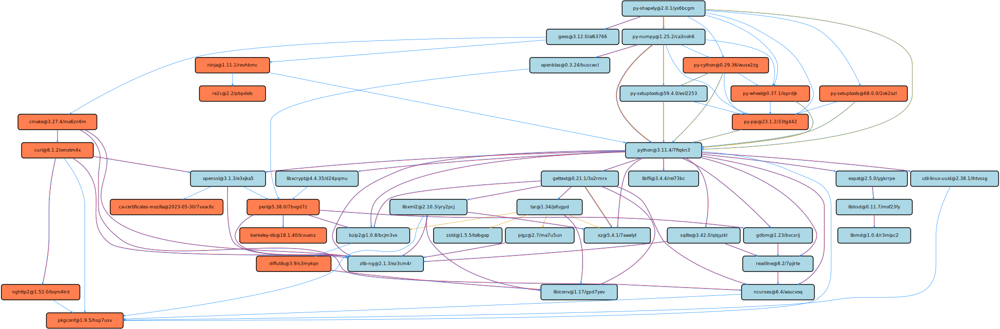

.. Copyright 2013-2023 Lawrence Livermore National Security, LLC and other
   Spack Project Developers. See the top-level COPYRIGHT file for details.

   SPDX-License-Identifier: (Apache-2.0 OR MIT)

.. _concretizer-options:

==========================================
Concretization Settings (concretizer.yaml)
==========================================

The ``concretizer.yaml`` configuration file allows to customize aspects of the
algorithm used to select the dependencies you install. The default configuration
is the following:

.. literalinclude:: _spack_root/etc/spack/defaults/concretizer.yaml
   :language: yaml

--------------------------------
Reuse already installed packages
--------------------------------

The ``reuse`` attribute controls whether Spack will prefer to use installed packages (``true``), or
whether it will do a "fresh" installation and prefer the latest settings from
``package.py`` files and ``packages.yaml`` (``false``).
You can use:

.. code-block:: console

   % spack install --reuse <spec>

to enable reuse for a single installation, and you can use:

.. code-block:: console

   spack install --fresh <spec>

to do a fresh install if ``reuse`` is enabled by default.
``reuse: dependencies`` is the default.

.. seealso::

   FAQ: :ref:`Why does Spack pick particular versions and variants? <faq-concretizer-precedence>`

------------------------------------------
Selection of the target microarchitectures
------------------------------------------

The options under the ``targets`` attribute control which targets are considered during a solve.
Currently the options in this section are only configurable from the ``concretizer.yaml`` file
and there are no corresponding command line arguments to enable them for a single solve.

The ``granularity`` option can take two possible values: ``microarchitectures`` and ``generic``.
If set to:

.. code-block:: yaml

   concretizer:
     targets:
       granularity: microarchitectures

Spack will consider all the microarchitectures known to ``archspec`` to label nodes for
compatibility. If instead the option is set to:

.. code-block:: yaml

   concretizer:
     targets:
       granularity: generic

Spack will consider only generic microarchitectures. For instance, when running on an
Haswell node, Spack will consider ``haswell`` as the best target in the former case and
``x86_64_v3`` as the best target in the latter case.

The ``host_compatible`` option is a Boolean option that determines whether or not the
microarchitectures considered during the solve are constrained to be compatible with the
host Spack is currently running on. For instance, if this option is set to ``true``, a
user cannot concretize for ``target=icelake`` while running on an Haswell node.

---------------
Duplicate nodes
---------------

The ``duplicates`` attribute controls whether the DAG can contain multiple configurations of
the same package. This is mainly relevant for build dependencies, which may have their version
pinned by some nodes, and thus be required at different versions by different nodes in the same
DAG.

The ``strategy`` option controls how the solver deals with duplicates. If the value is ``none``,
then a single configuration per package is allowed in the DAG. This means, for instance, that only
a single ``cmake`` or a single ``py-setuptools`` version is allowed. The result would be a slightly
faster concretization, at the expense of making a few specs unsolvable.

If the value is ``minimal`` Spack will allow packages tagged as ``build-tools`` to have duplicates.
This allows, for instance, to concretize specs whose nodes require different, and incompatible, ranges
of some build tool. For instance, in the figure below the latest `py-shapely` requires a newer `py-setuptools`,
while `py-numpy` still needs an older version:

Up to Spack v0.20 ``duplicates:strategy:none`` was the default (and only) behavior. From Spack v0.21 the
default behavior is ``duplicates:strategy:minimal``.
