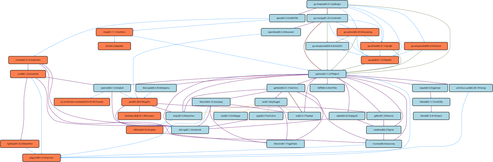
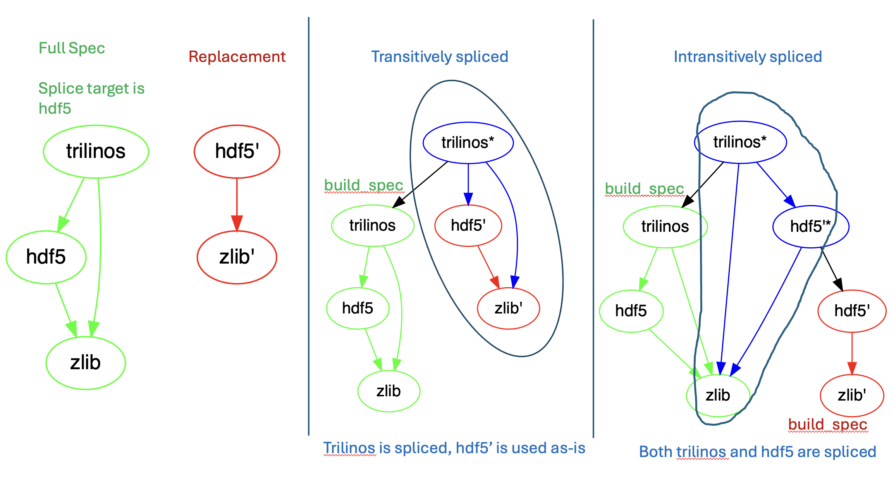

..
   Copyright Spack Project Developers. See COPYRIGHT file for details.

   SPDX-License-Identifier: (Apache-2.0 OR MIT)

.. meta::
   :description lang=en:
      Understand how to control the build process in Spack by customizing package-specific build settings and environment variables.

.. index::
   single: concretizer; configuring
   single: microarchitecture; target granularity

.. _concretizer-options:

Concretization Settings (concretizer.yaml)
==========================================

The ``concretizer.yaml`` configuration file allows users to customize aspects of the algorithm used to select the dependencies they install.
The default configuration is the following:

.. literalinclude:: _spack_root/etc/spack/defaults/base/concretizer.yaml
   :language: yaml

Completion of external nodes
----------------------------

:ref:`The external packages <sec-external-packages>` available from the ``packages.yaml`` configuration file are usually reporting only a few of the variants defined in the corresponding recipe.
Users can configure how Spack deals with missing information for externals via the ``concretizer:externals:completion`` attribute:

.. code-block:: yaml

   concretizer:
     externals:
       completion: default_variants

This attribute currently allows two possible values:

- ``architecture_only``: only the mandatory architectural information is completed on externals
- ``default_variants``: external specs are also completed with missing variants, using their default values

.. index::
   single: reuse; configuring
   single: fresh; configuring

Reuse Already Installed Packages
--------------------------------

The ``reuse`` attribute controls how aggressively Spack reuses binary packages during concretization.
The attribute can be either a single value or an object for more complex configurations.

In the former case ("single value"), it allows Spack to:

1. Reuse installed packages and build caches for all the specs to be concretized, when ``true``.
2. Reuse installed packages and build caches only for the dependencies of the root specs, when ``dependencies``.
3. Disregard reusing installed packages and build caches, when ``false``.

In case finer control over which specs are reused is needed, the value of this attribute can be an object with the following keys:

1. ``roots``: if ``true`` root specs are reused, if ``false`` only dependencies of root specs are reused
2. ``from``: list of sources from which reused specs are taken

Each source in ``from`` is itself an object with the following attributes:

.. list-table:: Attributes for a source or reusable specs
   :header-rows: 1

   * - Attribute name
     - Description
   * - type (mandatory, string)
     - Can be ``local``, ``buildcache``, or ``external``.
   * - include (optional, list of specs)
     - If present, reusable specs must match at least one of the constraints in the list.
   * - exclude (optional, list of specs)
     - If present, reusable specs must not match any of the constraints in the list.

For instance, the following configuration:

.. code-block:: yaml

   concretizer:
     reuse:
       roots: true
       from:
       - type: local
         include:
         - "%gcc"
         - "%clang"

tells the concretizer to reuse all specs compiled with either ``gcc`` or ``clang`` that are installed in the local store.
Any spec from remote build caches is disregarded.

To reduce the boilerplate in configuration files, default values for the ``include`` and ``exclude`` options can be pushed up one level:

.. code-block:: yaml

   concretizer:
     reuse:
       roots: true
       include:
       - "%gcc"
       from:
       - type: local
       - type: buildcache
       - type: local
         include:
         - "foo %oneapi"

In the example above, we reuse all specs compiled with ``gcc`` from the local store and remote build caches, and we also reuse ``foo %oneapi``.
Note that the last source of specs overrides the default ``include`` attribute.

For one-off concretizations, there are command-line arguments for each of the simple "single value" configurations.
This means a user can:

.. code-block:: console

   % spack install --reuse <spec>

to enable reuse for a single installation, or:

.. code-block:: console

   $ spack install --fresh <spec>

to do a fresh install if ``reuse`` is enabled by default.

.. seealso::

   FAQ: :ref:`Why does Spack pick particular versions and variants? <faq-concretizer-precedence>`

Selection of Target Microarchitectures
------------------------------------------

The options under the ``targets`` attribute control which targets are considered during a solve.
Currently, the options in this section are only configurable from the ``concretizer.yaml`` file, and there are no corresponding command-line arguments to enable them for a single solve.

The ``granularity`` option can take two possible values: ``microarchitectures`` and ``generic``.
If set to:

.. code-block:: yaml

   concretizer:
     targets:
       granularity: microarchitectures

Spack will consider all the microarchitectures known to ``archspec`` to label nodes for compatibility.
If instead the option is set to:

.. code-block:: yaml

   concretizer:
     targets:
       granularity: generic

Spack will consider only generic microarchitectures.
For instance, when running on a Haswell machine, Spack will consider ``haswell`` as the best target in the former case and ``x86_64_v3`` as the best target in the latter case.

The ``host_compatible`` option is a Boolean option that determines whether or not the microarchitectures considered during the solve are constrained to be compatible with the host Spack is currently running on.
For instance, if this option is set to ``true``, a user cannot concretize for ``target=icelake`` while running on a Haswell machine.

Duplicate Nodes
---------------

The ``duplicates`` attribute controls whether the DAG can contain multiple configurations of the same package.
This is mainly relevant for build dependencies, which may have their version pinned by some nodes and thus be required at different versions by different nodes in the same DAG.

The ``strategy`` option controls how the solver deals with duplicates.
If the value is ``none``, then a single configuration per package is allowed in the DAG.
This means, for instance, that only a single ``cmake`` or a single ``py-setuptools`` version is allowed.
The result would be a slightly faster concretization at the expense of making a few specs unsolvable.

If the value is ``minimal``, Spack will allow packages tagged as ``build-tools`` to have duplicates.
This allows, for instance, to concretize specs whose nodes require different and incompatible ranges of some build tool.
For instance, in the figure below, the latest `py-shapely` requires a newer `py-setuptools`, while `py-numpy` still needs an older version:

Up to Spack v0.20, ``duplicates:strategy:none`` was the default (and only) behavior.
From Spack v0.21, the default behavior is ``duplicates:strategy:minimal``.

.. index::
   single: splicing; in config
   :name: splicing

Splicing
--------

The ``splice`` key covers configuration attributes for splicing specs in the solver.

"Splicing" is a method for replacing a dependency with another spec that provides the same package or virtual.
There are two types of splices, referring to different behaviors for shared dependencies between the root spec and the new spec replacing a dependency: "transitive" and "intransitive".
A "transitive" splice is one that resolves all conflicts by taking the dependency from the new node.
An "intransitive" splice is one that resolves all conflicts by taking the dependency from the original root.
From a theory perspective, hybrid splices are possible but are not modeled by Spack.

All spliced specs retain a ``build_spec`` attribute that points to the original spec before any splice occurred.
The ``build_spec`` for a non-spliced spec is itself.

The figure below shows examples of transitive and intransitive splices:

The concretizer can be configured to explicitly splice particular replacements for a target spec.
Splicing will allow the user to make use of generically built public binary caches while swapping in highly optimized local builds for performance-critical components and/or components that interact closely with the specific hardware details of the system.
The most prominent candidate for splicing is MPI providers.
MPI packages have relatively well-understood ABI characteristics, and most High Performance Computing facilities deploy highly optimized MPI packages tailored to their particular hardware.
The following configuration block configures Spack to replace whatever MPI provider each spec was concretized to use with the particular package of ``mpich`` with the hash that begins ``abcdef``.

.. code-block:: yaml

   concretizer:
     splice:
       explicit:
       - target: mpi
         replacement: mpich/abcdef
         transitive: false

.. warning::

   When configuring an explicit splice, you as the user take on the responsibility for ensuring ABI compatibility between the specs matched by the target and the replacement you provide.
   If they are not compatible, Spack will not warn you, and your application will fail to run.

The ``target`` field of an explicit splice can be any abstract spec.
The ``replacement`` field must be a spec that includes the hash of a concrete spec, and the replacement must either be the same package as the target, provide the virtual that is the target, or provide a virtual that the target provides.
The ``transitive`` field is optional -- by default, splices will be transitive.

.. note::

   With explicit splices configured, it is possible for Spack to concretize to a spec that does not satisfy the input.
   For example, with the configuration above, ``hdf5 ^mvapich2`` will concretize to use ``mpich/abcdef`` instead of ``mvapich2`` as the MPI provider.
   Spack will warn the user in this case, but will not fail the concretization.

.. _automatic_splicing:

Automatic Splicing
^^^^^^^^^^^^^^^^^^

The Spack solver can be configured to do automatic splicing for ABI-compatible packages.
Automatic splices are enabled in the concretizer configuration section:

.. code-block:: yaml

   concretizer:
     splice:
       automatic: true

Packages can include ABI-compatibility information using the ``can_splice`` directive.
See :ref:`the packaging guide <abi_compatibility>` for instructions on specifying ABI compatibility using the ``can_splice`` directive.

.. note::

   The ``can_splice`` directive is experimental and may be changed in future versions.

When automatic splicing is enabled, the concretizer will combine any number of ABI-compatible specs if possible to reuse installed packages and packages available from binary caches.
The end result of these specs is equivalent to a series of transitive/intransitive splices, but the series may be non-obvious.

.. index::
   single: concretization cache

.. _concretization-cache:

Concretization Cache
--------------------

Spack can cache the results of successful concretization runs and reuse them for identical solves.
The cache is configured under the ``concretizer:concretization_cache`` attribute in ``concretizer.yaml``.

``concretizer:concretization_cache:enable``
^^^^^^^^^^^^^^^^^^^^^^^^^^^^^^^^^^^^^^^^^^^

When set to ``true``, Spack will utilize a cache of solver outputs from successful concretization runs.
When enabled, Spack will check the concretization cache prior to running the solver.
If a previous request to solve a given problem is present in the cache, Spack will load the concrete specs and other solver data from the cache rather than running the solver.
Specs not previously concretized will be added to the cache on a successful solve.
The cache additionally holds solver statistics, so commands like ``spack solve`` will still return information about the run that produced a given solver result.

This cache is a subcache of the :ref:`Misc Cache` and as such will be cleaned when the Misc Cache is cleaned.

When ``false`` or omitted, all concretization requests will be performed from scratch.

``concretizer:concretization_cache:url``
^^^^^^^^^^^^^^^^^^^^^^^^^^^^^^^^^^^^^^^^

Path to the location where Spack will root the concretization cache.
Currently this only supports paths on the local filesystem.

Default location is under the :ref:`Misc Cache` at: ``$misc_cache/concretization``

The cache can be shared among users on the same machine.
Spack creates cache directories and entries with permissions that follow your umask, so sharing is controlled entirely by how the cache directory is set up.
There are two ways to share:

* **Read-only sharing**: one user (e.g. a CI account) populates the cache with a typical umask (e.g. ``022``), and other users point ``concretizer:concretization_cache:url`` at it.
  Spack degrades gracefully in a cache it cannot write to.
  Hits are returned, and misses simply re-run the solver.

* **Read/write sharing**: point ``concretizer:concretization_cache:url`` at a directory owned by a common group, group-writable, and with the setgid bit set:

  .. code-block:: console

     $ chgrp spackusers $cache_dir
     $ chmod 2770 $cache_dir

  If sharers may have restrictive umasks, you can also set a default ACL so that entries are always group read/write:

  .. code-block:: console

     $ setfacl -d -m u::rwx,g::rwx,o::--- $cache_dir

  Avoid sticky, world-writable locations like ``/tmp``: the sticky bit prevents users from replacing or pruning each other's entries.

``concretizer:concretization_cache:entry_limit``
^^^^^^^^^^^^^^^^^^^^^^^^^^^^^^^^^^^^^^^^^^^^^^^^

Sets a limit on the number of concretization results that Spack will cache.
The limit is evaluated after each concretization run; if Spack has stored more results than the limit allows, the oldest concretization results are pruned until 10% of the limit has been removed.

Setting this value to 0 disables automatic pruning.
It is expected that users will be responsible for maintaining this cache.

``concretizer:concretization_cache:size_limit``
^^^^^^^^^^^^^^^^^^^^^^^^^^^^^^^^^^^^^^^^^^^^^^^

Sets a limit on the size of the concretization cache in bytes.
The limit is evaluated after each concretization run; if Spack has stored more results than the limit allows, the oldest concretization results are pruned until 10% of the limit has been removed.

Setting this value to 0 disables automatic pruning.
It is expected that users will be responsible for maintaining this cache.
