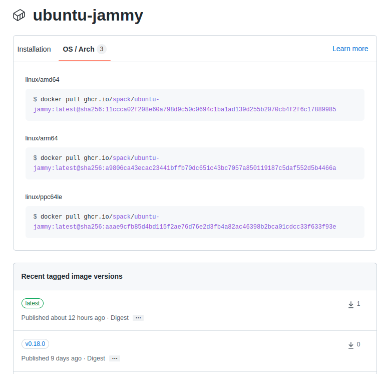

.. Copyright 2013-2024 Lawrence Livermore National Security, LLC and other
   Spack Project Developers. See the top-level COPYRIGHT file for details.

   SPDX-License-Identifier: (Apache-2.0 OR MIT)

.. _containers:

================
Container Images
================

Spack :ref:`environments` can easily be turned into container images. This page
outlines two ways in which this can be done:

1. By installing the environment on the host system, and copying the installations
   into the container image. This approach does not require any tools like Docker
   or Singularity to be installed.
2. By generating a Docker or Singularity recipe that can be used to build the
   container image. In this approach, Spack builds the software inside the
   container runtime, not on the host system.

The first approach is easiest if you already have an installed environment,
the second approach gives more control over the container image.

---------------------------
From existing installations
---------------------------

If you already have a Spack environment installed on your system, you can
share the binaries as an OCI compatible container image. To get started you
just have to configure and OCI registry and run ``spack buildcache push``.

.. code-block:: console
  
   # Create and install an environment in the current directory
   spack env create -d .
   spack -e . add pkg-a pkg-b
   spack -e . install

   # Configure the registry
   spack -e . mirror add --oci-username ... --oci-password ... container-registry oci://example.com/name/image

   # Push the image
   spack -e . buildcache push --update-index --base-image ubuntu:22.04 --tag my_env container-registry

The resulting container image can then be run as follows:

.. code-block:: console

   $ docker run -it example.com/name/image:my_env

The image generated by Spack consists of the specified base image with each package from the
environment as a separate layer on top. The image is minimal by construction, it only contains the
environment roots and its runtime dependencies.

.. note::

  When using registries like GHCR and Docker Hub, the ``--oci-password`` flag is not
  the password for your account, but a personal access token you need to generate separately.

The specified ``--base-image`` should have a libc that is compatible with the host system.
For example if your host system is Ubuntu 20.04, you can use ``ubuntu:20.04``, ``ubuntu:22.04``
or newer: the libc in the container image must be at least the version of the host system,
assuming ABI compatibility. It is also perfectly fine to use a completely different
Linux distribution as long as the libc is compatible.

For convenience, Spack also turns the OCI registry into a :ref:`build cache <binary_caches_oci>`,
so that future ``spack install`` of the environment will simply pull the binaries from the
registry instead of doing source builds. The flag ``--update-index`` is needed to make Spack
take the build cache into account when concretizing.

.. note::

  When generating container images in CI, the approach above is recommended when CI jobs
  already run in a sandboxed environment. You can simply use ``spack`` directly
  in the CI job and push the resulting image to a registry. Subsequent CI jobs should
  run faster because Spack can install from the same registry instead of rebuilding from
  sources.

---------------------------------------------
Generating recipes for Docker and Singularity
---------------------------------------------

Apart from copying existing installations into container images, Spack can also
generate recipes for container images. This is useful if you want to run Spack
itself in a sandboxed environment instead of on the host system.

Since recipes need a little bit more boilerplate than

.. code-block:: docker

   COPY spack.yaml /environment
   RUN spack -e /environment install

Spack provides a command to generate customizable recipes for container images. Customizations
include minimizing the size of the image, installing packages in the base image using the system
package manager, and setting up a proper entrypoint to run the image.

~~~~~~~~~~~~~~~~~~~~
A Quick Introduction
~~~~~~~~~~~~~~~~~~~~

Consider having a Spack environment like the following:

.. code-block:: yaml

   spack:
     specs:
     - gromacs+mpi
     - mpich

Producing a ``Dockerfile`` from it is as simple as changing directories to
where the ``spack.yaml`` file is stored and running the following command:

.. code-block:: console

   $ spack containerize > Dockerfile

The ``Dockerfile`` that gets created uses multi-stage builds and
other techniques to minimize the size of the final image:

.. code-block:: docker

   # Build stage with Spack pre-installed and ready to be used
   FROM spack/ubuntu-bionic:latest as builder

   # What we want to install and how we want to install it
   # is specified in a manifest file (spack.yaml)
   RUN mkdir /opt/spack-environment \
   &&  (echo "spack:" \
   &&   echo "  specs:" \
   &&   echo "  - gromacs+mpi" \
   &&   echo "  - mpich" \
   &&   echo "  concretizer:" \
   &&   echo "    unify: true" \
   &&   echo "  config:" \
   &&   echo "    install_tree: /opt/software" \
   &&   echo "  view: /opt/view") > /opt/spack-environment/spack.yaml

   # Install the software, remove unnecessary deps
   RUN cd /opt/spack-environment && spack env activate . && spack install --fail-fast && spack gc -y

   # Strip all the binaries
   RUN find -L /opt/view/* -type f -exec readlink -f '{}' \; | \
       xargs file -i | \
       grep 'charset=binary' | \
       grep 'x-executable\|x-archive\|x-sharedlib' | \
       awk -F: '{print $1}' | xargs strip -s

   # Modifications to the environment that are necessary to run
   RUN cd /opt/spack-environment && \
       spack env activate --sh -d . >> /etc/profile.d/z10_spack_environment.sh

   # Bare OS image to run the installed executables
   FROM ubuntu:18.04

   COPY --from=builder /opt/spack-environment /opt/spack-environment
   COPY --from=builder /opt/software /opt/software
   COPY --from=builder /opt/view /opt/view
   COPY --from=builder /etc/profile.d/z10_spack_environment.sh /etc/profile.d/z10_spack_environment.sh

   ENTRYPOINT ["/bin/bash", "--rcfile", "/etc/profile", "-l"]

The image itself can then be built and run in the usual way, with any of the
tools suitable for the task. For instance, if we decided to use ``docker``:

.. code-block:: bash

   $ spack containerize > Dockerfile
   $ docker build -t myimage .
   [ ... ]
   $ docker run -it myimage

The various components involved in the generation of the recipe and their
configuration are discussed in details in the sections below.

.. _container_spack_images:

~~~~~~~~~~~~~~~~~~~~~~~~~~
Spack Images on Docker Hub
~~~~~~~~~~~~~~~~~~~~~~~~~~

Docker images with Spack preinstalled and ready to be used are
built when a release is tagged, or nightly on ``develop``. The images
are then pushed both to `Docker Hub <https://hub.docker.com/u/spack>`_
and to `GitHub Container Registry <https://github.com/orgs/spack/packages?repo_name=spack>`_.
The OS that are currently supported are summarized in the table below:

.. _containers-supported-os:

.. list-table:: Supported operating systems
   :header-rows: 1

   * - Operating System
     - Base Image
     - Spack Image
   * - Ubuntu 20.04
     - ``ubuntu:20.04``
     - ``spack/ubuntu-focal``
   * - Ubuntu 22.04
     - ``ubuntu:22.04``
     - ``spack/ubuntu-jammy``
   * - Ubuntu 24.04
     - ``ubuntu:24.04``
     - ``spack/ubuntu-noble``
   * - CentOS Stream9
     - ``quay.io/centos/centos:stream9``
     - ``spack/centos-stream9``
   * - openSUSE Leap
     - ``opensuse/leap``
     - ``spack/leap15``
   * - Amazon Linux 2
     - ``amazonlinux:2``
     - ``spack/amazon-linux``
   * - AlmaLinux 8
     - ``almalinux:8``
     - ``spack/almalinux8``
   * - AlmaLinux 9
     - ``almalinux:9``
     - ``spack/almalinux9``
   * - Rocky Linux 8
     - ``rockylinux:8``
     - ``spack/rockylinux8``
   * - Rocky Linux 9
     - ``rockylinux:9``
     - ``spack/rockylinux9``
   * - Fedora Linux 39
     - ``fedora:39``
     - ``spack/fedora39``
   * - Fedora Linux 40
     - ``fedora:40``
     - ``spack/fedora40``

All the images are tagged with the corresponding release of Spack:

with the exception of the ``latest`` tag that points to the HEAD
of the ``develop`` branch. These images are available for anyone
to use and take care of all the repetitive tasks that are necessary
to setup Spack within a container. The container recipes generated
by Spack use them as default base images for their ``build`` stage,
even though handles to use custom base images provided by users are
available to accommodate complex use cases.

~~~~~~~~~~~~~~~~~~~~~~~~~~~~~~~~
Configuring the Container Recipe
~~~~~~~~~~~~~~~~~~~~~~~~~~~~~~~~

Any Spack Environment can be used for the automatic generation of container
recipes. Sensible defaults are provided for things like the base image or the
version of Spack used in the image.
If a finer tuning is needed it can be obtained by adding the relevant metadata
under the ``container`` attribute of environments:

.. code-block:: yaml

   spack:
     specs:
     - gromacs+mpi
     - mpich

     container:
       # Select the format of the recipe e.g. docker,
       # singularity or anything else that is currently supported
       format: docker

       # Sets the base images for the stages where Spack builds the
       # software or where the software gets installed after being built..
       images:
         os: "centos:7"
         spack: develop

       # Whether or not to strip binaries
       strip: true

       # Additional system packages that are needed at runtime
       os_packages:
         final:
         - libgomp

       # Labels for the image
       labels:
         app: "gromacs"
         mpi: "mpich"

A detailed description of the options available can be found in the :ref:`container_config_options` section.

~~~~~~~~~~~~~~~~~~~
Setting Base Images
~~~~~~~~~~~~~~~~~~~

The ``images`` subsection is used to select both the image where
Spack builds the software and the image where the built software
is installed. This attribute can be set in different ways and
which one to use depends on the use case at hand.

""""""""""""""""""""""""""""""""""""""""
Use Official Spack Images From Dockerhub
""""""""""""""""""""""""""""""""""""""""

To generate a recipe that uses an official Docker image from the
Spack organization to build the software and the corresponding official OS image
to install the built software, all the user has to do is specify:

1. An operating system under ``images:os``
2. A Spack version under ``images:spack``

Any combination of these two values that can be mapped to one of the images
discussed in :ref:`container_spack_images` is allowed. For instance, the
following ``spack.yaml``:

.. code-block:: yaml

   spack:
     specs:
     - gromacs+mpi
     - mpich

     container:
       images:
         os: centos:7
         spack: 0.15.4

uses ``spack/centos7:0.15.4``  and ``centos:7`` for the stages where the
software is respectively built and installed:

.. code-block:: docker

   # Build stage with Spack pre-installed and ready to be used
   FROM spack/centos7:0.15.4 as builder

   # What we want to install and how we want to install it
   # is specified in a manifest file (spack.yaml)
   RUN mkdir /opt/spack-environment \
   &&  (echo "spack:" \
   &&   echo "  specs:" \
   &&   echo "  - gromacs+mpi" \
   &&   echo "  - mpich" \
   &&   echo "  concretizer:" \
   &&   echo "    unify: true" \
   &&   echo "  config:" \
   &&   echo "    install_tree: /opt/software" \
   &&   echo "  view: /opt/view") > /opt/spack-environment/spack.yaml
   [ ... ]
   # Bare OS image to run the installed executables
   FROM centos:7

   COPY --from=builder /opt/spack-environment /opt/spack-environment
   COPY --from=builder /opt/software /opt/software
   COPY --from=builder /opt/view /opt/view
   COPY --from=builder /etc/profile.d/z10_spack_environment.sh /etc/profile.d/z10_spack_environment.sh

   ENTRYPOINT ["/bin/bash", "--rcfile", "/etc/profile", "-l"]

This is the simplest available method of selecting base images, and we advise
to use it whenever possible. There are cases though where using Spack official
images is not enough to fit production needs. In these situations users can
extend the recipe to start with the bootstrapping of Spack at a certain pinned
version or manually select which base image to start from in the recipe,
as we'll see next.

^^^^^^^^^^^^^^^^^^^^^^^^^^^^^^^
Use a Bootstrap Stage for Spack
^^^^^^^^^^^^^^^^^^^^^^^^^^^^^^^

In some cases users may want to pin the commit sha that is used for Spack, to ensure later
reproducibility, or start from a fork of the official Spack repository to try a bugfix or
a feature in the early stage of development. This is possible by being just a little more
verbose when specifying information about Spack in the ``spack.yaml`` file:

.. code-block:: yaml

   images:
     os: amazonlinux:2
     spack:
       # URL of the Spack repository to be used in the container image
       url: <to-use-a-fork>
       # Either a commit sha, a branch name or a tag
       ref: <sha/tag/branch>
       # If true turn a branch name or a tag into the corresponding commit
       # sha at the time of recipe generation
       resolve_sha: <true/false>

``url`` specifies the URL from which to clone Spack and defaults to https://github.com/spack/spack.
The ``ref`` attribute can be either a commit sha, a branch name or a tag. The default value in
this case is to use the ``develop`` branch, but it may change in the future to point to the latest stable
release. Finally ``resolve_sha`` transform branch names or tags into the corresponding commit
shas at the time of recipe generation, to allow for a greater reproducibility of the results
at a later time.

The list of operating systems that can be used to bootstrap Spack can be
obtained with:

.. command-output:: spack containerize --list-os

.. note::

   The ``resolve_sha`` option uses ``git rev-parse`` under the hood and thus it requires
   to checkout the corresponding Spack repository in a temporary folder before generating
   the recipe. Recipe generation may take longer when this option is set to true because
   of this additional step.

^^^^^^^^^^^^^^^^^^^^^^^^^^^^^^^^^^^
Use Custom Images Provided by Users
^^^^^^^^^^^^^^^^^^^^^^^^^^^^^^^^^^^

Consider, as an example, building a production grade image for a CUDA
application. The best strategy would probably be to build on top of
images provided by the vendor and regard CUDA as an external package.

Spack doesn't currently provide an official image with CUDA configured
this way, but users can build it on their own and then configure the
environment to explicitly pull it. This requires users to:

1. Specify the image used to build the software under ``images:build``
2. Specify the image used to install the built software under ``images:final``

A ``spack.yaml`` like the following:

.. code-block:: yaml

   spack:
     specs:
     - gromacs@2019.4+cuda build_type=Release
     - mpich
     - fftw precision=float
     packages:
       cuda:
         buildable: False
         externals:
         - spec: cuda%gcc
           prefix: /usr/local/cuda

     container:
       images:
         build: custom/cuda-10.1-ubuntu18.04:latest
         final: nvidia/cuda:10.1-base-ubuntu18.04

produces, for instance, the following ``Dockerfile``:

.. code-block:: docker

   # Build stage with Spack pre-installed and ready to be used
   FROM custom/cuda-10.1-ubuntu18.04:latest as builder

   # What we want to install and how we want to install it
   # is specified in a manifest file (spack.yaml)
   RUN mkdir /opt/spack-environment \
   &&  (echo "spack:" \
   &&   echo "  specs:" \
   &&   echo "  - gromacs@2019.4+cuda build_type=Release" \
   &&   echo "  - mpich" \
   &&   echo "  - fftw precision=float" \
   &&   echo "  packages:" \
   &&   echo "    cuda:" \
   &&   echo "      buildable: false" \
   &&   echo "      externals:" \
   &&   echo "      - spec: cuda%gcc" \
   &&   echo "        prefix: /usr/local/cuda" \
   &&   echo "  concretizer:" \
   &&   echo "    unify: true" \
   &&   echo "  config:" \
   &&   echo "    install_tree: /opt/software" \
   &&   echo "  view: /opt/view") > /opt/spack-environment/spack.yaml

   # Install the software, remove unnecessary deps
   RUN cd /opt/spack-environment && spack env activate . && spack install --fail-fast && spack gc -y

   # Strip all the binaries
   RUN find -L /opt/view/* -type f -exec readlink -f '{}' \; | \
       xargs file -i | \
       grep 'charset=binary' | \
       grep 'x-executable\|x-archive\|x-sharedlib' | \
       awk -F: '{print $1}' | xargs strip -s

   # Modifications to the environment that are necessary to run
   RUN cd /opt/spack-environment && \
       spack env activate --sh -d . >> /etc/profile.d/z10_spack_environment.sh

   # Bare OS image to run the installed executables
   FROM nvidia/cuda:10.1-base-ubuntu18.04

   COPY --from=builder /opt/spack-environment /opt/spack-environment
   COPY --from=builder /opt/software /opt/software
   COPY --from=builder /opt/view /opt/view
   COPY --from=builder /etc/profile.d/z10_spack_environment.sh /etc/profile.d/z10_spack_environment.sh

   ENTRYPOINT ["/bin/bash", "--rcfile", "/etc/profile", "-l"]

where the base images for both stages are completely custom.

This second mode of selection for base images is more flexible than just
choosing an operating system and a Spack version, but is also more demanding.
Users may need to generate by themselves their base images and it's also their
responsibility to ensure that:

1. Spack is available in the ``build`` stage and set up correctly to install the required software
2. The artifacts produced in the ``build`` stage can be executed in the ``final`` stage

Therefore we don't recommend its use in cases that can be otherwise
covered by the simplified mode shown first.

~~~~~~~~~~~~~~~~~~~~~~~~~~~~
Singularity Definition Files
~~~~~~~~~~~~~~~~~~~~~~~~~~~~

In addition to producing recipes in ``Dockerfile`` format Spack can produce
Singularity Definition Files by just changing the value of the ``format``
attribute:

.. code-block:: console

   $ cat spack.yaml
   spack:
     specs:
     - hdf5~mpi
     container:
       format: singularity

   $ spack containerize > hdf5.def
   $ sudo singularity build hdf5.sif hdf5.def

The minimum version of Singularity required to build a SIF (Singularity Image Format)
image from the recipes generated by Spack is ``3.5.3``.

~~~~~~~~~~~~~~~~~~~~~~~~~~~~~~
Extending the Jinja2 Templates
~~~~~~~~~~~~~~~~~~~~~~~~~~~~~~

The Dockerfile and the Singularity definition file that Spack can generate are based on
a few Jinja2 templates that are rendered according to the environment being containerized.
Even though Spack allows a great deal of customization by just setting appropriate values for
the configuration options, sometimes that is not enough.

In those cases, a user can directly extend the template that Spack uses to render the image
to e.g. set additional environment variables or perform specific operations either before or
after a given stage of the build. Let's consider as an example the following structure:

.. code-block:: console

   $ tree /opt/environment
   /opt/environment
   ├── data
   │     └── data.csv
   ├── spack.yaml
   ├── data
   └── templates
       └── container
           └── CustomDockerfile

containing both the custom template extension and the environment manifest file. To use a custom
template, the environment must register the directory containing it, and declare its use under the
``container`` configuration:

.. code-block:: yaml
   :emphasize-lines: 7-8,12

   spack:
     specs:
     - hdf5~mpi
     concretizer:
       unify: true
     config:
       template_dirs:
       - /opt/environment/templates
     container:
       format: docker
       depfile: true
       template: container/CustomDockerfile

The template extension can override two blocks, named ``build_stage`` and ``final_stage``, similarly to
the example below:

.. code-block::
   :emphasize-lines: 3,8

   
   
   RUN echo "Start building"
   {{ super() }}
   
   
   {{ super() }}
   COPY data /share/myapp/data
   

The Dockerfile is generated by running:

.. code-block:: console

   $ spack -e /opt/environment containerize

Note that the environment must be active for spack to read the template.
The recipe that gets generated contains the two extra instruction that we added in our template extension:

.. code-block:: Dockerfile
   :emphasize-lines: 4,43

   # Build stage with Spack pre-installed and ready to be used
   FROM spack/ubuntu-jammy:latest as builder

   RUN echo "Start building"

   # What we want to install and how we want to install it
   # is specified in a manifest file (spack.yaml)
   RUN mkdir /opt/spack-environment \
   &&  (echo "spack:" \
   &&   echo "  specs:" \
   &&   echo "  - hdf5~mpi" \
   &&   echo "  concretizer:" \
   &&   echo "    unify: true" \
   &&   echo "  config:" \
   &&   echo "    template_dirs:" \
   &&   echo "    - /tmp/environment/templates" \
   &&   echo "    install_tree: /opt/software" \
   &&   echo "  view: /opt/view") > /opt/spack-environment/spack.yaml

   # Install the software, remove unnecessary deps
   RUN cd /opt/spack-environment && spack env activate . && spack concretize && spack env depfile -o Makefile && make -j $(nproc) && spack gc -y

   # Strip all the binaries
   RUN find -L /opt/view/* -type f -exec readlink -f '{}' \; | \
       xargs file -i | \
       grep 'charset=binary' | \
       grep 'x-executable\|x-archive\|x-sharedlib' | \
       awk -F: '{print $1}' | xargs strip -s

   # Modifications to the environment that are necessary to run
   RUN cd /opt/spack-environment && \
       spack env activate --sh -d . >> /etc/profile.d/z10_spack_environment.sh

   # Bare OS image to run the installed executables
   FROM ubuntu:22.04

   COPY --from=builder /opt/spack-environment /opt/spack-environment
   COPY --from=builder /opt/software /opt/software
   COPY --from=builder /opt/._view /opt/._view
   COPY --from=builder /opt/view /opt/view
   COPY --from=builder /etc/profile.d/z10_spack_environment.sh /etc/profile.d/z10_spack_environment.sh

   COPY data /share/myapp/data

   ENTRYPOINT ["/bin/bash", "--rcfile", "/etc/profile", "-l", "-c", "$*", "--" ]
   CMD [ "/bin/bash" ]

.. _container_config_options:

~~~~~~~~~~~~~~~~~~~~~~~
Configuration Reference
~~~~~~~~~~~~~~~~~~~~~~~

The tables below describe all the configuration options that are currently supported
to customize the generation of container recipes:

.. list-table:: General configuration options for the ``container`` section of ``spack.yaml``
   :header-rows: 1

   * - Option Name
     - Description
     - Allowed Values
     - Required
   * - ``format``
     - The format of the recipe
     - ``docker`` or ``singularity``
     - Yes
   * - ``depfile``
     - Whether to use a depfile for installation, or not
     - True or False (default)
     - No
   * - ``images:os``
     - Operating system used as a base for the image
     - See :ref:`containers-supported-os`
     - Yes, if using constrained selection of base images
   * - ``images:spack``
     - Version of Spack use in the ``build`` stage
     - Valid tags for ``base:image``
     - Yes, if using constrained selection of base images
   * - ``images:spack:url``
     - Repository from which Spack is cloned
     - Any fork of Spack
     - No
   * - ``images:spack:ref``
     - Reference for the checkout of Spack
     - Either a commit sha, a branch name or a tag
     - No
   * - ``images:spack:resolve_sha``
     - Resolve branches and tags in ``spack.yaml`` to commits in the generated recipe
     - True or False (default: False)
     - No
   * - ``images:build``
     - Image to be used in the ``build`` stage
     - Any valid container image
     - Yes, if using custom selection of base images
   * - ``images:final``
     - Image to be used in the ``build`` stage
     - Any valid container image
     - Yes, if using custom selection of base images
   * - ``strip``
     - Whether to strip binaries
     - ``true`` (default) or ``false``
     - No
   * - ``os_packages:command``
     - Tool used to manage system packages
     - ``apt``, ``yum``, ``dnf``, ``dnf_epel``, ``zypper``, ``apk``, ``yum_amazon``
     - Only with custom base images
   * - ``os_packages:update``
     - Whether or not to update the list of available packages
     - True or False (default: True)
     - No
   * - ``os_packages:build``
     - System packages needed at build-time
     - Valid packages for the current OS
     - No
   * - ``os_packages:final``
     - System packages needed at run-time
     - Valid packages for the current OS
     - No
   * - ``labels``
     - Labels to tag the image
     - Pairs of key-value strings
     - No

.. list-table:: Configuration options specific to Singularity
   :header-rows: 1

   * - Option Name
     - Description
     - Allowed Values
     - Required
   * - ``singularity:runscript``
     - Content of ``%runscript``
     - Any valid script
     - No
   * - ``singularity:startscript``
     - Content of ``%startscript``
     - Any valid script
     - No
   * - ``singularity:test``
     - Content of ``%test``
     - Any valid script
     - No
   * - ``singularity:help``
     - Description of the image
     - Description string
     - No

~~~~~~~~~~~~~~
Best Practices
~~~~~~~~~~~~~~

"""
MPI
"""
Due to the dependency on Fortran for OpenMPI, which is the spack default
implementation, consider adding ``gfortran`` to the ``apt-get install`` list.

Recent versions of OpenMPI will require you to pass ``--allow-run-as-root``
to your ``mpirun`` calls if started as root user inside Docker.

For execution on HPC clusters, it can be helpful to import the docker
image into Singularity in order to start a program with an *external*
MPI. Otherwise, also add ``openssh-server`` to the ``apt-get install`` list.

""""
CUDA
""""
Starting from CUDA 9.0, Nvidia provides minimal CUDA images based on
Ubuntu. Please see `their instructions <https://hub.docker.com/r/nvidia/cuda/>`_.
Avoid double-installing CUDA by adding, e.g.

.. code-block:: yaml

   packages:
     cuda:
       externals:
       - spec: "cuda@9.0.176%gcc@5.4.0 arch=linux-ubuntu16-x86_64"
         prefix: /usr/local/cuda
       buildable: False

to your ``spack.yaml``.

Users will either need ``nvidia-docker`` or e.g. Singularity to *execute*
device kernels.

"""""""""""""""""""""""""
Docker on Windows and OSX
"""""""""""""""""""""""""

On Mac OS and Windows, docker runs on a hypervisor that is not allocated much
memory by default, and some spack packages may fail to build due to lack of
memory. To work around this issue, consider configuring your docker installation
to use more of your host memory. In some cases, you can also ease the memory
pressure on parallel builds by limiting the parallelism in your config.yaml.

.. code-block:: yaml

   config:
     build_jobs: 2

