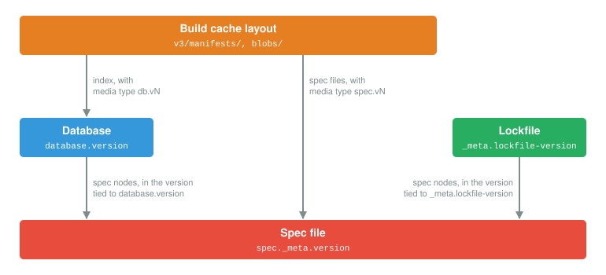

..
   Copyright Spack Project Developers. See COPYRIGHT file for details.

   SPDX-License-Identifier: (Apache-2.0 OR MIT)

.. meta::
   :description lang=en:
      A developer reference for the versioned file formats used by Spack, describing how the formats relate to each other, how their versions are checked, and how they have evolved across releases.

.. _file-formats:

Versioned File Formats
======================

This document describes the versioned file formats that Spack uses to store concrete specs, installation records, and the state of environments.
It is intended for developers who modify the data that Spack writes to disk or to a build cache.

Each format is documented in detail on a dedicated page:

.. toctree::
   :maxdepth: 1

   file_formats/specfile
   file_formats/database
   file_formats/lockfile
   file_formats/buildcache

The figure below shows how the formats depend on each other:

   An arrow from A to B means that A stores data in the format of B.

The following table lists the formats, the files in which they are stored, and the constant that defines the current version of each.

.. list-table:: Versioned formats
   :header-rows: 1

   * - Format
     - Location
     - Version constant
     - Current version
   * - :doc:`Spec file <file_formats/specfile>`
     - ``<prefix>/.spack/spec.json``, build cache spec files
     - :data:`spack.spec.SPECFILE_FORMAT_VERSION`
     - |specfile_format_version|
   * - :doc:`Database <file_formats/database>`
     - ``<install_tree:root>/.spack-db/index.json``, build cache indexes
     - ``spack.database._DB_VERSION``
     - |db_version|
   * - :doc:`Environment lockfile <file_formats/lockfile>`
     - ``<environment>/spack.lock``
     - :data:`spack.environment.environment.CURRENT_LOCKFILE_VERSION`
     - |lockfile_version|
   * - :doc:`Build cache layout <file_formats/buildcache>`
     - ``<mirror>/v3/``, ``<mirror>/blobs/``
     - ``spack.url_buildcache.CURRENT_BUILD_CACHE_LAYOUT_VERSION``
     - |buildcache_layout_version|

.. _file-formats-coupling:

How Format Versions Are Coupled
-------------------------------

.. admonition:: A spec file version increment requires a Database and a lockfile version increment
   :class: warning

   An increment of the spec file version must be accompanied by an increment of both the Database version and the lockfile version in the same change.
   Otherwise, the nodes of a Database or a lockfile written with the new spec file format would be interpreted according to the previous one.
   The converse does not hold: the Database and the lockfile versions can be incremented on their own, as was done for lockfile v7.

   For example, `#53012 <https://github.com/spack/spack/pull/53012>`_ introduced spec file v6 together with Database v9, lockfile v8, and the ``spec.v6`` and ``db.v9`` build cache media types.

This requirement follows from the way the formats are layered.
They form a stack, with the spec file at the bottom, and each layer is described below, starting from the bottom of the stack.

**Spec file**
   The spec file is the format on which all the others depend.
   It stores a spec as a list of *node dictionaries*, each describing a single node of the DAG: its name, version, variants, architecture, DAG hash, and the hashes of its dependencies.
   The layout of a node dictionary is defined by the spec file version, which is recorded in ``spec._meta.version``.

**Database**
   The Database stores one node dictionary for each installed spec, without the enclosing ``spec`` and ``_meta`` keys.
   The spec file version is therefore not recorded for each node.
   Instead, each version of the Database is associated with exactly one spec file version, which is used to read all the nodes in the index.

**Lockfile**
   The lockfile stores one node dictionary for each spec in the environment, in the same way as the Database.
   Each version of the lockfile is associated with exactly one spec file version, which is used to read all the nodes in the file.
   The ``_meta.specfile-version`` key, which lockfiles have included since v0.17, is informational and is not used when reading.

**Build cache layout**
   A build cache stores complete spec files, each recording its own version, and an index in the Database format.
   Both are labeled with a media type that includes the version of their format, such as ``spec.v6`` or ``db.v9``.

Compatibility
-------------

.. admonition:: Using a newer version of Spack does not make existing data unreadable to older versions
   :class: tip

   Using a newer version of Spack on existing data does not, in itself, make that data unreadable to the version that wrote it.
   A file is converted to a newer format only by a command that modifies it, such as ``spack concretize`` for a lockfile or ``spack reindex`` for the Database.

The compatibility of each format is described in terms of the following properties:

**Backward compatibility**
   The ability of a newer version of Spack to read files written by an older version.

**Forward compatibility**
   The ability of an older version of Spack to read files written by a newer version.

**Rewrite policy**
   The conditions under which a file in an older format is rewritten in the current one.

The following table summarizes these properties for each format:

.. list-table:: Compatibility properties of each format
   :header-rows: 1

   * - Format
     - Backward compatibility
     - Forward compatibility
     - Rewrite policy
   * - Spec file
     - All previous versions are read.
     - None.
       A newer version is an error.
     - Never rewritten.
       The ``spec.json`` file of an installation prefix is written once, at installation time.
   * - Database
     - A limited set of recent versions is read, see :doc:`file_formats/database`.
       Older versions are an error that requests ``spack reindex``.
     - None.
       A newer version is an error.
     - Rewritten only by an explicit ``spack reindex``, which creates a backup.
       Writes to an index in an older version are refused.
   * - Lockfile
     - All previous versions are read.
     - None.
       A newer version is an error.
     - Rewritten when the content of the environment changes.
       Lockfiles before v4 are rewritten on the next write, and v1 lockfiles are backed up first.
   * - Build cache layout
     - The previous layout version is read, with a deprecation warning.
     - None.
       Entries with a newer media type are not used.
     - Never rewritten in place.
       A build cache in the previous layout is converted by an explicit ``spack buildcache migrate``.

To determine whether two releases of Spack can share a file, compare the versions they write:

.. table:: Format versions written by each release
   :class: format-history

   +-----------------------+-----------+----------+----------+--------------------+
   | Spack                 | Spec file | Database | Lockfile | Build cache layout |
   +=======================+===========+==========+==========+====================+
   | v0.12                 | \-        | 0.9.3    | 1        | \-                 |
   +-----------------------+           +----------+----------+                    +
   | v0.13 to v0.16        |           | 5        | 2        |                    |
   +-----------------------+-----------+----------+----------+                    +
   | v0.17                 | 2         | 6        | 3        |                    |
   +-----------------------+-----------+          +----------+--------------------+
   | v0.18 to v0.20        | 3         |          | 4        | 1                  |
   +-----------------------+-----------+----------+----------+                    +
   | v0.21                 | 4         | 7        | 5        |                    |
   +-----------------------+           +          +          +--------------------+
   | v0.22 to v0.23        |           |          |          | 2                  |
   +-----------------------+-----------+----------+----------+--------------------+
   | v1.0 to v1.1          | 5         | 8        | 6        | 3                  |
   +-----------------------+           +          +----------+                    +
   | v1.2                  |           |          | 7        |                    |
   +-----------------------+-----------+----------+----------+                    +
   | v1.3 (in development) | 6         | 9        | 8        |                    |
   +-----------------------+-----------+----------+----------+--------------------+

Changing a Format
-----------------

A change to what Spack writes in one of these formats may require a new version of that format, and of the formats that depend on it.

**When a new version is required**
   A new version of a format is required whenever an older version of Spack would misinterpret the file:

   * the meaning of an existing key changes,
   * a new key affects the identity of a spec, for instance because it is part of the DAG hash, or
   * an older version of Spack would reconstruct a different spec from the same data.

   An optional key that older versions of Spack can safely ignore does not require a new version.
   For example, the ``spack`` and ``include_concrete`` sections of lockfiles were added in this way (`#32801 <https://github.com/spack/spack/pull/32801>`_, `#33768 <https://github.com/spack/spack/pull/33768>`_).

**Which formats are incremented with it**
   * A new version of the spec file requires a new version of the Database and of the lockfile in the same change, as explained in :ref:`file-formats-coupling`.
     The build cache media types of spec files and indexes include these versions, so they change with them.
   * A new version of the Database does not affect the other formats.
     It requires a decision on whether an index in the previous version can still be read in place, which also applies to upstreams and to the indexes of build caches.
   * A new version of the lockfile does not affect the other formats.
     A key added by the new version needs a default value for lockfiles in older versions.
   * A new version of the build cache layout does not affect the other formats.
     The previous version of the layout remains readable, and Spack provides a command to convert a build cache to the new one.

**What to update in these documents**
   * The Version History section on the page of the format.
   * The table of the format versions written by each release, in the section above.
   * For the lockfile, the table of the versions read by each release.
   * For the Database, the versions that are read in place.

**What to test**
   * A file written by a released version of Spack is read, and gives the same specs.
   * A file in a version newer than the current one is refused.
