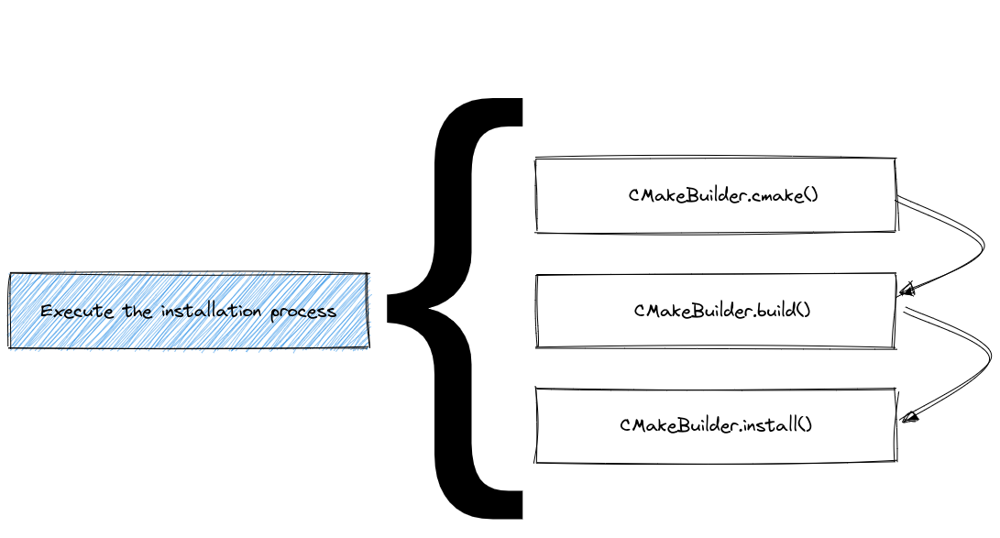
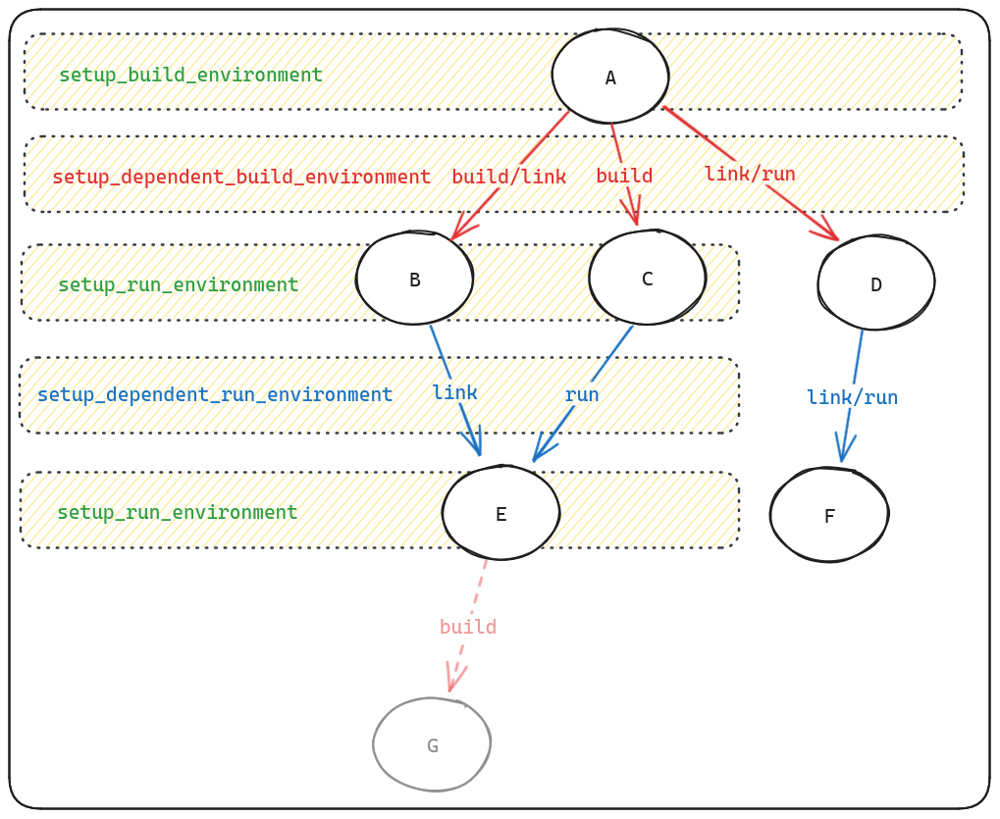
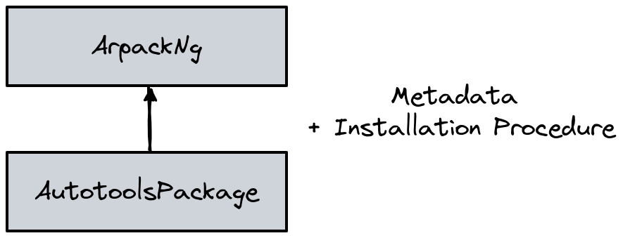
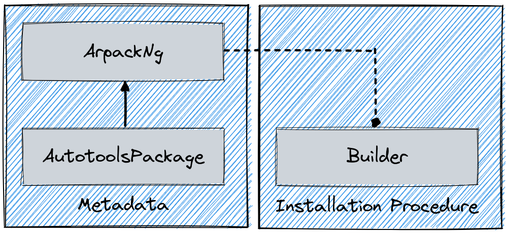
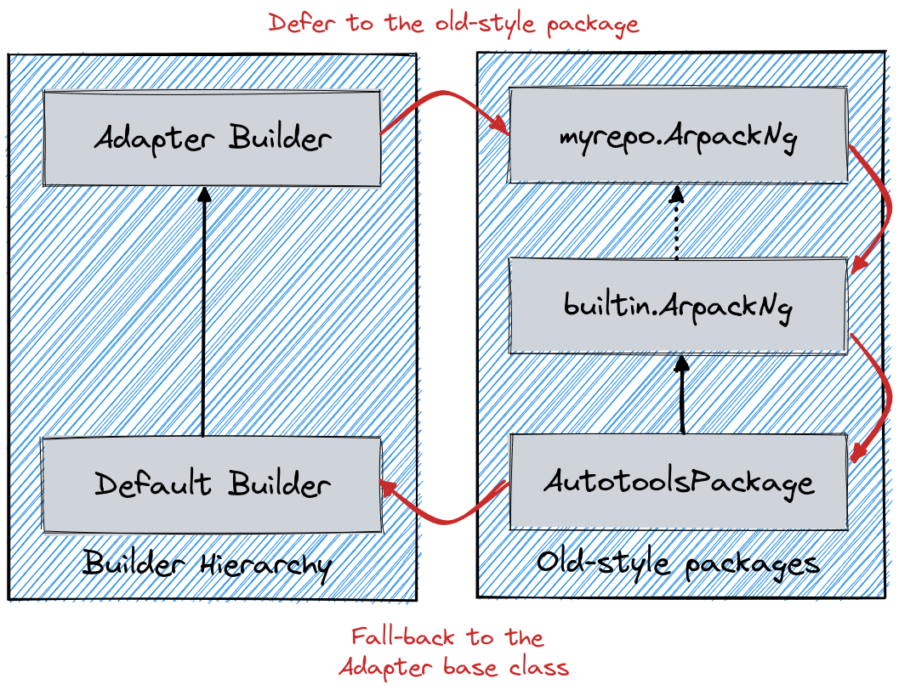

.. Copyright 2013-2023 Lawrence Livermore National Security, LLC and other
   Spack Project Developers. See the top-level COPYRIGHT file for details.

   SPDX-License-Identifier: (Apache-2.0 OR MIT)

.. _packaging-guide:

===============
Packaging Guide
===============

This guide is intended for developers or administrators who want to
package software so that Spack can install it.  It assumes that you
have at least some familiarity with Python, and that you've read the
:ref:`basic usage guide <basic-usage>`, especially the part about
:ref:`specs <sec-specs>`.

There are two key parts of Spack:

#. **Specs**: expressions for describing builds of software, and
#. **Packages**: Python modules that describe how to build and
   test software according to a spec.

Specs allow a user to describe a *particular* build in a way that a
package author can understand.  Packages allow the packager to
encapsulate the build logic for different versions, compilers,
options, platforms, and dependency combinations in one place.
Essentially, a package translates a spec into build logic. It
also allows the packager to write spec-specific tests of the
installed software.

Packages in Spack are written in pure Python, so you can do anything
in Spack that you can do in Python.  Python was chosen as the
implementation language for two reasons.  First, Python is becoming
ubiquitous in the scientific software community. Second, it's a modern
language and has many powerful features to help make package writing
easy.

.. warning::

   As a general rule, packages should install the software *from source*.
   The only exception is for proprietary software (e.g., vendor compilers).

   If a special build system needs to be added in order to support building
   a package from source, then the associated code and recipe should be added
   first.

.. _installation_procedure:

--------------------------------------
Overview of the installation procedure
--------------------------------------

Whenever Spack installs software, it goes through a series of predefined steps:

.. image:: images/installation_pipeline.png
  :scale: 60 %
  :align: center

All these steps are influenced by the metadata in each ``package.py`` and
by the current Spack configuration.
Since build systems are different from one another, the execution of the
last block in the figure is further expanded in a build system specific way.
An example for ``CMake`` is, for instance:

The predefined steps for each build system are called "phases".
In general, the name and order in which the phases will be executed can be
obtained by either reading the API docs at :py:mod:`~.spack.build_systems`, or
using the ``spack info`` command:

.. code-block:: console
    :emphasize-lines: 13,14

    $ spack info --phases m4
    AutotoolsPackage:    m4
    Homepage:            https://www.gnu.org/software/m4/m4.html

    Safe versions:
        1.4.17    ftp://ftp.gnu.org/gnu/m4/m4-1.4.17.tar.gz

    Variants:
        Name       Default   Description

        sigsegv    on        Build the libsigsegv dependency

    Installation Phases:
        autoreconf    configure    build    install

    Build Dependencies:
        libsigsegv

    ...

An extensive list of available build systems and phases is provided in :ref:`installation_process`.

------------------------
Writing a package recipe
------------------------

Since v0.19, Spack supports  two ways of writing a package recipe. The most commonly used is to encode both the metadata
(directives, etc.) and the build behavior in a single class, like shown in the following example:

.. code-block:: python

   class Openjpeg(CMakePackage):
       """OpenJPEG is an open-source JPEG 2000 codec written in C language"""

       homepage = "https://github.com/uclouvain/openjpeg"
       url = "https://github.com/uclouvain/openjpeg/archive/v2.3.1.tar.gz"

       version("2.4.0", sha256="8702ba68b442657f11aaeb2b338443ca8d5fb95b0d845757968a7be31ef7f16d")

       variant("codec", default=False, description="Build the CODEC executables")
       depends_on("libpng", when="+codec")

       def url_for_version(self, version):
           if version >= Version("2.1.1"):
               return super().url_for_version(version)
           url_fmt = "https://github.com/uclouvain/openjpeg/archive/version.{0}.tar.gz"
           return url_fmt.format(version)

       def cmake_args(self):
           args = [
               self.define_from_variant("BUILD_CODEC", "codec"),
               self.define("BUILD_MJ2", False),
               self.define("BUILD_THIRDPARTY", False),
           ]
           return args

A package encoded with a single class is backward compatible with versions of Spack
lower than v0.19, and so are custom repositories containing only recipes of this kind.
The downside is that *this format doesn't allow packagers to use more than one build system in a single recipe*.

To do that, we have to resort to the second way Spack has of writing packages, which involves writing a
builder class explicitly. Using the same example as above, this reads:

.. code-block:: python

   class Openjpeg(CMakePackage):
       """OpenJPEG is an open-source JPEG 2000 codec written in C language"""

       homepage = "https://github.com/uclouvain/openjpeg"
       url = "https://github.com/uclouvain/openjpeg/archive/v2.3.1.tar.gz"

       version("2.4.0", sha256="8702ba68b442657f11aaeb2b338443ca8d5fb95b0d845757968a7be31ef7f16d")

       variant("codec", default=False, description="Build the CODEC executables")
       depends_on("libpng", when="+codec")

       def url_for_version(self, version):
           if version >= Version("2.1.1"):
               return super().url_for_version(version)
           url_fmt = "https://github.com/uclouvain/openjpeg/archive/version.{0}.tar.gz"
           return url_fmt.format(version)

   class CMakeBuilder(spack.build_systems.cmake.CMakeBuilder):
       def cmake_args(self):
           args = [
               self.define_from_variant("BUILD_CODEC", "codec"),
               self.define("BUILD_MJ2", False),
               self.define("BUILD_THIRDPARTY", False),
           ]
           return args

This way of writing packages allows extending the recipe to support multiple build systems,
see :ref:`multiple_build_systems` for more details. The downside is that recipes of this kind
are only understood by Spack since v0.19+. More information on the internal architecture of
Spack can be found at :ref:`package_class_structure`.

.. note::

   If a builder is implemented in ``package.py``, all build-specific methods must be moved
   to the builder. This means that if you have a package like

   .. code-block:: python

      class Foo(CmakePackage):
          def cmake_args(self):
              ...

   and you add a builder to the ``package.py``, you must move ``cmake_args`` to the builder.

.. _cmd-spack-create:

---------------------
Creating new packages
---------------------

To help creating a new package Spack provides a command that generates a ``package.py``
file in an existing repository, with a boilerplate package template. Here's an example:

.. code-block:: console

   $ spack create https://gmplib.org/download/gmp/gmp-6.1.2.tar.bz2

Spack examines the tarball URL and tries to figure out the name of the package
to be created. If the name contains uppercase letters, these are automatically
converted to lowercase. If the name contains underscores or periods, these are
automatically converted to dashes.

Spack also searches for *additional* versions located in the same directory of
the website. Spack prompts you to tell you how many versions it found and asks
you how many you would like to download and checksum:

.. code-block:: console

   $ spack create https://gmplib.org/download/gmp/gmp-6.1.2.tar.bz2
   ==> This looks like a URL for gmp
   ==> Found 16 versions of gmp:

     6.1.2   https://gmplib.org/download/gmp/gmp-6.1.2.tar.bz2
     6.1.1   https://gmplib.org/download/gmp/gmp-6.1.1.tar.bz2
     6.1.0   https://gmplib.org/download/gmp/gmp-6.1.0.tar.bz2
     ...
     5.0.0   https://gmplib.org/download/gmp/gmp-5.0.0.tar.bz2

   How many would you like to checksum? (default is 1, q to abort)

Spack will automatically download the number of tarballs you specify
(starting with the most recent) and checksum each of them.

You do not *have* to download all of the versions up front. You can
always choose to download just one tarball initially, and run
:ref:`cmd-spack-checksum` later if you need more versions.

Spack automatically creates a directory in the appropriate repository,
generates a boilerplate template for your package, and opens up the new
``package.py`` in your favorite ``$EDITOR`` (see :ref:`controlling-the-editor`
for details):

.. code-block:: python
   :linenos:

   # Copyright 2013-2023 Lawrence Livermore National Security, LLC and other
   # Spack Project Developers. See the top-level COPYRIGHT file for details.
   #
   # SPDX-License-Identifier: (Apache-2.0 OR MIT)

   # ----------------------------------------------------------------------------
   # If you submit this package back to Spack as a pull request,
   # please first remove this boilerplate and all FIXME comments.
   #
   # This is a template package file for Spack.  We've put "FIXME"
   # next to all the things you'll want to change. Once you've handled
   # them, you can save this file and test your package like this:
   #
   #     spack install gmp
   #
   # You can edit this file again by typing:
   #
   #     spack edit gmp
   #
   # See the Spack documentation for more information on packaging.
   # ----------------------------------------------------------------------------
   import spack.build_systems.autotools
   from spack.package import *

   class Gmp(AutotoolsPackage):
       """FIXME: Put a proper description of your package here."""

       # FIXME: Add a proper url for your package's homepage here.
       homepage = "https://www.example.com"
       url = "https://gmplib.org/download/gmp/gmp-6.1.2.tar.bz2"

       # FIXME: Add a list of GitHub accounts to
       # notify when the package is updated.
       # maintainers("github_user1", "github_user2")

       version("6.2.1", sha256="eae9326beb4158c386e39a356818031bd28f3124cf915f8c5b1dc4c7a36b4d7c")

       # FIXME: Add dependencies if required.
       # depends_on("foo")

       def configure_args(self):
           # FIXME: Add arguments other than --prefix
           # FIXME: If not needed delete the function
           args = []
           return args

The tedious stuff (creating the class, checksumming archives) has been
done for you. Spack correctly detected that ``gmp`` uses the ``autotools``
build system, so it created a new ``Gmp`` package that subclasses the
``AutotoolsPackage`` base class.

The default installation procedure for a package subclassing the ``AutotoolsPackage``
is to go through the typical process of:

.. code-block:: bash

   ./configure --prefix=/path/to/installation/directory
   make
   make check
   make install

For most Autotools packages, this is sufficient. If you need to add
additional arguments to the ``./configure`` call, add them via the
``configure_args`` function.

In the generated package, the download ``url`` attribute is already
set. All the things you still need to change are marked with
``FIXME`` labels. You can delete the commented instructions between
the license and the first import statement after reading them.
The rest of the tasks you need to do are as follows:

#. Add a description.

   Immediately inside the package class is a *docstring* in
   triple-quotes (``"""``).  It is used to generate the description
   shown when users run ``spack info``.

#. Change the ``homepage`` to a useful URL.

   The ``homepage`` is displayed when users run ``spack info`` so
   that they can learn more about your package.

#. Add a comma-separated list of maintainers.

   Add a list of Github accounts of people who want to be notified
   any time the package is modified. See :ref:`package_maintainers`.

#. Add ``depends_on()`` calls for the package's dependencies.

   ``depends_on`` tells Spack that other packages need to be built
   and installed before this one. See :ref:`dependencies`.

#. Get the installation working.

   Your new package may require specific flags during ``configure``.
   These can be added via ``configure_args``. Specifics will differ
   depending on the package and its build system.
   :ref:`installation_process` is
   covered in detail later.

.. _controlling-the-editor:

^^^^^^^^^^^^^^^^^^^^^^^^^
Controlling the editor
^^^^^^^^^^^^^^^^^^^^^^^^^

When Spack needs to open an editor for you (e.g., for commands like
:ref:`cmd-spack-create` or :ref:`cmd-spack-edit`, it looks at several environment variables
to figure out what to use. The order of precedence is:

* ``SPACK_EDITOR``: highest precedence, in case you want something specific for Spack;
* ``VISUAL``: standard environment variable for full-screen editors like ``vim`` or ``emacs``;
* ``EDITOR``: older environment variable for your editor.

You can set any of these to the command you want to run, e.g., in ``bash`` you might run
one of these::

  export VISUAL=vim
  export EDITOR="emacs -nw"
  export SPACK_EDITOR=nano

If Spack finds none of these variables set, it will look for ``vim``, ``vi``, ``emacs``,
``nano``, and ``notepad``, in that order.

^^^^^^^^^^^^^^^^^
Bundling software
^^^^^^^^^^^^^^^^^

If you have a collection of software expected to work well together with
no source code of its own, you can create a :ref:`BundlePackage <bundlepackage>`.
Examples where bundle packages can be useful include defining suites of
applications (e.g, `EcpProxyApps
<https://github.com/spack/spack/blob/develop/var/spack/repos/builtin/packages/ecp-proxy-apps/package.py>`_), commonly used libraries
(e.g., `AmdAocl <https://github.com/spack/spack/blob/develop/var/spack/repos/builtin/packages/amd-aocl/package.py>`_),
and software development kits (e.g., `EcpDataVisSdk <https://github.com/spack/spack/blob/develop/var/spack/repos/builtin/packages/ecp-data-vis-sdk/package.py>`_).

These versioned packages primarily consist of dependencies on the associated
software packages. They can include :ref:`variants <variants>` to ensure
common build options are consistently applied to dependencies. Known build
failures, such as not building on a platform or when certain compilers or
variants are used, can be flagged with :ref:`conflicts <packaging_conflicts>`.
Build requirements, such as only building with specific compilers, can similarly
be flagged with :ref:`requires <packaging_conflicts>`.

The ``spack create --template bundle`` command will create a skeleton
``BundlePackage`` ``package.py`` for you:

.. code-block:: console

   $ spack create --template bundle --name coolsdk

Now you can fill in the basic package documentation, version(s), and software
package dependencies along with any other relevant customizations.

.. note::

   Remember that bundle packages have no software of their own so there
   is nothing to download.

^^^^^^^^^^^^^^^^^^^^^^^^^
Non-downloadable software
^^^^^^^^^^^^^^^^^^^^^^^^^

If your software cannot be downloaded from a URL you can still create a boilerplate
``package.py`` by telling ``spack create`` what name you want to use:

.. code-block:: console

   $ spack create --name intel

This will create a simple ``intel`` package with an ``install()``
method that you can craft to install your package.
Likewise, you can force the build system to be used with ``--template`` and,
in case it's needed, you can overwrite a package already in the repository
with ``--force``:

.. code-block:: console

   $ spack create --name gmp https://gmplib.org/download/gmp/gmp-6.1.2.tar.bz2
   $ spack create --force --template autotools https://gmplib.org/download/gmp/gmp-6.1.2.tar.bz2

A complete list of available build system templates can be found by running
``spack create --help``.

.. _cmd-spack-edit:

-------------------------
Editing existing packages
-------------------------

One of the easiest ways to learn how to write packages is to look at
existing ones.  You can edit a package file by name with the ``spack
edit`` command:

.. code-block:: console

   $ spack edit gmp

If you used ``spack create`` to create a package, you can get back to
it later with ``spack edit``. For instance, the ``gmp`` package actually
lives in:

.. code-block:: console

   $ spack location -p gmp
   ${SPACK_ROOT}/var/spack/repos/builtin/packages/gmp/package.py

but ``spack edit`` provides a much simpler shortcut and saves you the
trouble of typing the full path.

----------------------------
Naming & directory structure
----------------------------

This section describes how packages need to be named, and where they
live in Spack's directory structure.  In general, :ref:`cmd-spack-create`
handles creating package files for you, so you can skip most of the
details here.

^^^^^^^^^^^^^^^^^^^^^^^^^^^^^^^^^^^^
``var/spack/repos/builtin/packages``
^^^^^^^^^^^^^^^^^^^^^^^^^^^^^^^^^^^^

A Spack installation directory is structured like a standard UNIX
install prefix (``bin``, ``lib``, ``include``, ``var``, ``opt``,
etc.).  Most of the code for Spack lives in ``$SPACK_ROOT/lib/spack``.
Packages themselves live in ``$SPACK_ROOT/var/spack/repos/builtin/packages``.

If you ``cd`` to that directory, you will see directories for each
package:

.. command-output:: cd $SPACK_ROOT/var/spack/repos/builtin/packages && ls
   :shell:
   :ellipsis: 10

Each directory contains a file called ``package.py``, which is where
all the python code for the package goes.  For example, the ``libelf``
package lives in:

.. code-block:: none

   $SPACK_ROOT/var/spack/repos/builtin/packages/libelf/package.py

Alongside the ``package.py`` file, a package may contain extra
directories or files (like patches) that it needs to build.

^^^^^^^^^^^^^
Package Names
^^^^^^^^^^^^^

Packages are named after the directory containing ``package.py``. So,
``libelf``'s ``package.py`` lives in a directory called ``libelf``.
The ``package.py`` file defines a class called ``Libelf``, which
extends Spack's ``Package`` class.  For example, here is
``$SPACK_ROOT/var/spack/repos/builtin/packages/libelf/package.py``:

.. code-block:: python
   :linenos:

   from spack import *

   class Libelf(Package):
       """ ... description ... """
       homepage = ...
       url = ...
       version(...)
       depends_on(...)

       def install():
           ...

The **directory name** (``libelf``) determines the package name that
users should provide on the command line. e.g., if you type any of
these:

.. code-block:: console

   $ spack info libelf
   $ spack versions libelf
   $ spack install libelf@0.8.13

Spack sees the package name in the spec and looks for
``libelf/package.py`` in ``var/spack/repos/builtin/packages``.
Likewise, if you run ``spack install py-numpy``, Spack looks for
``py-numpy/package.py``.

Spack uses the directory name as the package name in order to give
packagers more freedom in naming their packages. Package names can
contain letters, numbers, and dashes. Using a Python identifier
(e.g., a class name or a module name) would make it difficult to
support these options.  So, you can name a package ``3proxy`` or
``foo-bar`` and Spack won't care. It just needs to see that name
in the packages directory.

^^^^^^^^^^^^^^^^^^^
Package class names
^^^^^^^^^^^^^^^^^^^

Spack loads ``package.py`` files dynamically, and it needs to find a
special class name in the file for the load to succeed.  The **class
name** (``Libelf`` in our example) is formed by converting words
separated by ``-`` in the file name to CamelCase. If the name
starts with a number, we prefix the class name with ``_``. Here are
some examples:

=================  =================
 Module Name         Class Name
=================  =================
 ``foo-bar``         ``FooBar``
 ``3proxy``          ``_3proxy``
=================  =================

In general, you won't have to remember this naming convention because
:ref:`cmd-spack-create` and :ref:`cmd-spack-edit` handle the details for you.

.. _package_maintainers:

-----------
Maintainers
-----------

Each package in Spack may have one or more maintainers, i.e. one or more
GitHub accounts of people who want to be notified any time the package is
modified.

When a pull request is submitted that updates the package, these people will
be requested to review the PR. This is useful for developers who maintain a
Spack package for their own software, as well as users who rely on a piece of
software and want to ensure that the package doesn't break. It also gives users
a list of people to contact for help when someone reports a build error with
the package.

To add maintainers to a package, simply declare them with the ``maintainers`` directive:

.. code-block:: python

   maintainers("user1", "user2")

The list of maintainers is additive, and includes all the accounts eventually declared in base classes.

-----------------
Trusted Downloads
-----------------

Spack verifies that the source code it downloads is not corrupted or
compromised; or at least, that it is the same version the author of
the Spack package saw when the package was created.  If Spack uses a
download method it can verify, we say the download method is
*trusted*.  Trust is important for *all downloads*: Spack
has no control over the security of the various sites from which it
downloads source code, and can never assume that any particular site
hasn't been compromised.

Trust is established in different ways for different download methods.
For the most common download method --- a single-file tarball --- the
tarball is checksummed.  Git downloads using ``commit=`` are trusted
implicitly, as long as a hash is specified.

Spack also provides untrusted download methods: tarball URLs may be
supplied without a checksum, or Git downloads may specify a branch or
tag instead of a hash.  If the user does not control or trust the
source of an untrusted download, it is a security risk.  Unless otherwise
specified by the user for special cases, Spack should by default use
*only* trusted download methods.

Unfortunately, Spack does not currently provide that guarantee.  It
does provide the following mechanisms for safety:

#. By default, Spack will only install a tarball package if it has a
   checksum and that checksum matches.  You can override this with
   ``spack install --no-checksum``.

#. Numeric versions are almost always tarball downloads, whereas
   non-numeric versions not named ``develop`` frequently download
   untrusted branches or tags from a version control system.  As long
   as a package has at least one numeric version, and no non-numeric
   version named ``develop``, Spack will prefer it over any
   non-numeric versions.

^^^^^^^^^
Checksums
^^^^^^^^^

For tarball downloads, Spack can currently support checksums using the
MD5, SHA-1, SHA-224, SHA-256, SHA-384, and SHA-512 algorithms.  It
determines the algorithm to use based on the hash length.

.. _versions-and-fetching:

---------------------
Versions and fetching
---------------------

The most straightforward way to add new versions to your package is to
add a line like this in the package class:

.. code-block:: python

   class Foo(Package):

       url = "http://example.com/foo-1.0.tar.gz"

       version("8.2.1", md5="4136d7b4c04df68b686570afa26988ac")
       version("8.2.0", md5="1c9f62f0778697a09d36121ead88e08e")
       version("8.1.2", md5="d47dd09ed7ae6e7fd6f9a816d7f5fdf6")

.. note::

   By convention, we list versions in descending order, from newest to oldest.

.. note::

   :ref:`Bundle packages  <bundlepackage>` do not have source code so
   there is nothing to fetch. Consequently, their version directives
   consist solely of the version name (e.g., ``version("202309")``).

^^^^^^^^^^^^^
Date Versions
^^^^^^^^^^^^^

If you wish to use dates as versions, it is best to use the format
``@yyyy-mm-dd``.  This will ensure they sort in the correct order.

Alternately, you might use a hybrid release-version / date scheme.
For example, ``@1.3_2016-08-31`` would mean the version from the
``1.3`` branch, as of August 31, 2016.

^^^^^^^^^^^^
Version URLs
^^^^^^^^^^^^

By default, each version's URL is extrapolated from the ``url`` field
in the package.  For example, Spack is smart enough to download
version ``8.2.1`` of the ``Foo`` package above from
http://example.com/foo-8.2.1.tar.gz.

If the URL is particularly complicated or changes based on the release,
you can override the default URL generation algorithm by defining your
own ``url_for_version()`` function. For example, the download URL for
OpenMPI contains the major.minor version in one spot and the
major.minor.patch version in another:

https://www.open-mpi.org/software/ompi/v2.1/downloads/openmpi-2.1.1.tar.bz2

In order to handle this, you can define a ``url_for_version()`` function
like so:

.. literalinclude:: _spack_root/var/spack/repos/builtin/packages/openmpi/package.py
   :pyobject: Openmpi.url_for_version

With the use of this ``url_for_version()``, Spack knows to download OpenMPI ``2.1.1``
from http://www.open-mpi.org/software/ompi/v2.1/downloads/openmpi-2.1.1.tar.bz2
but download OpenMPI ``1.10.7`` from http://www.open-mpi.org/software/ompi/v1.10/downloads/openmpi-1.10.7.tar.bz2.

You'll notice that OpenMPI's ``url_for_version()`` function makes use of a special
``Version`` function called ``up_to()``. When you call ``version.up_to(2)`` on a
version like ``1.10.0``, it returns ``1.10``. ``version.up_to(1)`` would return
``1``. This can be very useful for packages that place all ``X.Y.*`` versions in
a single directory and then places all ``X.Y.Z`` versions in a sub-directory.

There are a few ``Version`` properties you should be aware of. We generally
prefer numeric versions to be separated by dots for uniformity, but not all
tarballs are named that way. For example, ``icu4c`` separates its major and minor
versions with underscores, like ``icu4c-57_1-src.tgz``. The value ``57_1`` can be
obtained with the use of the ``version.underscored`` property. Note that Python
properties don't need parentheses. There are other separator properties as well:

===================  ======
Property             Result
===================  ======
version.dotted       1.2.3
version.dashed       1-2-3
version.underscored  1_2_3
version.joined       123
===================  ======

.. note::

   Python properties don't need parentheses. ``version.dashed`` is correct.
   ``version.dashed()`` is incorrect.

In addition, these version properties can be combined with ``up_to()``.
For example:

.. code-block:: python

   >>> version = Version("1.2.3")
   >>> version.up_to(2).dashed
   Version("1-2")
   >>> version.underscored.up_to(2)
   Version("1_2")

As you can see, order is not important. Just keep in mind that ``up_to()`` and
the other version properties return ``Version`` objects, not strings.

If a URL cannot be derived systematically, or there is a special URL for one
of its versions, you can add an explicit URL for a particular version:

.. code-block:: python

   version("8.2.1", md5="4136d7b4c04df68b686570afa26988ac",
           url="http://example.com/foo-8.2.1-special-version.tar.gz")

When you supply a custom URL for a version, Spack uses that URL
*verbatim* and does not perform extrapolation. The order of precedence
of these methods is:

#. package-level ``url``
#. ``url_for_version()``
#. version-specific ``url``

so if your package contains a ``url_for_version()``, it can be overridden
by a version-specific ``url``.

If your package does not contain a package-level ``url`` or ``url_for_version()``,
Spack can determine which URL to download from even if only some of the versions
specify their own ``url``. Spack will use the nearest URL *before* the requested
version. This is useful for packages that have an easy to extrapolate URL, but
keep changing their URL format every few releases. With this method, you only
need to specify the ``url`` when the URL changes.

"""""""""""""""""""""""
Mirrors of the main URL
"""""""""""""""""""""""

Spack supports listing mirrors of the main URL in a package by defining
the ``urls`` attribute:

.. code-block:: python

  class Foo(Package):

    urls = [
        "http://example.com/foo-1.0.tar.gz",
        "http://mirror.com/foo-1.0.tar.gz"
    ]

instead of just a single ``url``. This attribute is a list of possible URLs that
will be tried in order when fetching packages. Notice that either one of ``url``
or ``urls`` can be present in a package, but not both at the same time.

A well-known case of packages that can be fetched from multiple mirrors is that
of GNU. For that, Spack goes a step further and defines a mixin class that
takes care of all of the plumbing and requires packagers to just define a proper
``gnu_mirror_path`` attribute:

.. literalinclude:: _spack_root/var/spack/repos/builtin/packages/autoconf/package.py
   :lines: 9-18

^^^^^^^^^^^^^^^^^^^^^^^^
Skipping the expand step
^^^^^^^^^^^^^^^^^^^^^^^^

Spack normally expands archives (e.g. ``*.tar.gz`` and ``*.zip``) automatically
into a standard stage source directory (``self.stage.source_path``) after
downloading them. If you want to skip this step (e.g., for self-extracting
executables and other custom archive types), you can add ``expand=False`` to a
``version`` directive.

.. code-block:: python

   version("8.2.1", md5="4136d7b4c04df68b686570afa26988ac",
           url="http://example.com/foo-8.2.1-special-version.sh", expand=False)

When ``expand`` is set to ``False``, Spack sets the current working
directory to the directory containing the downloaded archive before it
calls your ``install`` method.  Within ``install``, the path to the
downloaded archive is available as ``self.stage.archive_file``.

Here is an example snippet for packages distributed as self-extracting
archives.  The example sets permissions on the downloaded file to make
it executable, then runs it with some arguments.

.. code-block:: python

   def install(self, spec, prefix):
       set_executable(self.stage.archive_file)
       installer = Executable(self.stage.archive_file)
       installer("--prefix=%s" % prefix, "arg1", "arg2", "etc.")

.. _deprecate:

^^^^^^^^^^^^^^^^^^^^^^^^
Deprecating old versions
^^^^^^^^^^^^^^^^^^^^^^^^

There are many reasons to remove old versions of software:

#. Security vulnerabilities (most serious reason)
#. Changing build systems that increase package complexity
#. Changing dependencies/patches/resources/flags that increase package complexity
#. Maintainer/developer inability/unwillingness to support old versions
#. No longer available for download (right to be forgotten)
#. Package or version rename

At the same time, there are many reasons to keep old versions of software:

#. Reproducibility
#. Requirements for older packages (e.g. some packages still rely on Qt 3)

In general, you should not remove old versions from a ``package.py``. Instead,
you should first deprecate them using the following syntax:

.. code-block:: python

   version("1.2.3", sha256="...", deprecated=True)

This has two effects. First, ``spack info`` will no longer advertise that
version. Second, commands like ``spack install`` that fetch the package will
require user approval:

.. code-block:: console

   $ spack install openssl@1.0.1e
   ==> Warning: openssl@1.0.1e is deprecated and may be removed in a future Spack release.
   ==>   Fetch anyway? [y/N]

If you use ``spack install --deprecated``, this check can be skipped.

This also applies to package recipes that are renamed or removed. You should
first deprecate all versions before removing a package. If you need to rename
it, you can deprecate the old package and create a new package at the same
time.

Version deprecations should always last at least one Spack minor release cycle
before the version is completely removed. For example, if a version is
deprecated in Spack 0.16.0, it should not be removed until Spack 0.17.0. No
version should be removed without such a deprecation process. This gives users
a chance to complain about the deprecation in case the old version is needed
for some application. If you require a deprecated version of a package, simply
submit a PR to remove ``deprecated=True`` from the package. However, you may be
asked to help maintain this version of the package if the current maintainers
are unwilling to support this older version.

^^^^^^^^^^^^^^^^
Download caching
^^^^^^^^^^^^^^^^

Spack maintains a cache (described :ref:`here <caching>`) which saves files
retrieved during package installations to avoid re-downloading in the case that
a package is installed with a different specification (but the same version) or
reinstalled on account of a change in the hashing scheme. It may (rarely) be
necessary to avoid caching for a particular version by adding ``no_cache=True``
as an option to the ``version()`` directive. Example situations would be a
"snapshot"-like Version Control System (VCS) tag, a VCS branch such as
``v6-16-00-patches``, or a URL specifying a regularly updated snapshot tarball.

^^^^^^^^^^^^^^^^^^
Version comparison
^^^^^^^^^^^^^^^^^^

Most Spack versions are numeric, a tuple of integers; for example,
``0.1``, ``6.96`` or ``1.2.3.1``.  Spack knows how to compare and sort
numeric versions.

Some Spack versions involve slight extensions of numeric syntax; for
example, ``py-sphinx-rtd-theme@=0.1.10a0``.  In this case, numbers are
always considered to be "newer" than letters.  This is for consistency
with `RPM <https://bugzilla.redhat.com/show_bug.cgi?id=50977>`_.

Spack versions may also be arbitrary non-numeric strings, for example
``develop``, ``master``, ``local``.

The order on versions is defined as follows. A version string is split
into a list of components based on delimiters such as ``.``, ``-`` etc.
Lists are then ordered lexicographically, where components are ordered
as follows:

#. The following special strings are considered larger than any other
   numeric or non-numeric version component, and satisfy the following
   order between themselves:
   ``develop > main > master > head > trunk > stable``.

#. Numbers are ordered numerically, are less than special strings, and
   larger than other non-numeric components.

#. All other non-numeric components are less than numeric components,
   and are ordered alphabetically.

The logic behind this sort order is two-fold:

#. Non-numeric versions are usually used for special cases while
   developing or debugging a piece of software.  Keeping most of them
   less than numeric versions ensures that Spack chooses numeric
   versions by default whenever possible.

#. The most-recent development version of a package will usually be
   newer than any released numeric versions.  This allows the
   ``@develop`` version to satisfy dependencies like ``depends_on(abc,
   when="@x.y.z:")``

^^^^^^^^^^^^^^^^^
Version selection
^^^^^^^^^^^^^^^^^

When concretizing, many versions might match a user-supplied spec.
For example, the spec ``python`` matches all available versions of the
package ``python``.  Similarly, ``python@3:`` matches all versions of
Python 3 and above.  Given a set of versions that match a spec, Spack
concretization uses the following priorities to decide which one to
use:

#. If the user provided a list of versions in ``packages.yaml``, the
   first matching version in that list will be used.

#. If one or more versions is specified as ``preferred=True``, in
   either ``packages.yaml`` or ``package.py``, the largest matching
   version will be used.  ("Latest" is defined by the sort order
   above).

#. If no preferences in particular are specified in the package or in
   ``packages.yaml``, then the largest matching non-develop version
   will be used.  By avoiding ``@develop``, this prevents users from
   accidentally installing a ``@develop`` version.

#. If all else fails and ``@develop`` is the only matching version, it
   will be used.

^^^^^^^^^^^^^^^^^^^^^^^^^^^^^^^
Ranges versus specific versions
^^^^^^^^^^^^^^^^^^^^^^^^^^^^^^^

When specifying versions in Spack using the ``pkg@<specifier>`` syntax,
you can use either ranges or specific versions. It is generally
recommended to use ranges instead of specific versions when packaging
to avoid overly constraining dependencies, patches, and conflicts.

For example, ``depends_on("python@3")`` denotes a range of versions,
allowing Spack to pick any ``3.x.y`` version for Python, while
``depends_on("python@=3.10.1")`` restricts it to a specific version.

Specific ``@=`` versions should only be used in exceptional cases, such
as when the package has a versioning scheme that omits the zero in the
first patch release: ``3.1``, ``3.1.1``, ``3.1.2``. In this example,
the specifier ``@=3.1`` is the correct way to select only the ``3.1``
version, whereas ``@3.1`` would match all those versions.

Ranges are preferred even if they would only match a single version
defined in the package. This is because users can define custom versions
in ``packages.yaml`` that typically include a custom suffix. For example,
if the package defines the version ``1.2.3``, the specifier ``@1.2.3``
will also match a user-defined version ``1.2.3-custom``.

.. _cmd-spack-checksum:

^^^^^^^^^^^^^^^^^^
``spack checksum``
^^^^^^^^^^^^^^^^^^

If you want to add new versions to a package you've already created,
this is automated with the ``spack checksum`` command.  Here's an
example for ``libelf``:

.. code-block:: console

   $ spack checksum libelf
   ==> Found 16 versions of libelf.
     0.8.13    http://www.mr511.de/software/libelf-0.8.13.tar.gz
     0.8.12    http://www.mr511.de/software/libelf-0.8.12.tar.gz
     0.8.11    http://www.mr511.de/software/libelf-0.8.11.tar.gz
     0.8.10    http://www.mr511.de/software/libelf-0.8.10.tar.gz
     0.8.9     http://www.mr511.de/software/libelf-0.8.9.tar.gz
     0.8.8     http://www.mr511.de/software/libelf-0.8.8.tar.gz
     0.8.7     http://www.mr511.de/software/libelf-0.8.7.tar.gz
     0.8.6     http://www.mr511.de/software/libelf-0.8.6.tar.gz
     0.8.5     http://www.mr511.de/software/libelf-0.8.5.tar.gz
     ...
     0.5.2     http://www.mr511.de/software/libelf-0.5.2.tar.gz

   How many would you like to checksum? (default is 1, q to abort)

This does the same thing that ``spack create`` does, but it allows you
to go back and add new versions easily as you need them (e.g., as
they're released).  It fetches the tarballs you ask for and prints out
a list of ``version`` commands ready to copy/paste into your package
file:

.. code-block:: console

   ==> Checksummed new versions of libelf:
       version("0.8.13", md5="4136d7b4c04df68b686570afa26988ac")
       version("0.8.12", md5="e21f8273d9f5f6d43a59878dc274fec7")
       version("0.8.11", md5="e931910b6d100f6caa32239849947fbf")
       version("0.8.10", md5="9db4d36c283d9790d8fa7df1f4d7b4d9")

By default, Spack will search for new tarball downloads by scraping
the parent directory of the tarball you gave it.  So, if your tarball
is at ``http://example.com/downloads/foo-1.0.tar.gz``, Spack will look
in ``http://example.com/downloads/`` for links to additional versions.
If you need to search another path for download links, you can supply
some extra attributes that control how your package finds new
versions. See the documentation on :ref:`attribute_list_url` and
:ref:`attribute_list_depth`.

.. note::

  * This command assumes that Spack can extrapolate new URLs from an
    existing URL in the package, and that Spack can find similar URLs
    on a webpage.  If that's not possible, e.g. if the package's
    developers don't name their tarballs consistently, you'll need to
    manually add ``version`` calls yourself.

  * For ``spack checksum`` to work, Spack needs to be able to
    ``import`` your package in Python.  That means it can't have any
    syntax errors, or the ``import`` will fail.  Use this once you've
    got your package in working order.

--------------------
Finding new versions
--------------------

You've already seen the ``homepage`` and ``url`` package attributes:

.. code-block:: python
   :linenos:

   from spack import *

   class Mpich(Package):
      """MPICH is a high performance and widely portable implementation of
         the Message Passing Interface (MPI) standard."""
      homepage = "http://www.mpich.org"
      url      = "http://www.mpich.org/static/downloads/3.0.4/mpich-3.0.4.tar.gz"

These are class-level attributes used by Spack to show users
information about the package, and to determine where to download its
source code.

Spack uses the tarball URL to extrapolate where to find other tarballs
of the same package (e.g. in :ref:`cmd-spack-checksum`, but
this does not always work.  This section covers ways you can tell
Spack to find tarballs elsewhere.

.. _attribute_list_url:

^^^^^^^^^^^^
``list_url``
^^^^^^^^^^^^

When spack tries to find available versions of packages (e.g. with
:ref:`cmd-spack-checksum`), it spiders the parent directory
of the tarball in the ``url`` attribute.  For example, for libelf, the
url is:

.. code-block:: python

   url = "http://www.mr511.de/software/libelf-0.8.13.tar.gz"

Here, Spack spiders ``http://www.mr511.de/software/`` to find similar
tarball links and ultimately to make a list of available versions of
``libelf``.

For many packages, the tarball's parent directory may be unlistable,
or it may not contain any links to source code archives.  In fact,
many times additional package downloads aren't even available in the
same directory as the download URL.

For these, you can specify a separate ``list_url`` indicating the page
to search for tarballs.  For example, ``libdwarf`` has the homepage as
the ``list_url``, because that is where links to old versions are:

.. code-block:: python
   :linenos:

   class Libdwarf(Package):
       homepage = "http://www.prevanders.net/dwarf.html"
       url      = "http://www.prevanders.net/libdwarf-20130729.tar.gz"
       list_url = homepage

.. _attribute_list_depth:

^^^^^^^^^^^^^^
``list_depth``
^^^^^^^^^^^^^^

``libdwarf`` and many other packages have a listing of available
versions on a single webpage, but not all do.  For example, ``mpich``
has a tarball URL that looks like this:

.. code-block:: python

   url = "http://www.mpich.org/static/downloads/3.0.4/mpich-3.0.4.tar.gz"

But its downloads are in many different subdirectories of
``http://www.mpich.org/static/downloads/``.  So, we need to add a
``list_url`` *and* a ``list_depth`` attribute:

.. code-block:: python
   :linenos:

   class Mpich(Package):
       homepage   = "http://www.mpich.org"
       url        = "http://www.mpich.org/static/downloads/3.0.4/mpich-3.0.4.tar.gz"
       list_url   = "http://www.mpich.org/static/downloads/"
       list_depth = 1

By default, Spack only looks at the top-level page available at
``list_url``.  ``list_depth = 1`` tells it to follow up to 1 level of
links from the top-level page.  Note that here, this implies 1
level of subdirectories, as the ``mpich`` website is structured much
like a filesystem.  But ``list_depth`` really refers to link depth
when spidering the page.

.. _vcs-fetch:

-------------------------------
Fetching from code repositories
-------------------------------

For some packages, source code is provided in a Version Control System
(VCS) repository rather than in a tarball.  Spack can fetch packages
from VCS repositories. Currently, Spack supports fetching with `Git
<git-fetch_>`_, `Mercurial (hg) <hg-fetch_>`_, `Subversion (svn)
<svn-fetch_>`_, `CVS (cvs) <cvs-fetch_>`_, and `Go <go-fetch_>`_.
In all cases, the destination
is the standard stage source path.

To fetch a package from a source repository, Spack needs to know which
VCS to use and where to download from. Much like with ``url``, package
authors can specify a class-level ``git``, ``hg``, ``svn``, ``cvs``, or ``go``
attribute containing the correct download location.

Many packages developed with Git have both a Git repository as well as
release tarballs available for download. Packages can define both a
class-level tarball URL and VCS. For example:

.. code-block:: python

   class Trilinos(CMakePackage):

       homepage = "https://trilinos.org/"
       url      = "https://github.com/trilinos/Trilinos/archive/trilinos-release-12-12-1.tar.gz"
       git      = "https://github.com/trilinos/Trilinos.git"

       version("develop", branch="develop")
       version("master",  branch="master")
       version("12.12.1", md5="ecd4606fa332212433c98bf950a69cc7")
       version("12.10.1", md5="667333dbd7c0f031d47d7c5511fd0810")
       version("12.8.1",  "9f37f683ee2b427b5540db8a20ed6b15")

If a package contains both a ``url`` and ``git`` class-level attribute,
Spack decides which to use based on the arguments to the ``version()``
directive. Versions containing a specific branch, tag, or revision are
assumed to be for VCS download methods, while versions containing a
checksum are assumed to be for URL download methods.

Like ``url``, if a specific version downloads from a different repository
than the default repo, it can be overridden with a version-specific argument.

.. note::

   In order to reduce ambiguity, each package can only have a single VCS
   top-level attribute in addition to ``url``. In the rare case that a
   package uses multiple VCS, a fetch strategy can be specified for each
   version. For example, the ``rockstar`` package contains:

   .. code-block:: python

      class Rockstar(MakefilePackage):

          homepage = "https://bitbucket.org/gfcstanford/rockstar"

          version("develop", git="https://bitbucket.org/gfcstanford/rockstar.git")
          version("yt", hg="https://bitbucket.org/MatthewTurk/rockstar")

.. _git-fetch:

^^^
Git
^^^

Git fetching supports the following parameters to ``version``:

* ``git``: URL of the git repository, if different than the class-level ``git``.
* ``branch``: Name of a branch to fetch.
* ``tag``: Name of a tag to fetch.
* ``commit``: SHA hash (or prefix) of a commit to fetch.
* ``submodules``: Also fetch submodules recursively when checking out this repository.
* ``submodules_delete``: A list of submodules to forcibly delete from the repository
  after fetching. Useful if a version in the repository has submodules that
  have disappeared/are no longer accessible.
* ``get_full_repo``: Ensure the full git history is checked out with all remote
  branch information. Normally (``get_full_repo=False``, the default), the git
  option ``--depth 1`` will be used if the version of git and the specified
  transport protocol support it, and ``--single-branch`` will be used if the
  version of git supports it.

Only one of ``tag``, ``branch``, or ``commit`` can be used at a time.

The destination directory for the clone is the standard stage source path.

Default branch
  To fetch a repository's default branch:

  .. code-block:: python

     class Example(Package):

         git = "https://github.com/example-project/example.git"

         version("develop")

  This download method is untrusted, and is not recommended. Aside from HTTPS,
  there is no way to verify that the repository has not been compromised, and
  the commit you get when you install the package likely won't be the same
  commit that was used when the package was first written. Additionally, the
  default branch may change. It is best to at least specify a branch name.

Branches
  To fetch a particular branch, use the ``branch`` parameter:

  .. code-block:: python

     version("experimental", branch="experimental")

  This download method is untrusted, and is not recommended. Branches are
  moving targets, so the commit you get when you install the package likely
  won't be the same commit that was used when the package was first written.

Tags
  To fetch from a particular tag, use ``tag`` instead:

  .. code-block:: python

     version("1.0.1", tag="v1.0.1")

  This download method is untrusted, and is not recommended. Although tags
  are generally more stable than branches, Git allows tags to be moved.
  Many developers use tags to denote rolling releases, and may move the
  tag when a bug is patched.

Commits
  Finally, to fetch a particular commit, use ``commit``:

  .. code-block:: python

     version("2014-10-08", commit="9d38cd4e2c94c3cea97d0e2924814acc")

  This doesn't have to be a full hash; you can abbreviate it as you'd
  expect with git:

  .. code-block:: python

     version("2014-10-08", commit="9d38cd")

  This download method *is trusted*.  It is the recommended way to
  securely download from a Git repository.

  It may be useful to provide a saner version for commits like this,
  e.g. you might use the date as the version, as done above. Or, if you
  know the commit at which a release was cut, you can use the release
  version. It's up to the package author to decide what makes the most
  sense. Although you can use the commit hash as the version number,
  this is not recommended, as it won't sort properly.

Submodules
  You can supply ``submodules=True`` to cause Spack to fetch submodules
  recursively along with the repository at fetch time.

  .. code-block:: python

     version("1.0.1", tag="v1.0.1", submodules=True)

  If a package has needs more fine-grained control over submodules, define
  ``submodules`` to be a callable function that takes the package instance as
  its only argument.  The function should return a list of submodules to be fetched.

  .. code-block:: python

     def submodules(package):
         submodules = []
         if "+variant-1" in package.spec:
             submodules.append("submodule_for_variant_1")
         if "+variant-2" in package.spec:
             submodules.append("submodule_for_variant_2")
         return submodules

      class MyPackage(Package):
          version("0.1.0", submodules=submodules)

  For more information about git submodules see the manpage of git: ``man
  git-submodule``.

.. _github-fetch:

^^^^^^
GitHub
^^^^^^

If a project is hosted on GitHub, *any* valid Git branch, tag, or hash
may be downloaded as a tarball.  This is accomplished simply by
constructing an appropriate URL.  Spack can checksum any package
downloaded this way, thereby producing a trusted download.  For
example, the following downloads a particular hash, and then applies a
checksum.

.. code-block:: python

       version("1.9.5.1.1", md5="d035e4bc704d136db79b43ab371b27d2",
               url="https://www.github.com/jswhit/pyproj/tarball/0be612cc9f972e38b50a90c946a9b353e2ab140f")

.. _hg-fetch:

^^^^^^^^^
Mercurial
^^^^^^^^^

Fetching with Mercurial works much like `Git <git-fetch>`_, but you
use the ``hg`` parameter.
The destination directory is still the standard stage source path.

Default branch
  Add the ``hg`` attribute with no ``revision`` passed to ``version``:

  .. code-block:: python

     class Example(Package):

         hg = "https://bitbucket.org/example-project/example"

         version("develop")

  This download method is untrusted, and is not recommended. As with
  Git's default fetching strategy, there is no way to verify the
  integrity of the download.

Revisions
  To fetch a particular revision, use the ``revision`` parameter:

  .. code-block:: python

     version("1.0", revision="v1.0")

  Unlike ``git``, which has special parameters for different types of
  revisions, you can use ``revision`` for branches, tags, and commits
  when you fetch with Mercurial. Like Git, fetching specific branches
  or tags is an untrusted download method, and is not recommended.
  The recommended fetch strategy is to specify a particular commit
  hash as the revision.

.. _svn-fetch:

^^^^^^^^^^
Subversion
^^^^^^^^^^

To fetch with subversion, use the ``svn`` and ``revision`` parameters.
The destination directory will be the standard stage source path.

Fetching the head
  Simply add an ``svn`` parameter to the package:

  .. code-block:: python

     class Example(Package):

         svn = "https://outreach.scidac.gov/svn/example/trunk"

         version("develop")

  This download method is untrusted, and is not recommended for the
  same reasons as mentioned above.

Fetching a revision
  To fetch a particular revision, add a ``revision`` argument to the
  version directive:

  .. code-block:: python

     version("develop", revision=128)

  This download method is untrusted, and is not recommended.

  Unfortunately, Subversion has no commit hashing scheme like Git and
  Mercurial do, so there is no way to guarantee that the download you
  get is the same as the download used when the package was created.
  Use at your own risk.

Subversion branches are handled as part of the directory structure, so
you can check out a branch or tag by changing the URL. If you want to
package multiple branches, simply add a ``svn`` argument to each
version directive.

.. _cvs-fetch:

^^^
CVS
^^^

CVS (Concurrent Versions System) is an old centralized version control
system. It is a predecessor of Subversion.

To fetch with CVS, use the ``cvs``, branch, and ``date`` parameters.
The destination directory will be the standard stage source path.

Fetching the head
  Simply add a ``cvs`` parameter to the package:

  .. code-block:: python

     class Example(Package):

         cvs = ":pserver:outreach.scidac.gov/cvsroot%module=modulename"

         version("1.1.2.4")

  CVS repository locations are described using an older syntax that
  is different from today's ubiquitous URL syntax. ``:pserver:``
  denotes the transport method. CVS servers can host multiple
  repositories (called "modules") at the same location, and one needs
  to specify both the server location and the module name to access.
  Spack combines both into one string using the ``%module=modulename``
  suffix shown above.

  This download method is untrusted.

Fetching a date
  Versions in CVS are commonly specified by date. To fetch a
  particular branch or date, add a ``branch`` and/or ``date`` argument
  to the version directive:

  .. code-block:: python

     version("2021.4.22", branch="branchname", date="2021-04-22")

  Unfortunately, CVS does not identify repository-wide commits via a
  revision or hash like Subversion, Git, or Mercurial do. This makes
  it impossible to specify an exact commit to check out.

CVS has more features, but since CVS is rarely used these days, Spack
does not support all of them.

.. _go-fetch:

^^
Go
^^

Go isn't a VCS, it is a programming language with a builtin command,
`go get <https://pkg.go.dev/cmd/go#hdr-Add_dependencies_to_current_module_and_install_them>`_,
that fetches packages and their dependencies automatically.
The destination directory will be the standard stage source path.

This strategy can clone a Git repository, or download from another source location.
For example:

.. code-block:: python

   class ThePlatinumSearcher(Package):

       homepage = "https://github.com/monochromegane/the_platinum_searcher"
       go       = "github.com/monochromegane/the_platinum_searcher/..."

       version("head")

Go cannot be used to fetch a particular commit or branch, it always
downloads the head of the repository. This download method is untrusted,
and is not recommended. Use another fetch strategy whenever possible.

.. _variants:

--------
Variants
--------

Many software packages can be configured to enable optional
features, which often come at the expense of additional dependencies or
longer build times. To be flexible enough and support a wide variety of
use cases, Spack allows you to expose to the end-user the ability to choose
which features should be activated in a package at the time it is installed.
The mechanism to be employed is the :py:func:`spack.directives.variant` directive.

^^^^^^^^^^^^^^^^
Boolean variants
^^^^^^^^^^^^^^^^

In their simplest form variants are boolean options specified at the package
level:

  .. code-block:: python

    class Hdf5(AutotoolsPackage):
        ...
        variant(
            "shared", default=True, description="Builds a shared version of the library"
        )

with a default value and a description of their meaning / use in the package.
*Variants can be tested in any context where a spec constraint is expected.*
In the example above the ``shared`` variant is tied to the build of shared dynamic
libraries. To pass the right option at configure time we can branch depending on
its value:

  .. code-block:: python

    def configure_args(self):
        ...
        if self.spec.satisfies("+shared"):
            extra_args.append("--enable-shared")
        else:
            extra_args.append("--disable-shared")
            extra_args.append("--enable-static-exec")

As explained in :ref:`basic-variants` the constraint ``+shared`` means
that the boolean variant is set to ``True``, while ``~shared`` means it is set
to ``False``.
Another common example is the optional activation of an extra dependency
which requires to use the variant in the ``when`` argument of
:py:func:`spack.directives.depends_on`:

  ..  code-block:: python

    class Hdf5(AutotoolsPackage):
        ...
        variant("szip", default=False, description="Enable szip support")
        depends_on("szip", when="+szip")

as shown in the snippet above where ``szip`` is modeled to be an optional
dependency of ``hdf5``.

^^^^^^^^^^^^^^^^^^^^^
Multi-valued variants
^^^^^^^^^^^^^^^^^^^^^

If need be, Spack can go beyond Boolean variants and permit an arbitrary
number of allowed values. This might be useful when modeling
options that are tightly related to each other.
The values in this case are passed to the :py:func:`spack.directives.variant`
directive as a tuple:

  .. code-block:: python

    class Blis(Package):
        ...
        variant(
            "threads", default="none", description="Multithreading support",
            values=("pthreads", "openmp", "none"), multi=False
        )

In the example above the argument ``multi`` is set to ``False`` to indicate
that only one among all the variant values can be active at any time. This
constraint is enforced by the parser and an error is emitted if a user
specifies two or more values at the same time:

  .. code-block:: console

    $ spack spec blis threads=openmp,pthreads
    Input spec
    --------------------------------
    blis threads=openmp,pthreads

    Concretized
    --------------------------------
    ==> Error: multiple values are not allowed for variant "threads"

Another useful note is that *Python's* ``None`` *is not allowed as a default value*
and therefore it should not be used to denote that no feature was selected.
Users should instead select another value, like ``"none"``, and handle it explicitly
within the package recipe if need be:

  .. code-block:: python

      if self.spec.variants["threads"].value == "none":
         options.append("--no-threads")

In cases where multiple values can be selected at the same time ``multi`` should
be set to ``True``:

  .. code-block:: python

    class Gcc(AutotoolsPackage):
        ...
        variant(
            "languages", default="c,c++,fortran",
            values=("ada", "brig", "c", "c++", "fortran",
                    "go", "java", "jit", "lto", "objc", "obj-c++"),
            multi=True,
            description="Compilers and runtime libraries to build"
        )

Within a package recipe a multi-valued variant is tested using a ``key=value`` syntax:

  .. code-block:: python

    if spec.satisfies("languages=jit"):
        options.append("--enable-host-shared")

"""""""""""""""""""""""""""""""""""""""""""
Complex validation logic for variant values
"""""""""""""""""""""""""""""""""""""""""""
To cover complex use cases, the :py:func:`spack.directives.variant` directive
could accept as the ``values`` argument a full-fledged object which has
``default`` and other arguments of the directive embedded as attributes.

An example, already implemented in Spack's core, is :py:class:`spack.variant.DisjointSetsOfValues`.
This class is used to implement a few convenience functions, like
:py:func:`spack.variant.any_combination_of`:

  ..  code-block:: python

    class Adios(AutotoolsPackage):
        ...
        variant(
            "staging",
            values=any_combination_of("flexpath", "dataspaces"),
            description="Enable dataspaces and/or flexpath staging transports"
        )

that allows any combination of the specified values, and also allows the
user to specify ``"none"`` (as a string) to choose none of them.
The objects returned by these functions can be modified at will by chaining
method calls to change the default value, customize the error message or
other similar operations:

  .. code-block:: python

    class Mvapich2(AutotoolsPackage):
        ...
        variant(
            "process_managers",
            description="List of the process managers to activate",
            values=disjoint_sets(
                ("auto",), ("slurm",), ("hydra", "gforker", "remshell")
            ).prohibit_empty_set().with_error(
                "'slurm' or 'auto' cannot be activated along with "
                "other process managers"
            ).with_default("auto").with_non_feature_values("auto"),
        )

"""""""""""""""""""""""""""
Conditional Possible Values
"""""""""""""""""""""""""""

There are cases where a variant may take multiple values, and the list of allowed values
expand over time. Think for instance at the C++ standard with which we might compile
Boost, which can take one of multiple possible values with the latest standards
only available from a certain version on.

To model a similar situation we can use *conditional possible values* in the variant declaration:

.. code-block:: python

   variant(
       "cxxstd", default="98",
       values=(
           "98", "11", "14",
           # C++17 is not supported by Boost < 1.63.0.
           conditional("17", when="@1.63.0:"),
           # C++20/2a is not support by Boost < 1.73.0
           conditional("2a", "2b", when="@1.73.0:")
       ),
       multi=False,
       description="Use the specified C++ standard when building.",
   )

The snippet above allows ``98``, ``11`` and ``14`` as unconditional possible values for the
``cxxstd`` variant, while ``17`` requires a version greater or equal to ``1.63.0``
and both ``2a`` and ``2b`` require a version greater or equal to ``1.73.0``.

^^^^^^^^^^^^^^^^^^^^
Conditional Variants
^^^^^^^^^^^^^^^^^^^^

The variant directive accepts a ``when`` clause. The variant will only
be present on specs that otherwise satisfy the spec listed as the
``when`` clause. For example, the following class has a variant
``bar`` when it is at version 2.0 or higher.

.. code-block:: python

   class Foo(Package):
       ...
       variant("bar", default=False, when="@2.0:", description="help message")

The ``when`` clause follows the same syntax and accepts the same
values as the ``when`` argument of
:py:func:`spack.directives.depends_on`

^^^^^^^^^^^^^^^
Sticky Variants
^^^^^^^^^^^^^^^

The variant directive can be marked as ``sticky`` by setting to ``True`` the
corresponding argument:

.. code-block:: python

   variant("bar", default=False, sticky=True)

A ``sticky`` variant differs from a regular one in that it is always set
to either:

#. An explicit value appearing in a spec literal or
#. Its default value

The concretizer thus is not free to pick an alternate value to work
around conflicts, but will error out instead.
Setting this property on a variant is useful in cases where the
variant allows some dangerous or controversial options (e.g. using unsupported versions
of a compiler for a library) and the packager wants to ensure that
allowing these options is done on purpose by the user, rather than
automatically by the solver.

^^^^^^^^^^^^^^^^^^^
Overriding Variants
^^^^^^^^^^^^^^^^^^^

Packages may override variants for several reasons, most often to
change the default from a variant defined in a parent class or to
change the conditions under which a variant is present on the spec.

When a variant is defined multiple times, whether in the same package
file or in a subclass and a superclass, the last definition is used
for all attributes **except** for the ``when`` clauses. The ``when``
clauses are accumulated through all invocations, and the variant is
present on the spec if any of the accumulated conditions are
satisfied.

For example, consider the following package:

.. code-block:: python

   class Foo(Package):
       ...
       variant("bar", default=False, when="@1.0", description="help1")
       variant("bar", default=True, when="platform=darwin", description="help2")
       ...

This package ``foo`` has a variant ``bar`` when the spec satisfies
either ``@1.0`` or ``platform=darwin``, but not for other platforms at
other versions. The default for this variant, when it is present, is
always ``True``, regardless of which condition of the variant is
satisfied. This allows packages to override variants in packages or
build system classes from which they inherit, by modifying the variant
values without modifying the ``when`` clause. It also allows a package
to implement ``or`` semantics for a variant ``when`` clause by
duplicating the variant definition.

------------------------------------
Resources (expanding extra tarballs)
------------------------------------

Some packages (most notably compilers) provide optional features if additional
resources are expanded within their source tree before building. In Spack it is
possible to describe such a need with the ``resource`` directive :

  .. code-block:: python

     resource(
        name="cargo",
        git="https://github.com/rust-lang/cargo.git",
        tag="0.10.0",
        destination="cargo"
     )

Based on the keywords present among the arguments the appropriate ``FetchStrategy``
will be used for the resource. The keyword ``destination`` is relative to the source
root of the package and should point to where the resource is to be expanded.

.. _license:

-----------------
Licensed software
-----------------

In order to install licensed software, Spack needs to know a few more
details about a package. The following class attributes should be defined.

^^^^^^^^^^^^^^^^^^^^
``license_required``
^^^^^^^^^^^^^^^^^^^^

Boolean. If set to ``True``, this software requires a license. If set to
``False``, all of the following attributes will be ignored. Defaults to
``False``.

^^^^^^^^^^^^^^^^^^^
``license_comment``
^^^^^^^^^^^^^^^^^^^

String. Contains the symbol used by the license manager to denote a comment.
Defaults to ``#``.

^^^^^^^^^^^^^^^^^
``license_files``
^^^^^^^^^^^^^^^^^

List of strings. These are files that the software searches for when
looking for a license. All file paths must be relative to the installation
directory. More complex packages like Intel may require multiple
licenses for individual components. Defaults to the empty list.

^^^^^^^^^^^^^^^^
``license_vars``
^^^^^^^^^^^^^^^^

List of strings. Environment variables that can be set to tell the software
where to look for a license if it is not in the usual location. Defaults
to the empty list.

^^^^^^^^^^^^^^^
``license_url``
^^^^^^^^^^^^^^^

String. A URL pointing to license setup instructions for the software.
Defaults to the empty string.

For example, let's take a look at the package for the PGI compilers.

.. code-block:: python

   # Licensing
   license_required = True
   license_comment  = "#"
   license_files    = ["license.dat"]
   license_vars     = ["PGROUPD_LICENSE_FILE", "LM_LICENSE_FILE"]
   license_url      = "http://www.pgroup.com/doc/pgiinstall.pdf"

As you can see, PGI requires a license. Its license manager, FlexNet, uses
the ``#`` symbol to denote a comment. It expects the license file to be
named ``license.dat`` and to be located directly in the installation prefix.
If you would like the installation file to be located elsewhere, simply set
``PGROUPD_LICENSE_FILE`` or ``LM_LICENSE_FILE`` after installation. For
further instructions on installation and licensing, see the URL provided.

Let's walk through a sample PGI installation to see exactly what Spack is
and isn't capable of. Since PGI does not provide a download URL, it must
be downloaded manually. It can either be added to a mirror or located in
the current directory when ``spack install pgi`` is run. See :ref:`mirrors`
for instructions on setting up a mirror.

After running ``spack install pgi``, the first thing that will happen is
Spack will create a global license file located at
``$SPACK_ROOT/etc/spack/licenses/pgi/license.dat``. It will then open up the
file using :ref:`your favorite editor <controlling-the-editor>`. It will look like
this:

.. code-block:: sh

   # A license is required to use pgi.
   #
   # The recommended solution is to store your license key in this global
   # license file. After installation, the following symlink(s) will be
   # added to point to this file (relative to the installation prefix):
   #
   #   license.dat
   #
   # Alternatively, use one of the following environment variable(s):
   #
   #   PGROUPD_LICENSE_FILE
   #   LM_LICENSE_FILE
   #
   # If you choose to store your license in a non-standard location, you may
   # set one of these variable(s) to the full pathname to the license file, or
   # port@host if you store your license keys on a dedicated license server.
   # You will likely want to set this variable in a module file so that it
   # gets loaded every time someone tries to use pgi.
   #
   # For further information on how to acquire a license, please refer to:
   #
   #   http://www.pgroup.com/doc/pgiinstall.pdf
   #
   # You may enter your license below.

You can add your license directly to this file, or tell FlexNet to use a
license stored on a separate license server. Here is an example that
points to a license server called licman1:

.. code-block:: none

   SERVER licman1.mcs.anl.gov 00163eb7fba5 27200
   USE_SERVER

If your package requires the license to install, you can reference the
location of this global license using ``self.global_license_file``.
After installation, symlinks for all of the files given in
``license_files`` will be created, pointing to this global license.
If you install a different version or variant of the package, Spack
will automatically detect and reuse the already existing global license.

If the software you are trying to package doesn't rely on license files,
Spack will print a warning message, letting the user know that they
need to set an environment variable or pointing them to installation
documentation.

.. _patching:

-------
Patches
-------

Depending on the host architecture, package version, known bugs, or
other issues, you may need to patch your software to get it to build
correctly.  Like many other package systems, spack allows you to store
patches alongside your package files and apply them to source code
after it's downloaded.

^^^^^^^^^
``patch``
^^^^^^^^^

You can specify patches in your package file with the ``patch()``
directive.  ``patch`` looks like this:

.. code-block:: python

   class Mvapich2(Package):
       ...
       patch("ad_lustre_rwcontig_open_source.patch", when="@1.9:")

The first argument can be either a URL or a filename.  It specifies a
patch file that should be applied to your source.  If the patch you
supply is a filename, then the patch needs to live within the spack
source tree.  For example, the patch above lives in a directory
structure like this:

.. code-block:: none

   $SPACK_ROOT/var/spack/repos/builtin/packages/
       mvapich2/
           package.py
           ad_lustre_rwcontig_open_source.patch

If you supply a URL instead of a filename, you need to supply a
``sha256`` checksum, like this:

.. code-block:: python

   patch("http://www.nwchem-sw.org/images/Tddft_mxvec20.patch",
         sha256="252c0af58be3d90e5dc5e0d16658434c9efa5d20a5df6c10bf72c2d77f780866")

Spack includes the hashes of patches in its versioning information, so
that the same package with different patches applied will have different
hash identifiers.  To ensure that the hashing scheme is consistent, you
must use a ``sha256`` checksum for the patch.  Patches will be fetched
from their URLs, checked, and applied to your source code.  You can use
the GNU utils ``sha256sum`` or the macOS ``shasum -a 256`` commands to
generate a checksum for a patch file.

Spack can also handle compressed patches.  If you use these, Spack needs
a little more help.  Specifically, it needs *two* checksums: the
``sha256`` of the patch and ``archive_sha256`` for the compressed
archive.  ``archive_sha256`` helps Spack ensure that the downloaded
file is not corrupted or malicious, before running it through a tool like
``tar`` or ``zip``.  The ``sha256`` of the patch is still required so
that it can be included in specs.  Providing it in the package file
ensures that Spack won't have to download and decompress patches it won't
end up using at install time.  Both the archive and patch checksum are
checked when patch archives are downloaded.

.. code-block:: python

   patch("http://www.nwchem-sw.org/images/Tddft_mxvec20.patch.gz",
         sha256="252c0af58be3d90e5dc5e0d16658434c9efa5d20a5df6c10bf72c2d77f780866",
         archive_sha256="4e8092a161ec6c3a1b5253176fcf33ce7ba23ee2ff27c75dbced589dabacd06e")

``patch`` keyword arguments are described below.

""""""""""""""""""""""""""""""
``sha256``, ``archive_sha256``
""""""""""""""""""""""""""""""

Hashes of downloaded patch and compressed archive, respectively.  Only
needed for patches fetched from URLs.

""""""""
``when``
""""""""

If supplied, this is a spec that tells spack when to apply
the patch.  If the installed package spec matches this spec, the
patch will be applied.  In our example above, the patch is applied
when mvapich is at version ``1.9`` or higher.

"""""""""
``level``
"""""""""

This tells spack how to run the ``patch`` command.  By default,
the level is 1 and spack runs ``patch -p 1``.  If level is 2,
spack will run ``patch -p 2``, and so on.

A lot of people are confused by level, so here's a primer.  If you
look in your patch file, you may see something like this:

.. code-block:: diff
   :linenos:

   --- a/src/mpi/romio/adio/ad_lustre/ad_lustre_rwcontig.c 2013-12-10 12:05:44.806417000 -0800
   +++ b/src/mpi/romio/adio/ad_lustre/ad_lustre_rwcontig.c 2013-12-10 11:53:03.295622000 -0800
   @@ -8,7 +8,7 @@
     *   Copyright (C) 2008 Sun Microsystems, Lustre group
     \*/

   -#define _XOPEN_SOURCE 600
   +//#define _XOPEN_SOURCE 600
    #include <stdlib.h>
    #include <malloc.h>
    #include "ad_lustre.h"

Lines 1-2 show paths with synthetic ``a/`` and ``b/`` prefixes.  These
are placeholders for the two ``mvapich2`` source directories that
``diff`` compared when it created the patch file.  This is git's
default behavior when creating patch files, but other programs may
behave differently.

``-p1`` strips off the first level of the prefix in both paths,
allowing the patch to be applied from the root of an expanded mvapich2
archive.  If you set level to ``2``, it would strip off ``src``, and
so on.

It's generally easier to just structure your patch file so that it
applies cleanly with ``-p1``, but if you're using a patch you didn't
create yourself, ``level`` can be handy.

"""""""""""""""
``working_dir``
"""""""""""""""

This tells spack where to run the ``patch`` command.  By default,
the working directory is the source path of the stage (``.``).
However, sometimes patches are made with respect to a subdirectory
and this is where the working directory comes in handy. Internally,
the working directory is given to ``patch`` via the ``-d`` option.
Let's take the example patch from above and assume for some reason,
it can only be downloaded in the following form:

.. code-block:: diff
   :linenos:

   --- a/romio/adio/ad_lustre/ad_lustre_rwcontig.c 2013-12-10 12:05:44.806417000 -0800
   +++ b/romio/adio/ad_lustre/ad_lustre_rwcontig.c 2013-12-10 11:53:03.295622000 -0800
   @@ -8,7 +8,7 @@
     *   Copyright (C) 2008 Sun Microsystems, Lustre group
     \*/

   -#define _XOPEN_SOURCE 600
   +//#define _XOPEN_SOURCE 600
    #include <stdlib.h>
    #include <malloc.h>
    #include "ad_lustre.h"

Hence, the patch needs to applied in the ``src/mpi`` subdirectory, and the
``working_dir="src/mpi"`` option would exactly do that.

^^^^^^^^^^^^^^^^^^^^^
Patch functions
^^^^^^^^^^^^^^^^^^^^^

In addition to supplying patch files, you can write a custom function
to patch a package's source.  For example, the ``py-pyside`` package
contains some custom code for tweaking the way the PySide build
handles ``RPATH``:

.. _pyside-patch:

.. literalinclude:: _spack_root/var/spack/repos/builtin/packages/py-pyside/package.py
   :pyobject: PyPyside.patch
   :linenos:

A ``patch`` function, if present, will be run after patch files are
applied and before ``install()`` is run.

You could put this logic in ``install()``, but putting it in a patch
function gives you some benefits.  First, spack ensures that the
``patch()`` function is run once per code checkout.  That means that
if you run install, hit ctrl-C, and run install again, the code in the
patch function is only run once.  Also, you can tell Spack to run only
the patching part of the build using the :ref:`cmd-spack-patch` command.

.. _patch_dependency_patching:

^^^^^^^^^^^^^^^^^^^
Dependency patching
^^^^^^^^^^^^^^^^^^^

So far we've covered how the ``patch`` directive can be used by a package
to patch *its own* source code. Packages can *also* specify patches to be
applied to their dependencies, if they require special modifications.  As
with all packages in Spack, a patched dependency library can coexist with
other versions of that library.  See the `section on depends_on
<dependency_dependency_patching_>`_ for more details.

.. _patch_inspecting_patches:

^^^^^^^^^^^^^^^^^^^
Inspecting patches
^^^^^^^^^^^^^^^^^^^

If you want to better understand the patches that Spack applies to your
packages, you can do that using ``spack spec``, ``spack find``, and other
query commands.  Let's look at ``m4``.  If you run ``spack spec m4``, you
can see the patches that would be applied to ``m4``::

  $ spack spec m4
  Input spec
  --------------------------------
  m4

  Concretized
  --------------------------------
  m4@1.4.18%apple-clang@9.0.0 patches=3877ab548f88597ab2327a2230ee048d2d07ace1062efe81fc92e91b7f39cd00,c0a408fbffb7255fcc75e26bd8edab116fc81d216bfd18b473668b7739a4158e,fc9b61654a3ba1a8d6cd78ce087e7c96366c290bc8d2c299f09828d793b853c8 +sigsegv arch=darwin-highsierra-x86_64
      ^libsigsegv@2.11%apple-clang@9.0.0 arch=darwin-highsierra-x86_64

You can also see patches that have been applied to installed packages
with ``spack find -v``::

  $ spack find -v m4
  ==> 1 installed package
  -- darwin-highsierra-x86_64 / apple-clang@9.0.0 -----------------
  m4@1.4.18 patches=3877ab548f88597ab2327a2230ee048d2d07ace1062efe81fc92e91b7f39cd00,c0a408fbffb7255fcc75e26bd8edab116fc81d216bfd18b473668b7739a4158e,fc9b61654a3ba1a8d6cd78ce087e7c96366c290bc8d2c299f09828d793b853c8 +sigsegv

.. _cmd-spack-resource:

In both cases above, you can see that the patches' sha256 hashes are
stored on the spec as a variant.  As mentioned above, this means that you
can have multiple, differently-patched versions of a package installed at
once.

You can look up a patch by its sha256 hash (or a short version of it)
using the ``spack resource show`` command::

  $ spack resource show 3877ab54
  3877ab548f88597ab2327a2230ee048d2d07ace1062efe81fc92e91b7f39cd00
      path:       /home/spackuser/src/spack/var/spack/repos/builtin/packages/m4/gnulib-pgi.patch
      applies to: builtin.m4

``spack resource show`` looks up downloadable resources from package
files by hash and prints out information about them.  Above, we see that
the ``3877ab54`` patch applies to the ``m4`` package.  The output also
tells us where to find the patch.

Things get more interesting if you want to know about dependency
patches. For example, when ``dealii`` is built with ``boost@1.68.0``, it
has to patch boost to work correctly.  If you didn't know this, you might
wonder where the extra boost patches are coming from::

  $ spack spec dealii ^boost@1.68.0 ^hdf5+fortran | grep "\^boost"
      ^boost@1.68.0
          ^boost@1.68.0%apple-clang@9.0.0+atomic+chrono~clanglibcpp cxxstd=default +date_time~debug+exception+filesystem+graph~icu+iostreams+locale+log+math~mpi+multithreaded~numpy patches=2ab6c72d03dec6a4ae20220a9dfd5c8c572c5294252155b85c6874d97c323199,b37164268f34f7133cbc9a4066ae98fda08adf51e1172223f6a969909216870f ~pic+program_options~python+random+regex+serialization+shared+signals~singlethreaded+system~taggedlayout+test+thread+timer~versionedlayout+wave arch=darwin-highsierra-x86_64
  $ spack resource show b37164268
  b37164268f34f7133cbc9a4066ae98fda08adf51e1172223f6a969909216870f
      path:       /home/spackuser/src/spack/var/spack/repos/builtin/packages/dealii/boost_1.68.0.patch
      applies to: builtin.boost
      patched by: builtin.dealii

Here you can see that the patch is applied to ``boost`` by ``dealii``,
and that it lives in ``dealii``'s directory in Spack's ``builtin``
package repository.

.. _handling_rpaths:

---------------
Handling RPATHs
---------------

Spack installs each package in a way that ensures that all of its
dependencies are found when it runs.  It does this using `RPATHs
<http://en.wikipedia.org/wiki/Rpath>`_.  An RPATH is a search
path, stored in a binary (an executable or library), that tells the
dynamic loader where to find its dependencies at runtime. You may be
familiar with `LD_LIBRARY_PATH
<http://tldp.org/HOWTO/Program-Library-HOWTO/shared-libraries.html>`_
on Linux or `DYLD_LIBRARY_PATH
<https://developer.apple.com/library/archive/documentation/System/Conceptual/ManPages_iPhoneOS/man3/dyld.3.html>`_
on Mac OS X.  RPATH is similar to these paths, in that it tells
the loader where to find libraries.  Unlike them, it is embedded in
the binary and not set in each user's environment.

RPATHs in Spack are handled in one of three ways:

#. For most packages, RPATHs are handled automatically using Spack's
   :ref:`compiler wrappers <compiler-wrappers>`.  These wrappers are
   set in standard variables like ``CC``, ``CXX``, ``F77``, and ``FC``,
   so most build systems (autotools and many gmake systems) pick them
   up and use them.
#. CMake also respects Spack's compiler wrappers, but many CMake
   builds have logic to overwrite RPATHs when binaries are
   installed. Spack provides the ``std_cmake_args`` variable, which
   includes parameters necessary for CMake build use the right
   installation RPATH.  It can be used like this when ``cmake`` is
   invoked:

   .. code-block:: python

      class MyPackage(Package):
          ...
          def install(self, spec, prefix):
              cmake("..", *std_cmake_args)
              make()
              make("install")

#. If you need to modify the build to add your own RPATHs, you can
   use the ``self.rpath`` property of your package, which will
   return a list of all the RPATHs that Spack will use when it
   links.  You can see this how this is used in the :ref:`PySide
   example <pyside-patch>` above.

.. _attribute_parallel:

---------------
Parallel builds
---------------

Spack supports parallel builds on an individual package and at the
installation level.  Package-level parallelism is established by the
``--jobs`` option and its configuration and package recipe equivalents.
Installation-level parallelism is driven by the DAG(s) of the requested
package or packages.

^^^^^^^^^^^^^^^^^^^^^^^^^^^^^^^
Package-level build parallelism
^^^^^^^^^^^^^^^^^^^^^^^^^^^^^^^

By default, Spack will invoke ``make()``, or any other similar tool,
with a ``-j <njobs>`` argument, so those builds run in parallel.
The parallelism is determined by the value of the ``build_jobs`` entry
in ``config.yaml`` (see :ref:`here <build-jobs>` for more details on
how this value is computed).

If a package does not build properly in parallel, you can override
this setting by adding ``parallel = False`` to your package.  For
example, OpenSSL's build does not work in parallel, so its package
looks like this:

.. code-block:: python
   :emphasize-lines: 8
   :linenos:

   class Openssl(Package):
       homepage = "http://www.openssl.org"
       url      = "http://www.openssl.org/source/openssl-1.0.1h.tar.gz"

       version("1.0.1h", md5="8d6d684a9430d5cc98a62a5d8fbda8cf")
       depends_on("zlib-api")

       parallel = False

Similarly, you can disable parallel builds only for specific make
commands, as ``libdwarf`` does:

.. code-block:: python
   :emphasize-lines: 9, 12
   :linenos:

   class Libelf(Package):
       ...

       def install(self, spec, prefix):
           configure("--prefix=" + prefix,
                     "--enable-shared",
                     "--disable-dependency-tracking",
                     "--disable-debug")
           make()

           # The mkdir commands in libelf's install can fail in parallel
           make("install", parallel=False)

The first make will run in parallel here, but the second will not.  If
you set ``parallel`` to ``False`` at the package level, then each call
to ``make()`` will be sequential by default, but packagers can call
``make(parallel=True)`` to override it.

^^^^^^^^^^^^^^^^^^^^^^^^^^^^^^^
Install-level build parallelism
^^^^^^^^^^^^^^^^^^^^^^^^^^^^^^^

Spack supports the concurrent installation of packages within a Spack
instance across multiple processes using file system locks.  This
parallelism is separate from the package-level achieved through build
systems' use of the ``-j <njobs>`` option.  With install-level parallelism,
processes coordinate the installation of the dependencies of specs
provided on the command line and as part of an environment build with
only **one process** being allowed to install a given package at a time.
Refer to :ref:`Dependencies` for more information on dependencies and
:ref:`installing-environment` for how to install an environment.

Concurrent processes may be any combination of interactive sessions and
batch jobs.  Which means a ``spack install`` can be running in a terminal
window while a batch job is running ``spack install`` on the same or
overlapping dependencies without any process trying to re-do the work of
another.

For example, if you are using Slurm, you could launch an installation
of ``mpich`` using the following command:

.. code-block:: console

   $ srun -N 2 -n 8 spack install -j 4 mpich@3.3.2

This will create eight concurrent, four-job installs on two different
nodes.

Alternatively, you could run the same installs on one node by entering
the following at the command line of a bash shell:

.. code-block:: console

   $ for i in {1..12}; do nohup spack install -j 4 mpich@3.3.2 >> mpich_install.txt 2>&1 & done

.. note::

   The effective parallelism is based on the maximum number of packages
   that can be installed at the same time, which is limited by the
   number of packages with no (remaining) uninstalled dependencies.

.. _dependencies:

------------
Dependencies
------------

We've covered how to build a simple package, but what if one package
relies on another package to build?  How do you express that in a
package file?  And how do you refer to the other package in the build
script for your own package?

Spack makes this relatively easy.  Let's take a look at the
``libdwarf`` package to see how it's done:

.. code-block:: python
   :emphasize-lines: 9
   :linenos:

   class Libdwarf(Package):
       homepage = "http://www.prevanders.net/dwarf.html"
       url      = "http://www.prevanders.net/libdwarf-20130729.tar.gz"
       list_url = homepage

       version("20130729", md5="4cc5e48693f7b93b7aa0261e63c0e21d")
       ...

       depends_on("libelf")

       def install(self, spec, prefix):
           ...

^^^^^^^^^^^^^^^^
``depends_on()``
^^^^^^^^^^^^^^^^

The highlighted ``depends_on("libelf")`` call tells Spack that it
needs to build and install the ``libelf`` package before it builds
``libdwarf``.  This means that in your ``install()`` method, you are
guaranteed that ``libelf`` has been built and installed successfully,
so you can rely on it for your libdwarf build.

^^^^^^^^^^^^^^^^
Dependency specs
^^^^^^^^^^^^^^^^

``depends_on`` doesn't just take the name of another package. It can
take a full spec as well. This means that you can restrict the versions or
other configuration options of ``libelf`` that ``libdwarf`` will build
with. For example, suppose that in the ``libdwarf`` package you write:

.. code-block:: python

   depends_on("libelf@0.8")

Now ``libdwarf`` will require ``libelf`` at *exactly* version ``0.8``.
You can also specify a requirement for a particular variant or for
specific compiler flags:

.. code-block:: python

   depends_on("libelf@0.8+debug")
   depends_on("libelf debug=True")
   depends_on("libelf cppflags='-fPIC'")

Both users *and* package authors can use the same spec syntax to refer
to different package configurations. Users use the spec syntax on the
command line to find installed packages or to install packages with
particular constraints, and package authors can use specs to describe
relationships between packages.

^^^^^^^^^^^^^^
Version ranges
^^^^^^^^^^^^^^

Although some packages require a specific version for their dependencies,
most can be built with a range of versions. For example, if you are
writing a package for a legacy Python module that only works with Python
2.4 through 2.6, this would look like:

.. code-block:: python

   depends_on("python@2.4:2.6")

Version ranges in Spack are *inclusive*, so ``2.4:2.6`` means any version
greater than or equal to ``2.4`` and up to and including any ``2.6.x``. If
you want to specify that a package works with any version of Python 3 (or
higher), this would look like:

.. code-block:: python

   depends_on("python@3:")

Here we leave out the upper bound. If you want to say that a package
requires Python 2, you can similarly leave out the lower bound:

.. code-block:: python

   depends_on("python@:2")

Notice that we didn't use ``@:3``. Version ranges are *inclusive*, so
``@:3`` means "up to and including any 3.x version".

You can also simply write

.. code-block:: python

   depends_on("python@2.7")

to tell Spack that the package needs Python 2.7.x. This is equivalent to
``@2.7:2.7``.

In very rare cases, you may need to specify an exact version, for example
if you need to distinguish between ``3.2`` and ``3.2.1``:

.. code-block:: python

   depends_on("pkg@=3.2")

But in general, you should try to use version ranges as much as possible,
so that custom suffixes are included too. The above example can be
rewritten in terms of ranges as follows:

.. code-block:: python

   depends_on("pkg@3.2:3.2.0")

A spec can contain a version list of ranges and individual versions
separated by commas. For example, if you need Boost 1.59.0 or newer,
but there are known issues with 1.64.0, 1.65.0, and 1.66.0, you can say:

.. code-block:: python

   depends_on("boost@1.59.0:1.63,1.65.1,1.67.0:")

.. _dependency-types:

^^^^^^^^^^^^^^^^
Dependency types
^^^^^^^^^^^^^^^^

Not all dependencies are created equal, and Spack allows you to specify
exactly what kind of a dependency you need. For example:

.. code-block:: python

   depends_on("cmake", type="build")
   depends_on("py-numpy", type=("build", "run"))
   depends_on("libelf", type=("build", "link"))
   depends_on("py-pytest", type="test")

The following dependency types are available:

* **"build"**: the dependency will be added to the ``PATH`` and
  ``PYTHONPATH`` at build-time.
* **"link"**: the dependency will be added to Spack's compiler
  wrappers, automatically injecting the appropriate linker flags,
  including ``-I``, ``-L``, and RPATH/RUNPATH handling.
* **"run"**: the dependency will be added to the ``PATH`` and
  ``PYTHONPATH`` at run-time. This is true for both ``spack load``
  and the module files Spack writes.
* **"test"**: the dependency will be added to the ``PATH`` and
  ``PYTHONPATH`` at build-time. The only difference between
  "build" and "test" is that test dependencies are only built
  if the user requests unit tests with ``spack install --test``.

One of the advantages of the ``build`` dependency type is that although the
dependency needs to be installed in order for the package to be built, it
can be uninstalled without concern afterwards. ``link`` and ``run`` disallow
this because uninstalling the dependency would break the package.

``build``, ``link``, and ``run`` dependencies all affect the hash of Spack
packages (along with ``sha256`` sums of patches and archives used to build the
package, and a `canonical hash <https://github.com/spack/spack/pull/28156>`_ of
the ``package.py`` recipes). ``test`` dependencies do not affect the package
hash, as they are only used to construct a test environment *after* building and
installing a given package installation. Older versions of Spack did not include
build dependencies in the hash, but this has been
`fixed <https://github.com/spack/spack/pull/28504>`_ as of |Spack v0.18|_.

.. |Spack v0.18| replace:: Spack ``v0.18``
.. _Spack v0.18: https://github.com/spack/spack/releases/tag/v0.18.0

If the dependency type is not specified, Spack uses a default of
``("build", "link")``. This is the common case for compiler languages.
Non-compiled packages like Python modules commonly use
``("build", "run")``. This means that the compiler wrappers don't need to
inject the dependency's ``prefix/lib`` directory, but the package needs to
be in ``PATH`` and ``PYTHONPATH`` during the build process and later when
a user wants to run the package.

^^^^^^^^^^^^^^^^^^^^^^^^
Conditional dependencies
^^^^^^^^^^^^^^^^^^^^^^^^

You may have a package that only requires a dependency under certain
conditions. For example, you may have a package with optional MPI support.
You would then provide a variant to reflect that the feature is optional
and specify the MPI dependency only applies when MPI support is enabled.
In that case, you could say something like:

.. code-block:: python

   variant("mpi", default=False, description="Enable MPI support")

   depends_on("mpi", when="+mpi")

Suppose the above package also has, since version 3, optional `Trilinos`
support and you want them both to build either with or without MPI. Further
suppose you require a version of `Trilinos` no older than 12.6. In that case,
the `trilinos` variant and dependency directives would be:

.. code-block:: python

   variant("trilinos", default=False, description="Enable Trilinos support")

   depends_on("trilinos@12.6:", when="@3: +trilinos")
   depends_on("trilinos@12.6: +mpi", when="@3: +trilinos +mpi")

Alternatively, you could use the `when` context manager to equivalently specify
the `trilinos` variant dependencies as follows:

.. code-block:: python

   with when("@3: +trilinos"):
       depends_on("trilinos@12.6:")
       depends_on("trilinos +mpi", when="+mpi")

The argument to ``when`` in either case can include any Spec constraints that
are supported on the command line using the same :ref:`syntax <sec-specs>`.

.. note::

   If a dependency isn't typically used, you can save time by making it
   conditional since Spack will not build the dependency unless it is
   required for the Spec.

.. _dependency_dependency_patching:

^^^^^^^^^^^^^^^^^^^
Dependency patching
^^^^^^^^^^^^^^^^^^^

Some packages maintain special patches on their dependencies, either to
add new features or to fix bugs.  This typically makes a package harder
to maintain, and we encourage developers to upstream (contribute back)
their changes rather than maintaining patches.  However, in some cases
it's not possible to upstream. Maybe the dependency's developers don't
accept changes, or maybe they just haven't had time to integrate them.

For times like these, Spack's ``depends_on`` directive can optionally
take a patch or list of patches:

.. code-block:: python

    class SpecialTool(Package):
        ...
        depends_on("binutils", patches="special-binutils-feature.patch")
        ...

Here, the ``special-tool`` package requires a special feature in
``binutils``, so it provides an extra ``patches=<filename>`` keyword
argument.  This is similar to the `patch directive <patching_>`_, with
one small difference.  Here, ``special-tool`` is responsible for the
patch, so it should live in ``special-tool``'s directory in the package
repository, not the ``binutils`` directory.

If you need something more sophisticated than this, you can simply nest a
``patch()`` directive inside of ``depends_on``:

.. code-block:: python

    class SpecialTool(Package):
        ...
        depends_on(
            "binutils",
            patches=patch("special-binutils-feature.patch",
                          level=3,
                          when="@:1.3"),   # condition on binutils
            when="@2.0:")                  # condition on special-tool
        ...

Note that there are two optional ``when`` conditions here -- one on the
``patch`` directive and the other on ``depends_on``.  The condition in
the ``patch`` directive applies to ``binutils`` (the package being
patched), while the condition in ``depends_on`` applies to
``special-tool``.  See `patch directive <patching_>`_ for details on all
the arguments the ``patch`` directive can take.

Finally, if you need *multiple* patches on a dependency, you can provide
a list for ``patches``, e.g.:

.. code-block:: python

    class SpecialTool(Package):
        ...
        depends_on(
            "binutils",
            patches=[
                "binutils-bugfix1.patch",
                "binutils-bugfix2.patch",
                patch("https://example.com/special-binutils-feature.patch",
                      sha256="252c0af58be3d90e5dc5e0d16658434c9efa5d20a5df6c10bf72c2d77f780866",
                      when="@:1.3")],
            when="@2.0:")
        ...

As with ``patch`` directives, patches are applied in the order they
appear in the package file (or in this case, in the list).

.. note::

   You may wonder whether dependency patching will interfere with other
   packages that depend on ``binutils``.  It won't.

   As described in patching_, Patching a package adds the ``sha256`` of
   the patch to the package's spec, which means it will have a
   *different* unique hash than other versions without the patch.  The
   patched version coexists with unpatched versions, and Spack's support
   for handling_rpaths_ guarantees that each installation finds the
   right version. If two packages depend on ``binutils`` patched *the
   same* way, they can both use a single installation of ``binutils``.

.. _packaging_conflicts:

--------------------------
Conflicts and requirements
--------------------------

Sometimes packages have known bugs, or limitations, that would prevent them
from building e.g. against other dependencies or with certain compilers. Spack
makes it possible to express such constraints with the ``conflicts`` directive.

Adding the following to a package:

.. code-block:: python

    conflicts(
        "%intel",
         when="@:1.2",
         msg="<myNicePackage> <= v1.2 cannot be built with Intel ICC, "
             "please use a newer release."
    )

we express the fact that the current package *cannot be built* with the Intel
compiler when we are trying to install a version "<=1.2".

The ``when`` argument can be omitted, in which case the conflict will always be active.

An optional custom error message can be added via the ``msg=`` parameter, and will be printed
by Spack in case the conflict cannot be avoided and leads to a concretization error.

Sometimes, packages allow only very specific choices and they can't use the rest. In those cases
the ``requires`` directive can be used:

.. code-block:: python

    requires(
        "%apple-clang",
        when="platform=darwin",
        msg="<myNicePackage> builds only with Apple-Clang on Darwin"
    )

In the example above, our package can only be built with Apple-Clang on Darwin.
The ``requires`` directive is effectively the opposite of the ``conflicts`` directive, and takes
the same optional ``when`` and ``msg`` arguments.

If a package needs to express more complex requirements, involving more than a single spec,
that can also be done using the ``requires`` directive. To express that a package can be built
either with GCC or with Clang we can write:

.. code-block:: python

    requires(
        "%gcc", "%clang",
        policy="one_of"
        msg="<myNicePackage> builds only with GCC or Clang"
    )

When using multiple specs in a ``requires`` directive, it is advised to set the ``policy=``
argument explicitly. That argument can take either the value ``any_of`` or the value ``one_of``,
and the semantic is the same as for :ref:`package-requirements`.

.. _packaging_extensions:

----------
Extensions
----------

Spack's support for package extensions is documented extensively in
:ref:`extensions`.  This section documents how to make your own
extendable packages and extensions.

To support extensions, a package needs to set its ``extendable``
property to ``True``, e.g.:

.. code-block:: python

   class Python(Package):
       ...
       extendable = True
       ...

To make a package into an extension, simply add an
``extends`` call in the package definition, and pass it the name of an
extendable package:

.. code-block:: python

   class PyNumpy(Package):
       ...
       extends("python")
       ...

This accomplishes a few things. Firstly, the Python package can set special
variables such as ``PYTHONPATH`` for all extensions when the run or build
environment is set up. Secondly, filesystem views can ensure that extensions
are put in the same prefix as their extendee. This ensures that Python in
a view can always locate its Python packages, even without environment
variables set.

A package can only extend one other package at a time.  To support packages
that may extend one of a list of other packages, Spack supports multiple
``extends`` directives as long as at most one of them is selected as
a dependency during concretization.  For example, a lua package could extend
either lua or luajit, but not both:

.. code-block:: python

   class LuaLpeg(Package):
       ...
       variant("use_lua", default=True)
       extends("lua", when="+use_lua")
       extends("lua-luajit", when="~use_lua")
       ...

Now, a user can install, and activate, the ``lua-lpeg`` package for either
lua or luajit.

^^^^^^^^^^^^^^^^^^^^^^^^^^^^^
Adding additional constraints
^^^^^^^^^^^^^^^^^^^^^^^^^^^^^

Some packages produce a Python extension, but are only compatible with
Python 3, or with Python 2.  In those cases, a ``depends_on()``
declaration should be made in addition to the ``extends()``
declaration:

.. code-block:: python

   class Icebin(Package):
       extends("python", when="+python")
       depends_on("python@3:", when="+python")

Many packages produce Python extensions for *some* variants, but not
others: they should extend ``python`` only if the appropriate
variant(s) are selected.  This may be accomplished with conditional
``extends()`` declarations:

.. code-block:: python

   class FooLib(Package):
       variant("python", default=True, description="Build the Python extension Module")
       extends("python", when="+python")
       ...

.. _setup-environment:

--------------------------------------------
Runtime and build time environment variables
--------------------------------------------

Spack provides a few methods to help package authors set up the required environment variables for
their package. Environment variables typically depend on how the package is used: variables that
make sense during the build phase may not be needed at runtime, and vice versa. Further, sometimes
it makes sense to let a dependency set the environment variables for its dependents. To allow all
this, Spack provides four different methods that can be overridden in a package:

1. :meth:`setup_build_environment <spack.builder.Builder.setup_build_environment>`
2. :meth:`setup_run_environment <spack.package_base.PackageBase.setup_run_environment>`
3. :meth:`setup_dependent_build_environment <spack.builder.Builder.setup_dependent_build_environment>`
4. :meth:`setup_dependent_run_environment <spack.package_base.PackageBase.setup_dependent_run_environment>`

The Qt package, for instance, uses this call:

.. literalinclude:: _spack_root/var/spack/repos/builtin/packages/qt/package.py
   :pyobject: Qt.setup_dependent_build_environment
   :linenos:

to set the ``QTDIR`` environment variable so that packages that depend on a particular Qt
installation will find it.

The following diagram will give you an idea when each of these methods is called in a build
context:

Notice that ``setup_dependent_run_environment`` can be called multiple times, once for each
dependent package, whereas ``setup_run_environment`` is called only once for the package itself.
This means that the former should only be used if the environment variables depend on the dependent
package, whereas the latter should be used if the environment variables depend only on the package
itself.

--------------------------------
Setting package module variables
--------------------------------

Apart from modifying environment variables of the dependent package, you can also define Python
variables to be used by the dependent. This is done by implementing
:meth:`setup_dependent_package <spack.package_base.PackageBase.setup_dependent_package>`. An
example of this can be found in the ``Python`` package:

.. literalinclude:: _spack_root/var/spack/repos/builtin/packages/python/package.py
   :pyobject: Python.setup_dependent_package
   :linenos:

This allows Python packages to directly use these variables:

.. code-block:: python

   def install(self, spec, prefix):
       ...
       install("script.py", python_platlib)

.. note::

   We recommend using ``setup_dependent_package`` sparingly, as it is not always clear where
   global variables are coming from when editing a ``package.py`` file.

-----
Views
-----

The ``spack view`` command can be
used to symlink a number of packages into a merged prefix. The methods of
``PackageViewMixin`` can be overridden to customize how packages are added
to views. Generally this can be used to create copies of specific files rather
than symlinking them when symlinking does not work. For example, ``Python``
overrides ``add_files_to_view`` in order to create a copy of the ``python``
binary since the real path of the Python executable is used to detect
extensions; as a consequence python extension packages (those inheriting from
``PythonPackage``) likewise override ``add_files_to_view`` in order to rewrite
shebang lines which point to the Python interpreter.

.. _virtual-dependencies:

--------------------
Virtual dependencies
--------------------

In some cases, more than one package can satisfy another package's
dependency.  One way this can happen is if a package depends on a
particular *interface*, but there are multiple *implementations* of
the interface, and the package could be built with any of them.  A
*very* common interface in HPC is the `Message Passing Interface (MPI)
<http://www.mcs.anl.gov/research/projects/mpi/>`_, which is used in
many large-scale parallel applications.

MPI has several different implementations (e.g., `MPICH
<http://www.mpich.org>`_, `OpenMPI <http://www.open-mpi.org>`_, and
`MVAPICH <http://mvapich.cse.ohio-state.edu>`_) and scientific
applications can be built with any one of them.  Complicating matters,
MPI does not have a standardized ABI, so a package built with one
implementation cannot simply be relinked with another implementation.
Many package managers handle interfaces like this by requiring many
similar package files, e.g., ``foo``, ``foo-mvapich``, ``foo-mpich``,
but Spack avoids this explosion of package files by providing support
for *virtual dependencies*.

^^^^^^^^^^^^
``provides``
^^^^^^^^^^^^

In Spack, ``mpi`` is handled as a *virtual package*.  A package like
``mpileaks`` can depend on it just like any other package, by
supplying a ``depends_on`` call in the package definition.  For example:

.. code-block:: python
   :linenos:
   :emphasize-lines: 7

   class Mpileaks(Package):
       homepage = "https://github.com/hpc/mpileaks"
       url = "https://github.com/hpc/mpileaks/releases/download/v1.0/mpileaks-1.0.tar.gz"

       version("1.0", md5="8838c574b39202a57d7c2d68692718aa")

       depends_on("mpi")
       depends_on("adept-utils")
       depends_on("callpath")

Here, ``callpath`` and ``adept-utils`` are concrete packages, but
there is no actual package file for ``mpi``, so we say it is a
*virtual* package.  The syntax of ``depends_on``, is the same for
both.  If we look inside the package file of an MPI implementation,
say MPICH, we'll see something like this:

.. code-block:: python

   class Mpich(Package):
       provides("mpi")
       ...

The ``provides("mpi")`` call tells Spack that the ``mpich`` package
can be used to satisfy the dependency of any package that
``depends_on("mpi")``.

^^^^^^^^^^^^^^^^^^^^^^^^^^^^^^^^^^^^^^^^^^
Providing multiple virtuals simultaneously
^^^^^^^^^^^^^^^^^^^^^^^^^^^^^^^^^^^^^^^^^^

Packages can provide more than one virtual dependency. Sometimes, due to implementation details,
there are subsets of those virtuals that need to be provided together by the same package.

A well-known example is ``openblas``, which provides both the ``lapack`` and ``blas`` API in a single ``libopenblas``
library. A package that needs ``lapack`` and ``blas`` must either use ``openblas`` to provide both, or not use
``openblas`` at all. It cannot pick one or the other.

To express this constraint in a package, the two virtual dependencies must be listed in the same ``provides`` directive:

.. code-block:: python

   provides('blas', 'lapack')

This makes it impossible to select ``openblas`` as a provider for one of the two
virtual dependencies and not for the other. If you try to, Spack will report an error:

.. code-block:: console

   $ spack spec netlib-scalapack  ^[virtuals=lapack] openblas ^[virtuals=blas] atlas
   ==> Error: concretization failed for the following reasons:

      1. Package 'openblas' needs to provide both 'lapack' and 'blas' together, but provides only 'lapack'

^^^^^^^^^^^^^^^^^^^^
Versioned Interfaces
^^^^^^^^^^^^^^^^^^^^

Just as you can pass a spec to ``depends_on``, so can you pass a spec
to ``provides`` to add constraints.  This allows Spack to support the
notion of *versioned interfaces*.  The MPI standard has gone through
many revisions, each with new functions added, and each revision of
the standard has a version number.  Some packages may require a recent
implementation that supports MPI-3 functions, but some MPI versions may
only provide up to MPI-2.  Others may need MPI 2.1 or higher.  You can
indicate this by adding a version constraint to the spec passed to
``provides``:

.. code-block:: python

   provides("mpi@:2")

Suppose that the above ``provides`` call is in the ``mpich2`` package.
This says that ``mpich2`` provides MPI support *up to* version 2, but
if a package ``depends_on("mpi@3")``, then Spack will *not* build that
package with ``mpich2``.

^^^^^^^^^^^^^^^^^
``provides when``
^^^^^^^^^^^^^^^^^

The same package may provide different versions of an interface
depending on *its* version.  Above, we simplified the ``provides``
call in ``mpich`` to make the explanation easier.  In reality, this is
how ``mpich`` calls ``provides``:

.. code-block:: python

   provides("mpi@:3", when="@3:")
   provides("mpi@:1", when="@1:")

The ``when`` argument to ``provides`` allows you to specify optional
constraints on the *providing* package, or the *provider*.  The
provider only provides the declared virtual spec when *it* matches
the constraints in the when clause.  Here, when ``mpich`` is at
version 3 or higher, it provides MPI up to version 3.  When ``mpich``
is at version 1 or higher, it provides the MPI virtual package at
version 1.

The ``when`` qualifier ensures that Spack selects a suitably high
version of ``mpich`` to satisfy some other package that ``depends_on``
a particular version of MPI.  It will also prevent a user from
building with too low a version of ``mpich``.  For example, suppose
the package ``foo`` declares this:

.. code-block:: python

   class Foo(Package):
       ...
       depends_on("mpi@2")

Suppose a user invokes ``spack install`` like this:

.. code-block:: console

   $ spack install foo ^mpich@1.0

Spack will fail with a constraint violation, because the version of
MPICH requested is too low for the ``mpi`` requirement in ``foo``.

.. _custom-attributes:

------------------
Custom attributes
------------------

Often a package will need to provide attributes for dependents to query
various details about what it provides.  While any number of custom defined
attributes can be implemented by a package, the four specific attributes
described below are always available on every package with default
implementations and the ability to customize with alternate implementations
in the case of virtual packages provided:

=========== =========================================== =====================
Attribute   Purpose                                     Default
=========== =========================================== =====================
``home``    The installation path for the package       ``spec.prefix``
``command`` An executable command for the package       | ``spec.name`` found
                                                          in
                                                        | ``.home.bin``
``headers`` A list of headers provided by the package   | All headers
                                                          searched
                                                        | recursively in
                                                          ``.home.include``
``libs``    A list of libraries provided by the package | ``lib{spec.name}``
                                                          searched
                                                        | recursively in
                                                          ``.home`` starting
                                                        | with ``lib``,
                                                          ``lib64``, then the
                                                        | rest of ``.home``
=========== =========================================== =====================

Each of these can be customized by implementing the relevant attribute
as a ``@property`` in the package's class:

.. code-block:: python
   :linenos:

   class Foo(Package):
       ...
       @property
       def libs(self):
           # The library provided by Foo is libMyFoo.so
           return find_libraries("libMyFoo", root=self.home, recursive=True)

A package may also provide a custom implementation of each attribute
for the virtual packages it provides by implementing the
``virtualpackagename_attributename`` property in the package's class.
The implementation used is the first one found from:

#. Specialized virtual: ``Package.virtualpackagename_attributename``
#. Generic package: ``Package.attributename``
#. Default

The use of customized attributes is demonstrated in the next example.

^^^^^^^^^^^^^^^^^^^^^^^^^^^^^^^^^^^^^^^^^^^^^^^^^^^
Example: Customized attributes for virtual packages
^^^^^^^^^^^^^^^^^^^^^^^^^^^^^^^^^^^^^^^^^^^^^^^^^^^

Consider a package ``foo`` that can optionally provide two virtual
packages ``bar`` and ``baz``.  When both are enabled the installation tree
appears as follows:

.. code-block:: console

   include/foo.h
   include/bar/bar.h
   lib64/libFoo.so
   lib64/libFooBar.so
   baz/include/baz/baz.h
   baz/lib/libFooBaz.so

The install tree shows that ``foo`` is providing the header ``include/foo.h``
and library ``lib64/libFoo.so`` in its install prefix.  The virtual
package ``bar`` is providing ``include/bar/bar.h`` and library
``lib64/libFooBar.so``, also in ``foo``'s install prefix.  The ``baz``
package, however, is provided in the ``baz`` subdirectory of ``foo``'s
prefix with the ``include/baz/baz.h`` header and ``lib/libFooBaz.so``
library.  Such a package could implement the optional attributes as
follows:

.. code-block:: python
   :linenos:

   class Foo(Package):
       ...
       variant("bar", default=False, description="Enable the Foo implementation of bar")
       variant("baz", default=False, description="Enable the Foo implementation of baz")
       ...
       provides("bar", when="+bar")
       provides("baz", when="+baz")
       ....

       # Just the foo headers
       @property
       def headers(self):
           return find_headers("foo", root=self.home.include, recursive=False)

       # Just the foo libraries
       @property
       def libs(self):
           return find_libraries("libFoo", root=self.home, recursive=True)

       # The header provided by the bar virtual package
       @property
       def bar_headers(self):
           return find_headers("bar/bar.h", root=self.home.include, recursive=False)

       # The library provided by the bar virtual package
       @property
       def bar_libs(self):
           return find_libraries("libFooBar", root=self.home, recursive=True)

       # The baz virtual package home
       @property
       def baz_home(self):
           return self.prefix.baz

       # The header provided by the baz virtual package
       @property
       def baz_headers(self):
           return find_headers("baz/baz", root=self.baz_home.include, recursive=False)

       # The library provided by the baz virtual package
       @property
       def baz_libs(self):
           return find_libraries("libFooBaz", root=self.baz_home, recursive=True)

Now consider another package, ``foo-app``, depending on all three:

.. code-block:: python
   :linenos:

   class FooApp(CMakePackage):
       ...
       depends_on("foo")
       depends_on("bar")
       depends_on("baz")

The resulting spec objects for it's dependencies shows the result of
the above attribute implementations:

.. code-block:: python

   # The core headers and libraries of the foo package

   >>> spec["foo"]
   foo@1.0%gcc@11.3.1+bar+baz arch=linux-fedora35-haswell
   >>> spec["foo"].prefix
   "/opt/spack/linux-fedora35-haswell/gcc-11.3.1/foo-1.0-ca3rczp5omy7dfzoqw4p7oc2yh3u7lt6"

   # home defaults to the package install prefix without an explicit implementation
   >>> spec["foo"].home
   "/opt/spack/linux-fedora35-haswell/gcc-11.3.1/foo-1.0-ca3rczp5omy7dfzoqw4p7oc2yh3u7lt6"

   # foo headers from the foo prefix
   >>> spec["foo"].headers
   HeaderList([
       "/opt/spack/linux-fedora35-haswell/gcc-11.3.1/foo-1.0-ca3rczp5omy7dfzoqw4p7oc2yh3u7lt6/include/foo.h",
   ])

   # foo include directories from the foo prefix
   >>> spec["foo"].headers.directories
   ["/opt/spack/linux-fedora35-haswell/gcc-11.3.1/foo-1.0-ca3rczp5omy7dfzoqw4p7oc2yh3u7lt6/include"]

   # foo libraries from the foo prefix
   >>> spec["foo"].libs
   LibraryList([
       "/opt/spack/linux-fedora35-haswell/gcc-11.3.1/foo-1.0-ca3rczp5omy7dfzoqw4p7oc2yh3u7lt6/lib64/libFoo.so",
   ])

   # foo library directories from the foo prefix
   >>> spec["foo"].libs.directories
   ["/opt/spack/linux-fedora35-haswell/gcc-11.3.1/foo-1.0-ca3rczp5omy7dfzoqw4p7oc2yh3u7lt6/lib64"]

.. code-block:: python

   # The virtual bar package in the same prefix as foo

   # bar resolves to the foo package
   >>> spec["bar"]
   foo@1.0%gcc@11.3.1+bar+baz arch=linux-fedora35-haswell
   >>> spec["bar"].prefix
   "/opt/spack/linux-fedora35-haswell/gcc-11.3.1/foo-1.0-ca3rczp5omy7dfzoqw4p7oc2yh3u7lt6"

   # home defaults to the foo prefix without either a Foo.bar_home
   # or Foo.home implementation
   >>> spec["bar"].home
   "/opt/spack/linux-fedora35-haswell/gcc-11.3.1/foo-1.0-ca3rczp5omy7dfzoqw4p7oc2yh3u7lt6"

   # bar header in the foo prefix
   >>> spec["bar"].headers
   HeaderList([
       "/opt/spack/linux-fedora35-haswell/gcc-11.3.1/foo-1.0-ca3rczp5omy7dfzoqw4p7oc2yh3u7lt6/include/bar/bar.h"
   ])

   # bar include dirs from the foo prefix
   >>> spec["bar"].headers.directories
   ["/opt/spack/linux-fedora35-haswell/gcc-11.3.1/foo-1.0-ca3rczp5omy7dfzoqw4p7oc2yh3u7lt6/include"]

   # bar library from the foo prefix
   >>> spec["bar"].libs
   LibraryList([
       "/opt/spack/linux-fedora35-haswell/gcc-11.3.1/foo-1.0-ca3rczp5omy7dfzoqw4p7oc2yh3u7lt6/lib64/libFooBar.so"
   ])

   # bar library directories from the foo prefix
   >>> spec["bar"].libs.directories
   ["/opt/spack/linux-fedora35-haswell/gcc-11.3.1/foo-1.0-ca3rczp5omy7dfzoqw4p7oc2yh3u7lt6/lib64"]

.. code-block:: python

   # The virtual baz package in a subdirectory of foo's prefix

   # baz resolves to the foo package
   >>> spec["baz"]
   foo@1.0%gcc@11.3.1+bar+baz arch=linux-fedora35-haswell
   >>> spec["baz"].prefix
   "/opt/spack/linux-fedora35-haswell/gcc-11.3.1/foo-1.0-ca3rczp5omy7dfzoqw4p7oc2yh3u7lt6"

   # baz_home implementation provides the subdirectory inside the foo prefix
   >>> spec["baz"].home
   "/opt/spack/linux-fedora35-haswell/gcc-11.3.1/foo-1.0-ca3rczp5omy7dfzoqw4p7oc2yh3u7lt6/baz"

   # baz headers in the baz subdirectory of the foo prefix
   >>> spec["baz"].headers
   HeaderList([
       "/opt/spack/linux-fedora35-haswell/gcc-11.3.1/foo-1.0-ca3rczp5omy7dfzoqw4p7oc2yh3u7lt6/baz/include/baz/baz.h"
   ])

   # baz include directories in the baz subdirectory of the foo prefix
   >>> spec["baz"].headers.directories
   [
       "/opt/spack/linux-fedora35-haswell/gcc-11.3.1/foo-1.0-ca3rczp5omy7dfzoqw4p7oc2yh3u7lt6/baz/include"
   ]

   # baz libraries in the baz subdirectory of the foo prefix
   >>> spec["baz"].libs
   LibraryList([
       "/opt/spack/linux-fedora35-haswell/gcc-11.3.1/foo-1.0-ca3rczp5omy7dfzoqw4p7oc2yh3u7lt6/baz/lib/libFooBaz.so"
   ])

   # baz library directories in the baz subdirectory of the foo porefix
   >>> spec["baz"].libs.directories
   [
       "/opt/spack/linux-fedora35-haswell/gcc-11.3.1/foo-1.0-ca3rczp5omy7dfzoqw4p7oc2yh3u7lt6/baz/lib"
   ]

.. _abstract-and-concrete:

-------------------------
Abstract & concrete specs
-------------------------

Now that we've seen how spec constraints can be specified :ref:`on the
command line <sec-specs>` and within package definitions, we can talk
about how Spack puts all of this information together.  When you run
this:

.. code-block:: console

   $ spack install mpileaks ^callpath@1.0+debug ^libelf@0.8.11

Spack parses the command line and builds a spec from the description.
The spec says that ``mpileaks`` should be built with the ``callpath``
library at 1.0 and with the debug option enabled, and with ``libelf``
version 0.8.11.  Spack will also look at the ``depends_on`` calls in
all of these packages, and it will build a spec from that.  The specs
from the command line and the specs built from package descriptions
are then combined, and the constraints are checked against each other
to make sure they're satisfiable.

What we have after this is done is called an *abstract spec*.  An
abstract spec is partially specified.  In other words, it could
describe more than one build of a package.  Spack does this to make
things easier on the user: they should only have to specify as much of
the package spec as they care about.  Here's an example partial spec
DAG, based on the constraints above:

.. code-block:: none

   mpileaks
       ^callpath@1.0+debug
           ^dyninst
               ^libdwarf
                   ^libelf@0.8.11
           ^mpi

.. graphviz::

   digraph {
       mpileaks -> mpi
       mpileaks -> "callpath@1.0+debug" -> mpi
       "callpath@1.0+debug" -> dyninst
       dyninst  -> libdwarf -> "libelf@0.8.11"
       dyninst  -> "libelf@0.8.11"
   }

This diagram shows a spec DAG output as a tree, where successive
levels of indentation represent a depends-on relationship.  In the
above DAG, we can see some packages annotated with their constraints,
and some packages with no annotations at all.  When there are no
annotations, it means the user doesn't care what configuration of that
package is built, just so long as it works.

^^^^^^^^^^^^^^
Concretization
^^^^^^^^^^^^^^

An abstract spec is useful for the user, but you can't install an
abstract spec.  Spack has to take the abstract spec and "fill in" the
remaining unspecified parts in order to install.  This process is
called **concretization**.  Concretization happens in between the time
the user runs ``spack install`` and the time the ``install()`` method
is called.  The concretized version of the spec above might look like
this:

.. code-block:: none

   mpileaks@2.3%gcc@4.7.3 arch=linux-debian7-x86_64
       ^callpath@1.0%gcc@4.7.3+debug arch=linux-debian7-x86_64
           ^dyninst@8.1.2%gcc@4.7.3 arch=linux-debian7-x86_64
               ^libdwarf@20130729%gcc@4.7.3 arch=linux-debian7-x86_64
                   ^libelf@0.8.11%gcc@4.7.3 arch=linux-debian7-x86_64
           ^mpich@3.0.4%gcc@4.7.3 arch=linux-debian7-x86_64

.. graphviz::

   digraph {
       "mpileaks@2.3\n%gcc@4.7.3\n arch=linux-debian7-x86_64" -> "mpich@3.0.4\n%gcc@4.7.3\n arch=linux-debian7-x86_64"
       "mpileaks@2.3\n%gcc@4.7.3\n arch=linux-debian7-x86_64" -> "callpath@1.0\n%gcc@4.7.3+debug\n arch=linux-debian7-x86_64" -> "mpich@3.0.4\n%gcc@4.7.3\n arch=linux-debian7-x86_64"
       "callpath@1.0\n%gcc@4.7.3+debug\n arch=linux-debian7-x86_64" -> "dyninst@8.1.2\n%gcc@4.7.3\n arch=linux-debian7-x86_64"
       "dyninst@8.1.2\n%gcc@4.7.3\n arch=linux-debian7-x86_64" -> "libdwarf@20130729\n%gcc@4.7.3\n arch=linux-debian7-x86_64" -> "libelf@0.8.11\n%gcc@4.7.3\n arch=linux-debian7-x86_64"
       "dyninst@8.1.2\n%gcc@4.7.3\n arch=linux-debian7-x86_64" -> "libelf@0.8.11\n%gcc@4.7.3\n arch=linux-debian7-x86_64"
   }

Here, all versions, compilers, and platforms are filled in, and there
is a single version (no version ranges) for each package.  All
decisions about configuration have been made, and only after this
point will Spack call the ``install()`` method for your package.

Concretization in Spack is based on certain selection policies that
tell Spack how to select, e.g., a version, when one is not specified
explicitly.  Concretization policies are discussed in more detail in
:ref:`configuration`.  Sites using Spack can customize them to match
the preferences of their own users.

.. _cmd-spack-spec:

^^^^^^^^^^^^^^
``spack spec``
^^^^^^^^^^^^^^

For an arbitrary spec, you can see the result of concretization by
running ``spack spec``.  For example:

.. code-block:: console

   $ spack spec dyninst@8.0.1
   dyninst@8.0.1
       ^libdwarf
           ^libelf

   dyninst@8.0.1%gcc@4.7.3 arch=linux-debian7-x86_64
       ^libdwarf@20130729%gcc@4.7.3 arch=linux-debian7-x86_64
           ^libelf@0.8.13%gcc@4.7.3 arch=linux-debian7-x86_64

This is useful when you want to know exactly what Spack will do when
you ask for a particular spec.

.. _concretization-policies:

^^^^^^^^^^^^^^^^^^^^^^^^^^^
``Concretization Policies``
^^^^^^^^^^^^^^^^^^^^^^^^^^^

A user may have certain preferences for how packages should
be concretized on their system.  For example, one user may prefer packages
built with OpenMPI and the Intel compiler.  Another user may prefer
packages be built with MVAPICH and GCC.

See the :ref:`package-preferences` section for more details.

.. _group_when_spec:

----------------------------
Common ``when=`` constraints
----------------------------

In case a package needs many directives to share the whole ``when=``
argument, or just part of it, Spack allows you to group the common part
under a context manager:

.. code-block:: python

   class Gcc(AutotoolsPackage):

       with when("+nvptx"):
           depends_on("cuda")
           conflicts("@:6", msg="NVPTX only supported in gcc 7 and above")
           conflicts("languages=ada")
           conflicts("languages=brig")
           conflicts("languages=go")

The snippet above is equivalent to the more verbose:

.. code-block:: python

   class Gcc(AutotoolsPackage):

       depends_on("cuda", when="+nvptx")
       conflicts("@:6", when="+nvptx", msg="NVPTX only supported in gcc 7 and above")
       conflicts("languages=ada", when="+nvptx")
       conflicts("languages=brig", when="+nvptx")
       conflicts("languages=go", when="+nvptx")

Constraints stemming from the context are added to what is explicitly present in the
``when=`` argument of a directive, so:

.. code-block:: python

   with when("+elpa"):
       depends_on("elpa+openmp", when="+openmp")

is equivalent to:

.. code-block:: python

   depends_on("elpa+openmp", when="+openmp+elpa")

Constraints from nested context managers are also combined together, but they are rarely
needed or recommended.

.. _default_args:

------------------------
Common default arguments
------------------------

Similarly, if directives have a common set of default arguments, you can
group them together in a ``with default_args()`` block:

.. code-block:: python

   class PyExample(PythonPackage):

       with default_args(type=("build", "run")):
           depends_on("py-foo")
           depends_on("py-foo@2:", when="@2:")
           depends_on("py-bar")
           depends_on("py-bz")

The above is short for:

.. code-block:: python

   class PyExample(PythonPackage):

       depends_on("py-foo", type=("build", "run"))
       depends_on("py-foo@2:", when="@2:", type=("build", "run"))
       depends_on("py-bar", type=("build", "run"))
       depends_on("py-bz", type=("build", "run"))

.. note::

   The ``with when()`` context manager is composable, while ``with default_args()``
   merely overrides the default. For example:

   .. code-block:: python

      with default_args(when="+feature"):
          depends_on("foo")
          depends_on("bar")
          depends_on("baz", when="+baz")

   is equivalent to:

   .. code-block:: python

      depends_on("foo", when="+feature")
      depends_on("bar", when="+feature")
      depends_on("baz", when="+baz")  # Note: not when="+feature+baz"

.. _install-method:

------------------
Conflicting Specs
------------------

Suppose a user needs to install package C, which depends on packages A
and B.  Package A builds a library with a Python2 extension, and
package B builds a library with a Python3 extension.  Packages A and B
cannot be loaded together in the same Python runtime:

.. code-block:: python

    class A(Package):
        variant("python", default=True, "enable python bindings")
        depends_on("python@2.7", when="+python")
        def install(self, spec, prefix):
            # do whatever is necessary to enable/disable python
            # bindings according to variant

    class B(Package):
        variant("python", default=True, "enable python bindings")
        depends_on("python@3.2:", when="+python")
        def install(self, spec, prefix):
            # do whatever is necessary to enable/disable python
            # bindings according to variant

Package C needs to use the libraries from packages A and B, but does
not need either of the Python extensions.  In this case, package C
should simply depend on the ``~python`` variant of A and B:

.. code-block:: python

    class C(Package):
        depends_on("A~python")
        depends_on("B~python")

This may require that A or B be built twice, if the user wishes to use
the Python extensions provided by them: once for ``+python`` and once
for ``~python``.  Other than using a little extra disk space, that
solution has no serious problems.

.. _installation_process:

--------------------------------
Overriding build system defaults
--------------------------------

.. note::

   If you code a single class in ``package.py`` all the functions shown in the table below
   can be implemented with the same signature on the ``*Package`` instead of the corresponding builder.

Most of the time the default implementation of methods or attributes in build system base classes
is what a packager needs, and just a very few entities need to be overwritten. Typically we just
need to override methods like ``configure_args``:

.. code-block:: python

   def configure_args(self):
        args = ["--enable-cxx"] + self.enable_or_disable("libs")
        if self.spec.satisfies("libs=static"):
            args.append("--with-pic")
        return args

The actual set of entities available for overriding in ``package.py`` depend on
the build system. The build systems currently supported by Spack are:

+----------------------------------------------------------+----------------------------------+
|     **API docs**                                         |           **Description**        |
+==========================================================+==================================+
| :class:`~spack.build_systems.generic`                    | Generic build system without any |
|                                                          | base implementation              |
+----------------------------------------------------------+----------------------------------+
| :class:`~spack.build_systems.makefile`                   | Specialized build system for     |
|                                                          | software built invoking          |
|                                                          | hand-written Makefiles           |
+----------------------------------------------------------+----------------------------------+
| :class:`~spack.build_systems.autotools`                  | Specialized build system for     |
|                                                          | software built using             |
|                                                          | GNU Autotools                    |
+----------------------------------------------------------+----------------------------------+
| :class:`~spack.build_systems.cmake`                      | Specialized build system for     |
|                                                          | software built using CMake       |
+----------------------------------------------------------+----------------------------------+
| :class:`~spack.build_systems.maven`                      | Specialized build system for     |
|                                                          | software built using Maven       |
+----------------------------------------------------------+----------------------------------+
| :class:`~spack.build_systems.meson`                      | Specialized build system for     |
|                                                          | software built using Meson       |
+----------------------------------------------------------+----------------------------------+
| :class:`~spack.build_systems.nmake`                      | Specialized build system for     |
|                                                          | software built using NMake       |
+----------------------------------------------------------+----------------------------------+
| :class:`~spack.build_systems.qmake`                      | Specialized build system for     |
|                                                          | software built using QMake       |
+----------------------------------------------------------+----------------------------------+
| :class:`~spack.build_systems.scons`                      | Specialized build system for     |
|                                                          | software built using SCons       |
+----------------------------------------------------------+----------------------------------+
| :class:`~spack.build_systems.waf`                        | Specialized build system for     |
|                                                          | software built using Waf         |
+----------------------------------------------------------+----------------------------------+
| :class:`~spack.build_systems.r`                          | Specialized build system for     |
|                                                          | R extensions                     |
+----------------------------------------------------------+----------------------------------+
| :class:`~spack.build_systems.octave`                     | Specialized build system for     |
|                                                          | Octave packages                  |
+----------------------------------------------------------+----------------------------------+
| :class:`~spack.build_systems.python`                     | Specialized build system for     |
|                                                          | Python extensions                |
+----------------------------------------------------------+----------------------------------+
| :class:`~spack.build_systems.perl`                       | Specialized build system for     |
|                                                          | Perl extensions                  |
+----------------------------------------------------------+----------------------------------+
| :class:`~spack.build_systems.ruby`                       | Specialized build system for     |
|                                                          | Ruby extensions                  |
+----------------------------------------------------------+----------------------------------+
| :class:`~spack.build_systems.intel`                      | Specialized build system for     |
|                                                          | licensed Intel software          |
+----------------------------------------------------------+----------------------------------+
| :class:`~spack.build_systems.oneapi`                     | Specialized build system for     |
|                                                          | Intel oneAPI software            |
+----------------------------------------------------------+----------------------------------+
| :class:`~spack.build_systems.aspell_dict`                | Specialized build system for     |
|                                                          | Aspell dictionaries              |
+----------------------------------------------------------+----------------------------------+

.. note::
    Choice of the appropriate base class for a package
        In most cases packagers don't have to worry about the selection of the right base class
        for a package, as ``spack create`` will make the appropriate choice on their behalf. In those
        rare cases where manual intervention is needed we need to stress that a
        package base class depends on the *build system* being used, not the language of the package.
        For example, a Python extension installed with CMake would ``extends("python")`` and
        subclass from :class:`~spack.build_systems.cmake.CMakePackage`.

^^^^^^^^^^^^^^^^^^^^^^^^^^
Overriding builder methods
^^^^^^^^^^^^^^^^^^^^^^^^^^

Build-system "phases" have default implementations that fit most of the common cases:

.. literalinclude:: _spack_root/lib/spack/spack/build_systems/autotools.py
    :pyobject: AutotoolsBuilder.configure
    :linenos:

It is usually sufficient for a packager to override a few
build system specific helper methods or attributes to provide, for instance,
configure arguments:

.. literalinclude::  _spack_root/var/spack/repos/builtin/packages/m4/package.py
    :pyobject: M4.configure_args
    :linenos:

Each specific build system has a list of attributes and methods that can be overridden to
fine-tune the installation of a package without overriding an entire phase. To
have more information on them the place to go is the API docs of the :py:mod:`~.spack.build_systems`
module.

^^^^^^^^^^^^^^^^^^^^^^^^^^
Overriding an entire phase
^^^^^^^^^^^^^^^^^^^^^^^^^^

Sometimes it is necessary to override an entire phase. If the ``package.py`` contains
a single class recipe, see :ref:`package_class_structure`, then the signature for a
phase is:

.. code-block:: python

   class Openjpeg(CMakePackage):
       def install(self, spec, prefix):
           ...

regardless of the build system. The arguments for the phase are:

``self``
    This is the package object, which extends ``CMakePackage``.
    For API docs on Package objects, see
    :py:class:`Package <spack.package_base.PackageBase>`.

``spec``
    This is the concrete spec object created by Spack from an
    abstract spec supplied by the user.  It describes what should be
    installed.  It will be of type :py:class:`Spec <spack.spec.Spec>`.

``prefix``
    This is the path that your install method should copy build
    targets into.  It acts like a string, but it's actually its own
    special type, :py:class:`Prefix <spack.util.prefix.Prefix>`.

The arguments ``spec`` and ``prefix`` are passed only for convenience, as they always
correspond to ``self.spec`` and ``self.spec.prefix`` respectively.

If the ``package.py`` has build instructions in a separate
:ref:`builder class <multiple_build_systems>`, the signature for a phase changes slightly:

.. code-block:: python

   class CMakeBuilder(spack.build_systems.cmake.CMakeBuilder):
       def install(self, pkg, spec, prefix):
           ...

In this case the package is passed as the second argument, and ``self`` is the builder instance.

^^^^^^^^^^^^^^^^^^
Mixin base classes
^^^^^^^^^^^^^^^^^^

Besides build systems, there are other cases where common metadata and behavior can be extracted
and reused by many packages. For instance, packages that depend on ``Cuda`` or ``Rocm``, share
common dependencies and constraints. To factor these attributes into a single place, Spack provides
a few mixin classes in the ``spack.build_systems`` module:

+---------------------------------------------------------------+----------------------------------+
|     **API docs**                                              |           **Description**        |
+===============================================================+==================================+
| :class:`~spack.build_systems.cuda.CudaPackage`                | A helper class for packages that |
|                                                               | use CUDA                         |
+---------------------------------------------------------------+----------------------------------+
| :class:`~spack.build_systems.rocm.ROCmPackage`                | A helper class for packages that |
|                                                               | use ROCm                         |
+---------------------------------------------------------------+----------------------------------+
| :class:`~spack.build_systems.gnu.GNUMirrorPackage`            | A helper class for GNU packages  |
+---------------------------------------------------------------+----------------------------------+
| :class:`~spack.build_systems.python.PythonExtension`          | A helper class for Python        |
|                                                               | extensions                       |
+---------------------------------------------------------------+----------------------------------+
| :class:`~spack.build_systems.sourceforge.SourceforgePackage`  | A helper class for packages      |
|                                                               | from sourceforge.org             |
+---------------------------------------------------------------+----------------------------------+
| :class:`~spack.build_systems.sourceware.SourcewarePackage`    | A helper class for packages      |
|                                                               | from sourceware.org              |
+---------------------------------------------------------------+----------------------------------+
| :class:`~spack.build_systems.xorg.XorgPackage`                | A helper class for x.org         |
|                                                               | packages                         |
+---------------------------------------------------------------+----------------------------------+

These classes should be used by adding them to the inheritance tree of the package that needs them,
for instance:

.. code-block:: python

   class Cp2k(MakefilePackage, CudaPackage):
       """CP2K is a quantum chemistry and solid state physics software package
       that can perform atomistic simulations of solid state, liquid, molecular,
       periodic, material, crystal, and biological systems
       """

In the example above ``Cp2k`` inherits all the conflicts and variants that ``CudaPackage`` defines.

.. _multiple_build_systems:

----------------------
Multiple build systems
----------------------

There are cases where a package actively supports two build systems, or changes build systems
as it evolves, or needs different build systems on different platforms. Spack allows dealing with
these cases by splitting the build instructions into separate builder classes.

For instance, software that supports two build systems unconditionally should derive from
both ``*Package`` base classes, and declare the possible use of multiple build systems using
a directive:

.. code-block:: python

   class Example(CMakePackage, AutotoolsPackage):

       variant("my_feature", default=True)

       build_system("cmake", "autotools", default="cmake")

In this case the software can be built with both ``autotools`` and ``cmake``. Since the package
supports multiple build systems, it is necessary to declare which one is the default.

Additional build instructions are split into separate builder classes:

.. code-block:: python

   class CMakeBuilder(spack.build_systems.cmake.CMakeBuilder):
       def cmake_args(self):
           return [
               self.define_from_variant("MY_FEATURE", "my_feature")
           ]

   class AutotoolsBuilder(spack.build_systems.autotools.AutotoolsBuilder):
       def configure_args(self):
           return self.with_or_without("my-feature", variant="my_feature")

In this example, ``spack install example +feature build_sytem=cmake``  will
pick the ``CMakeBuilder`` and invoke ``cmake -DMY_FEATURE:BOOL=ON``.

Similarly, ``spack install example +feature build_system=autotools`` will pick
the  ``AutotoolsBuilder`` and invoke ``./configure --with-my-feature``.

Dependencies are always specified in the package class. When some dependencies
depend on the choice of the build system, it is possible to use when conditions as
usual:

.. code-block:: python

   class Example(CMakePackage, AutotoolsPackage):

       build_system("cmake", "autotools", default="cmake")

       # Runtime dependencies
       depends_on("ncurses")
       depends_on("libxml2")

       # Lowerbounds for cmake only apply when using cmake as the build system
       with when("build_system=cmake"):
           depends_on("cmake@3.18:", when="@2.0:", type="build")
           depends_on("cmake@3:", type="build")

       # Specify extra build dependencies used only in the configure script
       with when("build_system=autotools"):
           depends_on("perl", type="build")
           depends_on("pkgconfig", type="build")

Very often projects switch from one build system to another, or add support
for a new build system from a certain version, which means that the choice
of the build system typically depends on a version range. Those situations can
be handled by using conditional values in the ``build_system`` directive:

.. code-block:: python

   class Example(CMakePackage, AutotoolsPackage):

       build_system(
           conditional("cmake", when="@0.64:"),
           conditional("autotools", when="@:0.63"),
           default="cmake",
       )

In the example the directive impose a change from ``Autotools`` to ``CMake`` going
from ``v0.63`` to ``v0.64``.

The ``build_system`` can be used as an ordinary variant, which also means that it can
be used in ``depends_on`` statements. This can be useful when a package *requires* that
its dependency has a CMake config file, meaning that the dependent can only build when the
dependency is built with CMake, and not Autotools. In that case, you can force the choice
of the build system in the dependent:

.. code-block:: python

   class Dependent(CMakePackage):

       depends_on("example build_system=cmake")

.. _install-environment:

-----------------------
The build environment
-----------------------

In general, you should not have to do much differently in your install
method than you would when installing a package on the command line.
In fact, you may need to do *less* than you would on the command line.

Spack tries to set environment variables and modify compiler calls so
that it *appears* to the build system that you're building with a
standard system install of everything.  Obviously that's not going to
cover *all* build systems, but it should make it easy to port packages
to Spack if they use a standard build system.  Usually with autotools
or cmake, building and installing is easy.  With builds that use
custom Makefiles, you may need to add logic to modify the makefiles.

The remainder of the section covers the way Spack's build environment
works.

^^^^^^^^^^^^^^^^^^^^^
Forking ``install()``
^^^^^^^^^^^^^^^^^^^^^

To give packagers free reign over their install environment, Spack forks
a new process each time it invokes a package's ``install()`` method.
This allows packages to have a sandboxed build environment, without
impacting the environments ofother jobs that the main Spack process runs.
Packages are free to change the environment or to modify Spack internals,
because each ``install()`` call has its own dedicated process.

^^^^^^^^^^^^^^^^^^^^^
Environment variables
^^^^^^^^^^^^^^^^^^^^^

Spack sets a number of standard environment variables that serve two
purposes:

#. Make build systems use Spack's compiler wrappers for their builds.
#. Allow build systems to find dependencies more easily

The Compiler environment variables that Spack sets are:

  ============  ===============================
    Variable     Purpose
  ============  ===============================
    ``CC``       C compiler
    ``CXX``      C++ compiler
    ``F77``      Fortran 77 compiler
    ``FC``       Fortran 90 and above compiler
  ============  ===============================

Spack sets these variables so that they point to *compiler
wrappers*. These are covered in :ref:`their own section
<compiler-wrappers>` below.

All of these are standard variables respected by most build systems.
If your project uses ``Autotools`` or ``CMake``, then it should pick
them up automatically when you run ``configure`` or ``cmake`` in the
``install()`` function.  Many traditional builds using GNU Make and
BSD make also respect these variables, so they may work with these
systems.

If your build system does *not* automatically pick these variables up
from the environment, then you can simply pass them on the command
line or use a patch as part of your build process to get the correct
compilers into the project's build system.  There are also some file
editing commands you can use -- these are described later in the
`section on file manipulation <file-manipulation_>`_.

In addition to the compiler variables, these variables are set before
entering ``install()`` so that packages can locate dependencies
easily:

=====================  ====================================================
``PATH``               Set to point to ``/bin`` directories of dependencies
``CMAKE_PREFIX_PATH``  Path to dependency prefixes for CMake
``PKG_CONFIG_PATH``    Path to any pkgconfig directories for dependencies
``PYTHONPATH``         Path to site-packages dir of any python dependencies
=====================  ====================================================

``PATH`` is set up to point to dependencies ``/bin`` directories so
that you can use tools installed by dependency packages at build time.
For example, ``$MPICH_ROOT/bin/mpicc`` is frequently used by dependencies of
``mpich``.

``CMAKE_PREFIX_PATH`` contains a colon-separated list of prefixes
where ``cmake`` will search for dependency libraries and headers.
This causes all standard CMake find commands to look in the paths of
your dependencies, so you *do not* have to manually specify arguments
like ``-DDEPENDENCY_DIR=/path/to/dependency`` to ``cmake``.  More on
this is `in the CMake documentation <http://www.cmake.org/cmake/help/v3.0/variable/CMAKE_PREFIX_PATH.html>`_.

``PKG_CONFIG_PATH`` is for packages that attempt to discover
dependencies using the GNU ``pkg-config`` tool.  It is similar to
``CMAKE_PREFIX_PATH`` in that it allows a build to automatically
discover its dependencies.

If you want to see the environment that a package will build with, or
if you want to run commands in that environment to test them out, you
can use the :ref:`cmd-spack-build-env` command, documented
below.

^^^^^^^^^^^^^^^^^^^^^
Failing the build
^^^^^^^^^^^^^^^^^^^^^

Sometimes you don't want a package to successfully install unless some
condition is true.  You can explicitly cause the build to fail from
``install()`` by raising an ``InstallError``, for example:

.. code-block:: python

   if spec.architecture.startswith("darwin"):
       raise InstallError("This package does not build on Mac OS X!")

.. _shell-wrappers:

^^^^^^^^^^^^^^^^^^^^^^^
Shell command functions
^^^^^^^^^^^^^^^^^^^^^^^

Recall the install method from ``libelf``:

.. literalinclude::  _spack_root/var/spack/repos/builtin/packages/libelf/package.py
   :pyobject: Libelf.install
   :linenos:

Normally in Python, you'd have to write something like this in order
to execute shell commands:

.. code-block:: python

   import subprocess
   subprocess.check_call("configure", "--prefix={0}".format(prefix))

We've tried to make this a bit easier by providing callable wrapper
objects for some shell commands.  By default, ``configure``,
``cmake``, and ``make`` wrappers are are provided, so you can call
them more naturally in your package files.

If you need other commands, you can use ``which`` to get them:

.. code-block:: python

   sed = which("sed")
   sed("s/foo/bar/", filename)

The ``which`` function will search the ``PATH`` for the application.

Callable wrappers also allow spack to provide some special features.
For example, in Spack, ``make`` is parallel by default, and Spack
figures out the number of cores on your machine and passes an
appropriate value for ``-j<numjobs>`` when it calls ``make`` (see the
``parallel`` `package attribute <attribute_parallel>`).  In
a package file, you can supply a keyword argument, ``parallel=False``,
to the ``make`` wrapper to disable parallel make.  In the ``libelf``
package, this allows us to avoid race conditions in the library's
build system.

^^^^^^^^^^^^^^
Compiler flags
^^^^^^^^^^^^^^

Compiler flags set by the user through the Spec object can be passed
to the build in one of three ways. By default, the build environment
injects these flags directly into the compiler commands using Spack's
compiler wrappers. In cases where the build system requires knowledge
of the compiler flags, they can be registered with the build system by
alternatively passing them through environment variables or as build
system arguments. The flag_handler method can be used to change this
behavior.

Packages can override the flag_handler method with one of three
built-in flag_handlers. The built-in flag_handlers are named
``inject_flags``, ``env_flags``, and ``build_system_flags``. The
``inject_flags`` method is the default. The ``env_flags`` method puts
all of the flags into the environment variables that ``make`` uses as
implicit variables ("CFLAGS", "CXXFLAGS", etc.). The
``build_system_flags`` method adds the flags as
arguments to the invocation of ``configure`` or ``cmake``,
respectively.

.. warning::

   Passing compiler flags using build system arguments is only
   supported for CMake and Autotools packages. Individual packages may
   also differ in whether they properly respect these arguments.

Individual packages may also define their own ``flag_handler``
methods. The ``flag_handler`` method takes the package instance
(``self``), the name of the flag, and a list of the values of the
flag. It will be called on each of the six compiler flags supported in
Spack. It should return a triple of ``(injf, envf, bsf)`` where
``injf`` is a list of flags to inject via the Spack compiler wrappers,
``envf`` is a list of flags to set in the appropriate environment
variables, and ``bsf`` is a list of flags to pass to the build system
as arguments.

.. warning::

   Passing a non-empty list of flags to ``bsf`` for a build system
   that does not support build system arguments will result in an
   error.

Here are the definitions of the three built-in flag handlers:

.. code-block:: python

   def inject_flags(pkg, name, flags):
       return (flags, None, None)

   def env_flags(pkg, name, flags):
       return (None, flags, None)

   def build_system_flags(pkg, name, flags):
       return (None, None, flags)

.. note::

   Returning ``[]`` and ``None`` are equivalent in a ``flag_handler``
   method.

Packages can override the default behavior either by specifying one of
the built-in flag handlers,

.. code-block:: python

   flag_handler = env_flags

or by implementing the flag_handler method. Suppose for a package
``Foo`` we need to pass ``cflags``, ``cxxflags``, and ``cppflags``
through the environment, the rest of the flags through compiler
wrapper injection, and we need to add ``-lbar`` to ``ldlibs``. The
following flag handler method accomplishes that.

.. code-block:: python

   def flag_handler(self, name, flags):
       if name in ["cflags", "cxxflags", "cppflags"]:
           return (None, flags, None)
       elif name == "ldlibs":
           flags.append("-lbar")
       return (flags, None, None)

Because these methods can pass values through environment variables,
it is important not to override these variables unnecessarily
(E.g. setting ``env["CFLAGS"]``) in other package methods when using
non-default flag handlers. In the ``setup_environment`` and
``setup_dependent_environment`` methods, use the ``append_flags``
method of the ``EnvironmentModifications`` class to append values to a
list of flags whenever the flag handler is ``env_flags``. If the
package passes flags through the environment or the build system
manually (in the install method, for example), we recommend using the
default flag handler, or removing manual references and implementing a
custom flag handler method that adds the desired flags to export as
environment variables or pass to the build system. Manual flag passing
is likely to interfere with the ``env_flags`` and
``build_system_flags`` methods.

In rare circumstances such as compiling and running small unit tests, a
package developer may need to know what are the appropriate compiler
flags to enable features like ``OpenMP``, ``c++11``, ``c++14`` and
alike. To that end the compiler classes in ``spack`` implement the
following **properties**: ``openmp_flag``, ``cxx98_flag``, ``cxx11_flag``,
``cxx14_flag``, and ``cxx17_flag``, which can be accessed in a package by
``self.compiler.cxx11_flag`` and alike. Note that the implementation is
such that if a given compiler version does not support this feature, an
error will be produced. Therefore package developers can also use these
properties to assert that a compiler supports the requested feature. This
is handy when a package supports additional variants like

.. code-block:: python

   variant("openmp", default=True, description="Enable OpenMP support.")

.. _blas_lapack_scalapack:

^^^^^^^^^^^^^^^^^^^^^^^^^^^^^^^^^^^^
Blas, Lapack and ScaLapack libraries
^^^^^^^^^^^^^^^^^^^^^^^^^^^^^^^^^^^^

Multiple packages provide implementations of ``Blas``, ``Lapack`` and ``ScaLapack``
routines.  The names of the resulting static and/or shared libraries
differ from package to package. In order to make the ``install()`` method
independent of the choice of ``Blas`` implementation, each package which
provides it implements ``@property def blas_libs(self):`` to return an object
of
`LibraryList <https://spack.readthedocs.io/en/latest/llnl.util.html#llnl.util.filesystem.LibraryList>`_
type which simplifies usage of a set of libraries.
The same applies to packages which provide ``Lapack`` and ``ScaLapack``.
Package developers are requested to use this interface. Common usage cases are:

1. Space separated list of full paths

.. code-block:: python

   lapack_blas = spec["lapack"].libs + spec["blas"].libs
   options.append(
      "--with-blas-lapack-lib={0}".format(lapack_blas.joined())
   )

2. Names of libraries and directories which contain them

.. code-block:: python

   blas = spec["blas"].libs
   options.extend([
     "-DBLAS_LIBRARY_NAMES={0}".format(";".join(blas.names)),
     "-DBLAS_LIBRARY_DIRS={0}".format(";".join(blas.directories))
   ])

3. Search and link flags

.. code-block:: python

   math_libs = spec["scalapack"].libs + spec["lapack"].libs + spec["blas"].libs
   options.append(
     "-DMATH_LIBS:STRING={0}".format(math_libs.ld_flags)
   )

For more information, see documentation of
`LibraryList <https://spack.readthedocs.io/en/latest/llnl.util.html#llnl.util.filesystem.LibraryList>`_
class.

.. _prefix-objects:

^^^^^^^^^^^^^^^^^^^^^
Prefix objects
^^^^^^^^^^^^^^^^^^^^^

Spack passes the ``prefix`` parameter to the install method so that
you can pass it to ``configure``, ``cmake``, or some other installer,
e.g.:

.. code-block:: python

   configure("--prefix={0}".format(prefix))

For the most part, prefix objects behave exactly like strings.  For
packages that do not have their own install target, or for those that
implement it poorly (like ``libdwarf``), you may need to manually copy
things into particular directories under the prefix.  For this, you
can refer to standard subdirectories without having to construct paths
yourself, e.g.:

.. code-block:: python

   def install(self, spec, prefix):
       mkdirp(prefix.bin)
       install("foo-tool", prefix.bin)

       mkdirp(prefix.include)
       install("foo.h", prefix.include)

       mkdirp(prefix.lib)
       install("libfoo.a", prefix.lib)

Attributes of this object are created on the fly when you request them,
so any of the following will work:

======================  =======================
Prefix Attribute        Location
======================  =======================
``prefix.bin``          ``$prefix/bin``
``prefix.lib64``        ``$prefix/lib64``
``prefix.share.man``    ``$prefix/share/man``
``prefix.foo.bar.baz``  ``$prefix/foo/bar/baz``
======================  =======================

Of course, this only works if your file or directory is a valid Python
variable name. If your file or directory contains dashes or dots, use
``join`` instead:

.. code-block:: python

   prefix.lib.join("libz.a")

.. _spec-objects:

------------
Spec objects
------------

When ``install`` is called, most parts of the build process are set up
for you.  The correct version's tarball has been downloaded and
expanded.  Environment variables like ``CC`` and ``CXX`` are set to
point to the correct compiler and version.  An install prefix has
already been selected and passed in as ``prefix``.  In most cases this
is all you need to get ``configure``, ``cmake``, or another install
working correctly.

There will be times when you need to know more about the build
configuration.  For example, some software requires that you pass
special parameters to ``configure``, like
``--with-libelf=/path/to/libelf`` or ``--with-mpich``.  You might also
need to supply special compiler flags depending on the compiler.  All
of this information is available in the spec.

.. _testing-specs:

^^^^^^^^^^^^^^^^^^^^^^^^
Testing spec constraints
^^^^^^^^^^^^^^^^^^^^^^^^

You can test whether your spec is configured a certain way by using
the ``satisfies`` method.  For example, if you want to check whether
the package's version is in a particular range, you can use specs to
do that, e.g.:

.. code-block:: python

   configure_args = [
       "--prefix={0}".format(prefix)
   ]

   if spec.satisfies("@1.2:1.4"):
       configure_args.append("CXXFLAGS='-DWITH_FEATURE'")

   configure(*configure_args)

This works for compilers, too:

.. code-block:: python

   if spec.satisfies("%gcc"):
       configure_args.append("CXXFLAGS='-g3 -O3'")
   if spec.satisfies("%intel"):
       configure_args.append("CXXFLAGS='-xSSE2 -fast'")

Or for combinations of spec constraints:

.. code-block:: python

   if spec.satisfies("@1.2%intel"):
       tty.error("Version 1.2 breaks when using Intel compiler!")

You can also do similar satisfaction tests for dependencies:

.. code-block:: python

   if spec.satisfies("^dyninst@8.0"):
       configure_args.append("CXXFLAGS=-DSPECIAL_DYNINST_FEATURE")

This could allow you to easily work around a bug in a particular
dependency version.

You can use ``satisfies()`` to test for particular dependencies,
e.g. ``foo.satisfies("^openmpi@1.2")`` or ``foo.satisfies("^mpich")``,
or you can use Python's built-in ``in`` operator:

.. code-block:: python

   if "libelf" in spec:
       print "this package depends on libelf"

This is useful for virtual dependencies, as you can easily see what
implementation was selected for this build:

.. code-block:: python

   if "openmpi" in spec:
       configure_args.append("--with-openmpi")
   elif "mpich" in spec:
       configure_args.append("--with-mpich")
   elif "mvapich" in spec:
       configure_args.append("--with-mvapich")

It's also a bit more concise than satisfies.  The difference between
the two functions is that ``satisfies()`` tests whether spec
constraints overlap at all, while ``in`` tests whether a spec or any
of its dependencies satisfy the provided spec.

^^^^^^^^^^^^^^^^^^^^^^^
Architecture specifiers
^^^^^^^^^^^^^^^^^^^^^^^

As mentioned in :ref:`support-for-microarchitectures` each node in a concretized spec
object has an architecture attribute which is a triplet of ``platform``, ``os`` and ``target``.
Each of these three items can be queried to take decisions when configuring, building or
installing a package.

""""""""""""""""""""""""""""""""""""""""""""""
Querying the platform and the operating system
""""""""""""""""""""""""""""""""""""""""""""""

Sometimes the actions to be taken to install a package might differ depending on the
platform we are installing for. If that is the case we can use conditionals:

.. code-block:: python

   if spec.platform == "darwin":
       # Actions that are specific to Darwin
       args.append("--darwin-specific-flag")

and branch based on the current spec platform. If we need to make a package directive
conditional on the platform we can instead employ the usual spec syntax and pass the
corresponding constraint to the appropriate argument of that directive:

.. code-block:: python

   class Libnl(AutotoolsPackage):

       conflicts("platform=darwin", msg="libnl requires FreeBSD or Linux")

Similar considerations are also valid for the ``os`` part of a spec's architecture.
For instance:

.. code-block:: python

   class Glib(AutotoolsPackage)

       patch("old-kernels.patch", when="os=centos6")

will apply the patch only when the operating system is Centos 6.

.. note::

   Even though experienced Python programmers might recognize that there are other ways
   to retrieve information on the platform:

   .. code-block:: python

      if sys.platform == "darwin":
          # Actions that are specific to Darwin
          args.append("--darwin-specific-flag")

   querying the spec architecture's platform should be considered the preferred. The key difference
   is that a query on ``sys.platform``, or anything similar, is always bound to the host on which the
   interpreter running Spack is located and as such it won't work correctly in environments where
   cross-compilation is required.

"""""""""""""""""""""""""""""""""""""
Querying the target microarchitecture
"""""""""""""""""""""""""""""""""""""

The third item of the architecture tuple is the ``target`` which abstracts the information on the
CPU microarchitecture. A list of all the targets known to Spack can be obtained via the
command line:

.. command-output:: spack arch --known-targets

Within directives each of the names above can be used to match a particular target:

.. code-block:: python

   class Julia(Package):
       # This patch is only applied on icelake microarchitectures
       patch("icelake.patch", when="target=icelake")

It's also possible to select all the architectures belonging to the same family
using an open range:

.. code-block:: python

   class Julia(Package):
       # This patch is applied on all x86_64 microarchitectures.
       # The trailing colon that denotes an open range of targets
       patch("generic_x86_64.patch", when="target=x86_64:")

in a way that resembles what was shown in :ref:`versions-and-fetching` for versions.
Where ``target`` objects really shine though is when they are used in methods
called at configure, build or install time. In that case we can test targets
for supported features, for instance:

.. code-block:: python

   if spec.satisfies("target=avx512"):
       args.append("--with-avx512")

The snippet above will append the ``--with-avx512`` item to a list of arguments only if the corresponding
feature is supported by the current target. Sometimes we need to take different actions based
on the architecture family and not on the specific microarchitecture. In those cases
we can check the ``family`` attribute:

.. code-block:: python

   if spec.target.family == "ppc64le":
       args.append("--enable-power")

Possible values for the ``family`` attribute are displayed by ``spack arch --known-targets``
under the "Generic architectures (families)" header.
Finally it's possible to perform actions based on whether the current microarchitecture
is compatible with a known one:

.. code-block:: python

   if spec.target > "haswell":
       args.append("--needs-at-least-haswell")

The snippet above will add an item to a list of configure options only if the current
architecture is a superset of ``haswell`` or, said otherwise, only if the current
architecture is a later microarchitecture still compatible with ``haswell``.

.. admonition:: Using Spack on unknown microarchitectures

   If Spack is used on an unknown microarchitecture it will try to perform a best match
   of the features it detects and will select the closest microarchitecture it has
   information for. In case nothing matches, it will create on the fly a new generic
   architecture. This is done to allow users to still be able to use Spack
   for their work. The software built won't be probably as optimized as it could but just
   as you need a newer compiler to build for newer architectures, you may need newer
   versions of Spack for new architectures to be correctly labeled.

^^^^^^^^^^^^^^^^^^^^^^
Accessing Dependencies
^^^^^^^^^^^^^^^^^^^^^^

You may need to get at some file or binary that's in the installation
prefix of one of your dependencies. You can do that by sub-scripting
the spec:

.. code-block:: python

   spec["mpi"]

The value in the brackets needs to be some package name, and spec
needs to depend on that package, or the operation will fail.  For
example, the above code will fail if the ``spec`` doesn't depend on
``mpi``.  The value returned is itself just another ``Spec`` object,
so you can do all the same things you would do with the package's
own spec:

.. code-block:: python

   spec["mpi"].prefix.bin
   spec["mpi"].version

.. _multimethods:

^^^^^^^^^^^^^^^^^^^^^^^^^^
Multimethods and ``@when``
^^^^^^^^^^^^^^^^^^^^^^^^^^

Spack allows you to make multiple versions of instance functions in
packages, based on whether the package's spec satisfies particular
criteria.

The ``@when`` annotation lets packages declare multiple versions of
methods like ``install()`` that depend on the package's spec.  For
example:

.. code-block:: python

   class SomePackage(Package):
       ...

       def install(self, prefix):
           # Do default install

       @when("arch=chaos_5_x86_64_ib")
       def install(self, prefix):
           # This will be executed instead of the default install if
           # the package's sys_type() is chaos_5_x86_64_ib.

       @when("arch=linux-debian7-x86_64")
       def install(self, prefix):
           # This will be executed if the package's sys_type() is
           # linux-debian7-x86_64.

In the above code there are three versions of ``install()``, two of which
are specialized for particular platforms.  The version that is called
depends on the architecture of the package spec.

Note that this works for methods other than install, as well.  So,
if you only have part of the install that is platform specific, you
could do something more like this:

.. code-block:: python

   class SomePackage(Package):
      ...
       # virtual dependence on MPI.
       # could resolve to mpich, mpich2, OpenMPI
       depends_on("mpi")

       def setup(self):
           # do nothing in the default case
           pass

       @when("^openmpi")
       def setup(self):
           # do something special when this is built with OpenMPI for
           # its MPI implementations.

       def install(self, prefix):
           # Do common install stuff
           self.setup()
           # Do more common install stuff

You can write multiple ``@when`` specs that satisfy the package's spec,
for example:

.. code-block:: python

   class SomePackage(Package):
       ...
       depends_on("mpi")

       def setup_mpi(self):
           # the default, called when no @when specs match
           pass

       @when("^mpi@3:")
       def setup_mpi(self):
           # this will be called when mpi is version 3 or higher
           pass

       @when("^mpi@2:")
       def setup_mpi(self):
           # this will be called when mpi is version 2 or higher
           pass

       @when("^mpi@1:")
       def setup_mpi(self):
           # this will be called when mpi is version 1 or higher
           pass

In situations like this, the first matching spec, in declaration order
will be called.  As before, if no ``@when`` spec matches, the default
method (the one without the ``@when`` decorator) will be called.

.. warning::

   The default version of decorated methods must **always** come
   first.  Otherwise it will override all of the platform-specific
   versions.  There's not much we can do to get around this because of
   the way decorators work.

.. _compiler-wrappers:

---------------------
Compiler wrappers
---------------------

As mentioned, ``CC``, ``CXX``, ``F77``, and ``FC`` are set to point to
Spack's compiler wrappers.  These are simply called ``cc``, ``c++``,
``f77``, and ``f90``, and they live in ``$SPACK_ROOT/lib/spack/env``.

``$SPACK_ROOT/lib/spack/env`` is added first in the ``PATH``
environment variable when ``install()`` runs so that system compilers
are not picked up instead.

All of these compiler wrappers point to a single compiler wrapper
script that figures out which *real* compiler it should be building
with.  This comes either from spec `concretization
<abstract-and-concrete>`_ or from a user explicitly asking for a
particular compiler using, e.g., ``%intel`` on the command line.

In addition to invoking the right compiler, the compiler wrappers add
flags to the compile line so that dependencies can be easily found.
These flags are added for each dependency, if they exist:

* Compile-time library search paths: ``-L$dep_prefix/lib``, ``-L$dep_prefix/lib64``
* Runtime library search paths (RPATHs): ``$rpath_flag$dep_prefix/lib``, ``$rpath_flag$dep_prefix/lib64``
* Include search paths: ``-I$dep_prefix/include``

An example of this would be the ``libdwarf`` build, which has one
dependency: ``libelf``.  Every call to ``cc`` in the ``libdwarf``
build will have ``-I$LIBELF_PREFIX/include``,
``-L$LIBELF_PREFIX/lib``, and ``$rpath_flag$LIBELF_PREFIX/lib``
inserted on the command line.  This is done transparently to the
project's build system, which will just think it's using a system
where ``libelf`` is readily available.  Because of this, you **do
not** have to insert extra ``-I``, ``-L``, etc. on the command line.

Another useful consequence of this is that you often do *not* have to
add extra parameters on the ``configure`` line to get autotools to
find dependencies.  The ``libdwarf`` install method just calls
configure like this:

.. code-block:: python

   configure("--prefix=" + prefix)

Because of the ``-L`` and ``-I`` arguments, configure will
successfully find ``libdwarf.h`` and ``libdwarf.so``, without the
packager having to provide ``--with-libdwarf=/path/to/libdwarf`` on
the command line.

.. note::

    For most compilers, ``$rpath_flag`` is ``-Wl,-rpath,``. However, NAG
    passes its flags to GCC instead of passing them directly to the linker.
    Therefore, its ``$rpath_flag`` is doubly wrapped: ``-Wl,-Wl,,-rpath,``.
    ``$rpath_flag`` can be overridden on a compiler specific basis in
    ``lib/spack/spack/compilers/$compiler.py``.

The compiler wrappers also pass the compiler flags specified by the user from
the command line (``cflags``, ``cxxflags``, ``fflags``, ``cppflags``, ``ldflags``,
and/or ``ldlibs``). They do not override the canonical autotools flags with the
same names (but in ALL-CAPS) that may be passed into the build by particularly
challenging package scripts.

---------------------
MPI support in Spack
---------------------

It is common for high performance computing software/packages to use the
Message Passing Interface ( ``MPI``).  As a result of conretization, a
given package can be built using different implementations of MPI such as
``Openmpi``, ``MPICH`` or ``IntelMPI``.  That is, when your package
declares that it ``depends_on("mpi")``, it can be built with any of these
``mpi`` implementations. In some scenarios, to configure a package, one
has to provide it with appropriate MPI compiler wrappers such as
``mpicc``, ``mpic++``.  However different implementations of ``MPI`` may
have different names for those wrappers.

Spack provides an idiomatic way to use MPI compilers in your package.  To
use MPI wrappers to compile your whole build, do this in your
``install()`` method:

.. code-block:: python

   env["CC"] = spec["mpi"].mpicc
   env["CXX"] = spec["mpi"].mpicxx
   env["F77"] = spec["mpi"].mpif77
   env["FC"] = spec["mpi"].mpifc

That's all.  A longer explanation of why this works is below.

We don't try to force any particular build method on packagers.  The
decision to use MPI wrappers depends on the way the package is written,
on common practice, and on "what works".  Loosely, There are three types
of MPI builds:

  1. Some build systems work well without the wrappers and can treat MPI
     as an external library, where the person doing the build has to
     supply includes/libs/etc.  This is fairly uncommon.

  2. Others really want the wrappers and assume you're using an MPI
     "compiler" – i.e., they have no mechanism to add MPI
     includes/libraries/etc.

  3. CMake's ``FindMPI`` needs the compiler wrappers, but it uses them to
     extract ``–I`` / ``-L`` / ``-D`` arguments, then treats MPI like a
     regular library.

Note that some CMake builds fall into case 2 because they either don't
know about or don't like CMake's ``FindMPI`` support – they just assume
an MPI compiler. Also, some autotools builds fall into case 3 (e.g. `here
is an autotools version of CMake's FindMPI
<https://github.com/tgamblin/libra/blob/master/m4/lx_find_mpi.m4>`_).

Given all of this, we leave the use of the wrappers up to the packager.
Spack will support all three ways of building MPI packages.

^^^^^^^^^^^^^^^^^^^^^
Packaging Conventions
^^^^^^^^^^^^^^^^^^^^^

As mentioned above, in the ``install()`` method, ``CC``, ``CXX``,
``F77``, and ``FC`` point to Spack's wrappers around the chosen compiler.
Spack's wrappers are not the MPI compiler wrappers, though they do
automatically add ``–I``, ``–L``, and ``–Wl,-rpath`` args for
dependencies in a similar way.  The MPI wrappers are a bit different in
that they also add ``-l`` arguments for the MPI libraries, and some add
special ``-D`` arguments to trigger build options in MPI programs.

For case 1 above, you generally don't need to do more than patch your
Makefile or add configure args as you normally would.

For case 3, you don't need to do much of anything, as Spack puts the MPI
compiler wrappers in the PATH, and the build will find them and
interrogate them.

For case 2, things are a bit more complicated, as you'll need to tell the
build to use the MPI compiler wrappers instead of Spack's compiler
wrappers.  All it takes some lines like this:

.. code-block:: python

   env["CC"] = spec["mpi"].mpicc
   env["CXX"] = spec["mpi"].mpicxx
   env["F77"] = spec["mpi"].mpif77
   env["FC"] = spec["mpi"].mpifc

Or, if you pass CC, CXX, etc. directly to your build with, e.g.,
`--with-cc=<path>`, you'll want to substitute `spec["mpi"].mpicc` in
there instead, e.g.:

.. code-block:: python

   configure("—prefix=%s" % prefix,
             "—with-cc=%s" % spec["mpi"].mpicc)

Now, you may think that doing this will lose the includes, library paths,
and RPATHs that Spack's compiler wrapper get you, but we've actually set
things up so that the MPI compiler wrappers use Spack's compiler wrappers
when run from within Spack. So using the MPI wrappers should really be as
simple as the code above.

^^^^^^^^^^^^^^^^^^^^^
``spec["mpi"]``
^^^^^^^^^^^^^^^^^^^^^

Ok, so how does all this work?

If your package has a virtual dependency like ``mpi``, then referring to
``spec["mpi"]`` within ``install()`` will get you the concrete ``mpi``
implementation in your dependency DAG.  That is a spec object just like
the one passed to install, only the MPI implementations all set some
additional properties on it to help you out.  E.g., in mvapich2, you'll
find this:

.. literalinclude:: _spack_root/var/spack/repos/builtin/packages/mvapich2/package.py
   :pyobject: Mvapich2.setup_dependent_package

That code allows the mvapich2 package to associate an ``mpicc`` property
with the ``mvapich2`` node in the DAG, so that dependents can access it.
``openmpi`` and ``mpich`` do similar things.  So, no matter what MPI
you're using, spec["mpi"].mpicc gets you the location of the MPI
compilers. This allows us to have a fairly simple polymorphic interface
for information about virtual dependencies like MPI.

^^^^^^^^^^^^^^^^^^^^^
Wrapping wrappers
^^^^^^^^^^^^^^^^^^^^^

Spack likes to use its own compiler wrappers to make it easy to add
``RPATHs`` to builds, and to try hard to ensure that your builds use the
right dependencies.  This doesn't play nicely by default with MPI, so we
have to do a couple tricks.

  1. If we build MPI with Spack's wrappers, mpicc and friends will be
     installed with hard-coded paths to Spack's wrappers, and using them
     from outside of Spack will fail because they only work within Spack.
     To fix this, we patch mpicc and friends to use the regular
     compilers.  Look at the filter_compilers method in mpich, openmpi,
     or mvapich2 for details.

  2. We still want to use the Spack compiler wrappers when Spack is
     calling mpicc. Luckily, wrappers in all mainstream MPI
     implementations provide environment variables that allow us to
     dynamically set the compiler to be used by mpicc, mpicxx, etc.
     Denis pasted some code from this below – Spack's build environment
     sets ``MPICC``, ``MPICXX``, etc. for mpich derivatives and
     ``OMPI_CC``, ``OMPI_CXX``, etc. for OpenMPI. This makes the MPI
     compiler wrappers use the Spack compiler wrappers so that your
     dependencies still get proper RPATHs even if you use the MPI
     wrappers.

^^^^^^^^^^^^^^^^^^^^^
MPI on Cray machines
^^^^^^^^^^^^^^^^^^^^^

The Cray programming environment notably uses ITS OWN compiler wrappers,
which function like MPI wrappers.  On Cray systems, the ``CC``, ``cc``,
and ``ftn`` wrappers ARE the MPI compiler wrappers, and it's assumed that
you'll use them for all of your builds.  So on Cray we don't bother with
``mpicc``, ``mpicxx``, etc, Spack MPI implementations set
``spec["mpi"].mpicc`` to point to Spack's wrappers, which wrap the Cray
wrappers, which wrap the regular compilers and include MPI flags.  That
may seem complicated, but for packagers, that means the same code for
using MPI wrappers will work, even on even on a Cray:

.. code-block:: python

   env["CC"] = spec["mpi"].mpicc

This is because on Cray, ``spec["mpi"].mpicc`` is just ``spack_cc``.

.. _checking_an_installation:

------------------------
Checking an installation
------------------------

A package that *appears* to install successfully does not mean
it is actually installed correctly or will continue to work indefinitely.
There are a number of possible points of failure so Spack provides
features for checking the software along the way.

Failures can occur during and after the installation process. The
build may start but the software not end up fully installed. The
installed software may not work at all or as expected. The software
may work after being installed but, due to changes on the system,
may stop working days, weeks, or months after being installed.

This section describes Spack's support for checks that can be performed
during and after its installation. The former checks are referred to as
``build-time tests`` and the latter as ``stand-alone (or smoke) tests``.

.. _build_time-tests:

^^^^^^^^^^^^^^^^
Build-time tests
^^^^^^^^^^^^^^^^

Spack infers the status of a build based on the contents of the install
prefix. Success is assumed if anything (e.g., a file, directory) is
written after ``install()`` completes. Otherwise, the build is assumed
to have failed. However, the presence of install prefix contents
is not a sufficient indicator of success so Spack supports the addition
of tests that can be performed during `spack install` processing.

Consider a simple autotools build using the following commands:

.. code-block:: console

   $ ./configure --prefix=/path/to/installation/prefix
   $ make
   $ make install

Standard Autotools and CMake do not write anything to the prefix from
the ``configure`` and ``make`` commands. Files are only written from
the ``make install`` after the build completes.

.. note::

   If you want to learn more about ``Autotools`` and ``CMake`` packages
   in Spack, refer to :ref:`AutotoolsPackage <autotoolspackage>` and
   :ref:`CMakePackage <cmakepackage>`, respectively.

What can you do to check that the build is progressing satisfactorily?
If there are specific files and or directories expected of a successful
installation, you can add basic, fast ``sanity checks``. You can also add
checks to be performed after one or more installation phases.

.. note::

   Build-time tests are performed when the ``--test`` option is passed
   to ``spack install``.

.. warning::

   Build-time test failures result in a failed installation of the software.

.. _sanity-checks:

""""""""""""""""""""
Adding sanity checks
""""""""""""""""""""

Unfortunately, many builds of scientific software modify the installation
prefix **before** ``make install``. Builds like this can falsely report
success when an error occurs before the installation is complete. Simple
sanity checks can be used to identify files and or directories that are
required of a successful installation. Spack checks for the presence of
the files and directories after ``install()`` runs.

If any of the listed files or directories are missing, then the build will
fail and the install prefix will be removed. If they all exist, then Spack
considers the build successful from a sanity check perspective and keeps
the prefix in place.

For example, the sanity checks for the ``reframe`` package below specify
that eight paths must exist within the installation prefix after the
``install`` method completes.

.. code-block:: python

   class Reframe(Package):
       ...

       # sanity check
       sanity_check_is_file = [join_path("bin", "reframe")]
       sanity_check_is_dir  = ["bin", "config", "docs", "reframe", "tutorials",
                               "unittests", "cscs-checks"]

When you run ``spack install`` with tests enabled, Spack will ensure that
a successfully installed package has the required files and or directories.

For example, running:

.. code-block:: console

   $ spack install --test=root reframe

results in spack checking that the installation created the following **file**:

* ``self.prefix.bin.reframe``

and the following **directories**:

* ``self.prefix.bin``
* ``self.prefix.config``
* ``self.prefix.docs``
* ``self.prefix.reframe``
* ``self.prefix.tutorials``
* ``self.prefix.unittests``
* ``self.prefix.cscs-checks``

If **any** of these paths are missing, then Spack considers the installation
to have failed.

.. note::

   You **MUST** use ``sanity_check_is_file`` to specify required
   files and ``sanity_check_is_dir`` for required directories.

.. _install_phase-tests:

"""""""""""""""""""""""""""""""
Adding installation phase tests
"""""""""""""""""""""""""""""""

Sometimes packages appear to build "correctly" only to have run-time
behavior issues discovered at a later stage, such as after a full
software stack relying on them has been built. Checks can be performed
at different phases of the package installation to possibly avoid
these types of problems. Some checks are built-in to different build
systems, while others will need to be added to the package.

Built-in installation phase tests are provided by packages inheriting
from select :ref:`build systems <build-systems>`, where naming conventions
are used to identify typical test identifiers for those systems. In
general, you won't need to add anything to your package to take advantage
of these tests if your software's build system complies with the convention;
otherwise, you'll want or need to override the post-phase method to perform
other checks.

.. list-table:: Built-in installation phase tests
   :header-rows: 1

   * - Build System Class
     - Post-Build Phase Method (Runs)
     - Post-Install Phase Method (Runs)
   * - :ref:`AutotoolsPackage <autotoolspackage>`
     - ``check`` (``make test``, ``make check``)
     - ``installcheck`` (``make installcheck``)
   * - :ref:`CachedCMakePackage <cachedcmakepackage>`
     - ``check`` (``make check``, ``make test``)
     - Not applicable
   * - :ref:`CMakePackage <cmakepackage>`
     - ``check`` (``make check``, ``make test``)
     - Not applicable
   * - :ref:`MakefilePackage <makefilepackage>`
     - ``check`` (``make test``, ``make check``)
     - ``installcheck`` (``make installcheck``)
   * - :ref:`MesonPackage <mesonpackage>`
     - ``check`` (``make test``, ``make check``)
     - Not applicable
   * - :ref:`PerlPackage <perlpackage>`
     - ``check`` (``make test``)
     - Not applicable
   * - :ref:`PythonPackage <pythonpackage>`
     - Not applicable
     - ``test`` (module imports)
   * - :ref:`QMakePackage <qmakepackage>`
     - ``check`` (``make check``)
     - Not applicable
   * - :ref:`SConsPackage <sconspackage>`
     - ``build_test`` (must be overridden)
     - Not applicable
   * - :ref:`SIPPackage <sippackage>`
     - Not applicable
     - ``test`` (module imports)
   * - :ref:`WafPackage <wafpackage>`
     - ``build_test`` (must be overridden)
     - ``install_test`` (must be overridden)

For example, the ``Libelf`` package inherits from ``AutotoolsPackage``
and its ``Makefile`` has a standard ``check`` target. So Spack will
automatically run ``make check`` after the ``build`` phase when it
is installed using the ``--test`` option, such as:

.. code-block:: console

   $ spack install --test=root libelf

In addition to overriding any built-in build system installation
phase tests, you can write your own install phase tests. You will
need to use two decorators for each phase test method:

* ``run_after``
* ``on_package_attributes``

The first decorator tells Spack when in the installation process to
run your test method installation process; namely *after* the provided
installation phase. The second decorator tells Spack to only run the
checks when the ``--test`` option is provided on the command line.

.. note::

   Be sure to place the directives above your test method in the order
   ``run_after`` *then* ``on_package_attributes``.

.. note::

   You also want to be sure the package supports the phase you use
   in the ``run_after`` directive. For example, ``PackageBase`` only
   supports the ``install`` phase while the ``AutotoolsPackage`` and
   ``MakefilePackage`` support both ``install`` and ``build`` phases.

Assuming both ``build`` and ``install`` phases are available to you,
you could add additional checks to be performed after each of those
phases based on the skeleton provided below.

.. code-block:: python

   class YourMakefilePackage(MakefilePackage):
       ...

       @run_after("build")
       @on_package_attributes(run_tests=True)
       def check_build(self):
            # Add your custom post-build phase tests
            pass

       @run_after("install")
       @on_package_attributes(run_tests=True)
       def check_install(self):
            # Add your custom post-install phase tests
            pass

.. note::

    You could also schedule work to be done **before** a given phase
    using the ``run_before`` decorator.

By way of a concrete example, the ``reframe`` package mentioned
previously has a simple installation phase check that runs the
installed executable. The check is implemented as follows:

.. code-block:: python

   class Reframe(Package):
       ...

       # check if we can run reframe
       @run_after("install")
       @on_package_attributes(run_tests=True)
       def check_list(self):
            with working_dir(self.stage.source_path):
                reframe = Executable(self.prefix.bin.reframe)
                reframe("-l")

.. warning::

    The API for adding tests is not yet considered stable and may change
    in future releases.

""""""""""""""""""""""""""""""""
Checking build-time test results
""""""""""""""""""""""""""""""""

Checking the results of these tests after running ``spack install --test``
can be done by viewing the spec's ``install-time-test-log.txt`` file whose
location will depend on whether the spec installed successfully.

A successful installation results in the build and stage logs being copied
to the ``.spack`` subdirectory of the spec's prefix. For example,

.. code-block:: console

   $ spack install --test=root zlib@1.2.13
   ...
   [+] /home/user/spack/opt/spack/linux-rhel8-broadwell/gcc-10.3.1/zlib-1.2.13-tehu6cbsujufa2tb6pu3xvc6echjstv6
   $ cat /home/user/spack/opt/spack/linux-rhel8-broadwell/gcc-10.3.1/zlib-1.2.13-tehu6cbsujufa2tb6pu3xvc6echjstv6/.spack/install-time-test-log.txt

If the installation fails due to build-time test failures, then both logs will
be left in the build stage directory as illustrated below:

.. code-block:: console

   $ spack install --test=root zlib@1.2.13
   ...
   See build log for details:
     /var/tmp/user/spack-stage/spack-stage-zlib-1.2.13-lxfsivs4htfdewxe7hbi2b3tekj4make/spack-build-out.txt

   $ cat /var/tmp/user/spack-stage/spack-stage-zlib-1.2.13-lxfsivs4htfdewxe7hbi2b3tekj4make/install-time-test-log.txt

.. _cmd-spack-test:

^^^^^^^^^^^^^^^^^
Stand-alone tests
^^^^^^^^^^^^^^^^^

While build-time tests are integrated with the build process, stand-alone
tests are expected to run days, weeks, even months after the software is
installed. The goal is to provide a mechanism for gaining confidence that
packages work as installed **and** *continue* to work as the underlying
software evolves. Packages can add and inherit stand-alone tests. The
`spack test`` command is used to manage stand-alone testing.

.. note::

    Execution speed is important since these tests are intended to quickly
    assess whether installed specs work on the system. Consequently, they
    should run relatively quickly -- as in on the order of at most a few
    minutes -- while ideally executing all, or at least key aspects of the
    installed software.

.. note::

    Failing stand-alone tests indicate problems with the installation and,
    therefore, there is no reason to proceed with more resource-intensive
    tests until those have been investigated.

    Passing stand-alone tests indicate that more thorough testing, such
    as running extensive unit or regression tests, or tests that run at
    scale can proceed without wasting resources on a problematic installation.

Tests are defined in the package using methods with names beginning ``test_``.
This allows Spack to support multiple independent checks, or parts. Files
needed for testing, such as source, data, and expected outputs, may be saved
from the build and or stored with the package in the repository. Regardless
of origin, these files are automatically copied to the spec's test stage
directory prior to execution of the test method(s). Spack also provides some
helper functions to facilitate processing.

.. _configure-test-stage:

""""""""""""""""""""""""""""""""""""
Configuring the test stage directory
""""""""""""""""""""""""""""""""""""

Stand-alone tests utilize a test stage directory for building, running,
and tracking results in the same way Spack uses a build stage directory.
The default test stage root directory, ``~/.spack/test``, is defined in
:ref:`etc/spack/defaults/config.yaml <config-yaml>`. This location is
customizable by adding or changing the ``test_stage`` path in the high-level
``config`` of the appropriate ``config.yaml`` file such that:

.. code-block:: yaml

   config:
     test_stage: /path/to/test/stage

Packages can use the ``self.test_suite.stage`` property to access this setting.
Other package properties that provide access to spec-specific subdirectories
and files are described in :ref:`accessing staged files <accessing-files>`.

.. note::

   The test stage path is the root directory for the **entire suite**.
   In other words, it is the root directory for **all specs** being
   tested by the ``spack test run`` command. Each spec gets its own
   stage subdirectory. Use ``self.test_suite.test_dir_for_spec(self.spec)``
   to access the spec-specific test stage directory.

.. _adding-standalone-tests:

""""""""""""""""""""""""
Adding stand-alone tests
""""""""""""""""""""""""

Test recipes are defined in the package using methods with names beginning
``test_``. This allows for the implementation of multiple independent tests.
Each method has access to the information Spack tracks on the package, such
as options, compilers, and dependencies, supporting the customization of tests
to the build. Standard python ``assert`` statements and other error reporting
mechanisms are available. Such exceptions are automatically caught and reported
as test failures.

Each test method is an implicit test part named by the method and whose
purpose is the method's docstring. Providing a purpose gives context for
aiding debugging. A test method may contain embedded test parts. Spack
outputs the test name and purpose prior to running each test method and
any embedded test parts. For example, ``MyPackage`` below provides two basic
examples of installation tests: ``test_always_fails`` and ``test_example``.
As the name indicates, the first always fails. The second simply runs the
installed example.

.. code-block:: python

   class MyPackage(Package):
       ...

       def test_always_fails(self):
           """use assert to always fail"""
           assert False

       def test_example(self):
           """run installed example"""
           example = which(self.prefix.bin.example)
           example()

Output showing the identification of each test part after runnig the tests
is illustrated below.

.. code-block:: console

   $ spack test run --alias mypackage mypackage@1.0
   ==> Spack test mypackage
   ...
   $ spack test results -l mypackage
   ==> Results for test suite 'mypackage':
   ...
   ==> [2023-03-10-16:03:56.625204] test: test_always_fails: use assert to always fail
   ...
   FAILED
   ==> [2023-03-10-16:03:56.625439] test: test_example: run installed example
   ...
   PASSED

.. note::

   If ``MyPackage`` were a recipe for a library, the tests should build
   an example or test program that is then executed.

A test method can include test parts using the ``test_part`` context manager.
Each part is treated as an independent check to allow subsequent test parts
to execute even after a test part fails.

.. _test-part:

The signature for ``test_part`` is:

.. code-block:: python

   def test_part(pkg, test_name, purpose, work_dir=".", verbose=False):

where each argument has the following meaning:

* ``pkg`` is an instance of the package for the spec under test.

* ``test_name`` is the name of the test part, which must start with ``test_``.

* ``purpose`` is a brief description used as a heading for the test part.

  Output from the test is written to a test log file allowing the test name
  and purpose to be searched for test part confirmation and debugging.

* ``work_dir`` is the path to the directory in which the test will run.

  The default of ``None``, or ``"."``, corresponds to the the spec's test
  stage (i.e., ``self.test_suite.test_dir_for_spec(self.spec)``.

.. admonition:: Tests should **not** run under the installation directory.

   Use of the package spec's installation directory for building and running
   tests is **strongly** discouraged. Doing so causes permission errors for
   shared spack instances *and* facilities that install the software in
   read-only file systems or directories.

Suppose ``MyPackage`` actually installs two examples we want to use for tests.
These checks can be implemented as separate checks or, as illustrated below,
embedded test parts.

.. code-block:: python

   class MyPackage(Package):
       ...

       def test_example(self):
           """run installed examples"""
           for example in ["ex1", "ex2"]:
               with test_part(
                   self,
                   f"test_example_{example}",
                   purpose=f"run installed {example}",
                ):
                    exe = which(join_path(self.prefix.bin, example))
                    exe()

In this case, there will be an implicit test part for ``test_example``
and separate sub-parts for ``ex1`` and ``ex2``. The second sub-part
will be executed regardless of whether the first passes. The test
log for a run where the first executable fails and the second passes
is illustrated below.

.. code-block:: console

   $ spack test run --alias mypackage mypackage@1.0
   ==> Spack test mypackage
   ...
   $ spack test results -l mypackage
   ==> Results for test suite 'mypackage':
   ...
   ==> [2023-03-10-16:03:56.625204] test: test_example: run installed examples
   ==> [2023-03-10-16:03:56.625439] test: test_example_ex1: run installed ex1
   ...
   FAILED
   ==> [2023-03-10-16:03:56.625555] test: test_example_ex2: run installed ex2
   ...
   PASSED
   ...

.. warning::

   Test results reporting requires that each test method and embedded
   test part for a package have a unique name.

Stand-alone tests run in an environment that provides access to information
Spack has on how the software was built, such as build options, dependencies,
and compilers. Build options and dependencies are accessed with the normal
spec checks. Examples of checking :ref:`variant settings <variants>` and
:ref:`spec constraints <testing-specs>` can be found at the provided links.
Accessing compilers in stand-alone tests that are used by the build requires
setting a package property as described :ref:`below <test-compilation>`.

.. _test-compilation:

"""""""""""""""""""""""""
Enabling test compilation
"""""""""""""""""""""""""

If you want to build and run binaries in tests, then you'll need to tell
Spack to load the package's compiler configuration. This is accomplished
by setting the package's ``test_requires_compiler`` property to ``True``.

Setting the property to ``True`` ensures access to the compiler through
canonical environment variables (e.g., ``CC``, ``CXX``, ``FC``, ``F77``).
It also gives access to build dependencies like ``cmake`` through their
``spec objects`` (e.g., ``self.spec["cmake"].prefix.bin.cmake``).

.. note::

   The ``test_requires_compiler`` property should be added at the top of
   the package near other attributes, such as the ``homepage`` and ``url``.

Below illustrates using this feature to compile an example.

.. code-block:: python

   class MyLibrary(Package):
       ...

       test_requires_compiler = True
       ...

       def test_cxx_example(self):
           """build and run cxx-example"""
           exe = "cxx-example"
           ...
           cxx = which(os.environ["CXX"])
           cxx(
               f"-L{self.prefix.lib}",
               f"-I{self.prefix.include}",
               f"{exe}.cpp",
               "-o", exe
           )
           cxx_example = which(exe)
           cxx_example()

.. _cache_extra_test_sources:

"""""""""""""""""""""""
Saving build-time files
"""""""""""""""""""""""

.. note::

    We highly recommend re-using build-time test sources and pared down
    input files for testing installed software. These files are easier
    to keep synchronized with software capabilities since they reside
    within the software's repository.

    If that is not possible, you can add test-related files to the package
    repository (see :ref:`adding custom files <cache_custom_files>`). It
    will be important to maintain them so they work across listed or supported
    versions of the package.

You can use the ``cache_extra_test_sources`` helper to copy directories
and or files from the source build stage directory to the package's
installation directory.

The signature for ``cache_extra_test_sources`` is:

.. code-block:: python

   def cache_extra_test_sources(pkg, srcs):

where each argument has the following meaning:

* ``pkg`` is an instance of the package for the spec under test.

* ``srcs`` is a string *or* a list of strings corresponding to the
  paths of subdirectories and or files needed for stand-alone testing.

The paths must be relative to the staged source directory. Contents of
subdirectories and files are copied to a special test cache subdirectory
of the installation prefix. They are automatically copied to the appropriate
relative paths under the test stage directory prior to executing stand-alone
tests.

For example, a package method for copying everything in the ``tests``
subdirectory plus the ``foo.c`` and ``bar.c`` files from ``examples``
and using ``foo.c`` in a test method is illustrated below.

.. code-block:: python

   class MyLibPackage(Package):
       ...

       @run_after("install")
       def copy_test_files(self):
           srcs = ["tests",
                   join_path("examples", "foo.c"),
                   join_path("examples", "bar.c")]
           cache_extra_test_sources(self, srcs)

       def test_foo(self):
           exe = "foo"
           src_dir = self.test_suite.current_test_cache_dir.examples
           with working_dir(src_dir):
               cc = which(os.environ["CC"])
               cc(
                   f"-L{self.prefix.lib}",
                   f"-I{self.prefix.include}",
                   f"{exe}.c",
                   "-o", exe
               )
               foo = which(exe)
               foo()

In this case, the method copies the associated files from the build
stage, **after** the software is installed, to the package's test
cache directory. Then ``test_foo`` builds ``foo`` using ``foo.c``
before running the program.

.. note::

   The method name ``copy_test_files`` here is for illustration purposes.
   You are free to use a name that is more suited to your package.

   The key to copying files for stand-alone testing at build time is use
   of the ``run_after`` directive, which ensures the associated files are
   copied **after** the provided build stage where the files **and**
   installation prefix are available.

These paths are **automatically copied** from cache to the test stage
directory prior to the execution of any stand-alone tests. Tests access
the files using the ``self.test_suite.current_test_cache_dir`` property.
In our example above, test methods can use the following paths to reference
the copy of each entry listed in ``srcs``, respectively:

* ``self.test_suite.current_test_cache_dir.tests``
* ``join_path(self.test_suite.current_test_cache_dir.examples, "foo.c")``
* ``join_path(self.test_suite.current_test_cache_dir.examples, "bar.c")``

.. admonition:: Library packages should build stand-alone tests

    Library developers will want to build the associated tests
    against their **installed** libraries before running them.

.. note::

    While source and input files are generally recommended, binaries
    **may** also be cached by the build process. Only you, as the package
    writer or maintainer, know whether these files would be appropriate
    for testing the installed software weeks to months later.

.. note::

    If one or more of the copied files needs to be modified to reference
    the installed software, it is recommended that those changes be made
    to the cached files **once** in the ``copy_test_sources`` method and
    ***after** the call to ``cache_extra_test_sources()``. This will
    reduce the amount of unnecessary work in the test method **and** avoid
    problems testing in shared instances and facility deployments.

    The ``filter_file`` function can be quite useful for such changes.
    See :ref:`file manipulation <file-manipulation>`.

.. _cache_custom_files:

"""""""""""""""""""
Adding custom files
"""""""""""""""""""

In some cases it can be useful to have files that can be used to build or
check the results of tests.  Examples include:

- test source files
- test input files
- test build scripts
- expected test outputs

While obtaining such files from the software repository is preferred (see
:ref:`adding build-time files  <cache_extra_test_sources>`), there are
circumstances where that is not feasible (e.g., the software is not being
actively maintained). When test files can't be obtained from the repository
or as a supplement to files that can, Spack supports the inclusion of
additional files under the ``test`` subdirectory of the package in the
Spack repository.

Spack **automatically copies** the contents of that directory to the
test staging directory prior to running stand-alone tests. Test methods
access those files using the ``self.test_suite.current_test_data_dir``
property as shown below.

.. code-block:: python

   class MyLibrary(Package):
       ...

       test_requires_compiler = True
       ...

       def test_example(self):
           """build and run custom-example"""
           data_dir = self.test_suite.current_test_data_dir
           exe = "custom-example"
           src = datadir.join(f"{exe}.cpp")
           ...
           # TODO: Build custom-example using src and exe
           ...
           custom_example = which(exe)
           custom_example()

.. _expected_test_output_from_file:

"""""""""""""""""""""""""""""""""""
Reading expected output from a file
"""""""""""""""""""""""""""""""""""

The helper function ``get_escaped_text_output`` is available for packages
to retrieve and properly format the text from a file that contains the
expected output from running an executable that may contain special
characters.

The signature for ``get_escaped_text_output`` is:

.. code-block:: python

   def get_escaped_text_output(filename):

where ``filename`` is the path to the file containing the expected output.

The ``filename`` for a :ref:`custom file <cache_custom_files>` can be
accessed by tests using the ``self.test_suite.current_test_data_dir``
property. The example below illustrates how to read a file that was
added to the package's ``test`` subdirectory.

.. code-block:: python

   import re

   class Sqlite(AutotoolsPackage):
       ...

       def test_example(self):
           """check example table dump"""
           test_data_dir = self.test_suite.current_test_data_dir
           db_filename = test_data_dir.join("packages.db")
           ..
           expected = get_escaped_text_output(test_data_dir.join("dump.out"))
           sqlite3 = which(self.prefix.bin.sqlite3)
           out = sqlite3(
               db_filename, ".dump", output=str.split, error=str.split
           )
           for exp in expected:
               assert re.search(exp, out), f"Expected '{exp}' in output"

If the file was instead copied from the ``tests`` subdirectory of the staged
source code, the path would be obtained as shown below.

.. code-block:: python

       def test_example(self):
           """check example table dump"""
           test_cache_dir = self.test_suite.current_test_cache_dir
           db_filename = test_cache_dir.join("packages.db")

Alternatively, if the file was copied to the ``share/tests`` subdirectory
as part of the installation process, the test could access the path as
follows:

.. code-block:: python

       def test_example(self):
           """check example table dump"""
           db_filename = join_path(self.prefix.share.tests, "packages.db")

.. _check_outputs:

""""""""""""""""""""""""""""""""""""
Comparing expected to actual outputs
""""""""""""""""""""""""""""""""""""

The helper function ``check_outputs`` is available for packages to ensure
the expected outputs from running an executable are contained within the
actual outputs.

The signature for ``check_outputs`` is:

.. code-block:: python

   def check_outputs(expected, actual):

where each argument has the expected type and meaning:

* ``expected`` is a string or list of strings containing the expected (raw)
  output.

* ``actual`` is a string containing the actual output from executing the command

Invoking the method is the equivalent of:

.. code-block:: python

   errors = []
   for check in expected:
       if not re.search(check, actual):
           errors.append(f"Expected '{check}' in output '{actual}'")
   if errors:
       raise RuntimeError("\n ".join(errors))

.. _accessing-files:

"""""""""""""""""""""""""""""""""""""""""
Accessing package- and test-related files
"""""""""""""""""""""""""""""""""""""""""

You may need to access files from one or more locations when writing
stand-alone tests. This can happen if the software's repository does not
include test source files or includes them but has no way to build the
executables using the installed headers and libraries. In these cases
you may need to reference the files relative to one or more root directory.
The table below lists relevant path properties and provides additional
examples of their use.
:ref:`Reading expected output <expected_test_output_from_file>` provides
examples of accessing files saved from the software repository, package
repository, and installation.

.. list-table:: Directory-to-property mapping
   :header-rows: 1

   * - Root Directory
     - Package Property
     - Example(s)
   * - Package (Spec) Installation
     - ``self.prefix``
     - ``self.prefix.include``, ``self.prefix.lib``
   * - Dependency Installation
     - ``self.spec["<dependency-package>"].prefix``
     - ``self.spec["trilinos"].prefix.include``
   * - Test Suite Stage
     - ``self.test_suite.stage``
     - ``join_path(self.test_suite.stage, "results.txt")``
   * - Spec's Test Stage
     - ``self.test_suite.test_dir_for_spec(<spec>)``
     - ``self.test_suite.test_dir_for_spec(self.spec)``
   * - Current Spec's Build-time Files
     - ``self.test_suite.current_test_cache_dir``
     - ``join_path(self.test_suite.current_test_cache_dir.examples, "foo.c")``
   * - Current Spec's Custom Test Files
     - ``self.test_suite.current_test_data_dir``
     - ``join_path(self.test_suite.current_test_data_dir, "hello.f90")``

.. _inheriting-tests:

""""""""""""""""""""""""""""
Inheriting stand-alone tests
""""""""""""""""""""""""""""

Stand-alone tests defined in parent (.e.g., :ref:`build-systems`) and
virtual (e.g., :ref:`virtual-dependencies`) packages are executed by
packages that inherit from or provide interface implementations for those
packages, respectively.

The table below summarizes the stand-alone tests that will be executed along
with those implemented in the package itself.

.. list-table:: Inherited/provided stand-alone tests
   :header-rows: 1

   * - Parent/Provider Package
     - Stand-alone Tests
   * - `C
       <https://github.com/spack/spack/blob/develop/var/spack/repos/builtin/packages/c>`_
     - Compiles ``hello.c`` and runs it
   * - `Cxx
       <https://github.com/spack/spack/blob/develop/var/spack/repos/builtin/packages/cxx>`_
     - Compiles and runs several ``hello`` programs
   * - `Fortan
       <https://github.com/spack/spack/blob/develop/var/spack/repos/builtin/packages/fortran>`_
     - Compiles and runs ``hello`` programs (``F`` and ``f90``)
   * - `Mpi
       <https://github.com/spack/spack/blob/develop/var/spack/repos/builtin/packages/mpi>`_
     - Compiles and runs ``mpi_hello`` (``c``, ``fortran``)
   * - :ref:`PythonPackage <pythonpackage>`
     - Imports modules listed in the ``self.import_modules`` property with defaults derived from the tarball
   * - :ref:`SipPackage <sippackage>`
     - Imports modules listed in the ``self.import_modules`` property with defaults derived from the tarball

These tests are very basic so it is important that package developers and
maintainers provide additional stand-alone tests customized to the package.

.. warning::

   Any package that implements a test method with the same name as an
   inherited method overrides the inherited method. If that is not the
   goal and you are not explicitly calling and adding functionality to
   the inherited method for the test, then make sure that all test methods
   and embedded test parts have unique test names.

One example of a package that adds its own stand-alone tests to those
"inherited" by the virtual package it provides an implementation for is
the `Openmpi package
<https://github.com/spack/spack/blob/develop/var/spack/repos/builtin/packages/openmpi/package.py>`_.

Below are snippets from running and viewing the stand-alone test results
for ``openmpi``:

.. code-block:: console

   $ spack test run --alias openmpi openmpi@4.1.4
   ==> Spack test openmpi
   ==> Testing package openmpi-4.1.4-ubmrigj
   ============================== 1 passed of 1 spec ==============================

   $ spack test results -l openmpi
   ==> Results for test suite 'openmpi':
   ==> test specs:
   ==>   openmpi-4.1.4-ubmrigj PASSED
   ==> Testing package openmpi-4.1.4-ubmrigj
   ==> [2023-03-10-16:03:56.160361] Installing $spack/opt/spack/linux-rhel7-broadwell/gcc-8.3.1/openmpi-4.1.4-ubmrigjrqcafh3hffqcx7yz2nc5jstra/.spack/test to $test_stage/xez37ekynfbi4e7h4zdndfemzufftnym/openmpi-4.1.4-ubmrigj/cache/openmpi
   ==> [2023-03-10-16:03:56.625204] test: test_bin: test installed binaries
   ==> [2023-03-10-16:03:56.625439] test: test_bin_mpirun: run and check output of mpirun
   ==> [2023-03-10-16:03:56.629807] '$spack/opt/spack/linux-rhel7-broadwell/gcc-8.3.1/openmpi-4.1.4-ubmrigjrqcafh3hffqcx7yz2nc5jstra/bin/mpirun' '-n' '1' 'ls' '..'
   openmpi-4.1.4-ubmrigj            repo
   openmpi-4.1.4-ubmrigj-test-out.txt  test_suite.lock
   PASSED: test_bin_mpirun
   ...
   ==> [2023-03-10-16:04:01.486977] test: test_version_oshcc: ensure version of oshcc is 8.3.1
   SKIPPED: test_version_oshcc: oshcc is not installed
   ...
   ==> [2023-03-10-16:04:02.215227] Completed testing
   ==> [2023-03-10-16:04:02.215597]
   ======================== SUMMARY: openmpi-4.1.4-ubmrigj ========================
   Openmpi::test_bin_mpirun .. PASSED
   Openmpi::test_bin_ompi_info .. PASSED
   Openmpi::test_bin_oshmem_info .. SKIPPED
   Openmpi::test_bin_oshrun .. SKIPPED
   Openmpi::test_bin_shmemrun .. SKIPPED
   Openmpi::test_bin .. PASSED
   ...
   ============================== 1 passed of 1 spec ==============================

.. _cmd-spack-test-list:

"""""""""""""""""""
``spack test list``
"""""""""""""""""""

Packages available for install testing can be found using the
``spack test list`` command. The command outputs all installed
packages that have defined stand-alone test methods.

Alternatively you can use the ``--all`` option to get a list of
all packages that have stand-alone test methods even if the packages
are not installed.

For more information, refer to `spack test list
<https://spack.readthedocs.io/en/latest/command_index.html#spack-test-list>`_.

.. _cmd-spack-test-run:

""""""""""""""""""
``spack test run``
""""""""""""""""""

Install tests can be run for one or more installed packages using
the ``spack test run`` command. A ``test suite`` is created for all
of the provided specs. The command accepts the same arguments provided
to ``spack install`` (see :ref:`sec-specs`). If no specs are provided
the command tests all specs in the active environment or all specs
installed in the Spack instance if no environment is active.

Test suites can be named using the ``--alias`` option. Unaliased
test suites use the content hash of their specs as their name.

Some of the more commonly used debugging options are:

- ``--fail-fast`` stops testing each package after the first failure
- ``--fail-first`` stops testing packages after the first failure

Test output is written to a text log file by default though ``junit``
and ``cdash`` are outputs available through the ``--log-format`` option.

For more information, refer to `spack test run
<https://spack.readthedocs.io/en/latest/command_index.html#spack-test-run>`_.

.. _cmd-spack-test-results:

""""""""""""""""""""""
``spack test results``
""""""""""""""""""""""

The ``spack test results`` command shows results for all completed
test suites by default. The alias or content hash can be provided to
limit reporting to the corresponding test suite.

The ``--logs`` option includes the output generated by the associated
test(s) to facilitate debugging.

The ``--failed`` option limits results shown to that of the failed
tests, if any, of matching packages.

For more information, refer to `spack test results
<https://spack.readthedocs.io/en/latest/command_index.html#spack-test-results>`_.

.. _cmd-spack-test-find:

"""""""""""""""""""
``spack test find``
"""""""""""""""""""

The ``spack test find`` command lists the aliases or content hashes
of all test suites whose results are available.

For more information, refer to `spack test find
<https://spack.readthedocs.io/en/latest/command_index.html#spack-test-find>`_.

.. _cmd-spack-test-remove:

"""""""""""""""""""""
``spack test remove``
"""""""""""""""""""""

The ``spack test remove`` command removes test suites to declutter
the test stage directory. You are prompted to confirm the removal
of each test suite **unless** you use the ``--yes-to-all`` option.

For more information, refer to `spack test remove
<https://spack.readthedocs.io/en/latest/command_index.html#spack-test-remove>`_.

.. _file-manipulation:

---------------------------
File manipulation functions
---------------------------

Many builds are not perfect. If a build lacks an install target, or if
it does not use systems like CMake or autotools, which have standard
ways of setting compilers and options, you may need to edit files or
install some files yourself to get them working with Spack.

You can do this with standard Python code, and Python has rich
libraries with functions for file manipulation and filtering. Spack
also provides a number of convenience functions of its own to make
your life even easier. These functions are described in this section.

All of the functions in this section can be included by simply
running:

.. code-block:: python

   from spack import *

This is already part of the boilerplate for packages created with
``spack create``.

^^^^^^^^^^^^^^^^^^^
Filtering functions
^^^^^^^^^^^^^^^^^^^

:py:func:`filter_file(regex, repl, *filenames, **kwargs) <llnl.util.filesystem.filter_file>`
  Works like ``sed`` but with Python regular expression syntax.  Takes
  a regular expression, a replacement, and a set of files.  ``repl``
  can be a raw string or a callable function.  If it is a raw string,
  it can contain ``\1``, ``\2``, etc. to refer to capture groups in
  the regular expression.  If it is a callable, it is passed the
  Python ``MatchObject`` and should return a suitable replacement
  string for the particular match.

  Examples:

  #. Filtering a Makefile to force it to use Spack's compiler wrappers:

     .. code-block:: python

        filter_file(r"^\s*CC\s*=.*",  "CC = "  + spack_cc,  "Makefile")
        filter_file(r"^\s*CXX\s*=.*", "CXX = " + spack_cxx, "Makefile")
        filter_file(r"^\s*F77\s*=.*", "F77 = " + spack_f77, "Makefile")
        filter_file(r"^\s*FC\s*=.*",  "FC = "  + spack_fc,  "Makefile")

  #. Replacing ``#!/usr/bin/perl`` with ``#!/usr/bin/env perl`` in ``bib2xhtml``:

     .. code-block:: python

        filter_file(r"#!/usr/bin/perl",
                    "#!/usr/bin/env perl", prefix.bin.bib2xhtml)

  #. Switching the compilers used by ``mpich``'s MPI wrapper scripts from
     ``cc``, etc. to the compilers used by the Spack build:

     .. code-block:: python

        filter_file("CC='cc'", "CC='%s'" % self.compiler.cc,
                    prefix.bin.mpicc)

        filter_file("CXX='c++'", "CXX='%s'" % self.compiler.cxx,
                    prefix.bin.mpicxx)

:py:func:`change_sed_delimiter(old_delim, new_delim, *filenames) <llnl.util.filesystem.change_sed_delimiter>`
    Some packages, like TAU, have a build system that can't install
    into directories with, e.g. "@" in the name, because they use
    hard-coded ``sed`` commands in their build.

    ``change_sed_delimiter`` finds all ``sed`` search/replace commands
    and change the delimiter.  e.g., if the file contains commands
    that look like ``s///``, you can use this to change them to
    ``s@@@``.

    Example of changing ``s///`` to ``s@@@`` in TAU:

    .. code-block:: python

       change_sed_delimiter("@", ";", "configure")
       change_sed_delimiter("@", ";", "utils/FixMakefile")
       change_sed_delimiter("@", ";", "utils/FixMakefile.sed.default")

^^^^^^^^^^^^^^
File functions
^^^^^^^^^^^^^^

:py:func:`ancestor(dir, n=1) <llnl.util.filesystem.ancestor>`
  Get the n\ :sup:`th` ancestor of the directory ``dir``.

:py:func:`can_access(path) <llnl.util.filesystem.can_access>`
  True if we can read and write to the file at ``path``.  Same as
  native python ``os.access(file_name, os.R_OK|os.W_OK)``.

:py:func:`install(src, dest) <llnl.util.filesystem.install>`
  Install a file to a particular location.  For example, install a
  header into the ``include`` directory under the install ``prefix``:

  .. code-block:: python

     install("my-header.h", prefix.include)

:py:func:`join_path(*paths) <llnl.util.filesystem.join_path>`
  An alias for ``os.path.join``. This joins paths using the OS path separator.

:py:func:`mkdirp(*paths) <llnl.util.filesystem.mkdirp>`
  Create each of the directories in ``paths``, creating any parent
  directories if they do not exist.

:py:func:`working_dir(dirname, kwargs) <llnl.util.filesystem.working_dir>`
  This is a Python `Context Manager
  <https://docs.python.org/2/library/contextlib.html>`_ that makes it
  easier to work with subdirectories in builds.  You use this with the
  Python ``with`` statement to change into a working directory, and
  when the with block is done, you change back to the original
  directory.  Think of it as a safe ``pushd`` / ``popd`` combination,
  where ``popd`` is guaranteed to be called at the end, even if
  exceptions are thrown.

  Example usage:

  #. The ``libdwarf`` build first runs ``configure`` and ``make`` in a
     subdirectory called ``libdwarf``.  It then implements the
     installation code itself.  This is natural with ``working_dir``:

     .. code-block:: python

        with working_dir("libdwarf"):
            configure("--prefix=" + prefix, "--enable-shared")
            make()
            install("libdwarf.a",  prefix.lib)

  #. Many CMake builds require that you build "out of source", that
     is, in a subdirectory.  You can handle creating and ``cd``'ing to
     the subdirectory like the LLVM package does:

     .. code-block:: python

        with working_dir("spack-build", create=True):
            cmake("..",
                  "-DLLVM_REQUIRES_RTTI=1",
                  "-DPYTHON_EXECUTABLE=/usr/bin/python",
                  "-DPYTHON_INCLUDE_DIR=/usr/include/python2.6",
                  "-DPYTHON_LIBRARY=/usr/lib64/libpython2.6.so",
                  *std_cmake_args)
            make()
            make("install")

     The ``create=True`` keyword argument causes the command to create
     the directory if it does not exist.

:py:func:`touch(path) <llnl.util.filesystem.touch>`
  Create an empty file at ``path``.

.. _make-package-findable:

----------------------------------------------------------
Making a package discoverable with ``spack external find``
----------------------------------------------------------

The simplest way to make a package discoverable with
:ref:`spack external find <cmd-spack-external-find>` is to:

1. Define the executables associated with the package
2. Implement a method to determine the versions of these executables

^^^^^^^^^^^^^^^^^
Minimal detection
^^^^^^^^^^^^^^^^^

The first step is fairly simple, as it requires only to
specify a package level ``executables`` attribute:

.. code-block:: python

   class Foo(Package):
       # Each string provided here is treated as a regular expression, and
       # would match for example "foo", "foobar", and "bazfoo".
       executables = ["foo"]

This attribute must be a list of strings. Each string is a regular
expression (e.g. "gcc" would match "gcc", "gcc-8.3", "my-weird-gcc", etc.) to
determine a set of system executables that might be part or this package. Note
that to match only executables named "gcc" the regular expression ``"^gcc$"``
must be used.

Finally to determine the version of each executable the ``determine_version``
method must be implemented:

.. code-block:: python

   @classmethod
   def determine_version(cls, exe):
       """Return either the version of the executable passed as argument
       or ``None`` if the version cannot be determined.

       Args:
           exe (str): absolute path to the executable being examined
       """

This method receives as input the path to a single executable and must return
as output its version as a string; if the user cannot determine the version
or determines that the executable is not an instance of the package, they can
return None and the exe will be discarded as a candidate.
Implementing the two steps above is mandatory, and gives the package the
basic ability to detect if a spec is present on the system at a given version.

.. note::
   Any executable for which the ``determine_version`` method returns ``None``
   will be discarded and won't appear in later stages of the workflow described below.

^^^^^^^^^^^^^^^^^^^^^^^^
Additional functionality
^^^^^^^^^^^^^^^^^^^^^^^^

Besides the two mandatory steps described above, there are also optional
methods that can be implemented to either increase the amount of details
being detected or improve the robustness of the detection logic in a package.

""""""""""""""""""""""""""""""
Variants and custom attributes
""""""""""""""""""""""""""""""

The ``determine_variants`` method can be optionally implemented in a package
to detect additional details of the spec:

.. code-block:: python

   @classmethod
   def determine_variants(cls, exes, version_str):
       """Return either a variant string, a tuple of a variant string
       and a dictionary of extra attributes that will be recorded in
       packages.yaml or a list of those items.

       Args:
           exes (list of str): list of executables (absolute paths) that
               live in the same prefix and share the same version
           version_str (str): version associated with the list of
               executables, as detected by ``determine_version``
       """

This method takes as input a list of executables that live in the same prefix and
share the same version string, and returns either:

1. A variant string
2. A tuple of a variant string and a dictionary of extra attributes
3. A list of items matching either 1 or 2 (if multiple specs are detected
   from the set of executables)

If extra attributes are returned, they will be recorded in ``packages.yaml``
and be available for later reuse. As an example, the ``gcc`` package will record
by default the different compilers found and an entry in ``packages.yaml``
would look like:

.. code-block:: yaml

   packages:
     gcc:
       externals:
       - spec: "gcc@9.0.1 languages=c,c++,fortran"
         prefix: /usr
         extra_attributes:
           compilers:
             c: /usr/bin/x86_64-linux-gnu-gcc-9
             c++: /usr/bin/x86_64-linux-gnu-g++-9
             fortran: /usr/bin/x86_64-linux-gnu-gfortran-9

This allows us, for instance, to keep track of executables that would be named
differently if built by Spack (e.g. ``x86_64-linux-gnu-gcc-9``
instead of just ``gcc``).

.. TODO: we need to gather some more experience on overriding "prefix"
   and other special keywords in extra attributes, but as soon as we are
   confident that this is the way to go we should document the process.
   See https://github.com/spack/spack/pull/16526#issuecomment-653783204

"""""""""""""""""""""""""""
Filter matching executables
"""""""""""""""""""""""""""

Sometimes defining the appropriate regex for the ``executables``
attribute might prove to be difficult, especially if one has to
deal with corner cases or exclude "red herrings". To help keeping
the regular expressions as simple as possible, each package can
optionally implement a ``filter_executables`` method:

.. code-block:: python

    @classmethod
    def filter_detected_exes(cls, prefix, exes_in_prefix):
        """Return a filtered list of the executables in prefix"""

which takes as input a prefix and a list of matching executables and
returns a filtered list of said executables.

Using this method has the advantage of allowing custom logic for
filtering, and does not restrict the user to regular expressions
only.  Consider the case of detecting the GNU C++ compiler. If we
try to search for executables that match ``g++``, that would have
the unwanted side effect of selecting also ``clang++`` - which is
a C++ compiler provided by another package - if present on the system.
Trying to select executables that contain ``g++`` but not ``clang``
would be quite complicated to do using regex only. Employing the
``filter_detected_exes`` method it becomes:

.. code-block:: python

   class Gcc(Package):
      executables = ["g++"]

      def filter_detected_exes(cls, prefix, exes_in_prefix):
         return [x for x in exes_in_prefix if "clang" not in x]

Another possibility that this method opens is to apply certain
filtering logic when specific conditions are met (e.g. take some
decisions on an OS and not on another).

^^^^^^^^^^^^^^^^^^
Validate detection
^^^^^^^^^^^^^^^^^^

To increase detection robustness, packagers may also implement a method
to validate the detected Spec objects:

.. code-block:: python

   @classmethod
   def validate_detected_spec(cls, spec, extra_attributes):
       """Validate a detected spec. Raise an exception if validation fails."""

This method receives a detected spec along with its extra attributes and can be
used to check that certain conditions are met by the spec. Packagers can either
use assertions or raise an ``InvalidSpecDetected`` exception when the check fails.
In case the conditions are not honored the spec will be discarded and any message
associated with the assertion or the exception will be logged as the reason for
discarding it.

As an example, a package that wants to check that the ``compilers`` attribute is
in the extra attributes can implement this method like this:

.. code-block:: python

   @classmethod
   def validate_detected_spec(cls, spec, extra_attributes):
       """Check that "compilers" is in the extra attributes."""
       msg = ("the extra attribute 'compilers' must be set for "
              "the detected spec '{0}'".format(spec))
       assert "compilers" in extra_attributes, msg

or like this:

.. code-block:: python

   @classmethod
   def validate_detected_spec(cls, spec, extra_attributes):
       """Check that "compilers" is in the extra attributes."""
       if "compilers" not in extra_attributes:
           msg = ("the extra attribute 'compilers' must be set for "
                  "the detected spec '{0}'".format(spec))
           raise InvalidSpecDetected(msg)

.. _determine_spec_details:

^^^^^^^^^^^^^^^^^^^^^^^^^
Custom detection workflow
^^^^^^^^^^^^^^^^^^^^^^^^^

In the rare case when the mechanisms described so far don't fit the
detection of a package, the implementation of all the methods above
can be disregarded and instead a custom ``determine_spec_details``
method can be implemented directly in the package class (note that
the definition of the ``executables`` attribute is still required):

.. code-block:: python

   @classmethod
   def determine_spec_details(cls, prefix, exes_in_prefix):
       # exes_in_prefix = a set of paths, each path is an executable
       # prefix = a prefix that is common to each path in exes_in_prefix

       # return None or [] if none of the exes represent an instance of
       # the package. Return one or more Specs for each instance of the
       # package which is thought to be installed in the provided prefix

This method takes as input a set of discovered executables (which match
those specified by the user) as well as a common prefix shared by all
of those executables. The function must return one or more :py:class:`spack.spec.Spec` associated
with the executables (it can also return ``None`` to indicate that no
provided executables are associated with the package).

As an example, consider a made-up package called ``foo-package`` which
builds an executable called ``foo``. ``FooPackage`` would appear as
follows:

.. code-block:: python

   class FooPackage(Package):
       homepage = "..."
       url = "..."

       version(...)

       # Each string provided here is treated as a regular expression, and
       # would match for example "foo", "foobar", and "bazfoo".
       executables = ["foo"]

       @classmethod
       def determine_spec_details(cls, prefix, exes_in_prefix):
           candidates = list(x for x in exes_in_prefix
                             if os.path.basename(x) == "foo")
           if not candidates:
               return
           # This implementation is lazy and only checks the first candidate
           exe_path = candidates[0]
           exe = Executable(exe_path)
           output = exe("--version", output=str, error=str)
           version_str = ...  # parse output for version string
           return Spec.from_detection(
               "foo-package@{0}".format(version_str)
           )

^^^^^^^^^^^^^^^^^^^^^^^^^^^^^^^
Add detection tests to packages
^^^^^^^^^^^^^^^^^^^^^^^^^^^^^^^

To ensure that software is detected correctly for multiple configurations
and on different systems users can write a ``detection_test.yaml`` file and
put it in the package directory alongside the ``package.py`` file.
This YAML file contains enough information for Spack to mock an environment
and try to check if the detection logic yields the results that are expected.

As a general rule, attributes at the top-level of ``detection_test.yaml``
represent search mechanisms and they each map to a list of tests that should confirm
the validity of the package's detection logic.

The detection tests can be run with the following command:

.. code-block:: console

   $ spack audit externals

Errors that have been detected are reported to screen.

""""""""""""""""""""""""""
Tests for PATH inspections
""""""""""""""""""""""""""

Detection tests insisting on ``PATH`` inspections are listed under
the ``paths`` attribute:

.. code-block:: yaml

   paths:
   - layout:
     - executables:
       - "bin/clang-3.9"
       - "bin/clang++-3.9"
       script: |
         echo "clang version 3.9.1-19ubuntu1 (tags/RELEASE_391/rc2)"
         echo "Target: x86_64-pc-linux-gnu"
         echo "Thread model: posix"
         echo "InstalledDir: /usr/bin"
     results:
     - spec: 'llvm@3.9.1 +clang~lld~lldb'

Each test is performed by first creating a temporary directory structure as
specified in the corresponding ``layout`` and by then running
package detection and checking that the outcome matches the expected
``results``. The exact details on how to specify both the ``layout`` and the
``results`` are reported in the table below:

.. list-table:: Test based on PATH inspections
   :header-rows: 1

   * - Option Name
     - Description
     - Allowed Values
     - Required Field
   * - ``layout``
     - Specifies the filesystem tree used for the test
     - List of objects
     - Yes
   * - ``layout:[0]:executables``
     - Relative paths for the mock executables to be created
     - List of strings
     - Yes
   * - ``layout:[0]:script``
     - Mock logic for the executable
     - Any valid shell script
     - Yes
   * - ``results``
     - List of expected results
     - List of objects (empty if no result is expected)
     - Yes
   * - ``results:[0]:spec``
     - A spec that is expected from detection
     - Any valid spec
     - Yes

"""""""""""""""""""""""""""""""
Reuse tests from other packages
"""""""""""""""""""""""""""""""

When using a custom repository, it is possible to customize a package that already exists in ``builtin``
and reuse its external tests. To do so, just write a ``detection_tests.yaml`` alongside the customized
``package.py`` with an ``includes`` attribute. For instance the ``detection_tests.yaml`` for
``myrepo.llvm`` might look like:

.. code-block:: yaml

   includes:
   - "builtin.llvm"

This YAML file instructs Spack to run the detection tests defined in ``builtin.llvm`` in addition to
those locally defined in the file.

-----------------------------
Style guidelines for packages
-----------------------------

The following guidelines are provided, in the interests of making
Spack packages work in a consistent manner:

^^^^^^^^^^^^^
Variant Names
^^^^^^^^^^^^^

Spack packages with variants similar to already-existing Spack
packages should use the same name for their variants.  Standard
variant names are:

  ======= ======== ========================
  Name    Default   Description
  ======= ======== ========================
  shared   True     Build shared libraries
  mpi      True     Use MPI
  python   False    Build Python extension
  ======= ======== ========================

If specified in this table, the corresponding default should be used
when declaring a variant.

The semantics of the `shared` variant are important. When a package is
built `~shared`, the package guarantees that no shared libraries are
built. When a package is built `+shared`, the package guarantees that
shared libraries are built, but it makes no guarantee about whether
static libraries are built.

^^^^^^^^^^^^^
Version Lists
^^^^^^^^^^^^^

Spack packages should list supported versions with the newest first.

^^^^^^^^^^^^^^^^^^^^^^^^^^^^
Using ``home`` vs ``prefix``
^^^^^^^^^^^^^^^^^^^^^^^^^^^^

``home`` and ``prefix`` are both attributes that can be queried on a
package's dependencies, often when passing configure arguments pointing to the
location of a dependency.  The difference is that while ``prefix`` is the
location on disk where a concrete package resides, ``home`` is the `logical`
location that a package resides, which may be different than ``prefix`` in
the case of virtual packages or other special circumstances.  For most use
cases inside a package, its dependency locations can be accessed via either
``self.spec["foo"].home`` or ``self.spec["foo"].prefix``.  Specific packages
that should be consumed by dependents via ``.home`` instead of ``.prefix``
should be noted in their respective documentation.

See :ref:`custom-attributes` for more details and an example implementing
a custom ``home`` attribute.

---------------------------
Packaging workflow commands
---------------------------

When you are building packages, you will likely not get things
completely right the first time.

The ``spack install`` command performs a number of tasks before it
finally installs each package.  It downloads an archive, expands it in
a temporary directory, and only then gives control to the package's
``install()`` method.  If the build doesn't go as planned, you may
want to clean up the temporary directory, or if the package isn't
downloading properly, you might want to run *only* the ``fetch`` stage
of the build.

Spack performs best-effort installation of package dependencies by default,
which means it will continue to install as many dependencies as possible
after detecting failures.  If you are trying to install a package with a
lot of dependencies where one or more may fail to build, you might want to
try the ``--fail-fast`` option to stop the installation process on the first
failure.

A typical package workflow might look like this:

.. code-block:: console

   $ spack edit mypackage
   $ spack install --fail-fast mypackage
   ... build breaks! ...
   $ spack clean mypackage
   $ spack edit mypackage
   $ spack install --fail-fast mypackage
   ... repeat clean/install until install works ...

Below are some commands that will allow you some finer-grained
control over the install process.

.. _cmd-spack-fetch:

^^^^^^^^^^^^^^^
``spack fetch``
^^^^^^^^^^^^^^^

The first step of ``spack install``.  Takes a spec and determines the
correct download URL to use for the requested package version, then
downloads the archive, checks it against an MD5 checksum, and stores
it in a staging directory if the check was successful.  The staging
directory will be located under the first writable directory in the
``build_stage`` configuration setting.

When run after the archive has already been downloaded, ``spack
fetch`` is idempotent and will not download the archive again.

.. _cmd-spack-stage:

^^^^^^^^^^^^^^^
``spack stage``
^^^^^^^^^^^^^^^

The second step in ``spack install`` after ``spack fetch``.  Expands
the downloaded archive in its temporary directory, where it will be
built by ``spack install``.  Similar to ``fetch``, if the archive has
already been expanded,  ``stage`` is idempotent.

.. _cmd-spack-patch:

^^^^^^^^^^^^^^^
``spack patch``
^^^^^^^^^^^^^^^

After staging, Spack applies patches to downloaded packages, if any
have been specified in the package file.  This command will run the
install process through the fetch, stage, and patch phases.  Spack
keeps track of whether patches have already been applied and skips
this step if they have been.  If Spack discovers that patches didn't
apply cleanly on some previous run, then it will restage the entire
package before patching.

.. _cmd-spack-restage:

^^^^^^^^^^^^^^^^^
``spack restage``
^^^^^^^^^^^^^^^^^

Restores the source code to pristine state, as it was before building.

Does this in one of two ways:

#. If the source was fetched as a tarball, deletes the entire build
   directory and re-expands the tarball.

#. If the source was checked out from a repository, this deletes the
   build directory and checks it out again.

.. _cmd-spack-clean:

^^^^^^^^^^^^^^^
``spack clean``
^^^^^^^^^^^^^^^

Cleans up Spack's temporary and cached files.  This command can be used to
recover disk space if temporary files from interrupted or failed installs
accumulate.

When called with ``--stage`` or without arguments this removes all staged
files.

The ``--downloads`` option removes cached :ref:`cached <caching>` downloads.

You can force the removal of all install failure tracking markers using the
``--failures`` option.  Note that ``spack install`` will automatically clear
relevant failure markings prior to performing the requested installation(s).

Long-lived caches, like the virtual package index, are removed using the
``--misc-cache`` option.

The ``--python-cache`` option removes `.pyc`, `.pyo`, and `__pycache__`
folders.

To remove all of the above, the command can be called with ``--all``.

When called with positional arguments, this command cleans up temporary files
only for a particular package. If ``fetch``, ``stage``, or ``install``
are run again after this, Spack's build process will start from scratch.

^^^^^^^^^^^^^^^^^^^^^^^^^^^^^^^^^^^^^^
Keeping the stage directory on success
^^^^^^^^^^^^^^^^^^^^^^^^^^^^^^^^^^^^^^

By default, ``spack install`` will delete the staging area once a
package has been successfully built and installed.  Use
``--keep-stage`` to leave the build directory intact:

.. code-block:: console

   $ spack install --keep-stage <spec>

This allows you to inspect the build directory and potentially debug
the build.  You can use ``clean`` later to get rid of the
unwanted temporary files.

^^^^^^^^^^^^^^^^^^^^^^^^^^^^^^^^^^^^^
Keeping the install prefix on failure
^^^^^^^^^^^^^^^^^^^^^^^^^^^^^^^^^^^^^

By default, ``spack install`` will delete any partially constructed
install prefix if anything fails during ``install()``.  If you want to
keep the prefix anyway (e.g. to diagnose a bug), you can use
``--keep-prefix``:

.. code-block:: console

   $ spack install --keep-prefix <spec>

Note that this may confuse Spack into thinking that the package has
been installed properly, so you may need to use ``spack uninstall --force``
to get rid of the install prefix before you build again:

.. code-block:: console

   $ spack uninstall --force <spec>

---------------------
Graphing dependencies
---------------------

.. _cmd-spack-graph:

^^^^^^^^^^^^^^^
``spack graph``
^^^^^^^^^^^^^^^

Spack provides the ``spack graph`` command for graphing dependencies.
The command by default generates an ASCII rendering of a spec's
dependency graph.  For example:

.. command-output:: spack graph hdf5

At the top is the root package in the DAG, with dependency edges emerging
from it.  On a color terminal, the edges are colored by which dependency
they lead to.

.. command-output:: spack graph --deptype=link hdf5

The ``deptype`` argument tells Spack what types of dependencies to graph.
By default it includes link and run dependencies but not build
dependencies.  Supplying ``--deptype=link`` will show only link
dependencies.  The default is ``--deptype=all``, which is equivalent to
``--deptype=build,link,run,test``.  Options for ``deptype`` include:

* Any combination of ``build``, ``link``, ``run``, and ``test`` separated
  by commas.
* ``all`` for all types of dependencies.

You can also use ``spack graph`` to generate graphs in the widely used
`Dot <http://www.graphviz.org/doc/info/lang.html>`_ format.  For example:

.. command-output:: spack graph --dot hdf5

This graph can be provided as input to other graphing tools, such as
those in `Graphviz <http://www.graphviz.org>`_.  If you have graphviz
installed, you can write straight to PDF like this:

.. code-block:: console

   $ spack graph --dot hdf5 | dot -Tpdf > hdf5.pdf

.. _packaging-shell-support:

-------------------------
Interactive shell support
-------------------------

Spack provides some limited shell support to make life easier for
packagers.  You can enable these commands by sourcing a setup file in
the ``share/spack`` directory.  For ``bash`` or ``ksh``, run:

.. code-block:: sh

   export SPACK_ROOT=/path/to/spack
   . $SPACK_ROOT/share/spack/setup-env.sh

For ``csh`` and ``tcsh`` run:

.. code-block:: csh

   setenv SPACK_ROOT /path/to/spack
   source $SPACK_ROOT/share/spack/setup-env.csh

``spack cd`` will then be available.

.. _cmd-spack-cd:

^^^^^^^^^^^^
``spack cd``
^^^^^^^^^^^^

``spack cd`` allows you to quickly cd to pertinent directories in Spack.
Suppose you've staged a package but you want to modify it before you
build it:

.. code-block:: console

   $ spack stage libelf
   ==> Trying to fetch from http://www.mr511.de/software/libelf-0.8.13.tar.gz
   ######################################################################## 100.0%
   ==> Staging archive: ~/spack/var/spack/stage/libelf@0.8.13%gcc@4.8.3 arch=linux-debian7-x86_64/libelf-0.8.13.tar.gz
   ==> Created stage in ~/spack/var/spack/stage/libelf@0.8.13%gcc@4.8.3 arch=linux-debian7-x86_64.
   $ spack cd libelf
   $ pwd
   ~/spack/var/spack/stage/libelf@0.8.13%gcc@4.8.3 arch=linux-debian7-x86_64/libelf-0.8.13

``spack cd`` here changed the current working directory to the
directory containing the expanded ``libelf`` source code.  There are a
number of other places you can cd to in the spack directory hierarchy:

.. command-output:: spack cd --help

Some of these change directory into package-specific locations (stage
directory, install directory, package directory) and others change to
core spack locations.  For example, ``spack cd --module-dir`` will take you to
the main python source directory of your spack install.

.. _cmd-spack-build-env:

^^^^^^^^^^^^^^^^^^^
``spack build-env``
^^^^^^^^^^^^^^^^^^^

``spack build-env`` functions much like the standard unix ``build-env``
command, but it takes a spec as an argument.  You can use it to see the
environment variables that will be set when a particular build runs,
for example:

.. code-block:: console

   $ spack build-env mpileaks@1.1%intel

This will display the entire environment that will be set when the
``mpileaks@1.1%intel`` build runs.

To run commands in a package's build environment, you can simply
provide them after the spec argument to ``spack build-env``:

.. code-block:: console

   $ spack cd mpileaks@1.1%intel
   $ spack build-env mpileaks@1.1%intel ./configure

This will cd to the build directory and then run ``configure`` in the
package's build environment.

.. _cmd-spack-location:

^^^^^^^^^^^^^^^^^^
``spack location``
^^^^^^^^^^^^^^^^^^

``spack location`` is the same as ``spack cd`` but it does not require
shell support.  It simply prints out the path you ask for, rather than
cd'ing to it.  In bash, this:

.. code-block:: console

   $ cd $(spack location --build-dir <spec>)

is the same as:

.. code-block:: console

   $ spack cd --build-dir <spec>

``spack location`` is intended for use in scripts or makefiles that
need to know where packages are installed.  e.g., in a makefile you
might write:

.. code-block:: makefile

   DWARF_PREFIX = $(spack location --install-dir libdwarf)
   CXXFLAGS += -I$DWARF_PREFIX/include
   CXXFLAGS += -L$DWARF_PREFIX/lib

.. _package_class_structure:

--------------------------
Package class architecture
--------------------------

.. note::

   This section aims to provide a high-level knowledge of how the package class architecture evolved
   in Spack, and provides some insights on the current design.

Packages in Spack were originally designed to support only a single build system. The overall
class structure for a package looked like:

In this architecture the base class ``AutotoolsPackage`` was responsible for both the metadata
related to the ``autotools`` build system (e.g. dependencies or variants common to all packages
using it), and for encoding the default installation procedure.

In reality, a non-negligible number of packages are either changing their build system during the evolution of the
project, or using different build systems for different platforms. An architecture based on a single class
requires hacks or other workarounds to deal with these cases.

To support a model more adherent to reality, Spack v0.19 changed its internal design by extracting
the attributes and methods related to building a software into a separate hierarchy:

In this new format each ``package.py`` contains one ``*Package`` class that gathers all the metadata,
and one or more ``*Builder`` classes that encode the installation procedure. A specific builder object
is created just before the software is built, so at a time where Spack knows which build system needs
to be used for the current installation, and receives a ``package`` object during initialization.

^^^^^^^^^^^^^^^^^^^^^^^^
``build_system`` variant
^^^^^^^^^^^^^^^^^^^^^^^^

To allow imposing conditions based on the build system, each package must a have ``build_system`` variant,
which is usually inherited from base classes. This variant allows for writing metadata that is conditional
on the build system:

.. code-block:: python

   with when("build_system=cmake"):
       depends_on("cmake", type="build")

and also for selecting a specific build system from a spec literal, like in the following command:

.. code-block:: console

   $ spack install arpack-ng build_system=autotools

^^^^^^^^^^^^^^^^^^^^^^^^^^^^^^^^^^^^^^
Compatibility with single-class format
^^^^^^^^^^^^^^^^^^^^^^^^^^^^^^^^^^^^^^

Internally, Spack always uses builders to perform operations related to the installation of a specific software.
The builders are created in the ``spack.builder.create`` function

.. literalinclude:: _spack_root/lib/spack/spack/builder.py
   :pyobject: create

To achieve backward compatibility with the single-class format Spack creates in this function a special
"adapter builder", if no custom builder is detected in the recipe:

Overall the role of the adapter is to route access to attributes of methods first through the ``*Package``
hierarchy, and then back to the base class builder. This is schematically shown in the diagram above, where
the adapter role is to "emulate" a method resolution order like the one represented by the red arrows.

------------------------------
Specifying License Information
------------------------------

Most of the software in Spack is open source, and most open source software is released
under one or more `common open source licenses <https://opensource.org/licenses/>`_.
Specifying the license that a package is released under in a project's
`package.py` is good practice. To specify a license, find the `SPDX identifier
<https://spdx.org/licenses/>`_ for a project and then add it using the license
directive:

.. code-block:: python

   license("<SPDX Identifier HERE>")

For example, the SPDX ID for the Apache Software License, version 2.0 is ``Apache-2.0``,
so you'd write:

.. code-block:: python

   license("Apache-2.0")

Or, for a dual-licensed package like Spack, you would use an `SPDX Expression
<https://spdx.github.io/spdx-spec/v2-draft/SPDX-license-expressions/>`_ with both of its
licenses:

.. code-block:: python

   license("Apache-2.0 OR MIT")

Note that specifying a license without a when clause makes it apply to all
versions and variants of the package, which might not actually be the case.
For example, a project might have switched licenses at some point or have
certain build configurations that include files that are licensed differently.
Spack itself used to be under the ``LGPL-2.1`` license, until it was relicensed
in version ``0.12`` in 2018.

You can specify when a ``license()`` directive applies using with a ``when=``
clause, just like other directives. For example, to specify that a specific
license identifier should only apply to versions up to ``0.11``, but another
license should apply for later versions, you could write:

.. code-block:: python

   license("LGPL-2.1", when="@:0.11")
   license("Apache-2.0 OR MIT", when="@0.12:")

Note that unlike for most other directives, the ``when=`` constraints in the
``license()`` directive can't intersect. Spack needs to be able to resolve
exactly one license identifier expression for any given version. To specify
*multiple* licenses, use SPDX expressions and operators as above. The operators
you probably care most about are:

* ``OR``: user chooses one license to adhere to; and
* ``AND``: user has to adhere to all the licenses.

You may also care about `license exceptions
<https://spdx.org/licenses/exceptions-index.html>`_ that use the ``WITH`` operator,
e.g. ``Apache-2.0 WITH LLVM-exception``.
