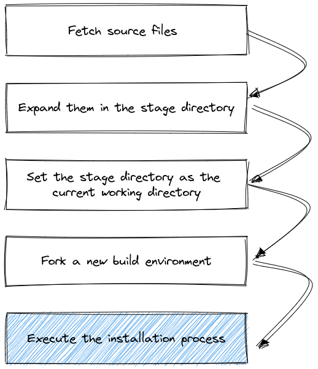
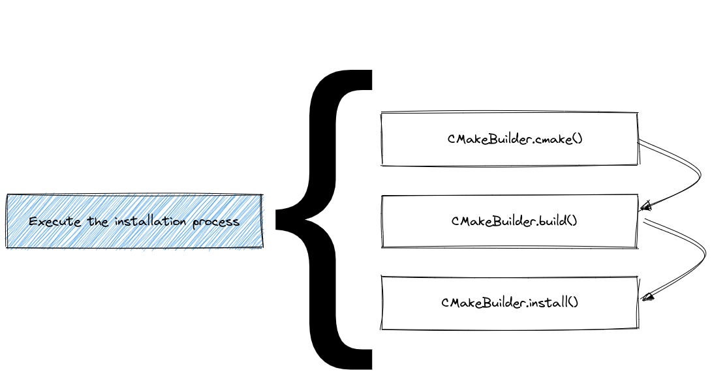
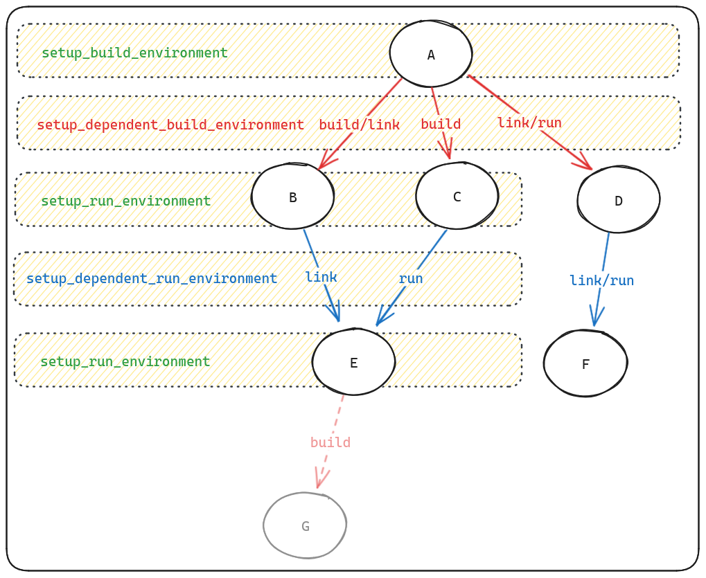
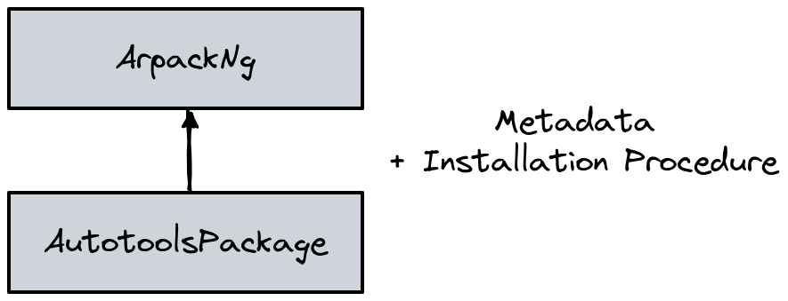
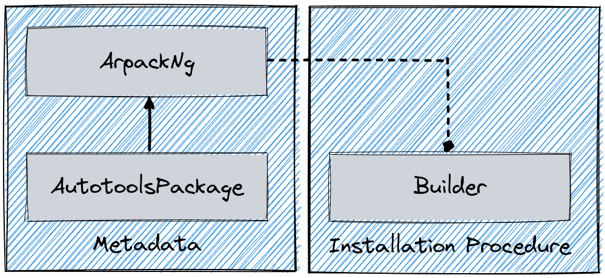
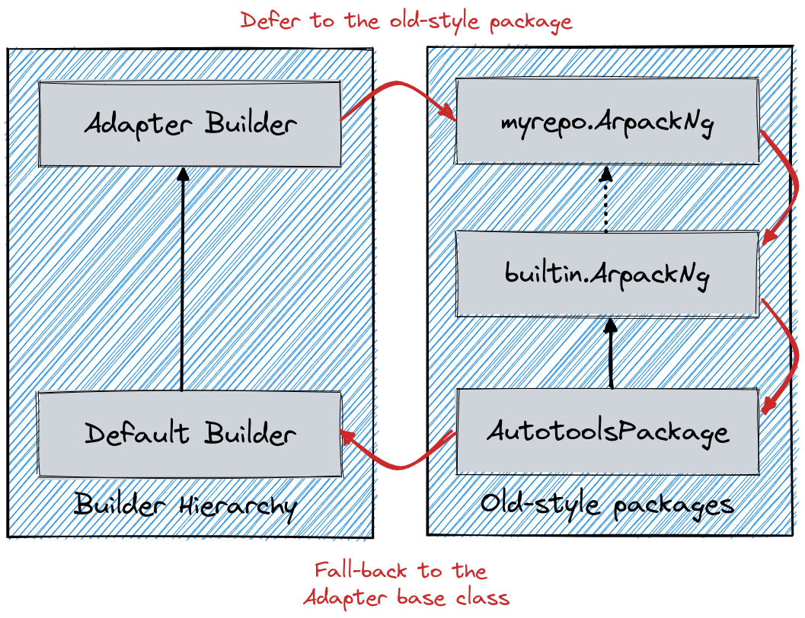

.. Copyright Spack Project Developers. See COPYRIGHT file for details.

   SPDX-License-Identifier: (Apache-2.0 OR MIT)

.. _packaging-guide-part-2:

======================================
Packaging Guide: customizing the build
======================================

In the first part of the packaging guide, we covered the basic structure of a package, how to specify dependencies, and how to define variants.
In the second part, we will cover the installation procedure, build systems, and how to customize the build process.

.. _installation_procedure:

--------------------------------------
Overview of the installation procedure
--------------------------------------

Whenever Spack installs software, it goes through a series of predefined steps:

All these steps are influenced by the metadata in each ``package.py`` and by the current Spack configuration.
Since build systems are different from one another, the execution of the last block in the figure is further expanded in a build system specific way.
An example for ``CMake`` is, for instance:

The predefined steps for each build system are called "phases".
In general, the name and order in which the phases will be executed can be obtained by either reading the API docs at :py:mod:`~.spack_repo.builtin.build_systems`, or using the ``spack info`` command:

.. code-block:: console
    :emphasize-lines: 13,14

    $ spack info --phases m4
    AutotoolsPackage:    m4
    Homepage:            https://www.gnu.org/software/m4/m4.html

    Safe versions:
        1.4.17    ftp://ftp.gnu.org/gnu/m4/m4-1.4.17.tar.gz

    Variants:
        Name       Default   Description

        sigsegv    on        Build the libsigsegv dependency

    Installation Phases:
        autoreconf    configure    build    install

    Build Dependencies:
        libsigsegv

    ...

An extensive list of available build systems and phases is provided in :ref:`installation_process`.

-----------------------------
Influencing the build process
-----------------------------

As we have seen in the first part of the packaging guide, the usual workflow for creating a package is to start with ``spack create <url>``, which generates a ``package.py`` file for you with a boilerplate package class.
This typically includes a package base class (e.g. ``AutotoolsPackage`` or ``CMakePackage``), a URL, and one or more versions.
After you have added required dependencies and variants, you can start customizing the build process.
There are various ways to do this, depending on the build system and the package itself.

From simplest to most complex, the following are the most common ways to customize the build process:

1. **Implementing build system helper methods and properties**.
   Most build systems provide a set of helper methods that can be overridden to customize the build process without overriding entire phases.
   For example, for ``AutotoolsPackage`` you can specify the command line arguments for ``./configure`` by implementing ``configure_args``:

   .. code-block:: python
   
      def configure_args(self):
          # FIXME: Add arguments other than --prefix
          # FIXME: If not needed delete this function
          args = []
          return args

   Similarly for ``CMakePackage`` you can influence how ``cmake`` is invoked by implementing ``cmake_args``:

   .. code-block:: python
   
      def cmake_args(self):
          # FIXME: Add arguments other than
          # FIXME: CMAKE_INSTALL_PREFIX and CMAKE_BUILD_TYPE
          # FIXME: If not needed delete this function
          args = []
          return args

   See :ref:`installation_process` for a list of available build systems and their helper methods.

2. **Setting environment variables**.
   Some build systems require specific environment variables to be set before the build starts.
   You can set these variables by overriding the ``setup_build_environment`` method in your package class:

   .. code-block:: python
   
      def setup_build_environment(self, env):
          env.set("MY_ENV_VAR", "value")

   This is useful for setting paths or other variables that the build system needs to find dependencies or configure itself correctly.

   See :ref:`setup-environment` for more details on how to set up environment variables.

3. **Complementing the build system with pre- or post-build steps**.
   In some cases, you may need to run additional commands before or after the build system phases.
   This is useful for installing additional files missed by the build system, or for running custom scripts.

   .. code-block:: python
   
      @run_after("install")
      def install_missing_files(self):
          install_tree("extra_files", self.prefix.bin)

4. **Overriding entire build phases**.
   If the default implementation of a build phase does not fit your needs, you can override the entire phase.
   This is done by implementing a method with the same name as the phase, such as ``install()`` for ``MakefilePackage`` or ``CMakePackage``.

   .. code-block:: python
   
      def install(self, spec, prefix):
          # Custom install logic
          make("install")
          install_tree("my_files", prefix.bin)

   In this case, you have full control over what happens during the install phase.

In any of the functions above, you can

1. **Make instructions dynamic**. Flags passed to build systems often depend on the package's variants, dependencies and other properties.
   For example, you can use 
   
   .. code-block:: python

      if self.spec.satisfies("+variant_name"):
         ...
   
   to check if a variant is enabled, or
   
   .. code-block:: python

      self.spec["dependency_name"].prefix

   to get the prefix of a dependency.
   See :ref:`spec-objects` for more details on how to use specs in your package.
2. **Use Spack's Python Package API**. The ``from spack.package import *`` statement allows you to access Spack's utilities and helper functions, such as ``which``, ``install_tree``, ``filter_file`` and others.
   See :ref:`python-package-api` for more details.

.. _setup-environment:

--------------------------------------------
Runtime and build time environment variables
--------------------------------------------

Spack provides a few methods to help package authors set up the required environment variables for
their package. Environment variables typically depend on how the package is used: variables that
make sense during the build phase may not be needed at runtime, and vice versa. Further, sometimes
it makes sense to let a dependency set the environment variables for its dependents. To allow all
this, Spack provides four different methods that can be overridden in a package:

1. :meth:`setup_build_environment <spack.builder.BaseBuilder.setup_build_environment>`
2. :meth:`setup_run_environment <spack.package_base.PackageBase.setup_run_environment>`
3. :meth:`setup_dependent_build_environment <spack.builder.BaseBuilder.setup_dependent_build_environment>`
4. :meth:`setup_dependent_run_environment <spack.package_base.PackageBase.setup_dependent_run_environment>`

The Qt package, for instance, uses this call:

.. literalinclude:: .spack/spack-packages/repos/spack_repo/builtin/packages/qt/package.py
   :pyobject: Qt.setup_dependent_build_environment
   :linenos:

to set the ``QTDIR`` environment variable so that packages that depend on a particular Qt
installation will find it.

The following diagram will give you an idea when each of these methods is called in a build
context:

Notice that ``setup_dependent_run_environment`` can be called multiple times, once for each
dependent package, whereas ``setup_run_environment`` is called only once for the package itself.
This means that the former should only be used if the environment variables depend on the dependent
package, whereas the latter should be used if the environment variables depend only on the package
itself.

--------------------------------
Setting package module variables
--------------------------------

Apart from modifying environment variables of the dependent package, you can also define Python
variables to be used by the dependent. This is done by implementing
:meth:`setup_dependent_package <spack.package_base.PackageBase.setup_dependent_package>`. An
example of this can be found in the ``Python`` package:

.. literalinclude:: .spack/spack-packages/repos/spack_repo/builtin/packages/python/package.py
   :pyobject: Python.setup_dependent_package
   :linenos:

This allows Python packages to directly use these variables:

.. code-block:: python

   def install(self, spec, prefix):
       ...
       install("script.py", python_platlib)

.. note::

   We recommend using ``setup_dependent_package`` sparingly, as it is not always clear where
   global variables are coming from when editing a ``package.py`` file.

.. _abstract-and-concrete:

-------------------------
Abstract & concrete specs
-------------------------

Now that we've seen how spec constraints can be specified :ref:`on the
command line <sec-specs>` and within package definitions, we can talk
about how Spack puts all of this information together.  When you run
this:

.. code-block:: console

   $ spack install mpileaks ^callpath@1.0+debug ^libelf@0.8.11

Spack parses the command line and builds a spec from the description.
The spec says that ``mpileaks`` should be built with the ``callpath``
library at 1.0 and with the debug option enabled, and with ``libelf``
version 0.8.11.  Spack will also look at the ``depends_on`` calls in
all of these packages, and it will build a spec from that.  The specs
from the command line and the specs built from package descriptions
are then combined, and the constraints are checked against each other
to make sure they're satisfiable.

What we have after this is done is called an *abstract spec*.  An
abstract spec is partially specified.  In other words, it could
describe more than one build of a package.  Spack does this to make
things easier on the user: they should only have to specify as much of
the package spec as they care about.  Here's an example partial spec
DAG, based on the constraints above:

.. code-block:: none

   mpileaks
       ^callpath@1.0+debug
           ^dyninst
               ^libdwarf
                   ^libelf@0.8.11
           ^mpi

.. graphviz::

   digraph {
       mpileaks -> mpi
       mpileaks -> "callpath@1.0+debug" -> mpi
       "callpath@1.0+debug" -> dyninst
       dyninst  -> libdwarf -> "libelf@0.8.11"
       dyninst  -> "libelf@0.8.11"
   }

This diagram shows a spec DAG output as a tree, where successive
levels of indentation represent a depends-on relationship.  In the
above DAG, we can see some packages annotated with their constraints,
and some packages with no annotations at all.  When there are no
annotations, it means the user doesn't care what configuration of that
package is built, just so long as it works.

^^^^^^^^^^^^^^
Concretization
^^^^^^^^^^^^^^

An abstract spec is useful for the user, but you can't install an
abstract spec.  Spack has to take the abstract spec and "fill in" the
remaining unspecified parts in order to install.  This process is
called **concretization**.  Concretization happens in between the time
the user runs ``spack install`` and the time the ``install()`` method
is called.  The concretized version of the spec above might look like
this:

.. code-block:: none

   mpileaks@2.3%gcc@4.7.3 arch=linux-debian7-x86_64
       ^callpath@1.0%gcc@4.7.3+debug arch=linux-debian7-x86_64
           ^dyninst@8.1.2%gcc@4.7.3 arch=linux-debian7-x86_64
               ^libdwarf@20130729%gcc@4.7.3 arch=linux-debian7-x86_64
                   ^libelf@0.8.11%gcc@4.7.3 arch=linux-debian7-x86_64
           ^mpich@3.0.4%gcc@4.7.3 arch=linux-debian7-x86_64

.. graphviz::

   digraph {
       "mpileaks@2.3\n%gcc@4.7.3\n arch=linux-debian7-x86_64" -> "mpich@3.0.4\n%gcc@4.7.3\n arch=linux-debian7-x86_64"
       "mpileaks@2.3\n%gcc@4.7.3\n arch=linux-debian7-x86_64" -> "callpath@1.0\n%gcc@4.7.3+debug\n arch=linux-debian7-x86_64" -> "mpich@3.0.4\n%gcc@4.7.3\n arch=linux-debian7-x86_64"
       "callpath@1.0\n%gcc@4.7.3+debug\n arch=linux-debian7-x86_64" -> "dyninst@8.1.2\n%gcc@4.7.3\n arch=linux-debian7-x86_64"
       "dyninst@8.1.2\n%gcc@4.7.3\n arch=linux-debian7-x86_64" -> "libdwarf@20130729\n%gcc@4.7.3\n arch=linux-debian7-x86_64" -> "libelf@0.8.11\n%gcc@4.7.3\n arch=linux-debian7-x86_64"
       "dyninst@8.1.2\n%gcc@4.7.3\n arch=linux-debian7-x86_64" -> "libelf@0.8.11\n%gcc@4.7.3\n arch=linux-debian7-x86_64"
   }

Here, all versions, compilers, and platforms are filled in, and there
is a single version (no version ranges) for each package.  All
decisions about configuration have been made, and only after this
point will Spack call the ``install()`` method for your package.

Concretization in Spack is based on certain selection policies that
tell Spack how to select, e.g., a version, when one is not specified
explicitly.  Concretization policies are discussed in more detail in
:ref:`configuration`.  Sites using Spack can customize them to match
the preferences of their own users.

.. _cmd-spack-spec:

^^^^^^^^^^^^^^
``spack spec``
^^^^^^^^^^^^^^

For an arbitrary spec, you can see the result of concretization by
running ``spack spec``.  For example:

.. code-block:: console

   $ spack spec dyninst@8.0.1
   dyninst@8.0.1
       ^libdwarf
           ^libelf

   dyninst@8.0.1%gcc@4.7.3 arch=linux-debian7-x86_64
       ^libdwarf@20130729%gcc@4.7.3 arch=linux-debian7-x86_64
           ^libelf@0.8.13%gcc@4.7.3 arch=linux-debian7-x86_64

This is useful when you want to know exactly what Spack will do when
you ask for a particular spec.

.. _concretization-policies:

^^^^^^^^^^^^^^^^^^^^^^^^^^^
``Concretization Policies``
^^^^^^^^^^^^^^^^^^^^^^^^^^^

A user may have certain preferences for how packages should
be concretized on their system.  For example, one user may prefer packages
built with OpenMPI and the Intel compiler.  Another user may prefer
packages be built with MVAPICH and GCC.

See the :ref:`package-preferences` section for more details.

.. _installation_process:

--------------------------------
Overriding build system defaults
--------------------------------

.. note::

   If you code a single class in ``package.py`` all the functions shown in the table below
   can be implemented with the same signature on the ``*Package`` instead of the corresponding builder.

Most of the time the default implementation of methods or attributes in build system base classes
is what a packager needs, and just very few entities need to be overwritten. Typically we just
need to override methods like ``configure_args``:

.. code-block:: python

   def configure_args(self):
        args = ["--enable-cxx"] + self.enable_or_disable("libs")
        if self.spec.satisfies("libs=static"):
            args.append("--with-pic")
        return args

The actual set of entities available for overriding in ``package.py`` depends on
the build system. The build systems currently supported by Spack are:

+----------------------------------------------------------+----------------------------------+
|     **API docs**                                         |           **Description**        |
+==========================================================+==================================+
| :class:`~spack_repo.builtin.build_systems.generic`       | Generic build system without any |
|                                                          | base implementation              |
+----------------------------------------------------------+----------------------------------+
| :class:`~spack_repo.builtin.build_systems.makefile`      | Specialized build system for     |
|                                                          | software built invoking          |
|                                                          | hand-written Makefiles           |
+----------------------------------------------------------+----------------------------------+
| :class:`~spack_repo.builtin.build_systems.autotools`     | Specialized build system for     |
|                                                          | software built using             |
|                                                          | GNU Autotools                    |
+----------------------------------------------------------+----------------------------------+
| :class:`~spack_repo.builtin.build_systems.cmake`         | Specialized build system for     |
|                                                          | software built using CMake       |
+----------------------------------------------------------+----------------------------------+
| :class:`~spack_repo.builtin.build_systems.maven`         | Specialized build system for     |
|                                                          | software built using Maven       |
+----------------------------------------------------------+----------------------------------+
| :class:`~spack_repo.builtin.build_systems.meson`         | Specialized build system for     |
|                                                          | software built using Meson       |
+----------------------------------------------------------+----------------------------------+
| :class:`~spack_repo.builtin.build_systems.nmake`         | Specialized build system for     |
|                                                          | software built using NMake       |
+----------------------------------------------------------+----------------------------------+
| :class:`~spack_repo.builtin.build_systems.qmake`         | Specialized build system for     |
|                                                          | software built using QMake       |
+----------------------------------------------------------+----------------------------------+
| :class:`~spack_repo.builtin.build_systems.scons`         | Specialized build system for     |
|                                                          | software built using SCons       |
+----------------------------------------------------------+----------------------------------+
| :class:`~spack_repo.builtin.build_systems.waf`           | Specialized build system for     |
|                                                          | software built using Waf         |
+----------------------------------------------------------+----------------------------------+
| :class:`~spack_repo.builtin.build_systems.r`             | Specialized build system for     |
|                                                          | R extensions                     |
+----------------------------------------------------------+----------------------------------+
| :class:`~spack_repo.builtin.build_systems.octave`        | Specialized build system for     |
|                                                          | Octave packages                  |
+----------------------------------------------------------+----------------------------------+
| :class:`~spack_repo.builtin.build_systems.python`        | Specialized build system for     |
|                                                          | Python extensions                |
+----------------------------------------------------------+----------------------------------+
| :class:`~spack_repo.builtin.build_systems.perl`          | Specialized build system for     |
|                                                          | Perl extensions                  |
+----------------------------------------------------------+----------------------------------+
| :class:`~spack_repo.builtin.build_systems.ruby`          | Specialized build system for     |
|                                                          | Ruby extensions                  |
+----------------------------------------------------------+----------------------------------+
| :class:`~spack_repo.builtin.build_systems.oneapi`        | Specialized build system for     |
|                                                          | Intel oneAPI software            |
+----------------------------------------------------------+----------------------------------+
| :class:`~spack_repo.builtin.build_systems.aspell_dict`   | Specialized build system for     |
|                                                          | Aspell dictionaries              |
+----------------------------------------------------------+----------------------------------+

.. note::
    Choice of the appropriate base class for a package
        In most cases packagers don't have to worry about the selection of the right base class
        for a package, as ``spack create`` will make the appropriate choice on their behalf. In those
        rare cases where manual intervention is needed we need to stress that a
        package base class depends on the *build system* being used, not the language of the package.
        For example, a Python extension installed with CMake would ``extends("python")`` and
        subclass from :class:`~spack_repo.builtin.build_systems.cmake.CMakePackage`.

^^^^^^^^^^^^^^^^^^^^^^^^^^
Overriding builder methods
^^^^^^^^^^^^^^^^^^^^^^^^^^

Build-system "phases" have default implementations that fit most of the common cases:

.. literalinclude:: .spack/spack-packages/repos/spack_repo/builtin/build_systems/autotools.py
    :pyobject: AutotoolsBuilder.configure
    :linenos:

It is usually sufficient for a packager to override a few
build system specific helper methods or attributes to provide, for instance,
configure arguments:

.. literalinclude::  .spack/spack-packages/repos/spack_repo/builtin/packages/m4/package.py
    :pyobject: M4.configure_args
    :linenos:

Each specific build system has a list of attributes and methods that can be overridden to
fine-tune the installation of a package without overriding an entire phase. To
have more information on them the place to go is the API docs of the :py:mod:`~.spack_repo.builtin.build_systems`
module.

^^^^^^^^^^^^^^^^^^^^^^^^^^
Overriding an entire phase
^^^^^^^^^^^^^^^^^^^^^^^^^^

Sometimes it is necessary to override an entire phase. If the ``package.py`` contains
a single class recipe, see :ref:`package_class_structure`, then the signature for a
phase is:

.. code-block:: python

   class Openjpeg(CMakePackage):
       def install(self, spec, prefix):
           ...

regardless of the build system. The arguments for the phase are:

``self``
    This is the package object, which extends ``CMakePackage``.
    For API docs on Package objects, see
    :py:class:`Package <spack.package_base.PackageBase>`.

``spec``
    This is the concrete spec object created by Spack from an
    abstract spec supplied by the user.  It describes what should be
    installed.  It will be of type :py:class:`Spec <spack.spec.Spec>`.

``prefix``
    This is the path that your install method should copy build
    targets into.  It acts like a string, but it's actually its own
    special type, :py:class:`Prefix <spack.util.prefix.Prefix>`.

The arguments ``spec`` and ``prefix`` are passed only for convenience, as they always
correspond to ``self.spec`` and ``self.spec.prefix`` respectively.

If the ``package.py`` has build instructions in a separate
:ref:`builder class <multiple_build_systems>`, the signature for a phase changes slightly:

.. code-block:: python

   class CMakeBuilder(spack_repo.builtin.build_systems.cmake.CMakeBuilder):
       def install(self, pkg, spec, prefix):
           ...

In this case the package is passed as the second argument, and ``self`` is the builder instance.

.. _multiple_build_systems:

----------------------
Multiple build systems
----------------------

There are cases where a package actively supports two build systems, or changes build systems
as it evolves, or needs different build systems on different platforms. Spack allows dealing with
these cases by splitting the build instructions into separate builder classes.

For instance, software that supports two build systems unconditionally should derive from
both ``*Package`` base classes, and declare the possible use of multiple build systems using
a directive:

.. code-block:: python

   class Example(CMakePackage, AutotoolsPackage):

       variant("my_feature", default=True)

       build_system("cmake", "autotools", default="cmake")

In this case the software can be built with both ``autotools`` and ``cmake``. Since the package
supports multiple build systems, it is necessary to declare which one is the default.

Additional build instructions are split into separate builder classes:

.. code-block:: python

   class CMakeBuilder(spack_repo.builtin.build_systems.cmake.CMakeBuilder):
       def cmake_args(self):
           return [
               self.define_from_variant("MY_FEATURE", "my_feature")
           ]

   class AutotoolsBuilder(spack_repo.builtin.build_systems.autotools.AutotoolsBuilder):
       def configure_args(self):
           return self.with_or_without("my-feature", variant="my_feature")

In this example, ``spack install example +feature build_system=cmake``  will
pick the ``CMakeBuilder`` and invoke ``cmake -DMY_FEATURE:BOOL=ON``.

Similarly, ``spack install example +feature build_system=autotools`` will pick
the  ``AutotoolsBuilder`` and invoke ``./configure --with-my-feature``.

Dependencies are always specified in the package class. When some dependencies
depend on the choice of the build system, it is possible to use when conditions as
usual:

.. code-block:: python

   class Example(CMakePackage, AutotoolsPackage):

       build_system("cmake", "autotools", default="cmake")

       # Runtime dependencies
       depends_on("ncurses")
       depends_on("libxml2")

       # Lowerbounds for cmake only apply when using cmake as the build system
       with when("build_system=cmake"):
           depends_on("cmake@3.18:", when="@2.0:", type="build")
           depends_on("cmake@3:", type="build")

       # Specify extra build dependencies used only in the configure script
       with when("build_system=autotools"):
           depends_on("perl", type="build")
           depends_on("pkgconfig", type="build")

Very often projects switch from one build system to another, or add support
for a new build system from a certain version, which means that the choice
of the build system typically depends on a version range. Those situations can
be handled by using conditional values in the ``build_system`` directive:

.. code-block:: python

   class Example(CMakePackage, AutotoolsPackage):

       build_system(
           conditional("cmake", when="@0.64:"),
           conditional("autotools", when="@:0.63"),
           default="cmake",
       )

In the example the directive imposes a change from ``Autotools`` to ``CMake`` going
from ``v0.63`` to ``v0.64``.

The ``build_system`` can be used as an ordinary variant, which also means that it can
be used in ``depends_on`` statements. This can be useful when a package *requires* that
its dependency has a CMake config file, meaning that the dependent can only build when the
dependency is built with CMake, and not Autotools. In that case, you can force the choice
of the build system in the dependent:

.. code-block:: python

   class Dependent(CMakePackage):

       depends_on("example build_system=cmake")

.. _install-environment:

-----------------------
The build environment
-----------------------

In general, you should not have to do much differently in your install
method than you would when installing a package on the command line.
In fact, you may need to do *less* than you would on the command line.

Spack tries to set environment variables and modify compiler calls so
that it *appears* to the build system that you're building with a
standard system install of everything.  Obviously that's not going to
cover *all* build systems, but it should make it easy to port packages
to Spack if they use a standard build system.  Usually with autotools
or cmake, building and installing is easy.  With builds that use
custom Makefiles, you may need to add logic to modify the makefiles.

The remainder of the section covers the way Spack's build environment
works.

^^^^^^^^^^^^^^^^^^^^^
Forking ``install()``
^^^^^^^^^^^^^^^^^^^^^

To give packagers free rein over their install environment, Spack forks
a new process each time it invokes a package's ``install()`` method.
This allows packages to have a sandboxed build environment, without
impacting the environments of other jobs that the main Spack process runs.
Packages are free to change the environment or to modify Spack internals,
because each ``install()`` call has its own dedicated process.

^^^^^^^^^^^^^^^^^^^^^
Environment variables
^^^^^^^^^^^^^^^^^^^^^

Spack sets a number of standard environment variables that serve two
purposes:

#. Make build systems use Spack's compiler wrappers for their builds.
#. Allow build systems to find dependencies more easily

The Compiler environment variables that Spack sets are:

  ============  ===============================
    Variable     Purpose
  ============  ===============================
    ``CC``       C compiler
    ``CXX``      C++ compiler
    ``F77``      Fortran 77 compiler
    ``FC``       Fortran 90 and above compiler
  ============  ===============================

Spack sets these variables so that they point to *compiler
wrappers*. These are covered in :ref:`their own section
<compiler-wrappers>` below.

All of these are standard variables respected by most build systems.
If your project uses ``Autotools`` or ``CMake``, then it should pick
them up automatically when you run ``configure`` or ``cmake`` in the
``install()`` function.  Many traditional builds using GNU Make and
BSD make also respect these variables, so they may work with these
systems.

If your build system does *not* automatically pick these variables up
from the environment, then you can simply pass them on the command
line or use a patch as part of your build process to get the correct
compilers into the project's build system.  There are also some file
editing commands you can use -- these are described later in the
`section on file manipulation <python-package-api_>`_.

In addition to the compiler variables, these variables are set before
entering ``install()`` so that packages can locate dependencies
easily:

=====================  ====================================================
``PATH``               Set to point to ``/bin`` directories of dependencies
``CMAKE_PREFIX_PATH``  Path to dependency prefixes for CMake
``PKG_CONFIG_PATH``    Path to any pkgconfig directories for dependencies
``PYTHONPATH``         Path to site-packages dir of any python dependencies
=====================  ====================================================

``PATH`` is set up to point to dependencies ``/bin`` directories so
that you can use tools installed by dependency packages at build time.
For example, ``$MPICH_ROOT/bin/mpicc`` is frequently used by dependencies of
``mpich``.

``CMAKE_PREFIX_PATH`` contains a colon-separated list of prefixes
where ``cmake`` will search for dependency libraries and headers.
This causes all standard CMake find commands to look in the paths of
your dependencies, so you *do not* have to manually specify arguments
like ``-DDEPENDENCY_DIR=/path/to/dependency`` to ``cmake``.  More on
this is `in the CMake documentation <http://www.cmake.org/cmake/help/v3.0/variable/CMAKE_PREFIX_PATH.html>`_.

``PKG_CONFIG_PATH`` is for packages that attempt to discover
dependencies using the GNU ``pkg-config`` tool.  It is similar to
``CMAKE_PREFIX_PATH`` in that it allows a build to automatically
discover its dependencies.

If you want to see the environment that a package will build with, or
if you want to run commands in that environment to test them out, you
can use the :ref:`cmd-spack-build-env` command, documented
below.

^^^^^^^^^^^^^^^^^^^^^
Failing the build
^^^^^^^^^^^^^^^^^^^^^

Sometimes you don't want a package to successfully install unless some
condition is true.  You can explicitly cause the build to fail from
``install()`` by raising an ``InstallError``, for example:

.. code-block:: python

   if spec.architecture.startswith("darwin"):
       raise InstallError("This package does not build on Mac OS X!")

.. _shell-wrappers:

^^^^^^^^^^^^^^^^^^^^^^^
Shell command functions
^^^^^^^^^^^^^^^^^^^^^^^

Recall the install method from ``libelf``:

.. literalinclude::  .spack/spack-packages/repos/spack_repo/builtin/packages/libelf/package.py
   :pyobject: Libelf.install
   :linenos:

Normally in Python, you'd have to write something like this in order
to execute shell commands:

.. code-block:: python

   import subprocess
   subprocess.check_call("configure", "--prefix={0}".format(prefix))

We've tried to make this a bit easier by providing callable wrapper
objects for some shell commands.  By default, ``configure``,
``cmake``, and ``make`` wrappers are provided, so you can call
them more naturally in your package files.

If you need other commands, you can use ``which`` to get them:

.. code-block:: python

   sed = which("sed")
   sed("s/foo/bar/", filename)

The ``which`` function will search the ``PATH`` for the application.

Callable wrappers also allow Spack to provide some special features.
For example, in Spack, ``make`` is parallel by default, and Spack
figures out the number of cores on your machine and passes an
appropriate value for ``-j<numjobs>`` when it calls ``make`` (see the
``parallel`` `package attribute <attribute_parallel>`).  In
a package file, you can supply a keyword argument, ``parallel=False``,
to the ``make`` wrapper to disable parallel make.  In the ``libelf``
package, this allows us to avoid race conditions in the library's
build system.

^^^^^^^^^^^^^^
Compiler flags
^^^^^^^^^^^^^^

Compiler flags set by the user through the Spec object can be passed
to the build in one of three ways. By default, the build environment
injects these flags directly into the compiler commands using Spack's
compiler wrappers. In cases where the build system requires knowledge
of the compiler flags, they can be registered with the build system by
alternatively passing them through environment variables or as build
system arguments. The flag_handler method can be used to change this
behavior.

Packages can override the flag_handler method with one of three
built-in flag_handlers. The built-in flag_handlers are named
``inject_flags``, ``env_flags``, and ``build_system_flags``. The
``inject_flags`` method is the default. The ``env_flags`` method puts
all of the flags into the environment variables that ``make`` uses as
implicit variables ("CFLAGS", "CXXFLAGS", etc.). The
``build_system_flags`` method adds the flags as
arguments to the invocation of ``configure`` or ``cmake``,
respectively.

.. warning::

   Passing compiler flags using build system arguments is only
   supported for CMake and Autotools packages. Individual packages may
   also differ in whether they properly respect these arguments.

Individual packages may also define their own ``flag_handler``
methods. The ``flag_handler`` method takes the package instance
(``self``), the name of the flag, and a list of the values of the
flag. It will be called on each of the six compiler flags supported in
Spack. It should return a triple of ``(injf, envf, bsf)`` where
``injf`` is a list of flags to inject via the Spack compiler wrappers,
``envf`` is a list of flags to set in the appropriate environment
variables, and ``bsf`` is a list of flags to pass to the build system
as arguments.

.. warning::

   Passing a non-empty list of flags to ``bsf`` for a build system
   that does not support build system arguments will result in an
   error.

Here are the definitions of the three built-in flag handlers:

.. code-block:: python

   def inject_flags(pkg, name, flags):
       return (flags, None, None)

   def env_flags(pkg, name, flags):
       return (None, flags, None)

   def build_system_flags(pkg, name, flags):
       return (None, None, flags)

.. note::

   Returning ``[]`` and ``None`` are equivalent in a ``flag_handler``
   method.

Packages can override the default behavior either by specifying one of
the built-in flag handlers,

.. code-block:: python

   flag_handler = env_flags

or by implementing the flag_handler method. Suppose for a package
``Foo`` we need to pass ``cflags``, ``cxxflags``, and ``cppflags``
through the environment, the rest of the flags through compiler
wrapper injection, and we need to add ``-lbar`` to ``ldlibs``. The
following flag handler method accomplishes that.

.. code-block:: python

   def flag_handler(self, name, flags):
       if name in ["cflags", "cxxflags", "cppflags"]:
           return (None, flags, None)
       elif name == "ldlibs":
           flags.append("-lbar")
       return (flags, None, None)

Because these methods can pass values through environment variables,
it is important not to override these variables unnecessarily
(E.g. setting ``env["CFLAGS"]``) in other package methods when using
non-default flag handlers. In the ``setup_environment`` and
``setup_dependent_environment`` methods, use the ``append_flags``
method of the ``EnvironmentModifications`` class to append values to a
list of flags whenever the flag handler is ``env_flags``. If the
package passes flags through the environment or the build system
manually (in the install method, for example), we recommend using the
default flag handler, or removing manual references and implementing a
custom flag handler method that adds the desired flags to export as
environment variables or pass to the build system. Manual flag passing
is likely to interfere with the ``env_flags`` and
``build_system_flags`` methods.

In rare circumstances such as compiling and running small unit tests, a
package developer may need to know what are the appropriate compiler
flags to enable features like ``OpenMP``, ``c++11``, ``c++14`` and
the like. To that end the compiler classes in ``spack`` implement the
following **properties**: ``openmp_flag``, ``cxx98_flag``, ``cxx11_flag``,
``cxx14_flag``, and ``cxx17_flag``, which can be accessed in a package by
``self.compiler.cxx11_flag`` and the like. Note that the implementation is
such that if a given compiler version does not support this feature, an
error will be produced. Therefore, package developers can also use these
properties to assert that a compiler supports the requested feature. This
is handy when a package supports additional variants like

.. code-block:: python

   variant("openmp", default=True, description="Enable OpenMP support.")

.. _blas_lapack_scalapack:

^^^^^^^^^^^^^^^^^^^^^^^^^^^^^^^^^^^^
Blas, Lapack and ScaLapack libraries
^^^^^^^^^^^^^^^^^^^^^^^^^^^^^^^^^^^^

Multiple packages provide implementations of ``Blas``, ``Lapack`` and ``ScaLapack``
routines.  The names of the resulting static and/or shared libraries
differ from package to package. In order to make the ``install()`` method
independent of the choice of ``Blas`` implementation, each package which
provides it implements ``@property def blas_libs(self):`` to return an object
of
`LibraryList <https://spack.readthedocs.io/en/latest/llnl.util.html#llnl.util.filesystem.LibraryList>`_
type which simplifies usage of a set of libraries.
The same applies to packages which provide ``Lapack`` and ``ScaLapack``.
Package developers are requested to use this interface. Common usage cases are:

1. Space separated list of full paths

.. code-block:: python

   lapack_blas = spec["lapack"].libs + spec["blas"].libs
   options.append(
      "--with-blas-lapack-lib={0}".format(lapack_blas.joined())
   )

2. Names of libraries and directories which contain them

.. code-block:: python

   blas = spec["blas"].libs
   options.extend([
     "-DBLAS_LIBRARY_NAMES={0}".format(";".join(blas.names)),
     "-DBLAS_LIBRARY_DIRS={0}".format(";".join(blas.directories))
   ])

3. Search and link flags

.. code-block:: python

   math_libs = spec["scalapack"].libs + spec["lapack"].libs + spec["blas"].libs
   options.append(
     "-DMATH_LIBS:STRING={0}".format(math_libs.ld_flags)
   )

For more information, see documentation of
`LibraryList <https://spack.readthedocs.io/en/latest/llnl.util.html#llnl.util.filesystem.LibraryList>`_
class.

.. _prefix-objects:

^^^^^^^^^^^^^^^^^^^^^
Prefix objects
^^^^^^^^^^^^^^^^^^^^^

Spack passes the ``prefix`` parameter to the install method so that
you can pass it to ``configure``, ``cmake``, or some other installer,
e.g.:

.. code-block:: python

   configure("--prefix={0}".format(prefix))

For the most part, prefix objects behave exactly like strings.  For
packages that do not have their own install target, or for those that
implement it poorly (like ``libdwarf``), you may need to manually copy
things into particular directories under the prefix.  For this, you
can refer to standard subdirectories without having to construct paths
yourself, e.g.:

.. code-block:: python

   def install(self, spec, prefix):
       mkdirp(prefix.bin)
       install("foo-tool", prefix.bin)

       mkdirp(prefix.include)
       install("foo.h", prefix.include)

       mkdirp(prefix.lib)
       install("libfoo.a", prefix.lib)

Attributes of this object are created on the fly when you request them,
so any of the following will work:

======================  =======================
Prefix Attribute        Location
======================  =======================
``prefix.bin``          ``$prefix/bin``
``prefix.lib64``        ``$prefix/lib64``
``prefix.share.man``    ``$prefix/share/man``
``prefix.foo.bar.baz``  ``$prefix/foo/bar/baz``
======================  =======================

Of course, this only works if your file or directory is a valid Python
variable name. If your file or directory contains dashes or dots, use
``join`` instead:

.. code-block:: python

   prefix.lib.join("libz.a")

.. _spec-objects:

------------
Spec objects
------------

When ``install`` is called, most parts of the build process are set up
for you.  The correct version's tarball has been downloaded and
expanded.  Environment variables like ``CC`` and ``CXX`` are set to
point to the correct compiler and version.  An install prefix has
already been selected and passed in as ``prefix``.  In most cases this
is all you need to get ``configure``, ``cmake``, or another install
working correctly.

There will be times when you need to know more about the build
configuration.  For example, some software requires that you pass
special parameters to ``configure``, like
``--with-libelf=/path/to/libelf`` or ``--with-mpich``.  You might also
need to supply special compiler flags depending on the compiler.  All
of this information is available in the spec.

.. _testing-specs:

^^^^^^^^^^^^^^^^^^^^^^^^
Testing spec constraints
^^^^^^^^^^^^^^^^^^^^^^^^

You can test whether your spec is configured a certain way by using
the ``satisfies`` method.  For example, if you want to check whether
the package's version is in a particular range, you can use specs to
do that, e.g.:

.. code-block:: python

   configure_args = [
       "--prefix={0}".format(prefix)
   ]

   if spec.satisfies("@1.2:1.4"):
       configure_args.append("CXXFLAGS='-DWITH_FEATURE'")

   configure(*configure_args)

This works for compilers, too:

.. code-block:: python

   if spec.satisfies("%gcc"):
       configure_args.append("CXXFLAGS='-g3 -O3'")
   if spec.satisfies("%intel"):
       configure_args.append("CXXFLAGS='-xSSE2 -fast'")

Or for combinations of spec constraints:

.. code-block:: python

   if spec.satisfies("@1.2%intel"):
       tty.error("Version 1.2 breaks when using Intel compiler!")

You can also do similar satisfaction tests for dependencies:

.. code-block:: python

   if spec.satisfies("^dyninst@8.0"):
       configure_args.append("CXXFLAGS=-DSPECIAL_DYNINST_FEATURE")

This could allow you to easily work around a bug in a particular
dependency version.

You can use ``satisfies()`` to test for particular dependencies,
e.g. ``foo.satisfies("^openmpi@1.2")`` or ``foo.satisfies("^mpich")``,
or you can use Python's built-in ``in`` operator:

.. code-block:: python

   if "libelf" in spec:
       print "this package depends on libelf"

This is useful for virtual dependencies, as you can easily see what
implementation was selected for this build:

.. code-block:: python

   if "openmpi" in spec:
       configure_args.append("--with-openmpi")
   elif "mpich" in spec:
       configure_args.append("--with-mpich")
   elif "mvapich" in spec:
       configure_args.append("--with-mvapich")

It's also a bit more concise than ``satisfies()``.

.. note::

   The ``satisfies()`` method tests whether this spec has, at least, all the constraints of the argument spec,
   while ``in`` tests whether a spec or any of its dependencies satisfy the provided spec.

   If the provided spec is anonymous (e.g., ":1.2:", "+shared") or has the
   same name as the spec being checked, then ``in`` works the same as
   ``satisfies()``; however, use of ``satisfies()`` is more intuitive.

^^^^^^^^^^^^^^^^^^^^^^^
Architecture specifiers
^^^^^^^^^^^^^^^^^^^^^^^

As mentioned in :ref:`support-for-microarchitectures` each node in a concretized spec
object has an architecture attribute, which is a triplet of ``platform``, ``os`` and ``target``.
Each of these three items can be queried to make decisions when configuring, building or
installing a package.

""""""""""""""""""""""""""""""""""""""""""""""
Querying the platform and the operating system
""""""""""""""""""""""""""""""""""""""""""""""

Sometimes the actions to be taken to install a package might differ depending on the
platform we are installing for. If that is the case we can use conditionals:

.. code-block:: python

   if spec.platform == "darwin":
       # Actions that are specific to Darwin
       args.append("--darwin-specific-flag")

and branch based on the current spec platform. If we need to make a package directive
conditional on the platform we can instead employ the usual spec syntax and pass the
corresponding constraint to the appropriate argument of that directive:

.. code-block:: python

   class Libnl(AutotoolsPackage):

       conflicts("platform=darwin", msg="libnl requires FreeBSD or Linux")

Similar considerations are also valid for the ``os`` part of a spec's architecture.
For instance:

.. code-block:: python

   class Glib(AutotoolsPackage)

       patch("old-kernels.patch", when="os=centos6")

will apply the patch only when the operating system is Centos 6.

.. note::

   Even though experienced Python programmers might recognize that there are other ways
   to retrieve information on the platform:

   .. code-block:: python

      if sys.platform == "darwin":
          # Actions that are specific to Darwin
          args.append("--darwin-specific-flag")

   querying the spec architecture's platform should be considered the preferred method. The key difference
   is that a query on ``sys.platform``, or anything similar, is always bound to the host on which the
   interpreter running Spack is located and as such, it won't work correctly in environments where
   cross-compilation is required.

"""""""""""""""""""""""""""""""""""""
Querying the target microarchitecture
"""""""""""""""""""""""""""""""""""""

The third item of the architecture tuple is the ``target``, which abstracts the information on the
CPU microarchitecture. A list of all the targets known to Spack can be obtained via the
command line:

.. command-output:: spack arch --known-targets

Within directives each of the names above can be used to match a particular target:

.. code-block:: python

   class Julia(Package):
       # This patch is only applied on icelake microarchitectures
       patch("icelake.patch", when="target=icelake")

It's also possible to select all the architectures belonging to the same family
using an open range:

.. code-block:: python

   class Julia(Package):
       # This patch is applied on all x86_64 microarchitectures.
       # The trailing colon that denotes an open range of targets
       patch("generic_x86_64.patch", when="target=x86_64:")

in a way that resembles what was shown in :ref:`versions-and-fetching` for versions.
Where ``target`` objects really shine is when they are used in methods
called at configure, build or install time. In that case we can test targets
for supported features, for instance:

.. code-block:: python

   if spec.satisfies("target=avx512"):
       args.append("--with-avx512")

The snippet above will append the ``--with-avx512`` item to a list of arguments only if the corresponding
feature is supported by the current target. Sometimes we need to take different actions based
on the architecture family and not on the specific microarchitecture. In those cases
we can check the ``family`` attribute:

.. code-block:: python

   if spec.target.family == "ppc64le":
       args.append("--enable-power")

Possible values for the ``family`` attribute are displayed by ``spack arch --known-targets``
under the "Generic architectures (families)" header.
Finally, it's possible to perform actions based on whether the current microarchitecture
is compatible with a known one:

.. code-block:: python

   if spec.target > "haswell":
       args.append("--needs-at-least-haswell")

The snippet above will add an item to a list of configure options only if the current
architecture is a superset of ``haswell`` or, in other words, only if the current
architecture is a later microarchitecture still compatible with ``haswell``.

.. admonition:: Using Spack on unknown microarchitectures

   If Spack is used on an unknown microarchitecture it will try to perform a best match
   of the features it detects and will select the closest microarchitecture it has
   information for. In case nothing matches, it will create on the fly a new generic
   architecture. This is done to allow users to still be able to use Spack
   for their work. The software built probably won't be as optimized as it could be, but just as
   you need a newer compiler to build for newer architectures, you may need newer
   versions of Spack for new architectures to be correctly labeled.

^^^^^^^^^^^^^^^^^^^^^^
Accessing Dependencies
^^^^^^^^^^^^^^^^^^^^^^

You may need to get at some file or binary that's in the installation
prefix of one of your dependencies. You can do that by sub-scripting
the spec:

.. code-block:: python

   spec["mpi"]

The value in the brackets needs to be some package name, and spec
needs to depend on that package, or the operation will fail.  For
example, the above code will fail if the ``spec`` doesn't depend on
``mpi``.  The value returned is itself just another ``Spec`` object,
so you can do all the same things you would do with the package's
own spec:

.. code-block:: python

   spec["mpi"].prefix.bin
   spec["mpi"].version

.. _multimethods:

^^^^^^^^^^^^^^^^^^^^^^^^^^
Multimethods and ``@when``
^^^^^^^^^^^^^^^^^^^^^^^^^^

Spack allows you to make multiple versions of instance functions in
packages, based on whether the package's spec satisfies particular
criteria.

The ``@when`` annotation lets packages declare multiple versions of
methods like ``install()`` that depend on the package's spec.  For
example:

.. code-block:: python

   class SomePackage(Package):
       ...

       def install(self, prefix):
           # Do default install

       @when("arch=chaos_5_x86_64_ib")
       def install(self, prefix):
           # This will be executed instead of the default install if
           # the package's sys_type() is chaos_5_x86_64_ib.

       @when("arch=linux-debian7-x86_64")
       def install(self, prefix):
           # This will be executed if the package's sys_type() is
           # linux-debian7-x86_64.

In the above code there are three versions of ``install()``, two of which
are specialized for particular platforms.  The version that is called
depends on the architecture of the package spec.

Note that this works for methods other than ``install()``, as well.  So,
if you only have part of the install that is platform specific, you
could do something more like this:

.. code-block:: python

   class SomePackage(Package):
      ...
       # virtual dependence on MPI.
       # could resolve to mpich, mpich2, OpenMPI
       depends_on("mpi")

       def setup(self):
           # do nothing in the default case
           pass

       @when("^openmpi")
       def setup(self):
           # do something special when this is built with OpenMPI for
           # its MPI implementations.

       def install(self, prefix):
           # Do common install stuff
           self.setup()
           # Do more common install stuff

You can write multiple ``@when`` specs that satisfy the package's spec,
for example:

.. code-block:: python

   class SomePackage(Package):
       ...
       depends_on("mpi")

       def setup_mpi(self):
           # the default, called when no @when specs match
           pass

       @when("^mpi@3:")
       def setup_mpi(self):
           # this will be called when mpi is version 3 or higher
           pass

       @when("^mpi@2:")
       def setup_mpi(self):
           # this will be called when mpi is version 2 or higher
           pass

       @when("^mpi@1:")
       def setup_mpi(self):
           # this will be called when mpi is version 1 or higher
           pass

In situations like this, the first matching spec, in declaration order,
will be called.  As before, if no ``@when`` spec matches, the default
method (the one without the ``@when`` decorator) will be called.

.. warning::

   The default version of decorated methods must **always** come
   first.  Otherwise it will override all of the platform-specific
   versions.  There's not much we can do to get around this because of
   the way decorators work.

.. _compiler-wrappers:

---------------------
Compiler wrappers
---------------------

As mentioned, ``CC``, ``CXX``, ``F77``, and ``FC`` are set to point to
Spack's compiler wrappers.  These are simply called ``cc``, ``c++``,
``f77``, and ``f90``, and they live in ``$SPACK_ROOT/lib/spack/env``.

``$SPACK_ROOT/lib/spack/env`` is added first in the ``PATH``
environment variable when ``install()`` runs so that system compilers
are not picked up instead.

All of these compiler wrappers point to a single compiler wrapper
script that figures out which *real* compiler it should be building
with.  This comes either from spec `concretization
<abstract-and-concrete>`_ or from a user explicitly asking for a
particular compiler using, e.g., ``%intel`` on the command line.

In addition to invoking the right compiler, the compiler wrappers add
flags to the compile line so that dependencies can be easily found.
These flags are added for each dependency, if they exist:

* Compile-time library search paths: ``-L$dep_prefix/lib``, ``-L$dep_prefix/lib64``
* Runtime library search paths (RPATHs): ``$rpath_flag$dep_prefix/lib``, ``$rpath_flag$dep_prefix/lib64``
* Include search paths: ``-I$dep_prefix/include``

An example of this would be the ``libdwarf`` build, which has one
dependency: ``libelf``.  Every call to ``cc`` in the ``libdwarf``
build will have ``-I$LIBELF_PREFIX/include``,
``-L$LIBELF_PREFIX/lib``, and ``$rpath_flag$LIBELF_PREFIX/lib``
inserted on the command line.  This is done transparently to the
project's build system, which will just think it's using a system
where ``libelf`` is readily available.  Because of this, you **do
not** have to insert extra ``-I``, ``-L``, etc. on the command line.

Another useful consequence of this is that you often do *not* have to
add extra parameters on the ``configure`` line to get autotools to
find dependencies.  The ``libdwarf`` install method just calls
configure like this:

.. code-block:: python

   configure("--prefix=" + prefix)

Because of the ``-L`` and ``-I`` arguments, configure will
successfully find ``libdwarf.h`` and ``libdwarf.so``, without the
packager having to provide ``--with-libdwarf=/path/to/libdwarf`` on
the command line.

.. note::

    For most compilers, ``$rpath_flag`` is ``-Wl,-rpath,``. However, NAG
    passes its flags to GCC instead of passing them directly to the linker.
    Therefore, its ``$rpath_flag`` is doubly wrapped: ``-Wl,-Wl,,-rpath,``.
    ``$rpath_flag`` can be overridden on a compiler-specific basis in
    ``lib/spack/spack/compilers/$compiler.py``.

The compiler wrappers also pass the compiler flags specified by the user from
the command line (``cflags``, ``cxxflags``, ``fflags``, ``cppflags``, ``ldflags``,
and/or ``ldlibs``). They do not override the canonical autotools flags with the
same names (but in ALL-CAPS) that may be passed into the build by particularly
challenging package scripts.

---------------------
MPI support in Spack
---------------------

It is common for high-performance computing software/packages to use the
Message Passing Interface ( ``MPI``).  As a result of concretization, a
given package can be built using different implementations of MPI such as
``OpenMPI``, ``MPICH`` or ``IntelMPI``.  That is, when your package
declares that it ``depends_on("mpi")``, it can be built with any of these
``mpi`` implementations. In some scenarios, to configure a package, one
has to provide it with appropriate MPI compiler wrappers such as
``mpicc``, ``mpic++``.  However, different implementations of ``MPI`` may
have different names for those wrappers.

Spack provides an idiomatic way to use MPI compilers in your package.  To
use MPI wrappers to compile your whole build, do this in your
``install()`` method:

.. code-block:: python

   env["CC"] = spec["mpi"].mpicc
   env["CXX"] = spec["mpi"].mpicxx
   env["F77"] = spec["mpi"].mpif77
   env["FC"] = spec["mpi"].mpifc

That's all.  A longer explanation of why this works is below.

We don't try to force any particular build method on packagers.  The
decision to use MPI wrappers depends on the way the package is written,
on common practice, and on "what works".  Loosely, there are three types
of MPI builds:

  1. Some build systems work well without the wrappers and can treat MPI
     as an external library, where the person doing the build has to
     supply includes/libs/etc.  This is fairly uncommon.

  2. Others really want the wrappers and assume you're using an MPI
     "compiler" – i.e., they have no mechanism to add MPI
     includes/libraries/etc.

  3. CMake's ``FindMPI`` needs the compiler wrappers, but it uses them to
     extract ``–I`` / ``-L`` / ``-D`` arguments, then treats MPI like a
     regular library.

Note that some CMake builds fall into case 2 because they either don't
know about or don't like CMake's ``FindMPI`` support – they just assume
an MPI compiler. Also, some autotools builds fall into case 3 (e.g., `here
is an autotools version of CMake's FindMPI
<https://github.com/tgamblin/libra/blob/master/m4/lx_find_mpi.m4>`_).

Given all of this, we leave the use of the wrappers up to the packager.
Spack will support all three ways of building MPI packages.

^^^^^^^^^^^^^^^^^^^^^
Packaging Conventions
^^^^^^^^^^^^^^^^^^^^^

As mentioned above, in the ``install()`` method, ``CC``, ``CXX``,
``F77``, and ``FC`` point to Spack's wrappers around the chosen compiler.
Spack's wrappers are not the MPI compiler wrappers, though they do
automatically add ``–I``, ``–L``, and ``–Wl,-rpath`` args for
dependencies in a similar way.  The MPI wrappers are a bit different in
that they also add ``-l`` arguments for the MPI libraries, and some add
special ``-D`` arguments to trigger build options in MPI programs.

For case 1 above, you generally don't need to do more than patch your
Makefile or add configure args as you normally would.

For case 3, you don't need to do much of anything, as Spack puts the MPI
compiler wrappers in the PATH, and the build will find them and
interrogate them.

For case 2, things are a bit more complicated, as you'll need to tell the
build to use the MPI compiler wrappers instead of Spack's compiler
wrappers.  All it takes some lines like this:

.. code-block:: python

   env["CC"] = spec["mpi"].mpicc
   env["CXX"] = spec["mpi"].mpicxx
   env["F77"] = spec["mpi"].mpif77
   env["FC"] = spec["mpi"].mpifc

Or, if you pass CC, CXX, etc. directly to your build with, e.g.,
`--with-cc=<path>`, you'll want to substitute `spec["mpi"].mpicc` in
there instead, e.g.:

.. code-block:: python

   configure("--prefix=%s" % prefix,
             "--with-cc=%s" % spec["mpi"].mpicc)

Now, you may think that doing this will lose the includes, library paths,
and RPATHs that Spack's compiler wrappers get you, but we've actually set
things up so that the MPI compiler wrappers use Spack's compiler wrappers
when run from within Spack. So using the MPI wrappers should really be as
simple as the code above.

^^^^^^^^^^^^^^^^^^^^^
``spec["mpi"]``
^^^^^^^^^^^^^^^^^^^^^

Ok, so how does all this work?

If your package has a virtual dependency like ``mpi``, then referring to
``spec["mpi"]`` within ``install()`` will get you the concrete ``mpi``
implementation in your dependency DAG.  That is a spec object just like
the one passed to install, only the MPI implementations all set some
additional properties on it to help you out.  E.g., in openmpi, you'll
find this:

.. literalinclude:: .spack/spack-packages/repos/spack_repo/builtin/packages/openmpi/package.py
   :pyobject: Openmpi.setup_dependent_package

That code allows the ``openmpi`` package to associate an ``mpicc`` property
with the ``openmpi`` node in the DAG, so that dependents can access it.
``mvapich2`` and ``mpich`` do similar things.  So, no matter what MPI
you're using, spec["mpi"].mpicc gets you the location of the MPI
compilers. This allows us to have a fairly simple polymorphic interface
for information about virtual dependencies like MPI.

^^^^^^^^^^^^^^^^^^^^^
Wrapping wrappers
^^^^^^^^^^^^^^^^^^^^^

Spack likes to use its own compiler wrappers to make it easy to add
``RPATHs`` to builds, and to try hard to ensure that your builds use the
right dependencies.  This doesn't play nicely by default with MPI, so we
have to do a couple tricks.

  1. If we build MPI with Spack's wrappers, mpicc and friends will be
     installed with hard-coded paths to Spack's wrappers, and using them
     from outside of Spack will fail because they only work within Spack.
     To fix this, we patch mpicc and friends to use the regular
     compilers.  Look at the filter_compilers method in mpich, openmpi,
     or mvapich2 for details.

  2. We still want to use the Spack compiler wrappers when Spack is
     calling mpicc. Luckily, wrappers in all mainstream MPI
     implementations provide environment variables that allow us to
     dynamically set the compiler to be used by mpicc, mpicxx, etc.
     Denis pasted some code from this below – Spack's build environment
     sets ``MPICC``, ``MPICXX``, etc. for mpich derivatives and
     ``OMPI_CC``, ``OMPI_CXX``, etc. for OpenMPI. This makes the MPI
     compiler wrappers use the Spack compiler wrappers so that your
     dependencies still get proper RPATHs even if you use the MPI
     wrappers.

^^^^^^^^^^^^^^^^^^^^^
MPI on Cray machines
^^^^^^^^^^^^^^^^^^^^^

The Cray programming environment notably uses ITS OWN compiler wrappers,
which function like MPI wrappers.  On Cray systems, the ``CC``, ``cc``,
and ``ftn`` wrappers ARE the MPI compiler wrappers, and it's assumed that
you'll use them for all of your builds.  So on Cray we don't bother with
``mpicc``, ``mpicxx``, etc., Spack MPI implementations set
``spec["mpi"].mpicc`` to point to Spack's wrappers, which wrap the Cray
wrappers, which wrap the regular compilers and include MPI flags.  That
may seem complicated, but for packagers, that means the same code for
using MPI wrappers will work, even on a Cray:

.. code-block:: python

   env["CC"] = spec["mpi"].mpicc

This is because on Cray, ``spec["mpi"].mpicc`` is just ``spack_cc``.

.. _checking_an_installation:

------------------------
Checking an installation
------------------------

A package that *appears* to install successfully does not mean
it is actually installed correctly or will continue to work indefinitely.
There are a number of possible points of failure so Spack provides
features for checking the software along the way.

Failures can occur during and after the installation process. The
build may start but the software may not end up fully installed. The
installed software may not work at all or as expected. The software
may work after being installed but, due to changes on the system,
may stop working days, weeks, or months after being installed.

This section describes Spack's support for checks that can be performed
during and after its installation. The former checks are referred to as
``build-time tests`` and the latter as ``stand-alone (or smoke) tests``.

.. _build_time-tests:

^^^^^^^^^^^^^^^^
Build-time tests
^^^^^^^^^^^^^^^^

Spack infers the status of a build based on the contents of the install
prefix. Success is assumed if anything (e.g., a file or directory) is
written after ``install()`` completes. Otherwise, the build is assumed
to have failed. However, the presence of install prefix contents
is not a sufficient indicator of success so Spack supports the addition
of tests that can be performed during `spack install` processing.

Consider a simple autotools build using the following commands:

.. code-block:: console

   $ ./configure --prefix=/path/to/installation/prefix
   $ make
   $ make install

Standard Autotools and CMake do not write anything to the prefix from
the ``configure`` and ``make`` commands. Files are only written from
the ``make install`` after the build completes.

.. note::

   If you want to learn more about ``Autotools`` and ``CMake`` packages
   in Spack, refer to :ref:`AutotoolsPackage <autotoolspackage>` and
   :ref:`CMakePackage <cmakepackage>`, respectively.

What can you do to check that the build is progressing satisfactorily?
If there are specific files and/or directories expected of a successful
installation, you can add basic, fast ``sanity checks``. You can also add
checks to be performed after one or more installation phases.

.. note::

   Build-time tests are performed when the ``--test`` option is passed
   to ``spack install``.

.. warning::

   Build-time test failures result in a failed installation of the software.

.. _sanity-checks:

""""""""""""""""""""
Adding sanity checks
""""""""""""""""""""

Unfortunately, many builds of scientific software modify the installation
prefix **before** ``make install``. Builds like this can falsely report
success when an error occurs before the installation is complete. Simple
sanity checks can be used to identify files and/or directories that are
required of a successful installation. Spack checks for the presence of
the files and directories after ``install()`` runs.

If any of the listed files or directories are missing, then the build will
fail and the install prefix will be removed. If they all exist, then Spack
considers the build successful from a sanity check perspective and keeps
the prefix in place.

For example, the sanity checks for the ``reframe`` package below specify
that eight paths must exist within the installation prefix after the
``install`` method completes.

.. code-block:: python

   class Reframe(Package):
       ...

       # sanity check
       sanity_check_is_file = [join_path("bin", "reframe")]
       sanity_check_is_dir  = ["bin", "config", "docs", "reframe", "tutorials",
                               "unittests", "cscs-checks"]

When you run ``spack install`` with tests enabled, Spack will ensure that
a successfully installed package has the required files and/or directories.

For example, running:

.. code-block:: console

   $ spack install --test=root reframe

results in Spack checking that the installation created the following **file**:

* ``self.prefix.bin.reframe``

and the following **directories**:

* ``self.prefix.bin``
* ``self.prefix.config``
* ``self.prefix.docs``
* ``self.prefix.reframe``
* ``self.prefix.tutorials``
* ``self.prefix.unittests``
* ``self.prefix.cscs-checks``

If **any** of these paths are missing, then Spack considers the installation
to have failed.

.. note::

   You **MUST** use ``sanity_check_is_file`` to specify required
   files and ``sanity_check_is_dir`` for required directories.

.. _install_phase-tests:

"""""""""""""""""""""""""""""""
Adding installation phase tests
"""""""""""""""""""""""""""""""

Sometimes packages appear to build "correctly" only to have runtime
behavior issues discovered at a later stage, such as after a full
software stack relying on them has been built. Checks can be performed
at different phases of the package installation to possibly avoid
these types of problems. Some checks are built-in to different build
systems, while others will need to be added to the package.

Built-in installation phase tests are provided by packages inheriting
from select :ref:`build systems <build-systems>`, where naming conventions
are used to identify typical test identifiers for those systems. In
general, you won't need to add anything to your package to take advantage
of these tests if your software's build system complies with the convention;
otherwise, you'll want or need to override the post-phase method to perform
other checks.

.. list-table:: Built-in installation phase tests
   :header-rows: 1

   * - Build System Class
     - Post-Build Phase Method (Runs)
     - Post-Install Phase Method (Runs)
   * - :ref:`AutotoolsPackage <autotoolspackage>`
     - ``check`` (``make test``, ``make check``)
     - ``installcheck`` (``make installcheck``)
   * - :ref:`CachedCMakePackage <cachedcmakepackage>`
     - ``check`` (``make check``, ``make test``)
     - Not applicable
   * - :ref:`CMakePackage <cmakepackage>`
     - ``check`` (``make check``, ``make test``)
     - Not applicable
   * - :ref:`MakefilePackage <makefilepackage>`
     - ``check`` (``make test``, ``make check``)
     - ``installcheck`` (``make installcheck``)
   * - :ref:`MesonPackage <mesonpackage>`
     - ``check`` (``make test``, ``make check``)
     - Not applicable
   * - :ref:`PerlPackage <perlpackage>`
     - ``check`` (``make test``)
     - Not applicable
   * - :ref:`PythonPackage <pythonpackage>`
     - Not applicable
     - ``test_imports`` (module imports)
   * - :ref:`QMakePackage <qmakepackage>`
     - ``check`` (``make check``)
     - Not applicable
   * - :ref:`SConsPackage <sconspackage>`
     - ``build_test`` (must be overridden)
     - Not applicable
   * - :ref:`SIPPackage <sippackage>`
     - Not applicable
     - ``test_imports`` (module imports)
   * - :ref:`WafPackage <wafpackage>`
     - ``build_test`` (must be overridden)
     - ``install_test`` (must be overridden)

For example, the ``Libelf`` package inherits from ``AutotoolsPackage``
and its ``Makefile`` has a standard ``check`` target. So Spack will
automatically run ``make check`` after the ``build`` phase when it
is installed using the ``--test`` option, such as:

.. code-block:: console

   $ spack install --test=root libelf

In addition to overriding any built-in build system installation
phase tests, you can write your own install phase tests. You will
need to use two decorators for each phase test method:

* ``run_after``
* ``on_package_attributes``

The first decorator tells Spack when in the installation process to
run your test method installation process; namely *after* the provided
installation phase. The second decorator tells Spack to only run the
checks when the ``--test`` option is provided on the command line.

.. note::

   Be sure to place the directives above your test method in the order
   ``run_after`` *then* ``on_package_attributes``.

.. note::

   You also want to be sure the package supports the phase you use
   in the ``run_after`` directive. For example, ``PackageBase`` only
   supports the ``install`` phase while the ``AutotoolsPackage`` and
   ``MakefilePackage`` support both ``install`` and ``build`` phases.

Assuming both ``build`` and ``install`` phases are available to you,
you could add additional checks to be performed after each of those
phases based on the skeleton provided below.

.. code-block:: python

   class YourMakefilePackage(MakefilePackage):
       ...

       @run_after("build")
       @on_package_attributes(run_tests=True)
       def check_build(self):
            # Add your custom post-build phase tests
            pass

       @run_after("install")
       @on_package_attributes(run_tests=True)
       def check_install(self):
            # Add your custom post-install phase tests
            pass

.. note::

    You could also schedule work to be done **before** a given phase
    using the ``run_before`` decorator.

By way of a concrete example, the ``reframe`` package mentioned
previously has a simple installation phase check that runs the
installed executable. The check is implemented as follows:

.. code-block:: python

   class Reframe(Package):
       ...

       # check if we can run reframe
       @run_after("install")
       @on_package_attributes(run_tests=True)
       def check_list(self):
            with working_dir(self.stage.source_path):
                reframe = Executable(self.prefix.bin.reframe)
                reframe("-l")

""""""""""""""""""""""""""""""""
Checking build-time test results
""""""""""""""""""""""""""""""""

Checking the results of these tests after running ``spack install --test``
can be done by viewing the spec's ``install-time-test-log.txt`` file whose
location will depend on whether the spec installed successfully.

A successful installation results in the build and stage logs being copied
to the ``.spack`` subdirectory of the spec's prefix. For example,

.. code-block:: console

   $ spack install --test=root zlib@1.2.13
   ...
   [+] /home/user/spack/opt/spack/linux-rhel8-broadwell/gcc-10.3.1/zlib-1.2.13-tehu6cbsujufa2tb6pu3xvc6echjstv6
   $ cat /home/user/spack/opt/spack/linux-rhel8-broadwell/gcc-10.3.1/zlib-1.2.13-tehu6cbsujufa2tb6pu3xvc6echjstv6/.spack/install-time-test-log.txt

If the installation fails due to build-time test failures, then both logs will
be left in the build stage directory as illustrated below:

.. code-block:: console

   $ spack install --test=root zlib@1.2.13
   ...
   See build log for details:
     /var/tmp/user/spack-stage/spack-stage-zlib-1.2.13-lxfsivs4htfdewxe7hbi2b3tekj4make/spack-build-out.txt

   $ cat /var/tmp/user/spack-stage/spack-stage-zlib-1.2.13-lxfsivs4htfdewxe7hbi2b3tekj4make/install-time-test-log.txt

.. _cmd-spack-test:

^^^^^^^^^^^^^^^^^
Stand-alone tests
^^^^^^^^^^^^^^^^^

While build-time tests are integrated with the installation process, stand-alone
tests are expected to run days, weeks, even months after the software is
installed. The goal is to provide a mechanism for gaining confidence that
packages work as installed **and** *continue* to work as the underlying
software evolves. Packages can add and inherit stand-alone tests. The
``spack test`` command is used for stand-alone testing.

.. admonition:: Stand-alone test methods should complete within a few minutes.

    Execution speed is important since these tests are intended to quickly
    assess whether installed specs work on the system. Spack cannot spare
    resources for more extensive testing of packages included in CI stacks.

    Consequently, stand-alone tests should run relatively quickly -- as in
    on the order of at most a few minutes -- while testing at least key aspects
    of the installed software. Save more extensive testing for other tools.

Tests are defined in the package using methods with names beginning ``test_``.
This allows Spack to support multiple independent checks, or parts. Files
needed for testing, such as source, data, and expected outputs, may be saved
from the build and/or stored with the package in the repository. Regardless
of origin, these files are automatically copied to the spec's test stage
directory prior to execution of the test method(s). Spack also provides helper
functions to facilitate common processing.

.. tip::

    **The status of stand-alone tests can be used to guide follow-up testing efforts.**

    Passing stand-alone tests justifies performing more thorough testing, such
    as running extensive unit or regression tests or tests that run at scale,
    when available. These tests are outside of the scope of Spack packaging.

    Failing stand-alone tests indicate problems with the installation and,
    therefore, no reason to proceed with more resource-intensive tests until
    the failures have been investigated.

.. _configure-test-stage:

""""""""""""""""""""""""""""""""""""
Configuring the test stage directory
""""""""""""""""""""""""""""""""""""

Stand-alone tests utilize a test stage directory to build, run, and track
tests in the same way Spack uses a build stage directory to install software.
The default test stage root directory, ``$HOME/.spack/test``, is defined in
:ref:`config.yaml <config-yaml>`. This location is customizable by adding or
changing the ``test_stage`` path such that:

.. code-block:: yaml

   config:
     test_stage: /path/to/test/stage

Packages can use the ``self.test_suite.stage`` property to access the path.

.. admonition:: Each spec being tested has its own test stage directory.

   The ``config:test_stage`` option is the path to the root of a
   **test suite**'s stage directories.

   Other package properties that provide paths to spec-specific subdirectories
   and files are described in :ref:`accessing-files`.

.. _adding-standalone-tests:

""""""""""""""""""""""""
Adding stand-alone tests
""""""""""""""""""""""""

Test recipes are defined in the package using methods with names beginning
``test_``. This allows for the implementation of multiple independent tests.
Each method has access to the information Spack tracks on the package, such
as options, compilers, and dependencies, supporting the customization of tests
to the build. Standard Python ``assert`` statements and other error reporting
mechanisms can be used. These exceptions are automatically caught and reported
as test failures.

Each test method is an *implicit test part* named by the method. Its purpose
is the method's docstring. Providing a meaningful purpose for the test gives
context that can aid debugging. Spack outputs both the name and purpose at the
start of test execution so it's also important that the docstring/purpose be
brief.

.. tip::

    We recommend naming test methods so it is clear *what* is being tested.
    For example, if a test method is building and/or running an executable
    called ``example``, then call the method ``test_example``. This, together
    with a similarly meaningful test purpose, will aid test comprehension,
    debugging, and maintainability.

Stand-alone tests run in an environment that provides access to information
on the installed software, such as build options, dependencies, and compilers.
Build options and dependencies are accessed using the same spec checks used
by build recipes. Examples of checking :ref:`variant settings <variants>` and
:ref:`spec constraints <testing-specs>` can be found at the provided links.

.. admonition:: Spack automatically sets up the test stage directory and environment.

    Spack automatically creates the test stage directory and copies
    relevant files *prior to* running tests. It can also ensure build
    dependencies are available **if** necessary.

    The path to the test stage is configurable (see :ref:`configure-test-stage`).

    Files that Spack knows to copy are those saved from the build (see
    :ref:`cache_extra_test_sources`) and those added to the package repository
    (see :ref:`cache_custom_files`).

    Spack will use the value of the ``test_requires_compiler`` property to
    determine whether it needs to also set up build dependencies (see
    :ref:`test-build-tests`).

The ``MyPackage`` package below provides two basic test examples:
``test_example`` and ``test_example2``.  The first runs the installed
``example`` and ensures its output contains an expected string. The second
runs ``example2`` without checking output so is only concerned with confirming
the executable runs successfully. If the installed spec is not expected to have
``example2``, then the check at the top of the method will raise a special
``SkipTest`` exception, which is captured to facilitate reporting skipped test
parts to tools like CDash.

.. code-block:: python

   class MyPackage(Package):
       ...

       def test_example(self):
           """ensure installed example works"""
           expected = "Done."
           example = which(self.prefix.bin.example)

           # Capture stdout and stderr from running the Executable
           # and check that the expected output was produced.
           out = example(output=str.split, error=str.split)
           assert expected in out, f"Expected '{expected}' in the output"

       def test_example2(self):
           """run installed example2"""
           if self.spec.satisfies("@:1.0"):
               # Raise SkipTest to ensure flagging the test as skipped for
               # test reporting purposes.
               raise SkipTest("Test is only available for v1.1 on")

           example2 = which(self.prefix.bin.example2)
           example2()

Output showing the identification of each test part after running the tests
is illustrated below.

.. code-block:: console

   $ spack test run --alias mypackage mypackage@2.0
   ==> Spack test mypackage
   ...
   $ spack test results -l mypackage
   ==> Results for test suite 'mypackage':
   ...
   ==> [2024-03-10-16:03:56.625439] test: test_example: ensure installed example works
   ...
   PASSED: MyPackage::test_example
   ==> [2024-03-10-16:03:56.625439] test: test_example2: run installed example2
   ...
   PASSED: MyPackage::test_example2

.. admonition:: Do NOT implement tests that must run in the installation prefix.

   Use of the package spec's installation prefix for building and running
   tests is **strongly discouraged**. Doing so causes permission errors for
   shared spack instances *and* facilities that install the software in
   read-only file systems or directories.

   Instead, start these test methods by explicitly copying the needed files
   from the installation prefix to the test stage directory. Note the test
   stage directory is the current directory when the test is executed with
   the ``spack test run`` command.

.. admonition:: Test methods for library packages should build test executables.

   Stand-alone tests for library packages *should* build test executables
   that utilize the *installed* library. Doing so ensures the tests follow
   a similar build process that users of the library would follow.

   For more information on how to do this, see :ref:`test-build-tests`.

.. tip::

   If you want to see more examples from packages with stand-alone tests, run
   ``spack pkg grep "def\stest" | sed "s/\/package.py.*//g" | sort -u``
   from the command line to get a list of the packages.

.. _adding-standalone-test-parts:

"""""""""""""""""""""""""""""
Adding stand-alone test parts
"""""""""""""""""""""""""""""

Sometimes dependencies between steps of a test lend themselves to being
broken into parts. Tracking the pass/fail status of each part may aid
debugging. Spack provides a ``test_part`` context manager for use within
test methods.

Each test part is independently run, tracked, and reported. Test parts are
executed in the order they appear. If one fails, subsequent test parts are
still performed even if they would also fail. This allows tools like CDash
to track and report the status of test parts across runs. The pass/fail status
of the enclosing test is derived from the statuses of the embedded test parts.

.. admonition:: Test method and test part names **must** be unique.

   Test results reporting requires that test methods and embedded test parts
   within a package have unique names.

The signature for ``test_part`` is:

.. code-block:: python

   def test_part(pkg, test_name, purpose, work_dir=".", verbose=False):

where each argument has the following meaning:

* ``pkg`` is an instance of the package for the spec under test.

* ``test_name`` is the name of the test part, which must start with ``test_``.

* ``purpose`` is a brief description used as a heading for the test part.

  Output from the test is written to a test log file allowing the test name
  and purpose to be searched for test part confirmation and debugging.

* ``work_dir`` is the path to the directory in which the test will run.

  The default of ``None``, or ``"."``, corresponds to the spec's test
  stage (i.e., ``self.test_suite.test_dir_for_spec(self.spec)``).

.. admonition:: Start test part names with the name of the enclosing test.

   We **highly recommend** starting the names of test parts with the name
   of the enclosing test. Doing so helps with the comprehension, readability
   and debugging of test results.

Suppose ``MyPackage`` installs multiple executables that need to run in a
specific order since the outputs from one are inputs of others. Further suppose
we want to add an integration test that runs the executables in order. We can
accomplish this goal by implementing a stand-alone test method consisting of
test parts for each executable as follows:

.. code-block:: python

   class MyPackage(Package):
       ...

       def test_series(self):
           """run setup, perform, and report"""

           with test_part(self, "test_series_setup", purpose="setup operation"):
                exe = which(self.prefix.bin.setup))
                exe()

           with test_part(self, "test_series_run", purpose="perform operation"):
                exe = which(self.prefix.bin.run))
                exe()

           with test_part(self, "test_series_report", purpose="generate report"):
                exe = which(self.prefix.bin.report))
                exe()

The result is ``test_series`` runs the following executable in order: ``setup``,
``run``, and ``report``. In this case no options are passed to any of the
executables and no outputs from running them are checked. Consequently, the
implementation could be simplified with a for-loop as follows:

.. code-block:: python

   class MyPackage(Package):
       ...

       def test_series(self):
           """execute series setup, run, and report"""

           for exe, reason in [
               ("setup", "setup operation"),
               ("run", "perform operation"),
               ("report", "generate report")
           ]:
               with test_part(self, f"test_series_{exe}", purpose=reason):
                   exe = which(self.prefix.bin.join(exe))
                   exe()

In both cases, since we're using a context manager, each test part in
``test_series`` will execute regardless of the status of the other test
parts.

Now let's look at the output from running the stand-alone tests where
the second test part, ``test_series_run``, fails.

.. code-block:: console

   $ spack test run --alias mypackage mypackage@1.0
   ==> Spack test mypackage
   ...
   $ spack test results -l mypackage
   ==> Results for test suite 'mypackage':
   ...
   ==> [2024-03-10-16:03:56.625204] test: test_series: execute series setup, run, and report
   ==> [2024-03-10-16:03:56.625439] test: test_series_setup: setup operation
   ...
   PASSED: MyPackage::test_series_setup
   ==> [2024-03-10-16:03:56.625555] test: test_series_run: perform operation
   ...
   FAILED: MyPackage::test_series_run
   ==> [2024-03-10-16:03:57.003456] test: test_series_report: generate report
   ...
   FAILED: MyPackage::test_series_report
   FAILED: MyPackage::test_series
   ...

Since test parts depended on the success of previous parts, we see that the
failure of one results in the failure of subsequent checks and the overall
result of the test method, ``test_series``, is failure.

.. tip::

   If you want to see more examples from packages using ``test_part``, run
   ``spack pkg grep "test_part(" | sed "s/\/package.py.*//g" | sort -u``
   from the command line to get a list of the packages.

.. _test-build-tests:

"""""""""""""""""""""""""""""""""""""
Building and running test executables
"""""""""""""""""""""""""""""""""""""

.. admonition:: Reuse build-time sources and (small) input data sets when possible.

    We **highly recommend** reusing build-time test sources and pared down
    input files for testing installed software. These files are easier
    to keep synchronized with software capabilities when they reside
    within the software's repository. More information on saving files from
    the installation process can be found at :ref:`cache_extra_test_sources`.

    If that is not possible, you can add test-related files to the package
    repository (see :ref:`cache_custom_files`). It will be important to
    remember to maintain them so they work across listed or supported versions
    of the package.

Packages that build libraries are good examples of cases where you'll want
to build test executables from the installed software before running them.
Doing so requires you to let Spack know it needs to load the package's
compiler configuration. This is accomplished by setting the package's
``test_requires_compiler`` property to ``True``.

.. admonition:: ``test_requires_compiler = True`` is required to build test executables.

   Setting the property to ``True`` ensures access to the compiler through
   canonical environment variables (e.g., ``CC``, ``CXX``, ``FC``, ``F77``).
   It also gives access to build dependencies like ``cmake`` through their
   ``spec objects`` (e.g., ``self.spec["cmake"].prefix.bin.cmake`` for the
   path or ``self.spec["cmake"].command`` for the ``Executable`` instance).

   Be sure to add the property at the top of the package class under other
   properties like the ``homepage``.

The example below, which ignores how ``cxx-example.cpp`` is acquired,
illustrates the basic process of compiling a test executable using the
installed library before running it.

.. code-block:: python

   class MyLibrary(Package):
       ...

       test_requires_compiler = True
       ...

       def test_cxx_example(self):
           """build and run cxx-example"""
           exe = "cxx-example"
           ...
           cxx = which(os.environ["CXX"])
           cxx(
               f"-L{self.prefix.lib}",
               f"-I{self.prefix.include}",
               f"{exe}.cpp",
               "-o", exe
           )
           cxx_example = which(exe)
           cxx_example()

Typically the files used to build and/or run test executables are either
cached from the installation (see :ref:`cache_extra_test_sources`) or added
to the package repository (see :ref:`cache_custom_files`). There is nothing
preventing the use of both.

.. _cache_extra_test_sources:

""""""""""""""""""""""""""""""""""""
Saving build- and install-time files
""""""""""""""""""""""""""""""""""""

You can use the ``cache_extra_test_sources`` helper routine to copy
directories and/or files from the source build stage directory to the
package's installation directory. Spack will automatically copy these
files for you when it sets up the test stage directory and before it
begins running the tests.

The signature for ``cache_extra_test_sources`` is:

.. code-block:: python

   def cache_extra_test_sources(pkg, srcs):

where each argument has the following meaning:

* ``pkg`` is an instance of the package for the spec under test.

* ``srcs`` is a string *or* a list of strings corresponding to the
  paths of subdirectories and/or files needed for stand-alone testing.

.. warning::

   Paths provided in the ``srcs`` argument **must be relative** to the
   staged source directory. They will be copied to the equivalent relative
   location under the test stage directory prior to test execution.

Contents of subdirectories and files are copied to a special test cache
subdirectory of the installation prefix. They are automatically copied to
the appropriate relative paths under the test stage directory prior to
executing stand-alone tests.

.. tip::

    *Perform test-related conversions once when copying files.*

    If one or more of the copied files needs to be modified to reference
    the installed software, it is recommended that those changes be made
    to the cached files **once** in the post-``install`` copy method
    **after** the call to ``cache_extra_test_sources``. This will reduce
    the amount of unnecessary work in the test method **and** avoid problems
    running stand-alone tests in shared instances and facility deployments.

    The ``filter_file`` function can be quite useful for such changes
    (see :ref:`file-filtering`).

Below is a basic example of a test that relies on files from the installation.
This package method reuses the contents of the ``examples`` subdirectory,
which is assumed to have all of the files necessary to allow ``make`` to
compile and link ``foo.c`` and ``bar.c`` against the package's installed
library.

.. code-block:: python

   class MyLibPackage(MakefilePackage):
       ...

       @run_after("install")
       def copy_test_files(self):
           cache_extra_test_sources(self, "examples")

       def test_example(self):
           """build and run the examples"""
           examples_dir = self.test_suite.current_test_cache_dir.examples
           with working_dir(examples_dir):
               make = which("make")
               make()

               for program in ["foo", "bar"]:
                   with test_part(
                       self,
                       f"test_example_{program}",
                       purpose=f"ensure {program} runs"
                   ):
                       exe = Executable(program)
                       exe()

In this case, ``copy_test_files`` copies the associated files from the
build stage to the package's test cache directory under the installation
prefix. Running ``spack test run`` for the package results in Spack copying
the directory and its contents to the test stage directory. The
``working_dir`` context manager ensures the commands within it are executed
from the ``examples_dir``. The test builds the software using ``make`` before
running each executable, ``foo`` and ``bar``, as independent test parts.

.. note::

   The method name ``copy_test_files`` here is for illustration purposes.
   You are free to use a name that is better suited to your package.

   The key to copying files for stand-alone testing at build time is use
   of the ``run_after`` directive, which ensures the associated files are
   copied **after** the provided build stage (``install``) when the installation
   prefix **and** files are available.

   The test method uses the path contained in the package's
   ``self.test_suite.current_test_cache_dir`` property for the root directory
   of the copied files. In this case, that's the ``examples`` subdirectory.

.. tip::

   If you want to see more examples from packages that cache build files, run
   ``spack pkg grep cache_extra_test_sources | sed "s/\/package.py.*//g" | sort -u``
   from the command line to get a list of the packages.

.. _cache_custom_files:

"""""""""""""""""""
Adding custom files
"""""""""""""""""""

Sometimes it is helpful or necessary to include custom files for building and/or
checking the results of tests as part of the package. Examples of the types
of files that might be useful are:

- test source files
- test input files
- test build scripts
- expected test outputs

While obtaining such files from the software repository is preferred (see
:ref:`cache_extra_test_sources`), there are circumstances where doing so is not
feasible such as when the software is not being actively maintained. When test
files cannot be obtained from the repository or there is a need to supplement
files that can, Spack supports the inclusion of additional files under the
``test`` subdirectory of the package in the Spack repository.

The following example assumes a ``custom-example.c`` is saved in ``MyLibrary``
package's ``test`` subdirectory. It also assumes the program simply needs to
be compiled and linked against the installed ``MyLibrary`` software.

.. code-block:: python

   class MyLibrary(Package):
       ...

       test_requires_compiler = True
       ...

       def test_custom_example(self):
           """build and run custom-example"""
           src_dir = self.test_suite.current_test_data_dir
           exe = "custom-example"

           with working_dir(src_dir):
               cc = which(os.environ["CC"])
               cc(
                   f"-L{self.prefix.lib}",
                   f"-I{self.prefix.include}",
                   f"{exe}.cpp",
                   "-o", exe
               )

               custom_example = Executable(exe)
               custom_example()

In this case, ``spack test run`` for the package results in Spack copying
the contents of the ``test`` subdirectory to the test stage directory path
in ``self.test_suite.current_test_data_dir`` before calling
``test_custom_example``. Use of the ``working_dir`` context manager
ensures the commands to build and run the program are performed from
within the appropriate subdirectory of the test stage.

.. _expected_test_output_from_file:

"""""""""""""""""""""""""""""""""""
Reading expected output from a file
"""""""""""""""""""""""""""""""""""

The helper function ``get_escaped_text_output`` is available for packages
to retrieve properly formatted text from a file potentially containing
special characters.

The signature for ``get_escaped_text_output`` is:

.. code-block:: python

   def get_escaped_text_output(filename):

where ``filename`` is the path to the file containing the expected output.

The path provided to ``filename`` for one of the copied custom files
(:ref:`custom file <cache_custom_files>`) is in the path rooted at
``self.test_suite.current_test_data_dir``.

The example below shows how to reference both the custom database
(``packages.db``) and expected output (``dump.out``) files Spack copies
to the test stage:

.. code-block:: python

   import re

   class Sqlite(AutotoolsPackage):
       ...

       def test_example(self):
           """check example table dump"""
           test_data_dir = self.test_suite.current_test_data_dir
           db_filename = test_data_dir.join("packages.db")
           ..
           expected = get_escaped_text_output(test_data_dir.join("dump.out"))
           sqlite3 = which(self.prefix.bin.sqlite3)
           out = sqlite3(
               db_filename, ".dump", output=str.split, error=str.split
           )
           for exp in expected:
               assert re.search(exp, out), f"Expected '{exp}' in output"

If the files were instead cached from installing the software, the paths to the
two files would be found under the ``self.test_suite.current_test_cache_dir``
directory as shown below:

.. code-block:: python

       def test_example(self):
           """check example table dump"""
           test_cache_dir = self.test_suite.current_test_cache_dir
           db_filename = test_cache_dir.join("packages.db")
           ..
           expected = get_escaped_text_output(test_cache_dir.join("dump.out"))
           ...

Alternatively, if both files had been installed by the software into the
``share/tests`` subdirectory of the installation prefix, the paths to the
two files would be referenced as follows:

.. code-block:: python

       def test_example(self):
           """check example table dump"""
           db_filename = self.prefix.share.tests.join("packages.db")
           ..
           expected = get_escaped_text_output(
               self.prefix.share.tests.join("dump.out")
           )
           ...

.. _check_outputs:

""""""""""""""""""""""""""""""""""""
Comparing expected to actual outputs
""""""""""""""""""""""""""""""""""""

The ``check_outputs`` helper routine is available for packages to ensure
multiple expected outputs from running an executable are contained within
the actual outputs.

The signature for ``check_outputs`` is:

.. code-block:: python

   def check_outputs(expected, actual):

where each argument has the expected type and meaning:

* ``expected`` is a string or list of strings containing the expected (raw)
  output.

* ``actual`` is a string containing the actual output from executing the command.

Invoking the method is the equivalent of:

.. code-block:: python

   errors = []
   for check in expected:
       if not re.search(check, actual):
           errors.append(f"Expected '{check}' in output '{actual}'")
   if errors:
       raise RuntimeError("\n ".join(errors))

.. tip::

   If you want to see more examples from packages that use this helper, run
   ``spack pkg grep check_outputs | sed "s/\/package.py.*//g" | sort -u``
   from the command line to get a list of the packages.

.. _accessing-files:

"""""""""""""""""""""""""""""""""""""""""
Finding package- and test-related files
"""""""""""""""""""""""""""""""""""""""""

You may need to access files from one or more locations when writing
stand-alone tests. This can happen if the software's repository does not
include test source files or includes them but has no way to build the
executables using the installed headers and libraries. In these cases
you may need to reference the files relative to one or more root directories.
The table below lists relevant path properties and provides additional
examples of their use. See :ref:`expected_test_output_from_file` for
examples of accessing files saved from the software repository, package
repository, and installation.

.. list-table:: Directory-to-property mapping
   :header-rows: 1

   * - Root Directory
     - Package Property
     - Example(s)
   * - Package (Spec) Installation
     - ``self.prefix``
     - ``self.prefix.include``, ``self.prefix.lib``
   * - Dependency Installation
     - ``self.spec["<dependency-package>"].prefix``
     - ``self.spec["trilinos"].prefix.include``
   * - Test Suite Stage
     - ``self.test_suite.stage``
     - ``join_path(self.test_suite.stage, "results.txt")``
   * - Spec's Test Stage
     - ``self.test_suite.test_dir_for_spec(<spec>)``
     - ``self.test_suite.test_dir_for_spec(self.spec)``
   * - Current Spec's Build-time Files
     - ``self.test_suite.current_test_cache_dir``
     - ``join_path(self.test_suite.current_test_cache_dir.examples, "foo.c")``
   * - Current Spec's Custom Test Files
     - ``self.test_suite.current_test_data_dir``
     - ``join_path(self.test_suite.current_test_data_dir, "hello.f90")``

.. _inheriting-tests:

""""""""""""""""""""""""""""
Inheriting stand-alone tests
""""""""""""""""""""""""""""

Stand-alone tests defined in parent (e.g., :ref:`build-systems`) and
virtual (e.g., :ref:`virtual-dependencies`) packages are executed by
packages that inherit from or provide interface implementations for those
packages, respectively.

The table below summarizes the stand-alone tests that will be executed along
with those implemented in the package itself.

.. list-table:: Inherited/provided stand-alone tests
   :header-rows: 1

   * - Parent/Provider Package
     - Stand-alone Tests
   * - `C
       <https://github.com/spack/spack-packages/blob/develop/repos/spack_repo/builtin/packages/c>`_
     - Compiles ``hello.c`` and runs it
   * - `Cxx
       <https://github.com/spack/spack-packages/blob/develop/repos/spack_repo/builtin/packages/cxx>`_
     - Compiles and runs several ``hello`` programs
   * - `Fortran
       <https://github.com/spack/spack-packages/blob/develop/repos/spack_repo/builtin/packages/fortran>`_
     - Compiles and runs ``hello`` programs (``F`` and ``f90``)
   * - `Mpi
       <https://github.com/spack/spack-packages/blob/develop/repos/spack_repo/builtin/packages/mpi>`_
     - Compiles and runs ``mpi_hello`` (``c``, ``fortran``)
   * - :ref:`PythonPackage <pythonpackage>`
     - Imports modules listed in the ``self.import_modules`` property with defaults derived from the tarball
   * - :ref:`SipPackage <sippackage>`
     - Imports modules listed in the ``self.import_modules`` property with defaults derived from the tarball

These tests are very basic so it is important that package developers and
maintainers provide additional stand-alone tests customized to the package.

.. warning::

   Any package that implements a test method with the same name as an
   inherited method will override the inherited method. If that is not the
   goal and you are not explicitly calling and adding functionality to
   the inherited method for the test, then make sure that all test methods
   and embedded test parts have unique test names.

One example of a package that adds its own stand-alone tests to those
"inherited" by the virtual package it provides an implementation for is
the `OpenMPI package
<https://github.com/spack/spack-packages/blob/develop/repos/spack_repo/builtin/packages/openmpi/package.py>`_.

Below are snippets from running and viewing the stand-alone test results
for ``openmpi``:

.. code-block:: console

   $ spack test run --alias openmpi openmpi@4.1.4
   ==> Spack test openmpi
   ==> Testing package openmpi-4.1.4-ubmrigj
   ============================== 1 passed of 1 spec ==============================

   $ spack test results -l openmpi
   ==> Results for test suite 'openmpi':
   ==> test specs:
   ==>   openmpi-4.1.4-ubmrigj PASSED
   ==> Testing package openmpi-4.1.4-ubmrigj
   ==> [2023-03-10-16:03:56.160361] Installing $spack/opt/spack/linux-rhel7-broadwell/gcc-8.3.1/openmpi-4.1.4-ubmrigjrqcafh3hffqcx7yz2nc5jstra/.spack/test to $test_stage/xez37ekynfbi4e7h4zdndfemzufftnym/openmpi-4.1.4-ubmrigj/cache/openmpi
   ==> [2023-03-10-16:03:56.625204] test: test_bin: test installed binaries
   ==> [2023-03-10-16:03:56.625439] test: test_bin_mpirun: run and check output of mpirun
   ==> [2023-03-10-16:03:56.629807] '$spack/opt/spack/linux-rhel7-broadwell/gcc-8.3.1/openmpi-4.1.4-ubmrigjrqcafh3hffqcx7yz2nc5jstra/bin/mpirun' '-n' '1' 'ls' '..'
   openmpi-4.1.4-ubmrigj            repo
   openmpi-4.1.4-ubmrigj-test-out.txt  test_suite.lock
   PASSED: test_bin_mpirun
   ...
   ==> [2023-03-10-16:04:01.486977] test: test_version_oshcc: ensure version of oshcc is 8.3.1
   SKIPPED: test_version_oshcc: oshcc is not installed
   ...
   ==> [2023-03-10-16:04:02.215227] Completed testing
   ==> [2023-03-10-16:04:02.215597]
   ======================== SUMMARY: openmpi-4.1.4-ubmrigj ========================
   Openmpi::test_bin_mpirun .. PASSED
   Openmpi::test_bin_ompi_info .. PASSED
   Openmpi::test_bin_oshmem_info .. SKIPPED
   Openmpi::test_bin_oshrun .. SKIPPED
   Openmpi::test_bin_shmemrun .. SKIPPED
   Openmpi::test_bin .. PASSED
   ...
   ============================== 1 passed of 1 spec ==============================

.. _cmd-spack-test-list:

"""""""""""""""""""
``spack test list``
"""""""""""""""""""

Packages available for install testing can be found using the
``spack test list`` command. The command outputs all installed
packages that have defined stand-alone test methods.

Alternatively you can use the ``--all`` option to get a list of
all packages that have stand-alone test methods even if the packages
are not installed.

For more information, refer to `spack test list
<https://spack.readthedocs.io/en/latest/command_index.html#spack-test-list>`_.

.. _cmd-spack-test-run:

""""""""""""""""""
``spack test run``
""""""""""""""""""

Install tests can be run for one or more installed packages using
the ``spack test run`` command. A ``test suite`` is created for all
of the provided specs. The command accepts the same arguments provided
to ``spack install`` (see :ref:`sec-specs`). If no specs are provided
the command tests all specs in the active environment or all specs
installed in the Spack instance if no environment is active.

Test suites can be named using the ``--alias`` option. Unaliased
test suites use the content hash of their specs as their name.

Some of the more commonly used debugging options are:

- ``--fail-fast`` stops testing each package after the first failure
- ``--fail-first`` stops testing packages after the first failure

Test output is written to a text log file by default, though ``junit``
and ``cdash`` are outputs available through the ``--log-format`` option.

For more information, refer to `spack test run
<https://spack.readthedocs.io/en/latest/command_index.html#spack-test-run>`_.

.. _cmd-spack-test-results:

""""""""""""""""""""""
``spack test results``
""""""""""""""""""""""

The ``spack test results`` command shows results for all completed
test suites by default. The alias or content hash can be provided to
limit reporting to the corresponding test suite.

The ``--logs`` option includes the output generated by the associated
test(s) to facilitate debugging.

The ``--failed`` option limits results shown to that of the failed
tests, if any, of matching packages.

For more information, refer to `spack test results
<https://spack.readthedocs.io/en/latest/command_index.html#spack-test-results>`_.

.. _cmd-spack-test-find:

"""""""""""""""""""
``spack test find``
"""""""""""""""""""

The ``spack test find`` command lists the aliases or content hashes
of all test suites whose results are available.

For more information, refer to `spack test find
<https://spack.readthedocs.io/en/latest/command_index.html#spack-test-find>`_.

.. _cmd-spack-test-remove:

"""""""""""""""""""""
``spack test remove``
"""""""""""""""""""""

The ``spack test remove`` command removes test suites to declutter
the test stage directory. You are prompted to confirm the removal
of each test suite **unless** you use the ``--yes-to-all`` option.

For more information, refer to `spack test remove
<https://spack.readthedocs.io/en/latest/command_index.html#spack-test-remove>`_.

.. _python-package-api:

--------------------------
Spack's Python Package API
--------------------------

Many builds are not perfect.
If a build lacks an install target, or if it does not use systems like CMake or Autotools, which have standard ways of setting compilers and options, you may need to edit files or install some files yourself to get them working with Spack.

You can do this with standard Python code, and Python has rich libraries with functions for file manipulation and filtering.
Spack also provides a number of convenience functions of its own to make your life even easier.
These functions are described in this section.

All of the functions in this section can be included by simply running:

.. code-block:: python

   from spack.package import *

This is already part of the boilerplate for packages created with ``spack create``.

.. _file-filtering:

^^^^^^^^^^^^^^^^^^^
Filtering functions
^^^^^^^^^^^^^^^^^^^

:py:func:`filter_file(regex, repl, *filenames, **kwargs) <llnl.util.filesystem.filter_file>`
  Works like ``sed`` but with Python regular expression syntax.  Takes
  a regular expression, a replacement, and a set of files.  ``repl``
  can be a raw string or a callable function.  If it is a raw string,
  it can contain ``\1``, ``\2``, etc. to refer to capture groups in
  the regular expression.  If it is a callable, it is passed the
  Python ``MatchObject`` and should return a suitable replacement
  string for the particular match.

  Examples:

  #. Filtering a Makefile to force it to use Spack's compiler wrappers:

     .. code-block:: python

        filter_file(r"^\s*CC\s*=.*",  "CC = "  + spack_cc,  "Makefile")
        filter_file(r"^\s*CXX\s*=.*", "CXX = " + spack_cxx, "Makefile")
        filter_file(r"^\s*F77\s*=.*", "F77 = " + spack_f77, "Makefile")
        filter_file(r"^\s*FC\s*=.*",  "FC = "  + spack_fc,  "Makefile")

  #. Replacing ``#!/usr/bin/perl`` with ``#!/usr/bin/env perl`` in ``bib2xhtml``:

     .. code-block:: python

        filter_file(r"#!/usr/bin/perl",
                    "#!/usr/bin/env perl", prefix.bin.bib2xhtml)

  #. Switching the compilers used by ``mpich``'s MPI wrapper scripts from
     ``cc``, etc. to the compilers used by the Spack build:

     .. code-block:: python

        filter_file("CC='cc'", "CC='%s'" % self.compiler.cc,
                    prefix.bin.mpicc)

        filter_file("CXX='c++'", "CXX='%s'" % self.compiler.cxx,
                    prefix.bin.mpicxx)

:py:func:`change_sed_delimiter(old_delim, new_delim, *filenames) <llnl.util.filesystem.change_sed_delimiter>`
    Some packages, like TAU, have a build system that can't install
    into directories with, e.g. "@" in the name, because they use
    hard-coded ``sed`` commands in their build.

    ``change_sed_delimiter`` finds all ``sed`` search/replace commands
    and changes the delimiter.  e.g., if the file contains commands
    that look like ``s///``, you can use this to change them to
    ``s@@@``.

    Example of changing ``s///`` to ``s@@@`` in TAU:

    .. code-block:: python

       change_sed_delimiter("@", ";", "configure")
       change_sed_delimiter("@", ";", "utils/FixMakefile")
       change_sed_delimiter("@", ";", "utils/FixMakefile.sed.default")

^^^^^^^^^^^^^^
File functions
^^^^^^^^^^^^^^

:py:func:`ancestor(dir, n=1) <llnl.util.filesystem.ancestor>`
  Get the n\ :sup:`th` ancestor of the directory ``dir``.

:py:func:`can_access(path) <llnl.util.filesystem.can_access>`
  True if we can read and write to the file at ``path``.  Same as
  native Python ``os.access(file_name, os.R_OK|os.W_OK)``.

:py:func:`install(src, dest) <llnl.util.filesystem.install>`
  Install a file to a particular location.  For example, install a
  header into the ``include`` directory under the install ``prefix``:

  .. code-block:: python

     install("my-header.h", prefix.include)

:py:func:`join_path(*paths) <llnl.util.filesystem.join_path>`
  An alias for ``os.path.join``. This joins paths using the OS path separator.

:py:func:`mkdirp(*paths) <llnl.util.filesystem.mkdirp>`
  Create each of the directories in ``paths``, creating any parent
  directories if they do not exist.

:py:func:`working_dir(dirname, kwargs) <llnl.util.filesystem.working_dir>`
  This is a Python `Context Manager
  <https://docs.python.org/2/library/contextlib.html>`_ that makes it
  easier to work with subdirectories in builds.  You use this with the
  Python ``with`` statement to change into a working directory, and
  when the with block is done, you change back to the original
  directory.  Think of it as a safe ``pushd`` / ``popd`` combination,
  where ``popd`` is guaranteed to be called at the end, even if
  exceptions are thrown.

  Example usage:

  #. The ``libdwarf`` build first runs ``configure`` and ``make`` in a
     subdirectory called ``libdwarf``.  It then implements the
     installation code itself.  This is natural with ``working_dir``:

     .. code-block:: python

        with working_dir("libdwarf"):
            configure("--prefix=" + prefix, "--enable-shared")
            make()
            install("libdwarf.a",  prefix.lib)

  #. Many CMake builds require that you build "out of source", that
     is, in a subdirectory.  You can handle creating and ``cd``'ing to
     the subdirectory like the LLVM package does:

     .. code-block:: python

        with working_dir("spack-build", create=True):
            cmake("..",
                  "-DLLVM_REQUIRES_RTTI=1",
                  "-DPYTHON_EXECUTABLE=/usr/bin/python",
                  "-DPYTHON_INCLUDE_DIR=/usr/include/python2.6",
                  "-DPYTHON_LIBRARY=/usr/lib64/libpython2.6.so",
                  *std_cmake_args)
            make()
            make("install")

     The ``create=True`` keyword argument causes the command to create
     the directory if it does not exist.

:py:func:`touch(path) <llnl.util.filesystem.touch>`
  Create an empty file at ``path``.

-----------------------------
Style guidelines for packages
-----------------------------

The following guidelines are provided, in the interests of making
Spack packages work in a consistent manner:

^^^^^^^^^^^^^
Variant Names
^^^^^^^^^^^^^

Spack packages with variants similar to already-existing Spack
packages should use the same name for their variants.  Standard
variant names are:

  ======= ======== ========================
  Name    Default   Description
  ======= ======== ========================
  shared   True     Build shared libraries
  mpi      True     Use MPI
  python   False    Build Python extension
  ======= ======== ========================

If specified in this table, the corresponding default should be used
when declaring a variant.

The semantics of the `shared` variant are important. When a package is
built `~shared`, the package guarantees that no shared libraries are
built. When a package is built `+shared`, the package guarantees that
shared libraries are built, but it makes no guarantee about whether
static libraries are built.

^^^^^^^^^^^^^
Version Lists
^^^^^^^^^^^^^

Spack packages should list supported versions with the newest first.

^^^^^^^^^^^^^^^^^^^^^^^^^^^^
Using ``home`` vs ``prefix``
^^^^^^^^^^^^^^^^^^^^^^^^^^^^

``home`` and ``prefix`` are both attributes that can be queried on a
package's dependencies, often when passing configure arguments pointing to the
location of a dependency.  The difference is that while ``prefix`` is the
location on disk where a concrete package resides, ``home`` is the `logical`
location that a package resides, which may be different than ``prefix`` in
the case of virtual packages or other special circumstances.  For most use
cases inside a package, its dependency locations can be accessed via either
``self.spec["foo"].home`` or ``self.spec["foo"].prefix``.  Specific packages
that should be consumed by dependents via ``.home`` instead of ``.prefix``
should be noted in their respective documentation.

See :ref:`custom-attributes` for more details and an example implementing
a custom ``home`` attribute.

---------------------------
Packaging workflow commands
---------------------------

When you are building packages, you will likely not get things
completely right the first time.

The ``spack install`` command performs a number of tasks before it
finally installs each package.  It downloads an archive, expands it in
a temporary directory, and only then gives control to the package's
``install()`` method.  If the build doesn't go as planned, you may
want to clean up the temporary directory, or if the package isn't
downloading properly, you might want to run *only* the ``fetch`` stage
of the build.

Spack performs best-effort installation of package dependencies by default,
which means it will continue to install as many dependencies as possible
after detecting failures.  If you are trying to install a package with a
lot of dependencies where one or more may fail to build, you might want to
try the ``--fail-fast`` option to stop the installation process on the first
failure.

A typical package workflow might look like this:

.. code-block:: console

   $ spack edit mypackage
   $ spack install --fail-fast mypackage
   ... build breaks! ...
   $ spack clean mypackage
   $ spack edit mypackage
   $ spack install --fail-fast mypackage
   ... repeat clean/install until install works ...

Below are some commands that will allow you some finer-grained
control over the install process.

.. _cmd-spack-fetch:

^^^^^^^^^^^^^^^
``spack fetch``
^^^^^^^^^^^^^^^

The first step of ``spack install``.  Takes a spec and determines the
correct download URL to use for the requested package version, then
downloads the archive, checks it against an MD5 checksum, and stores
it in a staging directory if the check was successful.  The staging
directory will be located under the first writable directory in the
``build_stage`` configuration setting.

When run after the archive has already been downloaded, ``spack
fetch`` is idempotent and will not download the archive again.

.. _cmd-spack-stage:

^^^^^^^^^^^^^^^
``spack stage``
^^^^^^^^^^^^^^^

The second step in ``spack install`` after ``spack fetch``.  Expands
the downloaded archive in its temporary directory, where it will be
built by ``spack install``.  Similar to ``fetch``, if the archive has
already been expanded,  ``stage`` is idempotent.

.. _cmd-spack-patch:

^^^^^^^^^^^^^^^
``spack patch``
^^^^^^^^^^^^^^^

After staging, Spack applies patches to downloaded packages, if any
have been specified in the package file.  This command will run the
install process through the fetch, stage, and patch phases.  Spack
keeps track of whether patches have already been applied and skips
this step if they have been.  If Spack discovers that patches didn't
apply cleanly on some previous run, then it will restage the entire
package before patching.

.. _cmd-spack-restage:

^^^^^^^^^^^^^^^^^
``spack restage``
^^^^^^^^^^^^^^^^^

Restores the source code to pristine state, as it was before building.

Does this in one of two ways:

#. If the source was fetched as a tarball, deletes the entire build
   directory and re-expands the tarball.

#. If the source was checked out from a repository, this deletes the
   build directory and checks it out again.

.. _cmd-spack-clean:

^^^^^^^^^^^^^^^
``spack clean``
^^^^^^^^^^^^^^^

Cleans up Spack's temporary and cached files.  This command can be used to
recover disk space if temporary files from interrupted or failed installs
accumulate.

When called with ``--stage`` or without arguments this removes all staged
files.

The ``--downloads`` option removes :ref:`cached <caching>` downloads.

You can force the removal of all install failure tracking markers using the
``--failures`` option.  Note that ``spack install`` will automatically clear
relevant failure markings prior to performing the requested installation(s).

Long-lived caches, like the virtual package index, are removed using the
``--misc-cache`` option.

The ``--python-cache`` option removes `.pyc`, `.pyo`, and `__pycache__`
folders.

To remove all of the above, the command can be called with ``--all``.

When called with positional arguments, this command cleans up temporary files
only for a particular package. If ``fetch``, ``stage``, or ``install``
are run again after this, Spack's build process will start from scratch.

^^^^^^^^^^^^^^^^^^^^^^^^^^^^^^^^^^^^^^
Keeping the stage directory on success
^^^^^^^^^^^^^^^^^^^^^^^^^^^^^^^^^^^^^^

By default, ``spack install`` will delete the staging area once a
package has been successfully built and installed.  Use
``--keep-stage`` to leave the build directory intact:

.. code-block:: console

   $ spack install --keep-stage <spec>

This allows you to inspect the build directory and potentially debug
the build.  You can use ``clean`` later to get rid of the
unwanted temporary files.

^^^^^^^^^^^^^^^^^^^^^^^^^^^^^^^^^^^^^
Keeping the install prefix on failure
^^^^^^^^^^^^^^^^^^^^^^^^^^^^^^^^^^^^^

By default, ``spack install`` will delete any partially constructed
install prefix if anything fails during ``install()``.  If you want to
keep the prefix anyway (e.g. to diagnose a bug), you can use
``--keep-prefix``:

.. code-block:: console

   $ spack install --keep-prefix <spec>

Note that this may confuse Spack into thinking that the package has
been installed properly, so you may need to use ``spack uninstall --force``
to get rid of the install prefix before you build again:

.. code-block:: console

   $ spack uninstall --force <spec>

---------------------
Graphing dependencies
---------------------

.. _cmd-spack-graph:

^^^^^^^^^^^^^^^
``spack graph``
^^^^^^^^^^^^^^^

Spack provides the ``spack graph`` command for graphing dependencies.
The command by default generates an ASCII rendering of a spec's
dependency graph.  For example:

.. command-output:: spack graph hdf5

At the top is the root package in the DAG, with dependency edges emerging
from it.  On a color terminal, the edges are colored by which dependency
they lead to.

.. command-output:: spack graph --deptype=link hdf5

The ``deptype`` argument tells Spack what types of dependencies to graph.
By default it includes link and run dependencies but not build
dependencies.  Supplying ``--deptype=link`` will show only link
dependencies.  The default is ``--deptype=all``, which is equivalent to
``--deptype=build,link,run,test``.  Options for ``deptype`` include:

* Any combination of ``build``, ``link``, ``run``, and ``test`` separated
  by commas.
* ``all`` for all types of dependencies.

You can also use ``spack graph`` to generate graphs in the widely used
`Dot <http://www.graphviz.org/doc/info/lang.html>`_ format.  For example:

.. command-output:: spack graph --dot hdf5

This graph can be provided as input to other graphing tools, such as
those in `Graphviz <http://www.graphviz.org>`_.  If you have graphviz
installed, you can write straight to PDF like this:

.. code-block:: console

   $ spack graph --dot hdf5 | dot -Tpdf > hdf5.pdf

.. _packaging-shell-support:

-------------------------
Interactive shell support
-------------------------

Spack provides some limited shell support to make life easier for
packagers.  You can enable these commands by sourcing a setup file in
the ``share/spack`` directory.  For ``bash`` or ``ksh``, run:

.. code-block:: sh

   export SPACK_ROOT=/path/to/spack
   . $SPACK_ROOT/share/spack/setup-env.sh

For ``csh`` and ``tcsh`` run:

.. code-block:: csh

   setenv SPACK_ROOT /path/to/spack
   source $SPACK_ROOT/share/spack/setup-env.csh

``spack cd`` will then be available.

.. _cmd-spack-cd:

^^^^^^^^^^^^
``spack cd``
^^^^^^^^^^^^

``spack cd`` allows you to quickly cd to pertinent directories in Spack.
Suppose you've staged a package but you want to modify it before you
build it:

.. code-block:: console

   $ spack stage libelf
   ==> Trying to fetch from http://www.mr511.de/software/libelf-0.8.13.tar.gz
   ######################################################################## 100.0%
   ==> Staging archive: ~/spack/var/spack/stage/libelf@0.8.13%gcc@4.8.3 arch=linux-debian7-x86_64/libelf-0.8.13.tar.gz
   ==> Created stage in ~/spack/var/spack/stage/libelf@0.8.13%gcc@4.8.3 arch=linux-debian7-x86_64.
   $ spack cd libelf
   $ pwd
   ~/spack/var/spack/stage/libelf@0.8.13%gcc@4.8.3 arch=linux-debian7-x86_64/libelf-0.8.13

``spack cd`` here changed the current working directory to the
directory containing the expanded ``libelf`` source code.  There are a
number of other places you can cd to in the spack directory hierarchy:

.. command-output:: spack cd --help

Some of these change directory into package-specific locations (stage
directory, install directory, package directory) and others change to
core spack locations.  For example, ``spack cd --module-dir`` will take you to
the main python source directory of your spack install.

.. _cmd-spack-build-env:

^^^^^^^^^^^^^^^^^^^
``spack build-env``
^^^^^^^^^^^^^^^^^^^

``spack build-env`` functions much like the standard Unix ``build-env``
command, but it takes a spec as an argument.  You can use it to see the
environment variables that will be set when a particular build runs,
for example:

.. code-block:: console

   $ spack build-env mpileaks@1.1%intel

This will display the entire environment that will be set when the
``mpileaks@1.1%intel`` build runs.

To run commands in a package's build environment, you can simply
provide them after the spec argument to ``spack build-env``:

.. code-block:: console

   $ spack cd mpileaks@1.1%intel
   $ spack build-env mpileaks@1.1%intel ./configure

This will cd to the build directory and then run ``configure`` in the
package's build environment.

.. _cmd-spack-location:

^^^^^^^^^^^^^^^^^^
``spack location``
^^^^^^^^^^^^^^^^^^

``spack location`` is the same as ``spack cd`` but it does not require
shell support.  It simply prints out the path you ask for, rather than
cd'ing to it.  In bash, this:

.. code-block:: console

   $ cd $(spack location --build-dir <spec>)

is the same as:

.. code-block:: console

   $ spack cd --build-dir <spec>

``spack location`` is intended for use in scripts or makefiles that
need to know where packages are installed.  e.g., in a makefile you
might write:

.. code-block:: makefile

   DWARF_PREFIX = $(spack location --install-dir libdwarf)
   CXXFLAGS += -I$DWARF_PREFIX/include
   CXXFLAGS += -L$DWARF_PREFIX/lib

.. _abi_compatibility:

----------------------------
Specifying ABI Compatibility
----------------------------

Packages can include ABI-compatibility information using the
``can_splice`` directive. For example, if ``Foo`` version 1.1 can
always replace version 1.0, then the package could have:

.. code-block:: python

   can_splice("foo@1.0", when="@1.1")

For virtual packages, packages can also specify ABI compatibility with
other packages providing the same virtual. For example, ``zlib-ng``
could specify:

.. code-block:: python

   can_splice("zlib@1.3.1", when="@2.2+compat")

Some packages have ABI-compatibility that is dependent on matching
variant values, either for all variants or for some set of
ABI-relevant variants. In those cases, it is not necessary to specify
the full combinatorial explosion. The ``match_variants`` keyword can
cover all single-value variants.

.. code-block:: python

   can_splice("foo@1.1", when="@1.2", match_variants=["bar"])  # any value for bar as long as they're the same
   can_splice("foo@1.2", when="@1.3", match_variants="*")  # any variant values if all single-value variants match

The concretizer will use ABI compatibility to determine automatic
splices when :ref:`automatic splicing<automatic_splicing>` is enabled.

.. note::

   The ``can_splice`` directive is experimental, and may be replaced
   by a higher-level interface in future versions of Spack.

.. _package_class_structure:

--------------------------
Package class architecture
--------------------------

.. note::

   This section aims to provide a high-level knowledge of how the package class architecture evolved
   in Spack, and provides some insights on the current design.

Packages in Spack were originally designed to support only a single build system. The overall
class structure for a package looked like:

In this architecture the base class ``AutotoolsPackage`` was responsible for both the metadata
related to the ``autotools`` build system (e.g. dependencies or variants common to all packages
using it), and for encoding the default installation procedure.

In reality, a non-negligible number of packages are either changing their build system during the evolution of the
project, or using different build systems for different platforms. An architecture based on a single class
requires hacks or other workarounds to deal with these cases.

To support a model more adherent to reality, Spack v0.19 changed its internal design by extracting
the attributes and methods related to building a software into a separate hierarchy:

In this new format each ``package.py`` contains one ``*Package`` class that gathers all the metadata,
and one or more ``*Builder`` classes that encode the installation procedure. A specific builder object
is created just before the software is built, so at a time where Spack knows which build system needs
to be used for the current installation, and receives a ``package`` object during initialization.

^^^^^^^^^^^^^^^^^^^^^^^^
``build_system`` variant
^^^^^^^^^^^^^^^^^^^^^^^^

To allow imposing conditions based on the build system, each package must have a ``build_system`` variant,
which is usually inherited from base classes. This variant allows for writing metadata that is conditional
on the build system:

.. code-block:: python

   with when("build_system=cmake"):
       depends_on("cmake", type="build")

and also for selecting a specific build system from a spec literal, like in the following command:

.. code-block:: console

   $ spack install arpack-ng build_system=autotools

^^^^^^^^^^^^^^^^^^^^^^^^^^^^^^^^^^^^^^
Compatibility with single-class format
^^^^^^^^^^^^^^^^^^^^^^^^^^^^^^^^^^^^^^

Internally, Spack always uses builders to perform operations related to the installation of a specific software.
The builders are created in the ``spack.builder.create`` function.

.. literalinclude:: _spack_root/lib/spack/spack/builder.py
   :pyobject: create

To achieve backward compatibility with the single-class format Spack creates in this function a special
"adapter builder", if no custom builder is detected in the recipe:

Overall the role of the adapter is to route access to attributes of methods first through the ``*Package``
hierarchy, and then back to the base class builder. This is schematically shown in the diagram above, where
the adapter role is to "emulate" a method resolution order like the one represented by the red arrows.

-----------------
Customizing Views
-----------------

.. note::

   This is advanced functionality that is rarely needed to be customized.

Spack environments manage a view of their packages, which is a single directory
that merges all installed packages through symlinks, so users can easily access them.
The methods of ``PackageViewMixin`` can be overridden to customize how packages are added
to views.
Sometimes it's impossible to get an application to work just through symlinking its executables, and patching is necessary.
For example, Python scripts in a ``bin`` directory may have a shebang that points to the Python interpreter in Python's install prefix, but it's more convenient to have the shebang point to the Python interpreter in the view, since that interpreter is aware of the Python packages in the view (the view is a virtual environment).
As a consequence, Python extension packages (those inheriting from ``PythonPackage``) override ``add_files_to_view`` in order to rewrite shebang lines.

^^^^^^^^^^^^^^^^^
Bundling software
^^^^^^^^^^^^^^^^^

If you have a collection of software expected to work well together with
no source code of its own, you can create a :ref:`BundlePackage <bundlepackage>`.
Examples where bundle packages can be useful include defining suites of
applications (e.g., `EcpProxyApps
<https://github.com/spack/spack-packages/blob/develop/repos/spack_repo/builtin/packages/ecp_proxy_apps/package.py>`_), commonly used libraries
(e.g., `AmdAocl <https://github.com/spack/spack-packages/blob/develop/repos/spack_repo/builtin/packages/amd_aocl/package.py>`_),
and software development kits (e.g., `EcpDataVisSdk <https://github.com/spack/spack-packages/blob/develop/repos/spack_repo/builtin/packages/ecp_data_vis_sdk/package.py>`_).

These versioned packages primarily consist of dependencies on the associated
software packages. They can include :ref:`variants <variants>` to ensure
common build options are consistently applied to dependencies. Known build
failures, such as not building on a platform or when certain compilers or
variants are used, can be flagged with :ref:`conflicts <packaging_conflicts>`.
Build requirements, such as only building with specific compilers, can similarly
be flagged with :ref:`requires <packaging_conflicts>`.

The ``spack create --template bundle`` command will create a skeleton
``BundlePackage`` ``package.py`` for you:

.. code-block:: console

   $ spack create --template bundle --name coolsdk

Now you can fill in the basic package documentation, version(s), and software
package dependencies along with any other relevant customizations.

.. note::

   Remember that bundle packages have no software of their own so there
   is nothing to download.

.. _handling_rpaths:

---------------
Handling RPATHs
---------------

Spack installs each package in a way that ensures that all of its
dependencies are found when it runs.  It does this using `RPATHs
<http://en.wikipedia.org/wiki/Rpath>`_.  An RPATH is a search
path, stored in a binary (an executable or library), that tells the
dynamic loader where to find its dependencies at runtime. You may be
familiar with `LD_LIBRARY_PATH
<http://tldp.org/HOWTO/Program-Library-HOWTO/shared-libraries.html>`_
on Linux or `DYLD_LIBRARY_PATH
<https://developer.apple.com/library/archive/documentation/System/Conceptual/ManPages_iPhoneOS/man3/dyld.3.html>`_
on Mac OS X.  RPATH is similar to these paths, in that it tells
the loader where to find libraries.  Unlike them, it is embedded in
the binary and not set in each user's environment.

RPATHs in Spack are handled in one of three ways:

#. For most packages, RPATHs are handled automatically using Spack's
   :ref:`compiler wrappers <compiler-wrappers>`.  These wrappers are
   set in standard variables like ``CC``, ``CXX``, ``F77``, and ``FC``,
   so most build systems (autotools and many gmake systems) pick them
   up and use them.
#. CMake has its own RPATH handling, and distinguishes between build and
   install RPATHs. By default, during the build it registers RPATHs to
   all libraries it links to, so that just-built executables can be run
   during the build itself. Upon installation, these RPATHs are cleared,
   unless the user defines the install RPATHs. When inheriting from
   ``CMakePackage``, Spack handles this automatically, and sets
   ``CMAKE_INSTALL_RPATH_USE_LINK_PATH`` and ``CMAKE_INSTALL_RPATH``,
   so that libraries of dependencies and the package's own libraries
   can be found at runtime.
#. If you need to modify the build to add your own RPATHs, you can
   use the ``self.rpath`` property of your package, which will
   return a list of all the RPATHs that Spack will use when it
   links.  You can see this how this is used in the :ref:`PySide
   example <pyside-patch>` above.

.. _attribute_parallel:

---------------
Parallel builds
---------------

Spack supports parallel builds on an individual package and at the
installation level.  Package-level parallelism is established by the
``--jobs`` option and its configuration and package recipe equivalents.
Installation-level parallelism is driven by the DAG(s) of the requested
package or packages.

^^^^^^^^^^^^^^^^^^^^^^^^^^^^^^^
Package-level build parallelism
^^^^^^^^^^^^^^^^^^^^^^^^^^^^^^^

By default, Spack will invoke ``make()``, or any other similar tool,
with a ``-j <njobs>`` argument, so those builds run in parallel.
The parallelism is determined by the value of the ``build_jobs`` entry
in ``config.yaml`` (see :ref:`here <build-jobs>` for more details on
how this value is computed).

If a package does not build properly in parallel, you can override
this setting by adding ``parallel = False`` to your package.  For
example, OpenSSL's build does not work in parallel, so its package
looks like this:

.. code-block:: python
   :emphasize-lines: 8
   :linenos:

   class Openssl(Package):
       homepage = "http://www.openssl.org"
       url      = "http://www.openssl.org/source/openssl-1.0.1h.tar.gz"

       version("1.0.1h", md5="8d6d684a9430d5cc98a62a5d8fbda8cf")
       depends_on("zlib-api")

       parallel = False

You can also disable parallel builds only for specific make
invocation:

.. code-block:: python
   :emphasize-lines: 5
   :linenos:

   class Libelf(Package):
       ...

       def install(self, spec, prefix):
           make("install", parallel=False)

Note that the ``--jobs`` option works out of the box for all standard
build systems. If you are using a non-standard build system instead, you
can use the variable ``make_jobs`` to extract the number of jobs specified
by the ``--jobs`` option:

.. code-block:: python
   :emphasize-lines: 7, 11
   :linenos:

   class Xios(Package):
      ...
      def install(self, spec, prefix):
         ...
         options = [
            ...
            '--jobs', str(make_jobs),
        ]
        ...
        make_xios = Executable("./make_xios")
        make_xios(*options)

^^^^^^^^^^^^^^^^^^^^^^^^^^^^^^^
Install-level build parallelism
^^^^^^^^^^^^^^^^^^^^^^^^^^^^^^^

Spack supports the concurrent installation of packages within a Spack
instance across multiple processes using file system locks.  This
parallelism is separate from the package-level achieved through build
systems' use of the ``-j <njobs>`` option.  With install-level parallelism,
processes coordinate the installation of the dependencies of specs
provided on the command line and as part of an environment build with
only **one process** being allowed to install a given package at a time.
Refer to :ref:`Dependencies` for more information on dependencies and
:ref:`installing-environment` for how to install an environment.

Concurrent processes may be any combination of interactive sessions and
batch jobs.  This means a ``spack install`` can be running in a terminal
window while a batch job is running ``spack install`` on the same or
overlapping dependencies without any process trying to re-do the work of
another.

For example, if you are using Slurm, you could launch an installation
of ``mpich`` using the following command:

.. code-block:: console

   $ srun -N 2 -n 8 spack install -j 4 mpich@3.3.2

This will create eight concurrent, four-job installs on two different
nodes.

Alternatively, you could run the same installs on one node by entering
the following at the command line of a bash shell:

.. code-block:: console

   $ for i in {1..12}; do nohup spack install -j 4 mpich@3.3.2 >> mpich_install.txt 2>&1 & done

.. note::

   The effective parallelism is based on the maximum number of packages
   that can be installed at the same time, which is limited by the
   number of packages with no (remaining) uninstalled dependencies.